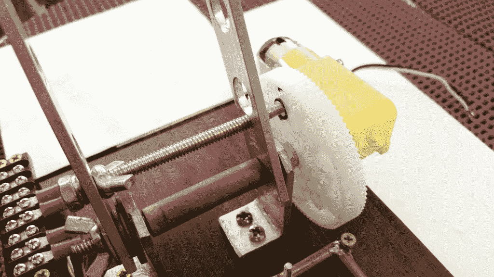
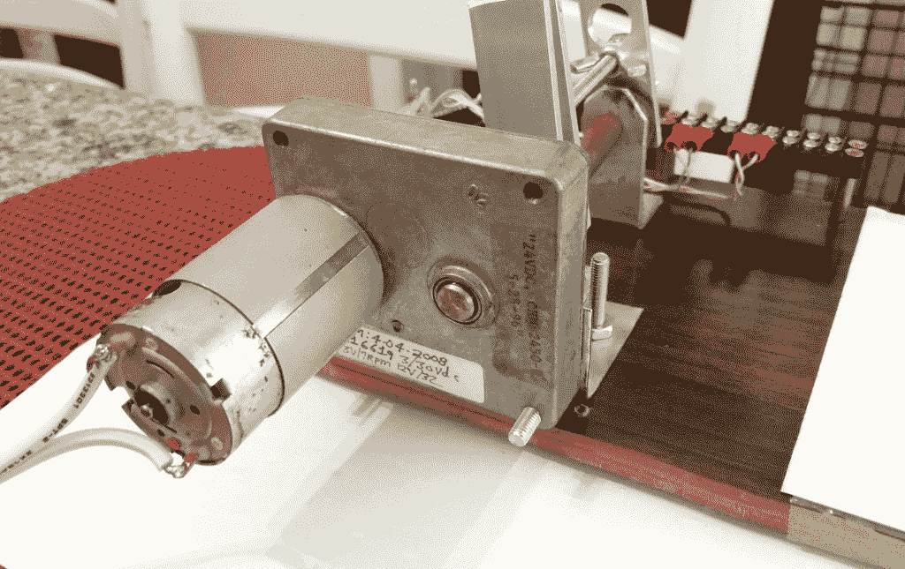
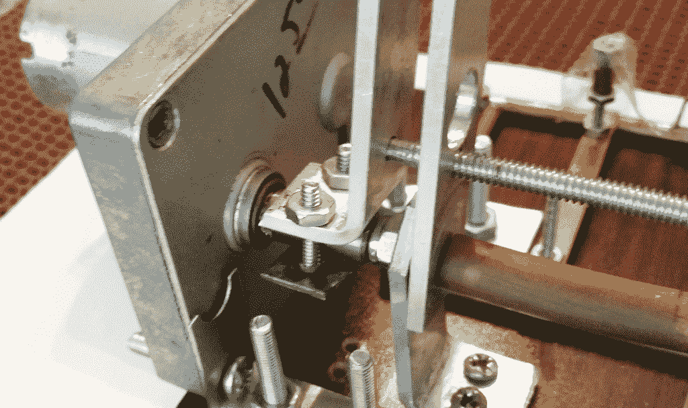
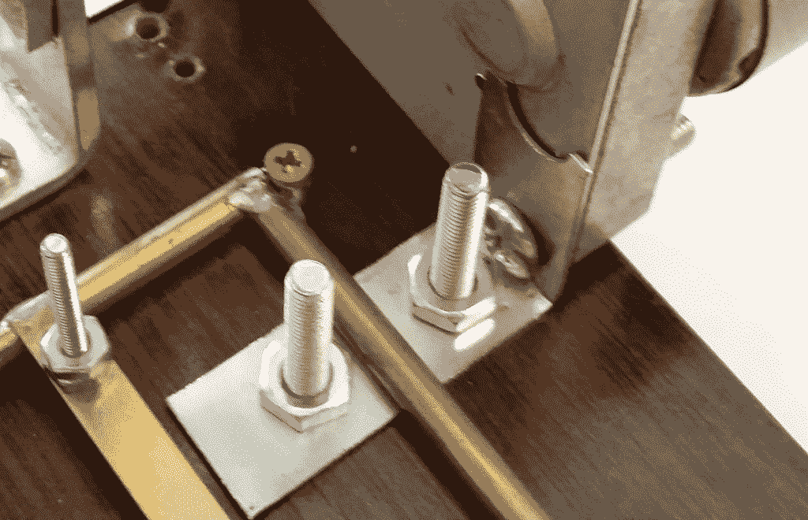

# 现成的黑客:抬起机械臂需要什么

> 原文：<https://thenewstack.io/off-the-shelf-hacker-what-it-takes-to-lift-a-robotic-arm/>

上周，我们开始谈论自动化和机器人。

我们还启动了一个快速项目，为一个简单的机构添加运动，用一个电动马达、一个马达驱动器和一个 Arduino 来回移动手臂。我们看了部分和一般项目布局，现在我们将通过构建和基本代码，使物理行为发生。下周，我们将深入探讨控制，如启动按钮，限位开关和紧急停止。我们将总结关于增强和为可能的 2.0 版本添加功能的想法。

在我们开始讨论机械和代码之前，我需要解决我用 6 伏电机和塑料变速箱的错误转向。

从一张白纸开始，快速原型化一个新的或未经测试的想法，是一场赌博。你不可能知道你不知道的东西，直到你建立了一个东西，测试它并分析结果。你所能做的最好的事情就是利用你自己丰富的知识和工程经验来做出你最好的初始决策，然后进行构建和测试。术语“快速失效”当然适用于构建任何种类的物理设备。我倾向于抓取零件，模拟物理机制，然后将开关拨到“开”的位置，看看会发生什么。偶尔，我会出错，但它并不像预想的那样工作。我想到了另一个贴切的术语，“迭代”。

从上周的故事开始，情况就是如此。以下是事情的经过，以及我是如何回到正轨的。

## 6 伏电机故障

读者会注意到，最初的零件清单显示了一个 6 伏电机与双轴塑料变速箱。我决定用一种更快、更省时的方法来完成这项工作，那就是从一个旧的两轮 MakeBot 机器人框架中取出一个 6 伏的车轮电机(单轴)。他们有一个直径 2 英寸的塑料齿轮，带有一个紧密配合的橡胶圈，充当轮胎。

使用单侧电机可以很容易地装配一对安装支架，将臂枢轴安装在安装面上方约 1-1/2 英寸处。然后将电机轴的中心与臂枢轴点对齐，并制作 L 形支架以将电机保持在正确的高度。

随着电机与臂枢轴正确对齐，想法是用一个销键接到塑料轮的一个孔中来驱动臂。看看这张照片。



6 伏电机/塑料变速箱

在将 6 伏电机/变速箱安装到蒸汽朋克演示机的摄像头臂上并在 Arduino 上运行代码后，很明显，这个小型电机无法胜任抬起摄像头臂的任务。它太小了。将马达输入电压增加到 12 伏特，减少机械装置的束缚，改变脉冲宽度和计时码，都是徒劳的。我本可以花时间，预先测量马达扭矩，计算控制手臂所需的能量，或者从一个大喇叭马达开始。但是，我没有。

有时候事情就是这样。设计，构建，然后快速失败并调整你的方法。

## 金属变速箱重新布线

幸运的是，我有一个更强大的电机和变速箱来补救这种情况。不久前，为了另一个项目，我花了大约 13 美元从 Skycraft Electronics 购买了这个马达。



带金属变速箱的大电机

在变速箱输出轴处，给电机电源端子提供 6 伏电压给了我大约 14 转/分钟。这相当于每分钟旋转 5040 度。或者说，每秒 84 度。在它目前的配置中，我们有大约 170 度的弧度，我们可以在与机器后部的木制底座或树莓皮碰撞之前摆动手臂。根据我们的代码，有了每秒 84 度这个数字，我们就可以根据我们运行马达的时间，粗略地计算出手臂会摆动多远。我的示例代码使电机向前运行 1000 毫秒，向后运行相同的时间。该臂在其行程包线的中间行进了大约 90 度的弧。

事实证明，最大的挑战是为轴装配一个致动器臂。轴的端部是 D 形横截面。最后，我将一块 1/8 英寸×3/4 英寸的铝型材弯曲成 L 形，并在短边上钻了几个孔，用钢带将它夹在电机轴的扁平部分。理想情况下，你会使用某种[拉成的](https://en.wikipedia.org/wiki/Broaching_(metalworking)) D 形适配器来连接到连接到相机臂的杠杆上。我没有任何适配器，所以我只是“快速原型化”了 L-bracket 并继续工作。用钻床、老虎钳和 BFH(大锤子)制作杠杆花了大约半个小时。



电机杆特写

我还制作了几个简单的 L 型支架，将电机固定在演示机器的底座上。他们用螺栓固定在齿轮箱壳体的底部。齿轮箱轴需要与臂枢轴的中心线对齐，这样就不会有任何束缚。



大电机 L 形支架

## 让我们看看代码

关于 Radio Shack 双通道电机驱动器(型号 2730851)的信息在网上有点难找到。幸运的是， [GitHub 有样图](https://github.com/RadioShackCorp/2730851-Dual-Channel-Motor-Driver)和规格表。我只是拉进来，根据我的需要修改了草图。因为只需要一个通道，所以另一个通道被注释掉了。

```
//********************************************************************************
// * File Name          : DC_motor_driver
// * Author             : Radio Shack Corporation
// * Version            : V1.0
// * Date               : 2014/01/27
// * Description        : Control direction and speed of a motor 
// *                      using pulse width modulation (PWM)
// ********************************************************************************
//    This program is free software: you can redistribute it and/or modify
//    it under the terms of the GNU General Public License as published by
//    the Free Software Foundation, either version 3 of the License, or
//    (at your option) any later version.
//
//    This program is distributed in the hope that it will be useful,
//    but WITHOUT ANY WARRANTY; without even the implied warranty of
//    MERCHANTABILITY or FITNESS FOR A PARTICULAR PURPOSE.  See the
//    GNU General Public License for more details.
//
//    You should have received a copy of the GNU General Public License
//    along with this program.  If not, see .
// ********************************************************************************
int CH1A  =  5; // CH1A, CH1B, CH2A, and CH2B 
int CH1B  =  6; // must be one of 3, 5, 6, 9, 10, or 11 for PWM
// int CH2A =5;    // Set digital ~5, ~6, ~10, and ~11 for default pins.
// int CH2B =12;

// *********************************************************************************
// * Function:  Control Motor A
// * Input:     speed (PWM duty, range = 0-255)
// *********************************************************************************
void motorA_forward(int sp)
{
  analogWrite(CH1A,sp);  
  analogWrite(CH1B,0);
}
void motorA_backward(int sp)
{
  analogWrite(CH1A,0);
  analogWrite(CH1B,sp);
}

// *********************************************************************************
// * Function:  Control Motor B
// * Input:     speed (PWM duty, range = 0-255)
// *********************************************************************************
void motorB_forward(int sp)
{
  // analogWrite(CH2A,sp);
  // analogWrite(CH2B,0);
}
void motorB_backward(int sp)
{
  // analogWrite(CH2A,0);
  // analogWrite(CH2B,sp);
}

void setup()
{
  pinMode(CH1A,  OUTPUT); // Initialize pin for output
  pinMode(CH1B,  OUTPUT);
  // pinMode(CH2A, OUTPUT);
  // pinMode(CH2B, OUTPUT);

  Serial.begin(9600);
  while  (!Serial)  {
    ;  // wait for serial port to connect. Needed for native USB port only
  }
}

void loop()
{
  Serial.println("motor backward");
  motorA_backward(250);
  delay(1000);
  // slow motor before reverse
  motorA_backward(10);
  delay(100);

  Serial.println("motor forward");
  motorA_forward(250);
  delay(1000);
  // slow motor before reverse
  motorA_forward(10);
  delay(100);
}

```

正如您在代码中看到的，我使用了数字引脚 5 和 6，它们具有脉冲宽度调制(PWM)功能。motorA_forward 和 motorA_backward 这两个函数实际上包含了 analog_Write()函数，并且是从主程序循环中调用的。给这些函数一个从 0 到 255 的参数来指定 PWM 的占空比。然后，告诉程序运行电机(使用 delay()函数)一定的毫秒数，以将机械臂移动到所需的角度。

你会注意到马达不会每秒钟突然反转方向。相反，它会在反转前 100 毫秒降低速度。在改变方向之前，通常的做法是增加或降低速度，以最小化手臂关节和机构上的峰值负载。逐渐加速/减速是电机驱动项目中平稳、可控负载和可靠运行的关键。

## 走向

在这个版本中，也没有任何定位反馈。我们只需让马达朝一个方向或另一个方向运转一段时间。没有初始位置验证或臂位置的连续监控。甚至没有任何限位开关来阻止手臂触及其行程的物理末端。

这一切都没问题，因为我的意图是解释使用电机、电机驱动器和 Arduino 来控制一个简单的旋转臂的基础知识。

下周，我们还将学习使用一些输入控件来启动运动序列，并讨论限位开关、定位反馈和紧急停止按钮。增强功能和可能的新功能也将提上日程。

<svg xmlns:xlink="http://www.w3.org/1999/xlink" viewBox="0 0 68 31" version="1.1"><title>Group</title> <desc>Created with Sketch.</desc></svg>