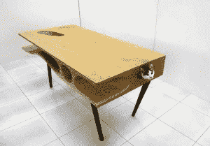

# 哦卡姆！关于编程的五首歌

> 原文：<https://thenewstack.io/oh-caml-five-songs-programming/>

本周早些时候，一段关于 OCaml 的新说唱视频出现在康奈尔大学计算机科学系一名助理教授的网站上。在可以下载的粗糙视频中，这位神秘的新说唱歌手吹嘘 OCaml 的词汇范围，以及他如何[填充 nomad](http://blogs.perl.org/users/cyocum/2012/11/writing-state-monads-in-ocaml.html) “像墨西哥卷饼一样”:

这首歌的歌词也被发布在亚龙·明斯基的 Github 账户上[，他的](https://gist.github.com/yminsky/1645d897bc9128ed4450) [Twitter feed](https://twitter.com/yminsky/status/673164430457315329) 描述为“偶尔的 Caml 程序员”

尽管他流着自吹自擂，这位说唱歌手也注意到了 OCaml 强大的静态打字能力可能带来的挫折。

“但实际上，此时此刻，我仍然生活在恐惧中，因为类型检查器给了我编译时错误。”

令人惊奇的是，OCaml 流只是关于计算机编程的悠久传统歌曲中的最新时刻——关于编程语言、软件架构模式、自由软件运动，甚至实际的计算机代码。如果你发现了世界上最令人讨厌的点唱机，它就会播放这些歌曲。以下是其他一些令人难忘的旋转:

## 詹姆斯·邓普西的《模型视图控制器》

早在 2003 年，苹果工程师 James Dempsey 就介绍了他对流行软件架构模式的由衷赞美。在苹果全球开发者大会(WWDC)的舞台上，他用一把木吉他解释了它的灵感。“就像有时我感到兴奋的技术一样，我做的第一件事就是去 iTunes 音乐商店，键入一些关键词，看看是否有关于它的歌曲。”

当没有的时候，他决定自己写一个。

[https://www.youtube.com/embed/YYvOGPMLVDo?feature=oembed](https://www.youtube.com/embed/YYvOGPMLVDo?feature=oembed)

视频

特别值得注意的是关于每个单独组件的诗句，加上这种方便的记忆方法来记住它们的相对位置。
 *“模型视图
是的，它有三层，就像它们奥利奥做的
模型，视图，滑腻的控制器”* 
完整的歌词可以在邓普西的网站上找到，2014 年邓普西甚至将这首歌收录在他在 iTunes 商店发布的包含 16 首非常极客歌曲的完整专辑[中，在那里它开始收集一些好评如潮的评论。“他的技术见解不仅准确无误，”一位评论家写道，“它们是经过完美提炼的总结，也是非常容易记忆的方法。”](https://itunes.apple.com/us/album/backtrace/id926558924)

## 理查德·斯托尔曼的“自由软件之歌”

理查德·斯托尔曼已经因为建立了自由软件基金会而闻名于世，因为开发了 GNU 编译器集合和 GNU Emacs，并且为所有人使用和修改自由软件而继续奋斗。在 20 世纪 90 年代初的某个时候，斯托曼还创作了成为他“标志性”的歌词——伴随着保加利亚民间舞蹈歌曲“Sadi moma bela loza”的旋律演唱

[https://www.youtube.com/embed/9sJUDx7iEJw?feature=oembed](https://www.youtube.com/embed/9sJUDx7iEJw?feature=oembed)

视频

在 Gnu.org 的一篇文章中，斯托曼回忆起他第一次创作这首歌的真实时刻，那是在一次科幻大会的歌曲分享会上。“我唱完之后，房间里的另一个人说，‘这有一种类似颂歌的品质。你应该给理查德·斯托尔曼看看。"

“我说，‘我是理查德·斯托尔曼。’"

这首歌在 Gnu.org 的页面还包含四种不同表演的链接，以及 12 种不同版本，包括西班牙朋克变体[和可爱的即兴钢琴版本](http://www.pc-freak.net/files/free-software-songs/Free_Software_Song_en_espa%c3%b1ol.ogv)。当斯托曼亲自露面时，他有时会以一首无伴奏合唱的歌曲作为结束，作为一种祝福，让观众感到惊讶:

*“现在就加入我们，共享软件；
你会自由的，黑客们，你会自由的。
囤积者可以拿到成堆的钱，
那是真的，黑客，那是真的。但是他们不能帮助他们的邻居；
那不好，黑客，那不好。”*

## 开发团队的“Java 生活(硬编码)”

早在 2011 年，在 JavaOne 大会的主题演讲中，一个特殊的视频就已经发布了。它仍然托管在 Java 的官方 YouTube 频道上，该频道将 rap 视频描述为“Oracle 产品”，并将其献给“各地日夜辛勤编码的开发人员”。

[https://www.youtube.com/embed/b-Cr0EWwaTk?feature=oembed](https://www.youtube.com/embed/b-Cr0EWwaTk?feature=oembed)

视频

这首歌以一段不祥的片段开始，一个极客在格子衬衫上擦亮他的眼镜，然后加入了一段正义的说唱，讲述“我们如何在这些小隔间里努力编码”……
*“自 95 年以来，Java 编码以软盘开始，现在我们把它带到了云端。”*

## 乔·韦克尔的《我讨厌 DMCA》

15 年前，一首奇怪的歌出现了，作为对镇压 DeCSS 代码的抗议，这个程序可以解密商业生产的 DVD。通过各种法律手段，DVD 拷贝控制协会试图压制代码的传播。结果，代码以多种形式分发，一个音乐极客决定把代码变成一首歌。

*“这个函数是 void
它需要两个参数
第一个是 SEC，一个指向 2048 个无符号字节的向量的指针:
这是加密的磁盘扇区，将被解密”* 
但是这首歌的副歌喊出了它的真正目标——数字千年版权法案。(“我讨厌 DMCA。它使这首歌成为非法的…”)

可以预见的是，原版歌曲的拷贝很难找到。但是你仍然可以在卡内基梅隆大学计算机科学系的研究教授的网页上找到完整的歌词。

* * *

## **网络还原**

<svg xmlns:xlink="http://www.w3.org/1999/xlink" viewBox="0 0 68 31" version="1.1"><title>Group</title> <desc>Created with Sketch.</desc></svg>