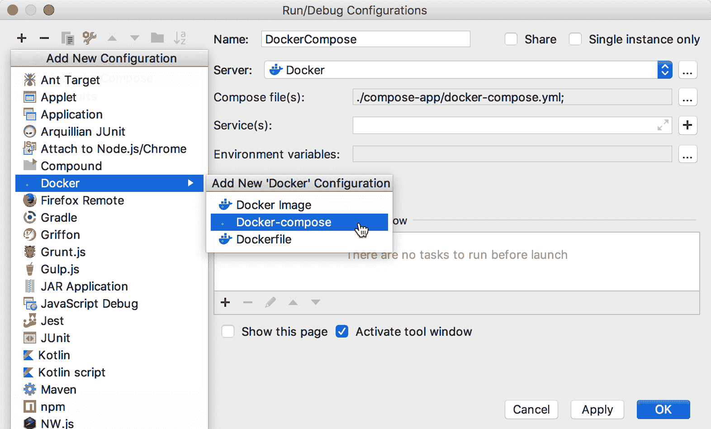
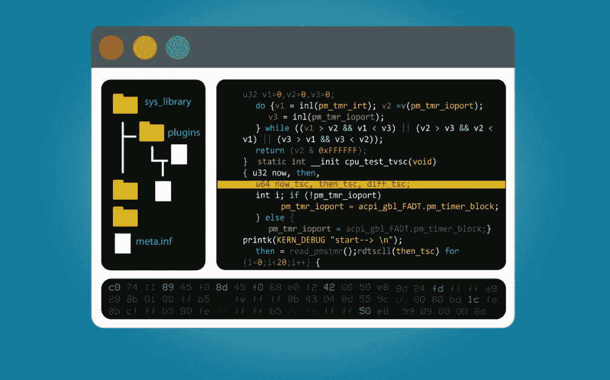
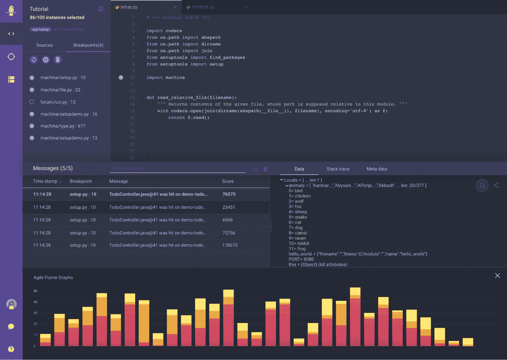

# 哦，当你离开你的思想时你会去的地方

> 原文：<https://thenewstack.io/oh-the-places-youll-go-when-you-leave-your-ide/>

[Oded Keret](https://www.linkedin.com/in/oded-keret-49786229/)

[Oded 是 Rookout 的产品负责人。他是一名经验丰富的软件工程师和产品经理。](https://www.linkedin.com/in/oded-keret-49786229/)

在软件工程界有许多争议点。哪种编码语言最好？云厂商，IDE(集成开发环境)或者源码控制管理工具哪个最好用，功能更强大？调试的最佳方式是什么——断点还是日志？

我们对这些问题有强烈的感觉，我们中的许多人有更好的选择。在某些情况下，当其中一个问题被提出时，我们会变成狂热的狂热者，如果你曾经对自己说“这正是一个制表符超过空格的人会说的话”，那么你就会明白我的意思。

但是尽管我们有分歧，似乎有一点是绝对的、永恒的、不容置疑的事实:开发人员永远不想离开他们的 IDE。开发工具供应商知道这一点，并付出了巨大的努力来让他们的用户和客户在他们最喜欢的 IDE 中感到快乐、安全和温暖。但是这种说法总是对的吗？让我们一起来了解一下。

如果可以的话，我想带你进行一次奇怪的旅行。探索和质疑绝对真理的旅程。一次去危险、遥远地方的旅行。一次超乎你想象的旅行。你可能想带把伞。

## 为什么显而易见的事实似乎显而易见和真实

如果你曾经以写代码为生，你可能熟悉打开你最喜欢的 IDE 的安全和温暖的感觉。而且很可能你也很熟悉每次被迫离开 IDE 时的挫败感。你的 IDE 向你展示了最重要的东西:你的代码。你正在写的东西，你正在做的东西，你正在诊断的东西。一切都是代码，代码就是一切。所以，很明显，查看和编辑代码的方法是在我的 IDE 中，对吗？

快！回到你的 IDE！

任何将你的视线从代码上移开的事情都是危险和令人沮丧的。查看一个缺陷描述或者一个用户故事，得到一条松弛的消息或者一封电子邮件，检查 CI 自动化的状态，并且试图找出哪些测试失败了——这些都是将开发人员的眼睛、思想和注意力从他们正在编写的代码上移开的行为的例子。上下文切换的脑力劳动和花费在尝试[搜索](https://en.wikipedia.org/wiki/Grok)应用程序的当前状态上的宝贵的几分钟或几小时的损失是开发人员被训练成不惜一切代价避免的损失。

从您的 IDE 舒适地配置和运行您的 Docker 应用程序。

开发工具和 DevOps 领域中流行的解决方案已经知道这一点有一段时间了，并通过提供一个 IDE 插件来努力接近他们家庭环境中的开发人员。快速浏览 IntelliJ 或 VS 代码插件市场会发现许多熟悉的品牌，证明许多供应商已经决定通过集成到他们最喜欢的界面来满足他们的用户。

## 播下异端的种子

像许多普遍接受的真理一样，当我们构建生产优先的应用程序时，一旦我们更深入地了解我们和我们的客户实际上是如何工作的，我们的信念就开始出现裂缝。我们中的一些人在提交或审查 pull 请求时更喜欢使用 Github web 界面。我们大多数人更喜欢获得用户故事或缺陷背后的完整故事，或者在外部界面的支持标签中添加我们的评论。我们所有人在切换标签来检查构建状态、了解为什么这次自动化测试失败了、更改 Docker 配置中的某些内容或者在我们最喜欢的 APM 仪表板中检查生产环境的状态之前都不会犹豫。

【T2

是的，其中一些工具和工作流有它们的 IDE 插件版本——或者，在某些情况下，CLI 替代版本——在众多 IDE 和支持的语言中取得了不同程度的成功。但是，当问题很复杂并且解决它需要一个专门的工具时，开发人员会毫不犹豫地使用最佳解决方案，并将目光从他们的 IDE 上移开。

## 解决认知失调

因此，我们知道开发人员永远不会离开他们的 IDE，除非他们真的离开了。当一项任务不是纯粹的编码，当替代工具带来足够的价值时，开发人员愿意付出额外的精神努力来切换标签或窗口，甚至学习使用新工具。在 Rookout，我们的使命是尽可能平稳地完成这一过渡，一方面尽可能减少摩擦并提供类似 IDE 的体验，另一方面确保在我们的 web IDE 中提供足够的附加值，以确保使用我们的工具值得付出最小的努力和学习曲线。

减少摩擦并提供尽可能接近 IDE 的体验并非易事。事实上，这是一项持续的工作，我们会根据用户的反馈不断改进我们的体验。选择深色的配色方案和使用合适的字体很容易。提供一个类似 IDE 的结构，其中代码位于中央，存储库和文件夹结构位于左侧，调试快照或日志控制台位于底部——这些事情也非常简单。当然，Rookout 调试体验的核心是在一行代码旁边设置断点，这是已知的。但是，请不要问我们断点应该是什么颜色。我们不会再打开那罐虫子了。

如果我不需要告诉你这是一个 IDE，那么我只是证明了我的观点。

当我们试图模拟那些能让开发人员对代码有更深理解的特性时，我们面临着更大的挑战。语法突出显示、显示上下文中的变量值以及提供高级搜索和导航功能有时都很难实现，但这些努力是值得的。看到我们的用户用 ctrl/cmd+shift+f 或者右键单击变量或函数并选择“转到定义”来直观地搜索，让我们意识到我们做了正确的选择。

## 从减少摩擦到增加价值

最终，我们的信念得到了重申，当涉及到生产中的调试和/或大规模分布式应用的调试时。在这些情况下，IDE 体验有其局限性。选择一个环境或服务器和容器的子集不是您期望在 IDE 中做的事情。确保查看正确版本的代码，在正确的服务器上设置断点，并确保设置的断点不会收集敏感数据，或者限制日志收集以防止性能下降，这些都不是 IDE 的固有体验。

这些是我们认为基于 web 的 IDE 可以提供额外价值的领域。通过定制适合云原生、生产优先用例的体验，我们已经将我们的 IDE 构建成势在必行的，这在 IDE 插件中很难复制。

熟悉的 IDE 体验，因跨浏览器 Web 应用程序的强大功能而更加丰富。

打破我们自己的开发教条，我们发现了可以为传统 ide 提供额外价值的其他领域。可视化从调试快照接收的数据，创建[调试热图](https://www.rookout.com/blog/setting-a-live-debugging-dashboard-to-catch-a-thief-of-time)，显示[敏捷火焰图](https://thenewstack.io/rookouts-agile-flame-graphs-give-quick-visual-insight-into-production-code/)和[动态跟踪时间线](https://www.rookout.com/blog/getting-by-with-a-little-help-from-my-visual-tracing)——这些都是 IDE 插件无法复制的体验。由于我们提供了基于 web 的软件即服务体验，我们可以提供丰富的高质量体验，而不必担心支持众多 ide、版本和外形，也不必担心我们的客户面临新版本插件中已解决的问题。

## 最后的想法

到目前为止，我故意忽略的一点是，我们确实有一个 [IDE 插件](https://plugins.jetbrains.com/plugin/12637-rookout)。我们开发了一个 IntelliJ 插件，提供基本的功能，并允许我们的用户设置不间断的断点，并在他们自己的 IDE 中舒适地查看实时调试快照和动态日志行。到目前为止，来自我们用户群的压倒性反应是，当开发人员第一次接受在产品中调试的挑战时，IDE 插件似乎是一个好主意。然而，随着用户了解到云原生、生产优先调试的复杂挑战，以及他们意识到我们的 web IDE 提供的丰富体验的好处，他们中的大多数人最终选择离开他们的 IDE。

这让我对我们的第一个动机加倍下注，这是为我们的开发人员提供一个重要的解决方案，作为一个具有 web-IDE 界面的 SaaS 产品。如果技术发展到支持所有这些深刻而丰富的功能，那么我们将重新审视 IDE 插件解决方案。在此之前，我们将继续为用户提供最佳的调试和监控体验。

<svg xmlns:xlink="http://www.w3.org/1999/xlink" viewBox="0 0 68 31" version="1.1"><title>Group</title> <desc>Created with Sketch.</desc></svg>