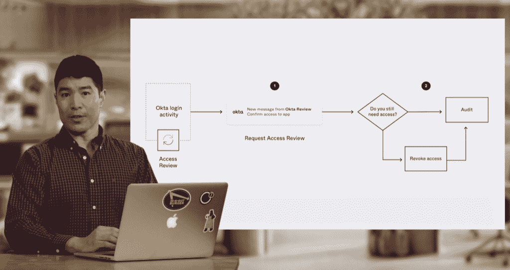
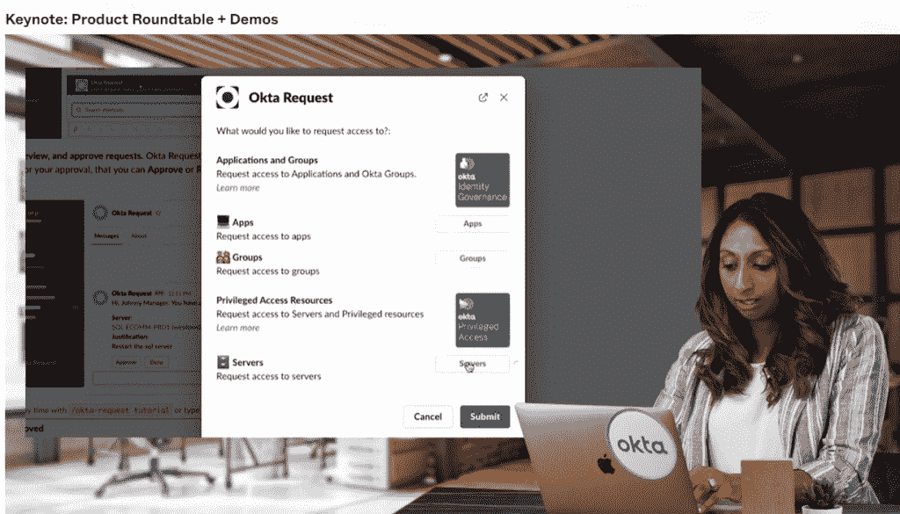

# Okta 为企业身份和访问管理推出统一控制平台

> 原文：<https://thenewstack.io/okta-launches-a-unified-control-plane-for-enterprise-identity-and-access-management/>

身份管理服务提供商 Okta 推出了一个统一的身份平台，这是一个统一的控制平面，用于管理身份和访问管理(IAM)的所有任务，以授权访问资源，包括风险管理、安全性和适当 IAM 所需的策略。

Okta 联合创始人兼首席执行官托德·麦金农(Todd Mckinnon)在本周虚拟举行的公司年度用户大会 [Oktane21](https://www.okta.com/oktane21/?utm_id=aNK4z00000000NPGAY&utm_campaign=global_all_al%5B%E2%80%A6%5D20the%20new%20stack&utm_medium=3psocial&utm_source=thenewstack) 的开幕主题演讲中说:“在过去的 12 年里，我们在 Okta 看到了身份在组织中扮演的角色发生了根本性的转变。“人们已经清楚地听到:您需要一个针对每种用户类型和每种使用情形的解决方案。你需要它不仅适用于应用程序，还适用于基础设施、容器和数据库。您还需要通过授权您的业务合作伙伴来确定需求，而不是通过信息技术来实现集中化，从而简化用户获取资源的方式。”

[平台](https://www.okta.com/products/okta-identity-governance-and-okta-privileged-access/)旨在为特权访问管理(PAM)和身份治理管理提供一个集中的系统，通过尽可能使用 Slack 和自动化工作流等自助服务工具来集中管理，同时减轻安全运营的负担。

该平台由两个新组件锻造而成，这两个组件都将在 2022 年初全面上市。

**Okta 特权管理**旨在保护关键基础设施，如 Kubernetes 集群和数据库，通过提供一个集中式系统向 IT 管理员授予临时凭证，以阻止恶意访问。

特权管理背后的理念是让组织更接近零信任环境，这是混合和多云环境所必需的，这种环境会成倍增加管理对所有这些宝贵资源的访问的复杂性。传统的 PAM 工具不具备管理这些云原生环境的灵活性。

这种新一代 PAM 系统可用于构建细粒度的用户和基于角色的安全策略，详细说明谁可以在基础架构级别访问什么。系统管理员可以申请临时访问，比如对需要重新启动的数据库的访问，随后的会话会被记录下来以供进一步查看。

第二个组件是 **Okta 身份治理**，它为日常授权任务提供了一个自助服务门户，消除了通过 IT 集中功能管理用户访问的需要。

Okta 身份治理通过自动化审批工作流和自助服务来管理日常访问管理。用户将获得一个标准的授权基础，以确定他们可以访问哪些应用程序，同时维护一个最低权限系统，以防止不必要的访问累积。离开公司的员工也可以很容易地禁用凭证。该系统利用当今 IT 工具(如 Slack)丰富的 API 特性，为最终用户提供尽可能无缝的自助服务功能。

对于 Okta 来说，去年的[网络安全管理软件产品事件](https://thenewstack.io/solarwinds-the-worlds-biggest-security-failure-and-open-sources-better-answer/)实际上是一个好消息，至少它提醒了组织错误的身份管理的昂贵危险，即使他们正在通过 DevOps 等自动化过程提高软件开发的速度。从 2020 年 3 月到 2021 年 3 月，Okta 平台上的独立应用程序登录次数超过 520 亿次，比去年同期增长了两倍。

<svg xmlns:xlink="http://www.w3.org/1999/xlink" viewBox="0 0 68 31" version="1.1"><title>Group</title> <desc>Created with Sketch.</desc></svg>