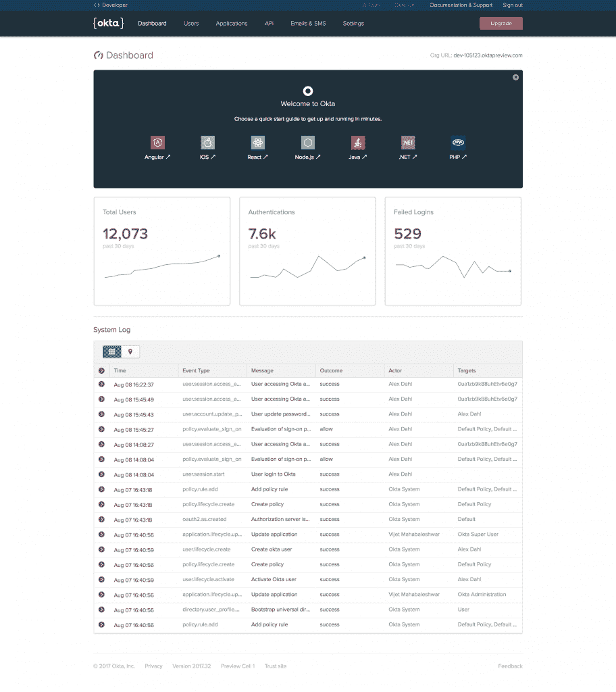

# Okta 希望成为开发者的身份服务

> 原文：<https://thenewstack.io/okta-wants-identity-service-developers-not-just/>

如果你遇到过 Okta [云身份服务](https://www.okta.com/products/)，你可能会认为它是一个 it 工具。管理员可以使用它来管理多个云服务的登录，如 Office 365、Google Cloud 和 Salesforce，通过一个界面完成密码强度和谁可以访问的策略。

但是 [Okta](https://www.okta.com/) 也正在通过 API 提供更多的认证和用户管理，这样开发者也可以将这些服务内置到他们的应用中，就像他们使用 API 驱动的身份服务一样，如 Twilio 的 Authy、 [Auth0](https://auth0.com/) 和微软的 [Azure Active Directory B2C](https://azure.microsoft.com/en-us/services/active-directory-b2c/) 。

数据安全如此重要(管理不善的凭证导致的数据泄露如此普遍)，是时候停止构建加密不良的用户和密码系统了(或者从 Stack Overflow 中复制并粘贴代码，该代码只对密码进行 base64 编码)。密码重置系统出错，数百万账户信息可能会丢失。正如用于消息和通信的 Twilio APIs 以及用于支付的 Stripe 或 Braintree APIs 一样，身份管理正在成为一种商品最好不要自己编写。

Okta 负责开发者平台的副总裁 Alex Salazar 告诉 the New Stack 说:“每个人都迫切需要构建客户网络应用程序，并将他们的产品和服务放到网上，这意味着有很大的推动力，只是没有足够的开发者来做这件事。”。他们选择阻力最小的道路，但这并不总是最好、最安全、最易维护的选择；我们正试图通过提供良好的开发者体验来改变这种状况。"

他认为，这不仅仅是指 Okta 服务中的技术，还包括 API 和文档。“我们将文档视为产品；在有文档之前，我们不能宣布[新的东西]。SDK 也是一样；如果一些东西不在 SDK 和框架中，它就不存在，”Salazar 说。

## 更多的因素，更多的并发症

如今，密码和用户名不足以保证应用的安全性和用户管理。越来越多的用户需要多因素身份认证，对于越来越多的设备来说，部署起来可能非常复杂。Salazar 说，即使是转向开源软件如 OAuth 规范和 OpenID 连接协议来简化安全连接的开发者也面临着一项艰巨的任务。

“如果你了解身份，你可能知道 OAuth。问题是实现标准 OAuth 实际上并不是最佳途径。Salazar 说:“即使你使用由主要供应商维护的完全兼容的库，你仍然错过了大多数开发人员不知道的安全最佳实践。

OAuth 使用令牌来增加拦截和重放凭证的难度，并且必须正确使用这些令牌；比如不使用身份令牌作为会话令牌，因为它可能包含个人信息，或者不使用本机应用程序中的嵌入式 web 视图来验证用户，因为他们每次使用应用程序时都必须重新验证，因为嵌入式流运行在沙箱中，不知道他们已经登录。

他指出，开发人员还需要知道如何处理流，比如保证用户如何认证和令牌撤销。“如果你的应用程序正在使用令牌，而你有一个不良或恶意用户，你应该关闭它们。OAuth 规范没有提到这一点，所以现在你必须建立自己的令牌撤销定制方案，”Salazar 建议道。

通常，开发人员甚至不知道这是一个问题，直到它在生产中出现，然后许多人真的没有关于如何补救这个问题的标准模式。

为了帮助实现这一点，当开发者登录 Okta 时，他们可以选择他们正在开发的应用程序类型，并获得模板和快速入门，显示安全注册、电子邮件验证和密码重置所涉及的步骤(在那里，工作流正在被添加)。

“我们试图让你走上正确的道路，做出最好的选择，而不需要你做太多额外的工作，”Salazar 告诉我们。“我们的目标是最流行的后端和前端语言。”用于 Node/Express、Java/Spring 和 ASP.NET 的库，以支持开发人员构建在服务器上运行的应用程序，以及用于前端的 Angular 和 React，以及用于 iOS 和 Android。对于其他技术，Okta 提供了关于使用 API 的文档。

Okta 还使用其 API 创建了一个可嵌入、[可定制的 JavaScript 登录小部件](https://github.com/okta/okta-signin-widget)，您可以使用它来获得端到端的代码流登录，包括多因素身份验证、密码到期和支持[社交身份验证提供商](https://developer.okta.com/code/javascript/okta_sign-in_widget.html)的自助帐户恢复。

另一个大动作是，Okta 不再仅仅是为了第一方 app 中的用户管理；它既可以用于客户，也可以用于内部用户，并且它将很快支持开发人员编写第三方应用程序。所以，比方说，如果一个使用 Okta 作为客户身份的太阳能屋顶安装程序有如此多的用户，以至于其他开发人员想为他们编写一个应用程序，他们将能够在他们的应用程序中使用这些 Okta 身份。Okta 还正在与广泛的云电子邮件服务和 OpenID Connect 提供商集成。

现在，所有 Okta 订阅都包括多因素身份验证，通过电子邮件提供一次性密码，或者检测常见密码，并将已知的恶意 IP 地址列入黑名单。像 Okta 这样的服务可以让您提供多因素身份验证，而不必拥有自己的基础设施，快速入门旨在使开发人员易于实现。

“多因素认证的问题在于它很复杂，”Salazar 说。“需要更方便；如果你不让人们容易实现，它就不会被使用。也需要是一次很好的体验。如果这不是一个好的体验，没有人会打开它，你需要用户采用多因素认证。太多的开发人员抓住一些不安全的东西，不让最终用户轻松使用。”

下一步是“无密码”认证，这是雅虎和谷歌已经提供的服务。一家澳大利亚保险公司已经在使用 Okta 来做这件事；因为客户登录的次数不足以记住密码，所以他们只是使用自己的电子邮件地址登录——用一次性令牌触发测试消息。Okta 正在为开发者提供一个工作流程。“在接下来的 13 个月里，我们将向客户提供可靠的无密码体验，并确保其安全性，”Salazar 告诉我们。

<svg xmlns:xlink="http://www.w3.org/1999/xlink" viewBox="0 0 68 31" version="1.1"><title>Group</title> <desc>Created with Sketch.</desc></svg>