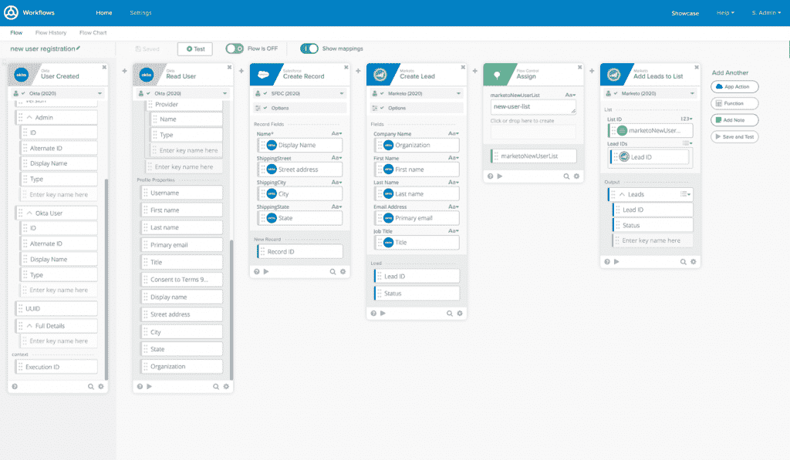
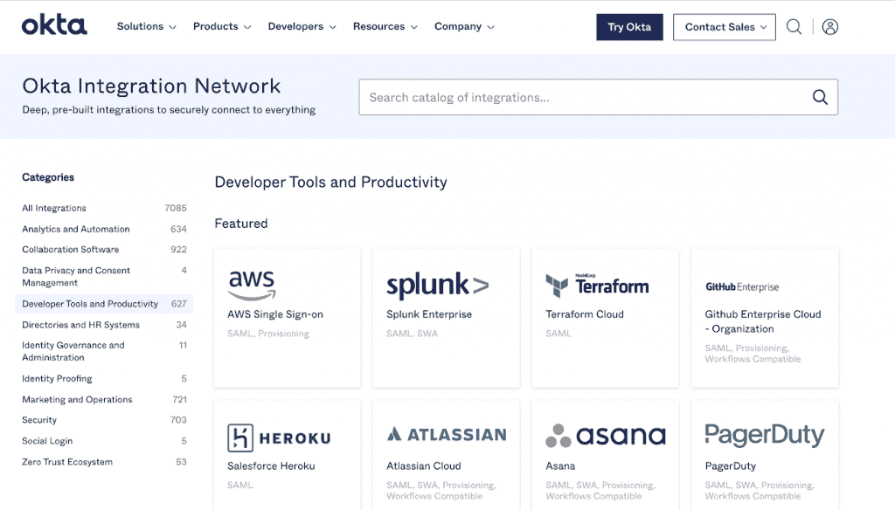
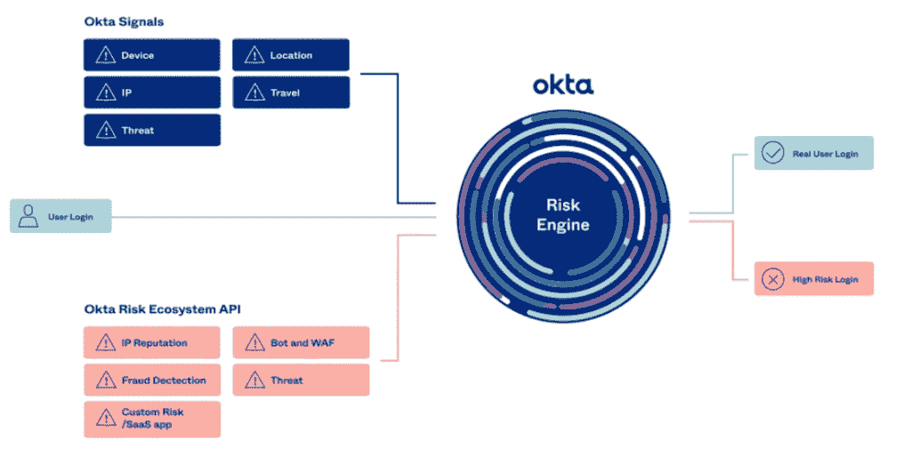
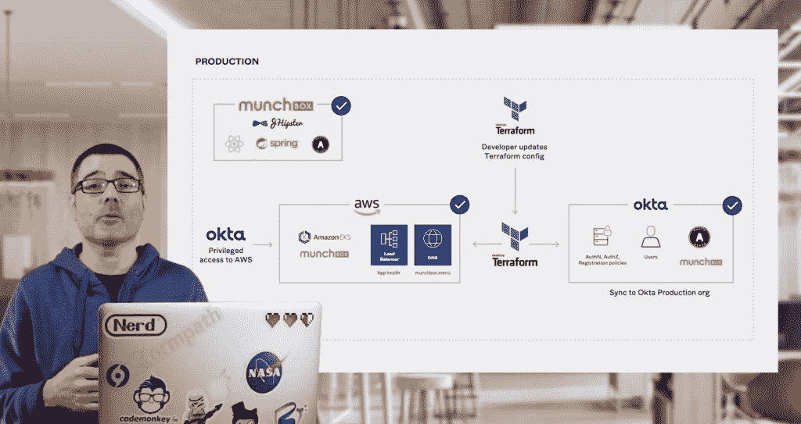

# Okta 为忙碌的开发者外包身份管理的平台

> 原文：<https://thenewstack.io/oktas-platform-to-outsource-identity-management-for-busy-developers/>

虽然身份往往被视为事后的想法，但去年的远程工作已经清楚地表明，身份(从用户帐户到特权管理员帐户和机器身份，如凭据、证书和机密)是基础架构和开发运维的关键支柱。

“身份已经成为真正的主云，就像您的基础架构或协作云等其他主云一样重要。它也是你的组织的技术连接的安全中心，”Okta 首席执行官[托德·麦金农](https://www.linkedin.com/in/toddmckinnon/)在 Okta 21 的主题演讲中说， [Okta](https://developer.okta.com/?utm_content=inline-mention) 最近的年度用户大会，以虚拟方式举行。

虽然身份非常重要，不容忽视，但开发人员是一种关键而稀缺的资源，他们通常已经在处理 DevOps 责任以及处理堆栈所有层的开发。为了部署和保护 API，他们需要处理用户身份、资源身份和运行的基础设施。

Okta 开发人员关系副总裁 [John Pritchard](https://www.linkedin.com/in/jpritchard/) 告诉我们:“没有足够多的开发人员，这些开发人员有时身兼数职。”他指出，通常情况下，在每种情况下管理身份的工具都是不同的，不能很好地与标准开发人员工具集成。

Okta 低代码工作流接口。

## **多种工具，同一平台**

在今年的大会上，Okta 推出了新的开发者入门版，让开发者更容易开始使用 Okta 的身份平台。该公司还推出了重新设计的控制台，新的文档和示例应用程序，以帮助开发人员快速启动和运行，以及与 DevOps 和 API 安全工具的新集成。

Okta 还推出了一个新的工作流工具加上身份治理，以及风险分析和权限管理服务，这些服务扩展了开发人员的工作范围，而无需成为身份专家。

Workflows for Customer Identity 是一个低代码的可视化界面，对构建面向客户的应用程序(无论是 B2C 还是 B2B)的公民开发人员非常有用，使他们能够访问开发人员用于与 DevOps、SecOps 和 API 安全工具进行预配置集成的相同 Okta 集成网络。营销团队中的某个人可以使用拖放可视化工具，使用 Hubspot、Salesforce、Marketo 和 SendGrid 创建工作流，而创建 Heroku 应用程序的开发人员可以使用 Okta 平台直接从 Heroku CLI 添加身份，他们都可以受益于该组织制定的政策和保护措施。

应用程序的身份验证流程可以基于客户行为触发后端集成，如从营销系统获取个性化报价，或根据用户登录的帐户类型定制登录体验。或者，它可以调用新的风险生态系统 API，该 API 使用来自第三方 web 应用防火墙的行为和交易信号来检测欺诈和 bot 检测工具，如 Fastly、HUMAN、F5 Networks 和 PerimeterX。

尽管这是一个非常适合云本地事件驱动架构的 API，Pritchard 建议 SecOps 团队将成为解释信号的专家。Pritchard 说:“开发人员会向 SecOps 专业人员询问‘这种行为说明了什么，我需要考虑哪些情况’，然后就可以通过编程来完成这些工作。”。

## **身份与特权管理的联姻**

身份治理传统上是法规遵从性和风险讨论的一部分。在有审计或电子发现请求之前，您不会想到这一点，但从根本上来说，这是一个谁应该在何时访问哪些资源的问题。虽然它通常与管理管理员访问完全分开处理，但它实际上与权限管理密切相关。虽然 Okta 为每一项服务都提供了新的服务，但 Pritchard 预计它们会越来越多地被一起采用。

Okta 特权访问在单个控制平面中覆盖混合和多云基础设施资源，是一个及时的产品。Keyfactor 最近的“[机器身份管理状态报告](https://www.keyfactor.com/state-of-machine-identity-management-2021/)”表明，组织正在努力制定策略治理和最佳实践来管理密钥、证书和机密，以保护与服务器、云工作负载和物联网设备的连接。88%的人报告说，在过去两年中至少有一次停机导致证书过期，超过一半的人没有 SSH 凭证的准确清单，并且有令人担忧的数字在构建服务器和开发人员系统上存储代码签名密钥。

特权访问简化了对短暂云资源的自助式限时访问，因此开发运维团队或 SRE 团队可以更新和监控系统，而没有永久访问的风险(或者一些管理员不得不在每次事件后花时间手动删除管理员访问权限)。这可能是跳到 Slack 上请求访问数据库服务器，这样您就可以重新启动 SQL 并打开日志记录来检查问题是否得到解决，或者在 Kubernetes 集群中处理特权基础设施凭证。

Zoom 在过去一年的爆炸性增长，当生活和工作突然转移到网上时，从每天 1000 万用户增加到超过 3 亿用户，这是 Okta 特权访问的主要用例。当 2020 年春天世界大部分地区陷入封锁时，Zoom 将一个几乎只在自己的数据中心运行的平台带到了公共云。与此同时，他们的知名度和增长使他们成为黑客的目标。

“我们对后端的身份认证基础架构进行了大量控制。但是，当我们以如此快的速度增长时，我们已经超越了我们以前使用的工具，”Zoom 数据中心运营主管 Zak Peirce 在 Oktane21 的一次演讲中说。他说，他们不得不重新思考他们的服务器 IAM 和自动化工具，并转向 Okta，这使 Zoom 能够扩展其团队并保持安全。

“我只是希望我的团队能够安装一个客户端…在他们的笔记本电脑上配置它，他们能够几乎不做任何更改就 SSH 到服务器，”皮尔斯说。而以前他们会有由管理员发布的公钥/私钥对。现在他们只需要 Okta 在入职时提供给他们的证书。工作流程的变化是一个浏览器窗口，仅此而已…因此，管理员为了完成工作，所做的更改非常有限。”

如何管理资源的策略将由安全团队定义，他们授予及时、有时限的访问权限来进行这些特定的更改。

身份治理集成了身份验证提供商和营销技术系统之间的许多以前的点对点集成，这将围绕客户获取等问题的政策决策开放给更多具有不同优先级的人。

营销团队最关心的是让客户快速顺利地注册；安全团队希望确保流程中的具体步骤得到验证。在就身份治理策略的适当平衡达成一致的同时，他们可以解决更复杂的问题，如不同的数据法规或额外的个性化，从而使注册流程更具吸引力。普里查德建议说:“他们可以共同模拟你有 GDPR 要求或公民要求的地方。”

但 Pritchard 指出，它也利用了在其他领域处理身份的相同模式。

与风险分析一样，通过开发人员使用的身份平台中的服务进行治理可以是“左移”方法的一部分，这种方法避免了最终安全审查常见的延迟。

Pritchard 说:“这使得效率更高，因为您可以更快地让安全专业人员参与进来，他们可以做他们最擅长的事情，即考虑管理风险和执行策略，然后允许用 DevOps 团队希望进行更改的所有资源以编程方式表达它，而不是让它成为一个票务系统或我们必须经历的所有事情，因为自动化只是您必须做的事情的一部分，所以您可以发送请求并等待。”

风险生态系统 API 从您的安全堆栈中引入第三方信号。

## **将 I 放入 CI/CD**

Okta 公布了一些针对云原生基础设施的具体集成，以适应“as-code”自动化模式，即策略在 Okta 等身份提供商中创作，并在 Kong 等 API 网关中表达。可以使用 Terraform 等工具通过 CI/CD 管道安全地部署基础架构，以便更轻松地跨 QA、试运行、生产等不同环境管理身份，尤其是“在服务到服务和容器到容器本质上不受信任的零信任环境中”

运营商不必在所有这些环境中填充、同步和配置用户身份，而是应该像堆栈的其余部分一样，作为 CI/CD 管道的一部分实现自动化，从而提供可重复性，并将人排除在循环之外。Pritchard 指出，它还利用了与其他领域处理身份相同的模式和政策，无论是边缘的身份网关、入口控制器还是服务网格。

“如果我们做得好，我们就有不同的执行点，可以在那里实施政策；这可能是边缘的网关，也可能是吊舱内部的控制器，”他说。“安全身份信息在所有这些不同的层级中发生，并且有不同的技术来实施它，但是如果我们能够在表达方式上保持一致，并且有工具允许制定这些策略的人在一个地方找到它，那么我们就做对了。”

像其他应用程序依赖项一样，使用 Terraform 部署身份。

*TNS 编辑和营销总监 Libby Clark 对此文有贡献。*

<svg xmlns:xlink="http://www.w3.org/1999/xlink" viewBox="0 0 68 31" version="1.1"><title>Group</title> <desc>Created with Sketch.</desc></svg>