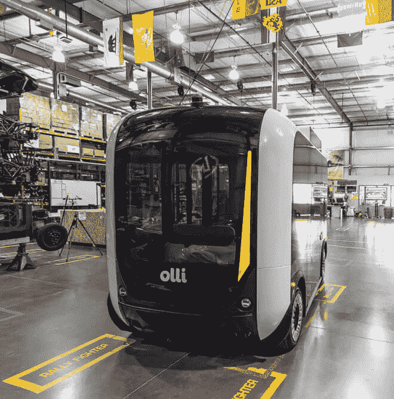
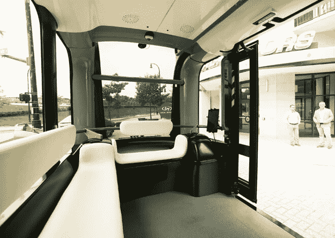
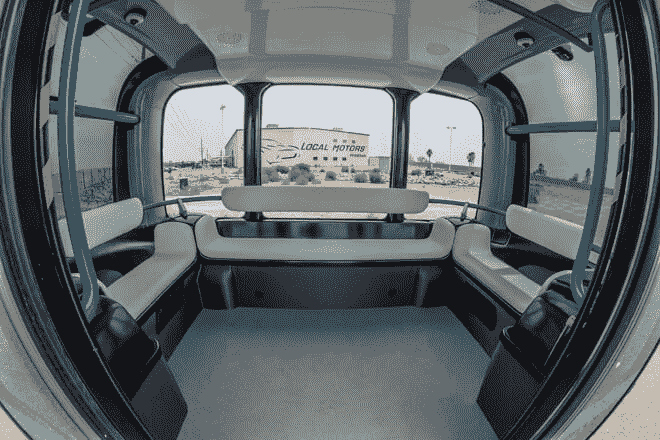
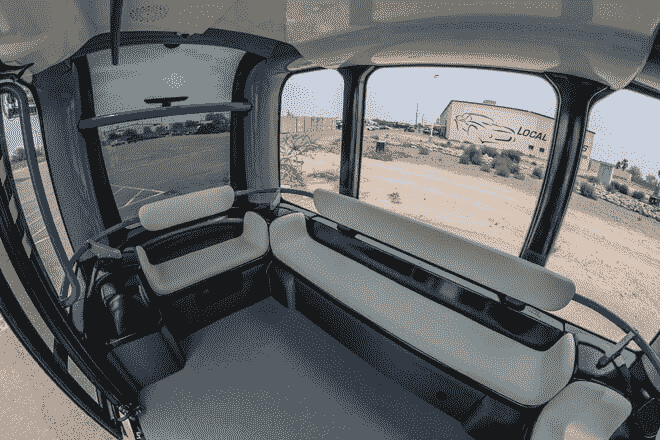
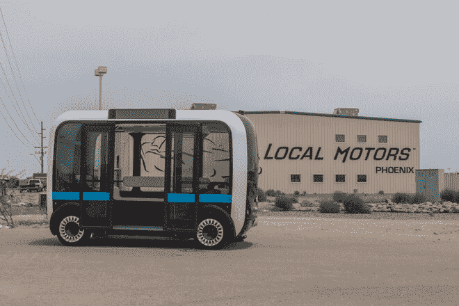

# 认识一下 Olli，你可以用智能手机呼叫的电动自动驾驶 3D 打印班车

> 原文：<https://thenewstack.io/olli-electric-self-driving-3d-printed-shuttle-can-hail-smartphone/>

随着交通拥堵问题在过去几十年中日益严重，全球范围内各种面向技术的解决方案也越来越多。像优步和 Lyft 这样的公司正在集中精力发展拼车市场，而其他公司正在投资智能驾驶系统，例如将汽车分组并连接成电子计时的"[排](https://en.wikipedia.org/wiki/Platoon_(automobile))"从而减少交通流量的自动高速公路。

当然，扩大和改善公共交通也是完善城市规划政策的试金石，但这也是科技创业公司正在迎接的挑战之一。一个典型的例子是总部位于亚利桑那州的[本地汽车](https://localmotors.com/)，这是一家汽车技术公司，最出名的是在 2014 年创造了[世界上第一辆 3D 打印电动汽车](https://en.wikipedia.org/wiki/Strati_(automobile))。它最近还在华盛顿特区的国家港口区推出了无人驾驶小型巴士服务，由 IBM 的人工智能技术 Watson 控制。

## 会说话的 3D 打印迷你巴士

这款电动汽车拥有活泼的绰号 Olli，由 3D 打印零件制成，一次最多可搭载 12 人。支撑 Olli 的人工智能将允许它与乘客互动，例如回答关于到达目的地的剩余时间的问题，规划路线，甚至推荐要参观的地标或餐馆。

在不久的将来，自动巴士将只在国家港口附近运行，作为为期一个夏天的试点项目的一部分，为游客提供免费试乘，游客可以安装一个应用程序，告诉班车来接他们。

但该项目的主要目标之一是测试 IBM Watson 的物联网(IoT)平台基于云的认知计算能力，以分析和学习将从安装在公交车上的 30 多个传感器收集的大量交通数据。除了公共交通，该公司还设想 Olli 可以用作包租班车、出租车服务，或者作为一个移动豆荚的互联网络在城市中运送人们。

据该公司称，为了确保更流畅和更个性化的交互体验，该车辆将利用四种沃森开发者 API，从语音到文本，文本到语音，自然语言和[名称实体识别](https://en.wikipedia.org/wiki/Named-entity_recognition)技术。

IBM 沃森物联网商业和教育总经理[哈里特·格林](https://www.linkedin.com/in/harrietg)表示:“认知计算提供了难以置信的机会，可以利用连接到物联网的所有设备的海量数据流，为客户创造无与伦比的定制体验。“IBM Watson 物联网认知计算能力[将]为每位乘客提供独特的个性化体验，同时有助于在未来几年彻底改变交通运输的未来。”

## 微型工厂和制造业的未来

除了制造世界上第一辆可以通过智能设备欢呼的自主按需小巴，Local Motors 还是一家开创了一种新制造方法的公司，这种方法利用了一个由众包人才和快速原型技术组成的开放社区，颠覆了关于规模经济的传统范式。该公司没有花费大量资金在商业市场上充分测试之前对同一产品进行一百万次迭代，而是选择一个由世界各地的贡献者提交的设计来换取版税，并在他们的“微型工厂”进行小规模生产之前销售这些设计。

Local Motors 联合创始人兼首席执行官 John B. Rogers，Jr .在 [Singularity Hub](http://singularityhub.com/2016/04/13/how-microfactories-can-bring-iterative-manufacturing-to-the-masses/) 上解释说:“我们的微型工厂能够以 5 倍的速度和 100 倍的成本完成这些复杂的网络机械设备。该公司可以按需生产产品，而不需要保持库存，使小型微型工厂成为这种敏捷设计方法的重要组成部分。

该公司现在正与官员合作，将奥利带到迈阿密戴德、拉斯维加斯和丹麦。毫无疑问，这种令人兴奋的自动驾驶公共交通的新可能性需要在道路上进行充分的测试，并在不断增长的(但[脆弱的](https://thenewstack.io/securing-internet-vulnerable-things/))物联网上得到充分的保护。但我们不得不承认，有了一队智能汽车，每天的通勤看起来不那么糟糕了，这些汽车不仅可以开车带你到处走，还可以来接你。这是否预示着从今天交通拥堵的城市中心到无车未来的转变，人们有朝一日可以依靠全面的、全市范围的、无污染的智能班车服务出行？只有时间能证明一切。

https://youtu.be/Ymz4SYVr_EE

[https://www.youtube.com/embed/azCRuwtE_n0?feature=oembed](https://www.youtube.com/embed/azCRuwtE_n0?feature=oembed)

视频

IBM 是这一新体系的赞助商。

图像:本地电机

<svg xmlns:xlink="http://www.w3.org/1999/xlink" viewBox="0 0 68 31" version="1.1"><title>Group</title> <desc>Created with Sketch.</desc></svg>