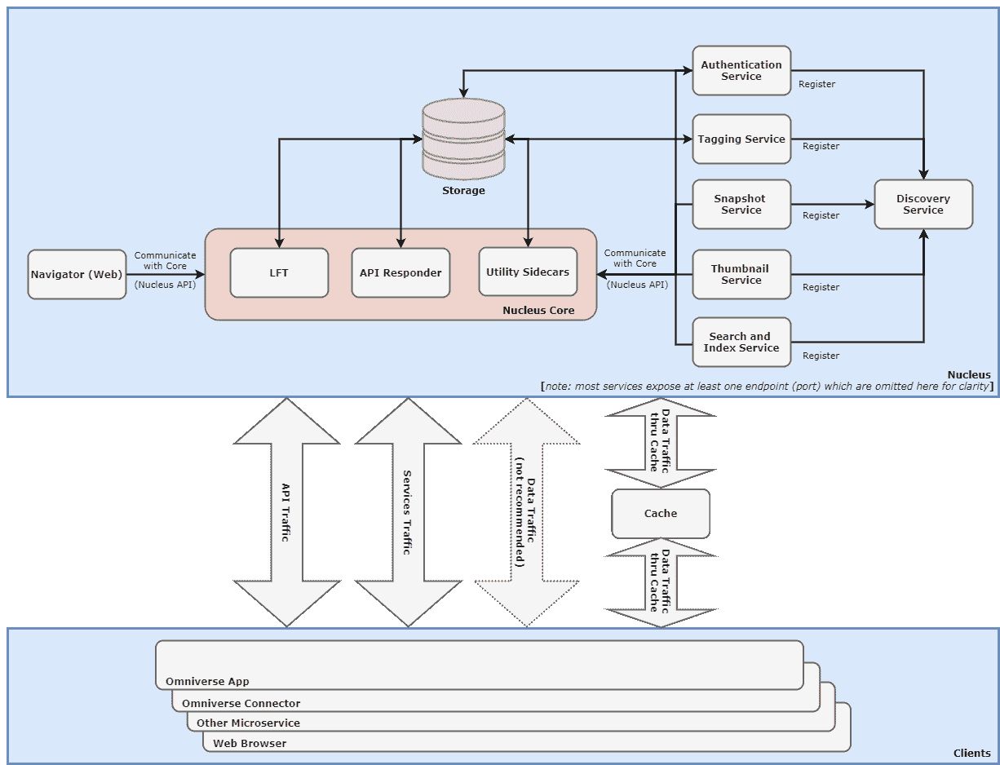
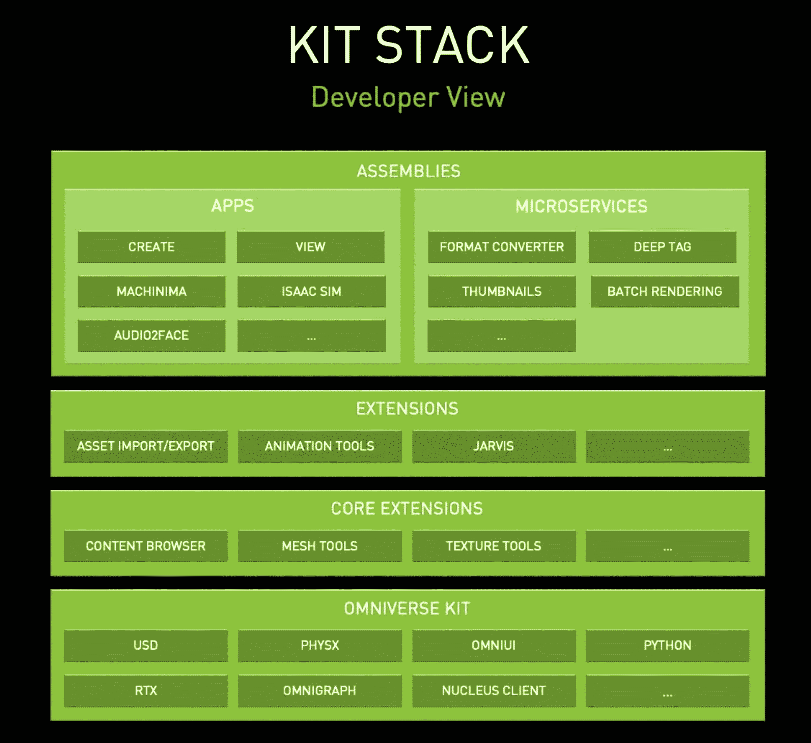
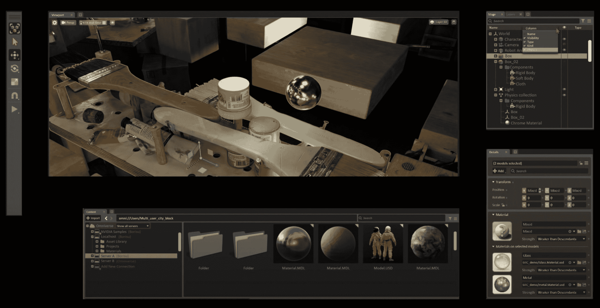
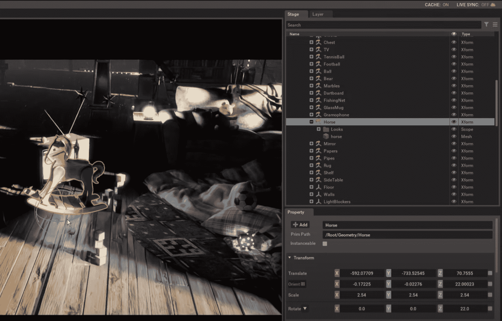
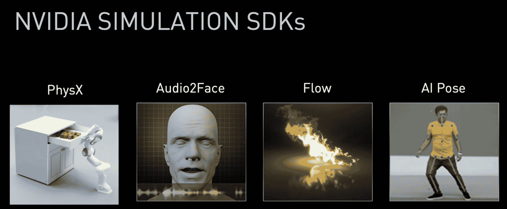
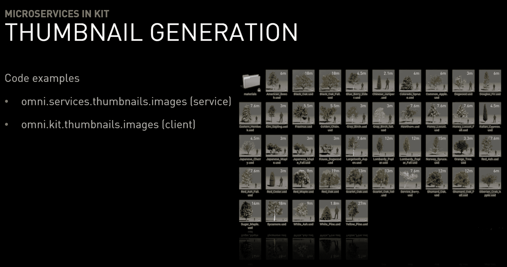

# 看看 Omniverse Kit，Nvidia 的元宇宙 SDK

> 原文：<https://thenewstack.io/omniverse-kit-nvidia-metaverse-sdk/>

 [理查德·麦克马努斯

理查德是 New Stack 的高级编辑，每周撰写一篇关于网络和应用程序发展趋势的专栏文章。此前，他在 2003 年创立了读写网，并将其打造为全球最具影响力的科技新闻和分析网站之一。](https://twitter.com/ricmac) 

上周，我考察了元宇宙的潜在开发者平台，这是一个今年被广泛讨论的 3D 版本的网络。尽管脸书上个月点燃了关于元宇宙的最新一轮炒作，另一家公司 Nvidia 在开发真正的元宇宙平台上走得更远。Nvidia 的 [Omniverse](https://developer.nvidia.com/nvidia-omniverse-platform) 从 2019 年就开始运行了，所以在今天的帖子里我要来看看它的开发者工具包:Omniverse Kit。

正如我上周所提到的，Omniverse 的主要目的是让工程师们通过共同研究产品的数字表示来合作构建一个物理产品。这是一个面向设计和制造公司的模拟和协作平台。

Omniverse Kit 是开发人员为 Omniverse 创建应用程序的工具。然而，它只是整个开发者平台的五个主要组件之一。另外四个部分分别是 Nucleus、Connect、Simulation 和 RTX 渲染器( [RTX](https://en.wikipedia.org/wiki/Nvidia_RTX) 是英伟达推出的高端专业视觉计算平台)。后三个组件相当容易理解，但是 Nucleus 需要一些解释。首先，这是架构图:

单击查看全尺寸图像(在新标签中打开)。

简而言之，Nucleus 是一套服务，Omniverse 应用程序可以与之交互。在一段介绍 Omniverse 套件的视频中，Nvidia 软件高级总监 Damien Fagnou 说 Nucleus“代表了许多不同应用程序之间的一个协调点。”

## 开发者栈

对于开发人员来说，Omniverse 工具包看起来像这样:

正如 Fagnou 在视频中指出的，“极端模块化”和扩展是 Omniverse 套件的两个关键概念。为了解释这一点，他展示了如何在使用 Kit: Omniverse Create 构建的内部应用程序中实现这一点，这是一个用于在平台上创建内容的工具。Create 不是一个大型的单一应用程序，而是使用许多扩展(基本上是软件模块)构建的。

“它不是一个应用程序，而是由扩展组成的，”法格努说。“这些扩展被称为构建模块，你可以用多种方式组装它们来创建不同类型的应用。在更高的层次上，它们都是用 Python 编写的，用于组装 UI、工作流和通用功能集。”

Omniverse 中的扩展创建

作为一个简单的例子，Create 中的搜索模块是一个连接到 Nucleus 索引服务的扩展。

## 这一切都是建立在美元之上的

包括 Kit 在内的所有 Omniverse 都是基于皮克斯的开源通用场景描述(USD)构建的。它既是一种文件格式，也是“一种具有 API 的强大场景表示”

正如另一个 Nvidia 视频中的[所解释的，Omniverse 是第一个完全围绕 USD 构建的应用。Nvidia 软件开发总监 Dirk Van Gelder](https://www.youtube.com/watch?v=vFxytzQlOEs) (在此之前，他是 Pixar 的一名 23 年老兵)说:“这不是一种进出口格式，你正在处理的实际文件是美元本身。”

一个例子是最简单的解释方法。在范·格尔德在他的视频中展示的一个场景中，他移动一匹动画马；每当马移动时，美元的价值就会改变。

## 物理学和 Python 的作用

3D 元宇宙平台的关键部分之一是它的“物理”，这意味着它模拟物理世界的方式。Nvidia 有几个模拟 SDK，其中一个是 physics SDK [PhysX](https://docs.omniverse.nvidia.com/prod_extensions/prod_extensions/ext_physics.html) 。

PhysX 的核心特性之一是角色控制器(CCT)，“一种视频游戏风格的移动控制器，允许用户在世界各地移动，而不能够通过物理碰撞启用的对象”(墙壁，其他人，等等)。).

虽然开发人员可以轻松地使用 Omniverse Create 这样的工具来添加和编辑 CCT，但他们也可以通过 Python 脚本来“调整”CCT 行为——例如，文档中说，“您可以添加一个键绑定和脚本来使 CCT 跳转。”

因此，如果 Python 开发人员想从 web 开发跳到元宇宙开发，他们可能在竞争中占有优势。Nvidia 最近的职位空缺表明，如果你是一名对元宇宙感兴趣的开发人员，需要什么。除了计算机科学学位，最近 Omniverse 团队[招聘广告](https://nvidia.wd5.myworkdayjobs.com/en-US/NVIDIAExternalCareerSite/job/US-CA-Remote/Senior-Software-Engineer---Omniverse_JR1941685)的申请人需要“很强的 C++和 Python 技能”以及“很强的游戏等实时系统知识”

## 微服务

最后，值得注意的是 Omniverse Kit 的微服务架构。在 Nvidia 高级软件工程经理 Jozef van Eenbergen 的视频中，他解释说微服务与 Kit 的扩展密切相关。

“服务可以是扩展的一部分，使用扩展或者是由 Kit 执行的简单脚本，”他说。

在 Kit 中如何使用微服务的一个例子是生成缩略图。“通信通过 http 进行，如果缩略图不存在，内容浏览器会指示一组缩略图服务生成缩略图，”van Eenbergen 说。

## 结论:Omniverse 领先了一步

正如您所看到的，Omniverse 开发人员平台范围很广，有很多可移动的部分。但是，如果你是一个熟悉 Python 和/或 C++的开发人员，并且对计算机图形感兴趣，那么将你的职业生涯转向元宇宙并不是一个很大的飞跃。

截至目前，Nividia 的 Omniverse 似乎是开发人员进入 3D 网络的完美方式，正如我在顶部提到的，这是一个趋势市场。尽管脸书也在招聘新成立的“元宇宙产品组”的员工，但它还没有一个开发者平台。另一方面，英伟达有一个全功能的元宇宙平台，它建立在皮克斯(Pixar)成熟的开源技术之上。

事实上，也许英伟达比脸书和其他公司领先两到三年，这将使 Omniverse 成为开发者进入元宇宙的主要途径。这仍有待观察，因为 Omniverse 目前的目标是企业市场，但无论如何，我都鼓励感兴趣的开发人员查看 Omniverse 工具包。

<svg xmlns:xlink="http://www.w3.org/1999/xlink" viewBox="0 0 68 31" version="1.1"><title>Group</title> <desc>Created with Sketch.</desc></svg>