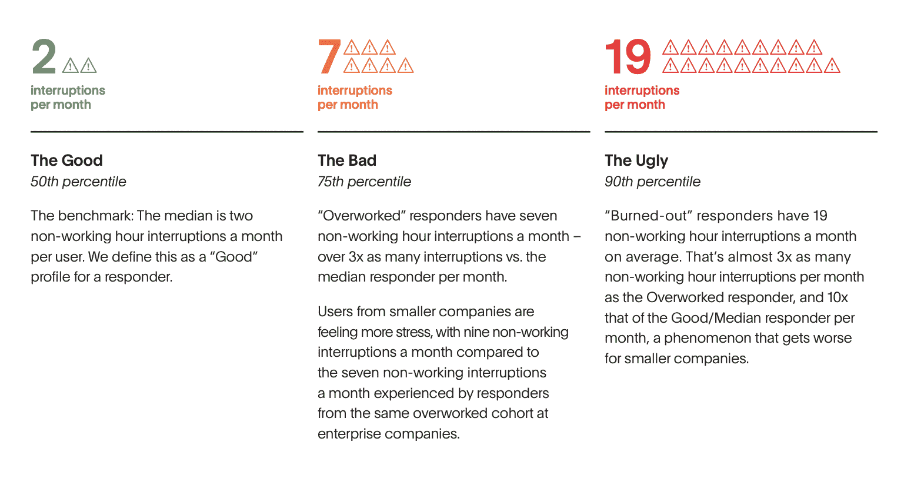

# 随叫随到。以下是如何在携带寻呼机时保持健康的方法

> 原文：<https://thenewstack.io/on-call-heres-how-to-stay-healthy-while-carrying-the-pager/>

[Hannah Culver](https://www.linkedin.com/in/hannah-culver/)

[Hannah 是 PagerDuty 的一名解决方案营销人员，她对实时紧急工作如何在这个数字时代的所有行业中发挥作用很感兴趣。](https://www.linkedin.com/in/hannah-culver/)

随叫随到很有挑战性。如果你在凌晨 2 点被闹钟吵醒，或者不得不中断与朋友的晚餐去处理突发事件，你就知道随叫随到带来的情感损失。从系统中消除所有失败的可能性是不可能的。即使代码冻结、负载测试、游戏天数等等，失败仍然可能发生。当它到来的时候，你可能正拿着一个传呼机。

重要的是专注于改进随叫随到的流程，并定期对其进行迭代，以改善随叫随到的生活。在这篇博文中，我们将分享你如何帮助自己和团队度过难关。

## 建立您随叫随到的信心

任何随叫随到的人都知道，在你习惯工作方式之前，有一个学习曲线。如果你是新手，或者以前没有打过电话，你会发现这是一个很好的公司:它令人生畏！和任何新事物一样，需要练习和熟悉才能适应。这对于刚接触随叫随到的人以及已经换了团队或公司的经验丰富的随叫随到的工程师来说非常重要。这里有一些你可以做的事情来建立随叫随到的信心。

### **阴影和反向阴影**

跟踪是培训新团队成员的常用技术。在跟班期间，新队友将跟随一名经验丰富的队友随叫随到，通常是在工作时间。这与[结对编程](https://www.agilealliance.org/glossary/pairing/#q=~(infinite~false~filters~(postType~(~'page~'post~'aa_book~'aa_event_session~'aa_experience_report~'aa_glossary~'aa_research_paper~'aa_video)~tags~(~'pair*20programming))~searchTerm~'~sort~false~sortDirection~'asc~page~1))类似。跟车之后，新队友可能觉得自己已经准备好了，也可能不觉得自己已经准备好了，所以让他们试驾是很重要的。这就是反向阴影的用武之地。在此期间，角色互换，影子现在响应警报。如果新队友发现自己需要帮助，他们的导师会加入进来。

在 PagerDuty，在新工程师任期的第二个月和第三个月，这种阴影期和反向阴影期非常常见。这个过程不仅仅对新员工有价值。对于那些可能对随叫随到感到紧张的人来说，这也很棒。您可以随时在您的团队中设置跟踪机会。

### **不要害怕升级**

不确定如何解决事件？我们都经历过。在[最近的一次网络研讨会](https://www.pagerduty.com/resources/webinar/impact-of-on-call-and-real-time-work/)中，工程经理迪莱什尼·贾亚辛格讲述了过去的 18 个月如何改变了她的团队处理分流的方式。在疫情之前，如果警报被触发，她的团队可以在需要开始一个事件之前转动他们的椅子，互相询问问题。

现在，贾亚辛格说，谨慎从事是很重要的。首先触发事件，在需要时毫不羞耻地尽快升级，并知道您的团队会支持您。与自己辩论某个事件是否糟糕到需要联系队友的时间是至关重要的。当停机时间每分钟花费数千美元时，尤其是在节假日期间，快速行动可以节省收入并提高客户满意度。

### **安全是关键**

哈佛大学教授艾米·埃德蒙森认为，心理安全是一种信念，认为在工作场所畅所欲言是安全的。她指出，要取得成功，团队既需要对卓越的承诺，也需要进入学习区的心理安全，这是最好和最有成效的工作方式。

为了帮助建立心理安全，试着把注意力放在移情和无可指责上。同理心可能看起来像认识到一个队友或你自己可能犯了一个错误，并肯定这是正常的。这也需要无可指责。不要指名道姓地羞辱某人或指责自己的失败，而是关注导致失败的系统性问题。是否缺少工具或文档？在被警报吵醒一夜之后，应答者累了吗？

通过同理心和关注无过错，你可以在你的团队中培养心理安全感。这将增加每个人对自己随叫随到能力的信心，并提醒他们即使你失败了，你也可以学习并东山再起。

## 改进流程和文档

当发现他们应该使用的流程和文档不能反映当前状态时，即使是最自信的待命工程师也会动摇。您应该在一年中定期审查您的流程和文档，以确保一切都是最新的。以下是一些需要检查的最重要的事情:

*   **随叫随到轮值:**如果你还没有建立随叫随到轮值，与你的团队一起确定谁负责哪几天。如果你有一个随叫随到的轮班，仔细检查以确保你需要轮班的任何一天都有专人负责。
*   **服务和依赖关系图:**每个服务可能依赖于其他服务，并且会有服务依赖于它。如果你遵循一个[全服务所有权模式](https://ownership.pagerduty.com/)，你应该有这些联系。如果这没有被记录下来，现在是确保您知道您的服务如何影响更广泛的系统的最佳时机。
*   **事件响应文档:**您需要了解如何对事件进行分类和解决。请确保您有概述每个严重程度的事件分类的文档。记录响应者的角色和职责，以简化响应。
*   run book:run book 有多种形状和尺寸。有些是精心制作的[自动补救序列](https://www.pagerduty.com/use-cases/automation/)，可以在需要人类介入之前解决事故。其他是较轻的自动化序列，可以为响应者提供额外的上下文或消除过程中的辛劳。即使不涉及自动化，操作手册也是有用的逐步指南。这些应该详细说明解决常见问题的流程，以便任何响应者都可以采取行动。
*   **工具:**确保你熟悉你的团队使用的随叫随到工具。查看运营分析、仪表盘、事件响应工具等内容。正如工程经理李奥·恩格尔所说，“当你被传呼时，你希望尽可能少的新奇。这样，你就能随手拿到你需要的东西。如果你能通过放下这些工具在心里预演一下，那就帮了大忙了。”

有了正确的流程和文档，您就可以更好地准备在值班期间处理任何问题。这种准备可以帮助您节省时间，因为每一秒钟对您的组织来说都意味着大量的金钱。然而，除了考虑底线，还有一个额外的甚至更重要的考虑因素。

## 评估响应者健康状况和沟通

了解你的近况是你能做的最重要的事情。你需要了解如何定性和定量地披露你的值班情况，以及你需要什么样的支持。

根据 PagerDuty 平台 2019 年和 2020 年的比较数据创建的一份[报告](https://www.pagerduty.com/state-of-digital-ops/)显示，在过去的 18 个月里，倦怠已经成为一个更大的问题。我们比较了用户经历的非工作时间中断次数，并将其分为三类:

好的类别每月只有两次中断。坏的一类有七个。丑陋类有 19 个。这些下班后的干扰导致每天额外工作两小时，每年额外工作 12 周。根据我们的数据，这一群体也是最有可能离开 PagerDuty 平台(我们的减员指标)的群体。每个人都有责任确保倦怠不会达到这种程度。

一种方法是记录你被打断的次数以及这些打断发生的时间。毕竟，下午 2 点的中断比凌晨 2 点的中断破坏性要小得多。[分析工具](https://www.pagerduty.com/platform/analytics/)可以帮助您了解您的值班情况，以便您可以将数据带给您的团队和经理。如果你是一名经理，你想看看这些指标，并检查你的团队做得如何。

此外，您可以向您的经理询问优先考虑和休息日政策，这些政策应在您的[值班文档](https://goingoncall.pagerduty.com/)中详细说明。覆盖和恢复日不是工程师的“工作津贴”。它们是健康的赌注。

要了解更多关于如何出色地随叫随到并保持良好状态的信息，您可以查看以下资源:

1.  [随叫随到行动指南](https://goingoncall.pagerduty.com)
2.  [网络研讨会:随叫随到和实时工作的数量和人员影响](https://www.pagerduty.com/resources/webinar/impact-of-on-call-and-real-time-work/)
3.  [待命团队的最佳实践](https://goingoncall.pagerduty.com/)
4.  [数字操作状态报告](https://www.pagerduty.com/state-of-digital-ops/)
5.  [全面服务所有权运营指南](https://ownership.pagerduty.com/)

*或查看[page duty](https://www.pagerduty.com/?utm_content=inline-mention)如何通过 14 天的免费试用帮助您采用最佳实践。*

<svg xmlns:xlink="http://www.w3.org/1999/xlink" viewBox="0 0 68 31" version="1.1"><title>Group</title> <desc>Created with Sketch.</desc></svg>