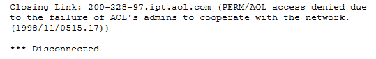

# 在其 30 周年之际，IRC 唤起了人们对互联网早期的回忆

> 原文：<https://thenewstack.io/on-its-30th-anniversary-remembering-the-early-days-of-irc/>

我们刚刚迎来了互联网中继聊天( [IRC](http://www.irc.org/) )的 30 周年纪念日——这使得它成为今天互联网上仍在使用的最长寿的通信协议之一。这不仅是分享一些记忆的时候，也是惊叹 IRC 如此长寿的时候。

IRC 的创始人 Jarkko Oikarinen 将其成功的部分原因归功于其固有的权力下放。IRC 没有独立的服务器，而是将服务器连接在一起，使所有用户都在同一个网络中(而当 Slack 宕机时——就像本周发生的那样——[成千上万的用户突然同时下线](https://www.cnet.com/news/slack-is-down-again-at-least-for-some/)。)但他也提到匿名——一次性的、用户选择的手柄——是“IRC 的特别之处”

90 年代初我用 IRC，那时候有各种好玩的事情可以做。有一个服务器的机器人[玩拼字游戏](http://www.circlemud.org/jelson/software/boggle.html)。我是那个自以为无所不知的音乐势利小人，被某人在 94 年伍德斯托克音乐节上设立的聊天频道踢出去了。我创造了键盘宏指令，产生了 ASCII 艺术。我跳过了 2006 年迈克·泰森(Mike Tyson)的付费拳击比赛，去观看有人在 IRC 上描述它。

> `<jon12345> lewis connects again
> <jon12345> arg
> <jon12345> on the ropes
> <CaZtRo> HES GOIN DOWN
> <CaZtRo> tyson is DOWN
> <DaNNe_> no!
> <CaZtRo> DOWN DOWN DOWN
> <DaNNe_> why ..`

但是这个匿名的网络社区也以其他方式进入了我们的生活。我记得一个叫 Lori G .的女人，她住在加利福尼亚的伯克利，她使用 EFNet 访问致力于从毒品和酒精成瘾中恢复的聊天。“当我在那个频道的时候，它在我极度沮丧的时候救了我的命，”她曾经告诉我。“当时我正在处理化学抑郁症。EFNet 救了我的命，因为我能够去那里与正在康复中的人交谈，他们也处理过同样的问题，并得到了很多很好的反馈……”

洛里记得，从匿名戒酒会到匿名戒毒会，都有各种各样的渠道，而且“当我忙得没有时间去参加真正的会议时，我可以上频道。”

早在 1997 年，Jarkko 说他已经听说过很多在 IRC 上认识的情侣，他甚至承认这影响了他自己的生活。“它让我开阔了眼界，看到并理解了来自不同文化的人们。”听起来就像任何其他热情的 IRC 用户一样，Jarkko 说，“我在世界各地交了很多朋友，如果没有 IRC 我就不会交这些朋友。”

早在 2 月份，Motherboard [记得 IRC](https://motherboard.vice.com/en_us/article/xw5wvj/why-did-slack-win-out-over-irc-anyway) 是“那种先于 ICQ、先于 AOL Instant Messenger 的书呆子式的努力，它以与新闻组相同的方式反映了互联网野性的、有点疯狂的本质……”，尽管也许我们都记得的是它的自由开放精神。“IRC 很棒——它甚至是一首热门 EDM 歌曲的主题！——但它肯定从未被打磨过，”Motherboard 补充道。

[https://www.youtube.com/embed/RYQUsp-jxDQ?feature=oembed](https://www.youtube.com/embed/RYQUsp-jxDQ?feature=oembed)

视频

"这是那种有一条大鳟鱼会让你大吃一惊的地方。"

开发人员 Khaled Mardam-Bey 基于一个旧的 Monty Python 短剧用 [a /slap 命令](https://en.wikipedia.org/wiki/Wikipedia:Whacking_with_a_wet_trout)增强了他的 1995 Windows IRC 客户端 mIRC。(键入/slap，用户的名字将会打出一个句子，表明你正在用一条大鳟鱼打那个用户。

[https://www.youtube.com/embed/IhJQp-q1Y1s?feature=oembed](https://www.youtube.com/embed/IhJQp-q1Y1s?feature=oembed)

视频

在任何频道上，如果你冒犯了频道的创建者，总有可能被隆重地踢出对话。还有一次是在 1998 年，美国在线[被踢出 IRC](http://aolwatch.org/list/0100.html#helmet)——也就是说，与所有非 AOL 服务器断开链接，进行互联网转播的聊天。在 EFNet 的 IRC 管理员的邮件列表上——仍然自称为“最初的 IRC 网络”——美国在线被敦促寻找更多的资源来处理滥用，他们的系统管理员对此的回应是，“生活糟透了。买个头盔。”

投票决定断开 AOL 的服务器是一致的。

AOL 并不是唯一一个不得不和愤怒的运营商打交道的大型实体。“在 Debian 的 IRC 频道上询问 Ubuntu 被认为是不好的……”2014 年的一个网页警告道，“自由开源软件基金会和华沙黑客空间是如何在 Freenode 上被#debian(暂时)禁止的。”

Motherboard 记得 90 年代中期，MTV [在 IRC](https://motherboard.vice.com/en_us/article/xw5wvj/why-did-slack-win-out-over-irc-anyway) 采访一个崭露头角的乐队，但认为这是证明这一规律的例外。“这基本上是我对 IRC 以任何方式、形状或形式成为主流的唯一记忆。一般来说，我对 IRC 的记忆都是围绕着聊天模拟器和*雷神之锤*有多棒。

但是据 TechCrunch 报道，在 2003 年至 2013 年间，IRC 的用户从 100 万增加到大约 40 万，这在一定程度上归咎于社交媒体的兴起。然而 Motherboard 报道说 Khaled Mardam-Bey 至今仍在维护 mIRC——尽管 AOL 自己的聊天客户端 AOL Instant Messenger 最终在八个月前关闭了。渐渐地，IRC 用户群体缩小到一个忠诚的核心，但它仍然很受欢迎，尤其是在技术社区。“不管你个人对 IRC 的看法如何，事实是如果你想加入开源软件和社区，你需要学习如何使用它，”OpenSource.com 的一篇文章警告说。

软件开发人员 Drew de fault[在 2015 年开玩笑说:“甚至我的父亲也取笑我使用一个 30 年前的协议，但在我指出他仍然使用 HTTP 之后就不是了。”。他指出，甚至 Docker 也使用 IRC，以及其他主要项目，如 Node.js、Django 和 Angular。](https://drewdevault.com/2015/11/01/Please-stop-using-slack.html)

早在 2016 年，ZDNet 就注意到 IRC 主要在“[开发者社区](https://www.zdnet.com/article/irc-3-the-original-online-chat-programs-gets-updated/)”中生存，并报告了 IRC 官方协议的新更新，“[，以使其在 21 世纪](https://www.zdnet.com/article/irc-3-the-original-online-chat-programs-gets-updated/)重新焕发活力也许每个老前辈都有自己对 IRC 的美好回忆——以及让它继续下去的愿望。

TechRepublic 去年 9 月报道称，“问问一群 IT 管理员，有多少人使用过老式的 IRC 聊天服务，会有很多人举手。”该报道宣布了新的多平台 IRC 服务(以及相应的客户端)IRC cloud[的到来。](https://www.techrepublic.com/article/irccloud-bring-old-school-irc-chats-into-the-modern-day-cloud/)

Jarkko Oikarinen 在他还是一名大学生的时候就创建了 IRC。“IRC 最初是一个暑期实习生的编程练习，”他曾经写道。“一次黑客攻击发展成为一个有数百人参与的软件开发项目，并成为一个世界范围的环境，现在成千上万的人在这里相互交流。”

## IRC 的黎明

1988 年夏天，他一直在奥卢大学信息处理科学系工作。“我猜他们没什么事让我做，”他后来在自己出版的《历史》中回忆道。“我负责管理该部门的 Sun 服务器，但这并没有占用太多时间……”他最初只是试图改进 tolsun.oulu.fi 上的一个公共论坛系统。他最初的想法是添加新闻组风格的讨论组以及实时讨论。

但是通过调查，他发现 Jyrki Kuoppala(也在芬兰)已经实现了`rmsg`，一个让不同机器上的人交换信息的程序。Jukka Pihl 还创建了另一个简单的多用户聊天程序，名为 MUT(代表多用户交谈)。当时已经有一个叫 Bitnet Relay Chat 的聊天网络，Jarkko 称这是他的灵感，是由田纳西大学查塔努加分校的 Jeff Kell 在 1985 年创建的。“我最初想把 IRC 和 Bitnet 中继聊天链接在一起，”Jarkko 在 10 年后的一次在线采访中说，尽管它最终在 IRC 历史上扮演了一个不同的角色。Jarkko 有一些朋友使用 Bitnet 中继聊天，他们最终成为 IRC 的第一批测试者。

Jarkko 后来记起了第一个 IRC 频道的名字。最初通道必须是数字，所以第一个通道要么是 1，要么是其他一位数

那么构建 IRC 用了多长时间？“在芬兰其他几个人的帮助下，在芬兰测试的第一个版本大概用了三到四个月就完成了编码。”Jarkko 不记得他最后发布 IRC 的确切日期，尽管他记得是在八月。

然后事情开始发生了。

“当 IRC 开始偶尔有超过 10 个用户时，我让我的一些朋友开始在芬兰南部运行 IRC 服务器，主要是在坦佩雷理工大学和赫尔辛基理工大学，”Jarkko 回忆道，并补充说“其他一些大学很快跟进。”当 Jarkko 在麻省理工学院的分时系统 ai.ai.mit.edu 上获得一个账户，并把 IRC 的服务器软件传给它在美国的第一个用户时，一个更大的突破出现了。该软件被传递给俄勒冈州立大学的两个用户(另一个在丹佛大学)，并且“在那之后，其他一些人开始运行 IRC，服务器的数量迅速增长。”

Jarkko 最终获得了博士学位，并于 2011 年成为斯德哥尔摩谷歌瑞典公司的技术主管。但是他在 2004 年为奥赖利的书 *IRC Hacks* 写前言时回顾了过去。

“在 1988 年 8 月 IRC 首次出现之前，至少有数百个聊天程序，”他谦逊地写道，并补充说现在有数千个。他对自己的角色保持着哲学态度。“IRC 是所有 IRC 用户和开发者的成就…

“我有幸创建的原始 IRC 的小雪球已经变得这么大，因为所有的 IRC 用户和开发者…

“谢谢你:-)-o——”

* * *

# WebReduce

<svg xmlns:xlink="http://www.w3.org/1999/xlink" viewBox="0 0 68 31" version="1.1"><title>Group</title> <desc>Created with Sketch.</desc></svg>