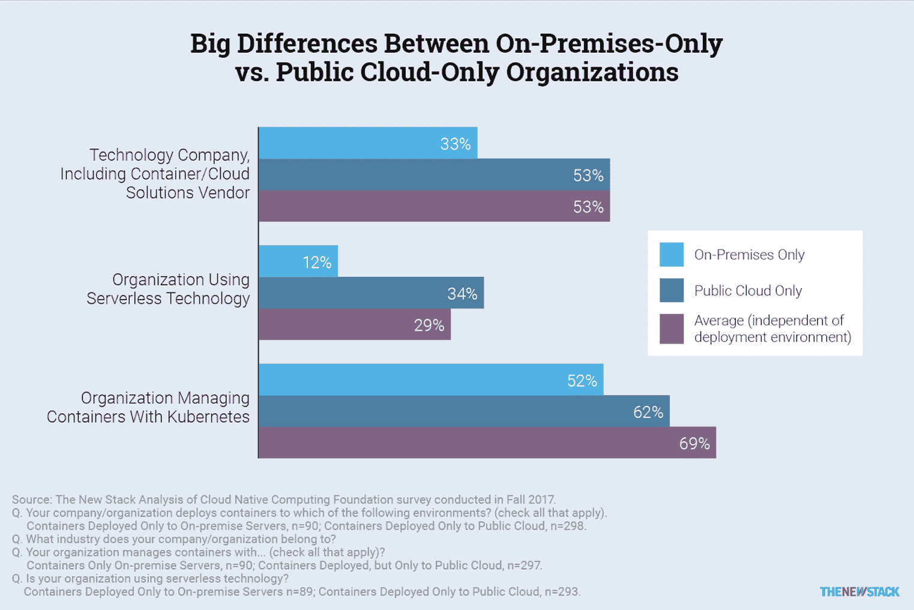

# 本周数字:内部组织在技术采用方面落后于云同行

> 原文：<https://thenewstack.io/on-prem-cloud-tech/>

去年底，[Cloud Native Computing Foundation](https://www.cncf.io/)对 763 名 IT 专业人士进行的一项调查发现，那些将运营保持在内部的组织在拥抱最新技术方面落后了。该调查包括 23%在仅使用公共云数据中心的组织中工作的参与者，以及 13%仅使用内部数据中心的参与者。虽然 29%的样本使用无服务器技术，但只有 12%的内部组织使用。

这对你意味着什么？随着内部解决方案变得强大，无服务器架构的采用是否会大幅增加，这一点有待确定。十有八九，公共云提供商将继续领先，但市场将支持维护自己的私有云或内部数据中心的组织，在给定工作负载的最佳执行环境中运行应用程序。

从 *[中可以看出，Kubernetes 用户在部署](https://thenewstack.io/top-challenges-kubernetes-users-face-deployment/)* 时面临的最大挑战，本地组织与公共组织面临的问题有很大不同。例如，对于 54%的仅使用本地服务器的容器用户来说，存储是最大的存储挑战，比仅使用公共数据中心的用户高 20 个百分点，高 13 个百分点。这可能是因为这些组织管理自己的存储基础架构，甚至可能由单独的 IT 团队来处理。

在 Kubernetes 上阅读我们最新的[电子书](/tag/kubernetes-deployment-and-security-patterns/)中的更多数据分析。

云本地计算基金会是新堆栈的赞助商。

<svg xmlns:xlink="http://www.w3.org/1999/xlink" viewBox="0 0 68 31" version="1.1"><title>Group</title> <desc>Created with Sketch.</desc></svg>