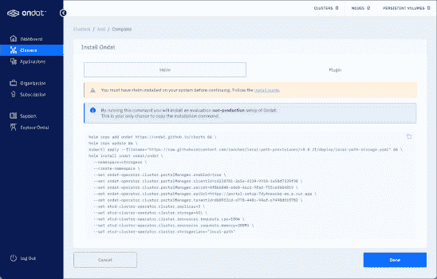
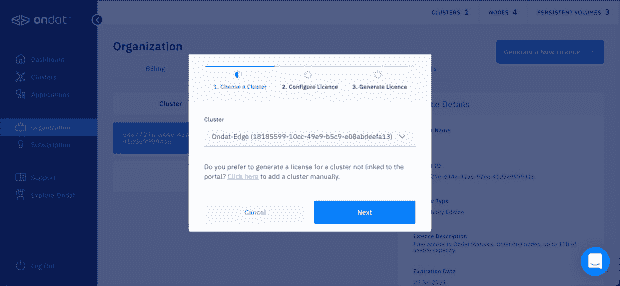

# Ondat 针对 Kubernetes 状态工作负载的无限节点

> 原文：<https://thenewstack.io/ondats-unlimited-nodes-for-kubernetes-stateful-workloads/>

云原生存储提供商[Ondat](https://www.ondat.io/blog/ondat-community-edition-pricing)(原 StorageOS)宣布推出其存储平台的免费社区版、付费版和定制企业版。Ondat 旨在通过消除安装和管理云原生存储层中的摩擦，使有状态工作负载成为 Kubernetes 中的一流公民。

Ondat 称自己是为 Kubernetes 构建的块存储数据网格，它基于本地结构，如持久卷、持久卷声明和快照。它聚合节点可用的多个块存储设备，以提供 Kubernetes 使用的单个统一存储层。

Ondat 创建的每个卷都被同步复制到集群不同节点上配置的其他卷。这种能力为有状态的企业工作负载带来了高可用性和冗余。

由于每个卷都是独立加密的，因此隔离和管理多租户应用程序变得非常简单。Ondat 卷是拓扑感知的，这意味着内置的调度程序可以确保使用持久卷的 pod 始终位于正确的可用性区域和正确的节点上。


Ondat 支持基于云的 Kubernetes 托管服务、本地 Kubernetes 集群和 [Red Hat OpenShift](https://www.openshift.com/try?utm_content=inline-mention) 集群。它还支持以运行在边缘的离线集群为目标的气隙安装。

## **探索 Ondat 社区版**

部署 Kubernetes 集群时的一个常见挑战是找到合适的存储层。虽然选择 CNI 网络层很容易，但在存储方面却没有太多选择。免费提供的开源产品缺乏存储集群的易用性、可靠性和可管理性。

Ondat Community Edition 旨在通过提供对充足存储和无限节点的支持来解决这个问题。它具有 1tb 的存储容量，对群集中的节点数量没有限制。这两个因素是 Ondat 区别于其他市售免费解决方案的独特之处。

在探索了 Kubernetes 的各种存储选择后，我发现 Ondat 的用户体验简单而直观。基于 web 的用户界面使得在各种环境中部署和管理 Ondat 变得非常容易，包括云和内部部署。它还负责生成和应用有效期为一年的社区许可证。

我决定尝试一下 Ondat Community Edition，将它安装在我的一个在裸机环境中运行的本地集群上。我的 Kubernetes 环境基于 1.23 版本，运行在一组由 1TB NVMe 磁盘驱动的英特尔 NUC 机器上。


以下是开始使用 Ondat Community Edition 的分步指南:


第一步是在 Ondat 注册，[登录](https://portal.ondat.io/signup)进入门户。

门户充当运行 Ondat 存储平台的所有集群的中心。让我们从选择“在您的集群上安装 Ondat”选项开始。


由于我们的目标是与边缘部署相同的环境，因此我们选择“other”作为群集位置。为集群命名并将其添加到门户。



在这里，您可以找到在集群中安装 Ondat 所需的一切。假设您已经安装了 [Helm](https://helm.sh/) ，您需要做的就是复制并粘贴门户中显示的命令。

让我们仔细看看安装工作流程。首先，它将 Helm repo 添加到 Ondat 图表所在的位置，并更新本地环境。

接下来，它安装来自 Rancher 的[本地路径供应器](https://github.com/rancher/local-path-provisioner)，该供应器从每个节点提供基于主机路径的持久卷。如果你想知道为什么 Ondat 需要安装另一个存储类，那是因为 etcd pods 需要存储。Ondat 依靠 etcd 来存储元数据和集群信息，但是 etcd pods 在部署之前需要一个存储类。本地路径存储提供程序是 Ondat 为 etcd pods 提供持久性的先决条件之一。

最后，通过设置 Ondat 所需的各种选项，将 Helm chart 安装到 storageos 名称空间中。

单击“完成”后，您将在 pending clusters 下看到该集群。在 Ondat pods 部署完毕并准备就绪后，它很快进入连接的集群部分。


密切关注 storageos 命名空间，了解 pod 是如何创建的。几分钟后，您会发现所有的 pod 都处于就绪状态。


门户通过以绿色显示集群状态来确认成功安装。


是时候申请社区版许可证了。转到“组织”部分下的“许可证”选项卡，然后选择集群。



选择 community edition 许可证，然后单击“下一步”应用它。


我们可以通过部署一个在 CLI 上运行的 pod 来验证许可证。

```
kubectl  -n  storageos create  -f-&lt;&lt;END
apiVersion:  apps/v1
kind:  Deployment

metadata:
  name:  storageos-cli
  namespace:  storageos
  labels:
      app:  storageos
     run:  cli

spec:
  replicas:  1
  selector:
      matchLabels:
        app:  storageos-cli
       run:  cli

  template:
      metadata:
        labels:
          app:  storageos-cli
         run:  cli

      spec:
        containers:
        -  command:
          -  /bin/sh
          -  -c
         -  "while true; do sleep 3600; done"

          env:
          -  name:  STORAGEOS_ENDPOINTS
            value:  http://storageos:5705
          -  name:  STORAGEOS_USERNAME
            value:  storageos
          -  name:  STORAGEOS_PASSWORD
           value:  storageos

          image:  storageos/cli:v2.5.0 
         name:  cli

END

```

Exec 进入 pod 并验证许可证。

`POD=$(kubectl -n storageos get pod -ocustom-columns=_:.metadata.name --no-headers -lapp=storageos-cli)`

`kubectl -n storageos exec $POD -- storageos get license`


最后，验证 Ondat 存储类是否可用于创建持久卷和声明。

`kubectl get storageclass`


我们现在已经准备好部署基于 Ondat 存储平台的有状态工作负载。在接下来的教程中，我将带您了解特性和功能的细节。敬请关注。

<svg xmlns:xlink="http://www.w3.org/1999/xlink" viewBox="0 0 68 31" version="1.1"><title>Group</title> <desc>Created with Sketch.</desc></svg>