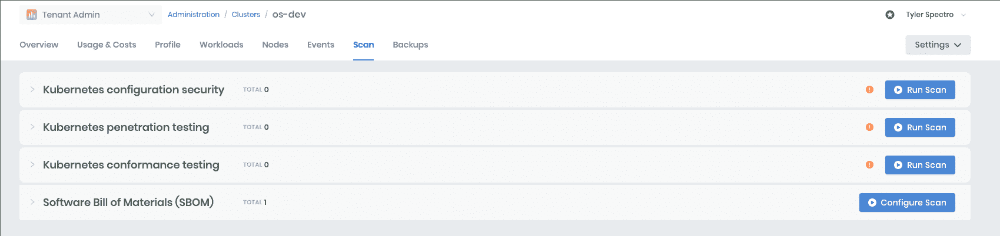
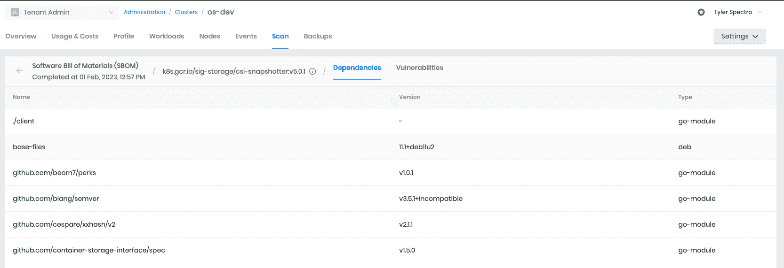

# 一键 SBOM 为您的 Kubernetes 集群与调色板

> 原文：<https://thenewstack.io/one-click-sbom-for-your-kubernetes-clusters-with-palette/>

软件材料清单(SBOM)是组成软件应用程序的组件、库和其他资产的综合列表。它详细介绍了软件中使用的第三方组件和依赖关系，有助于管理软件供应链中的安全性和合规性风险。

SBOM 跟踪关于每个组件的软件开发元数据，包括诸如版本、来源和许可证之类的数据字段。这使组织能够跟踪漏洞，执行定期软件维护，并确保符合法规要求。

SBOMs 可以多种格式构建，包括:

1.  [SPDX](https://github.com/spdx/spdx-spec/blob/v2.2/schemas/spdx-schema.json) :组织和政府广泛使用的标准化格式。它出现的时间比其他任何形式都要长。
2.  [CycloneDX](https://cyclonedx.org/specification/overview/) :一种开源的 XML 格式，提供了软件组件及其元数据的标准表示。
3.  GitHub 的[依赖提交格式](https://docs.github.com/en/rest/dependency-graph/dependency-submission?apiVersion=2022-11-28)，可以驱动[依赖评审工作流](https://docs.github.com/en/code-security/supply-chain-security/understanding-your-software-supply-chain/about-dependency-review)。
4.  JSON:一种轻量级数据交换格式，通常用于在基于 web 的应用程序中表示 SBOMs。

由于这个领域在快速发展，对于哪种格式是最好的还没有正式的共识。账单的格式将取决于生成账单的工具或程序、组织的要求及其预期用途。

## 为什么 SBOM 很重要？

材料清单提供了关于组成一个软件的组件的重要信息。它允许组织管理和监控其应用程序的安全足迹。

这在今天尤其重要，因为网络安全威胁不断演变，系统变得更加复杂。软件部署现在包括许多软件产品，通常来自多个软件供应商。[网络安全管理软件产品](https://www.businessinsider.com/solarwinds-hack-explained-government-agencies-cyber-security-2020-12)攻击和 [Log4Shell](https://anchore.com/log4j/) 漏洞是最近供应链风险的两个例子。通过维护最新的 SBOM 安全，组织可以识别常见的漏洞和暴露(CVE ),并确保它们在被利用之前得到解决。

此外，SBOMs 可以帮助组织确保遵守法规和标准，例如:

维护完整准确的 SBOMs 简化了证明符合这些法规的流程，有助于组织与客户和利益相关方建立信任。

## 我怎样才能创造一个 SBOM？

许多 SBOM 工具已经在各种开源许可下发布。现在，您可以从包含源代码的容器映像或 git 存储库和文件系统中生成 SBOMs。甚至还有一些工具可以处理更深奥的资源，比如 OCI 档案馆和 Singularity Image Format (SIF)容器。

流行的开源工具包括: [Tern](https://github.com/tern-tools/tern) 、 [Syft](https://github.com/anchore/syft) 、 [Kubernetes bom](https://github.com/kubernetes-sigs/bom) 和 [spdx-sbom-generator](https://github.com/opensbom-generator/spdx-sbom-generator) 等等。

开源工具非常棒，但是仍然需要 DevOps 努力将您选择的工具集成到您的映像构建管道中。即使配置了 SBOM 管道，还需要考虑如何以用户友好的方式呈现 sbom 及其包含的元数据。这就是 Palette 的软件材料清单(SBOM)扫描发挥作用的地方。

## 调色板软件物料清单(SBOM)扫描

Palette 已经支持一系列现成的扫描，包括 Kubernetes 配置安全性、一致性和渗透测试。现在，我们很高兴地宣布我们的软件材料清单(SBOM)扫描。

调色板聚类扫描

入门很简单。首先，选择你想要的 SBOM 格式:我们支持四种最流行的格式。然后，设置扫描范围，并选择性地指定备份存储位置。扫描范围包括:

1.  集群:整个 K8s 集群
2.  名称空间:单个名称空间
3.  标签选择器:与标签选择器匹配的名称空间中的所有窗格
4.  豆荚:一个豆荚

SBOM 扫描配置示例:集群范围和标签选择器

调色板将在您选择的范围内识别每个唯一的容器图像，并为该图像生成一个 SBOM。我们还将通过漏洞扫描器运行 SBOM，该扫描器将标记 CVE。

SBOM 扫描正在进行

SBOM 扫描完成

您可以单击已完成的扫描来查看扫描报告，其中包含已扫描的每个图像的其他详细信息。

context 列指示每个图像的每种独特用法，按容器名称、命名空间和 pod 名称分类。我们这样做是因为每个图像可能被给定范围内的不同容器使用。

漏洞摘要列提供了漏洞报告的精简视图。您可以通过单击扫描报告中的任何一行来访问更多详细信息。

完成 SBOM 扫描报告

最后，扫描报告中的每个映像详细信息页面都提供了依赖项和漏洞列表。这些表是为特定影像生成的 SBOM 中包含的元数据的浓缩高亮显示。将显示每个依赖项的版本和类型，但附加元数据将包含在 SBOM 中。具体包括哪些额外的元数据将取决于所选择的 SBOM 格式。

k8s.gcr.io/sig-storage/csi-snapshotter:v5.0.1 映像的依赖关系

对于每个漏洞，您可以查看名称、严重性级别、漏洞代码、已安装或受影响的版本以及修复版本(如果有可用的修复)。NIST 国家漏洞数据库(NVD)中记录的任何 CVE 都将呈现为该特定漏洞的 NVD 详细信息页面的超链接。

k8s.gcr.io/sig-storage/csi-snapshotter:v5.0.1 形象的弱点

如果您指定了备份存储位置——任何常见的 blob 存储提供商，如 AWS S3 或 Minio——我们将在那里上传完整的 SBOMs。您可以通过点击按钮或使用调色板 API 来下载它们。

如果提供了备份存储位置，将出现下载按钮

如果您没有指定备份存储位置，您将无法下载原始 SBOMs。但是 Palette 仍然会保留上面截图中的所有结果和元数据。

## 结论

SBOMs 可以在多个方面为任何组织提供价值，包括:

1.  软件安全性:尽早标记 CVE 并随着时间的推移管理暴露
2.  合规性:证明符合行业法规和标准；管理与使用开源组件相关的法律风险和许可问题
3.  供应链和版本管理:管理和维护您的源代码和第三方二进制文件带来的所有依赖关系的可见性

鉴于网络安全漏洞越来越普遍，为您的软件维护 SBOMs 至关重要。幸运的是，Palette 很容易上手。只需几次点击或 API 调用，您就可以为 Kubernetes 集群中的每张图像创建一个 SBOM。

感谢您的阅读，如果您有任何问题，请随时通过[电子邮件](mailto:tyler@spectrocloud.com)或 [LinkedIn](https://www.linkedin.com/in/tyler-gillson/) 联系我们。

<svg xmlns:xlink="http://www.w3.org/1999/xlink" viewBox="0 0 68 31" version="1.1"><title>Group</title> <desc>Created with Sketch.</desc></svg>