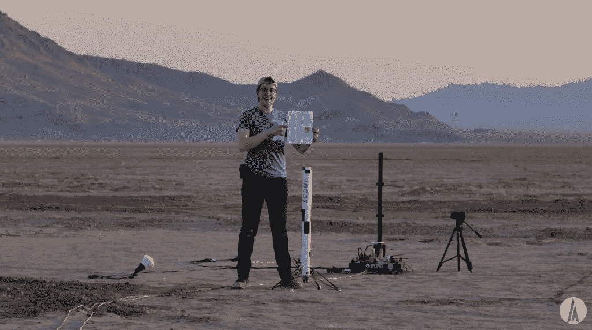

# 一个人的梦想是建造一个 SpaceX 式的工作模型火箭

> 原文：<https://thenewstack.io/one-mans-dream-to-build-a-working-spacex-style-model-rocket/>

今年早些时候，在莫哈韦沙漠的某个地方，乔·巴纳德终于体验了一次模型火箭的巨大飞跃。

“我像 SpaceX 一样降落了一枚火箭，”他在 YouTube 上的视频中解释道。

他只用了七年时间…

视频中，巴纳德讲述了一个始于 2015 年秋天的梦的故事。这是一个发自内心的项目，只有一个简单的目标:试图复制因 SpaceX 可重复使用的第一级“猎鹰 9 号”火箭而闻名的垂直起飞和垂直着陆。

巴纳德在视频中说，这是一个令人鼓舞的例子，说明爱好者在一个项目中追求自己的激情，“不是因为它对模型火箭技术来说是革命性的或改变游戏规则的，而是因为它是一个非常酷的项目”。“我知道我会学到很多东西。

"而我*学到了很多东西."他向观众展示了《T4》多年的视频《T5》，敦促他们“亲眼看看我是如何一次又一次失败，然后筋疲力尽，一次又一次失败，再一次筋疲力尽。*

 *“但慢慢地，随着时间的推移，你可以看到这些航班的可靠性只是一点一点地增加——一点一点地增加……”

## 任务背后的人

特别鼓舞人心的是巴纳德没有技术背景。巴纳德在一篇在线传记[中戏谑道“如果算的话，我拥有伯克利音乐学院的音频工程学位！”](https://bps.space/pages/about)

“我拿起几本教科书，找到几个不错的 YouTube 编码和机械设计教程，然后开始做实验！”

但是乔·巴纳德是 SpaceX 真实世界飞行的真正粉丝。巴纳德的传记[记得](https://bps.space/pages/about)“在看到 SpaceX 的雄心，以及新太空行业的兴奋之后，我被迷住了。

他在视频中解释道:“我过去常常在周末做婚礼摄像师，而且我会在一周内把多余的钱花在火箭上。”但他的探索现在通过赞助、Patreon 页面、YouTube 广告收入以及通过他创建的小公司 [BPS.space](https://bps.space/pages/about) 销售模型火箭组件获得资金。该公司的网站强调了一个更大的任务“提供先进火箭部件的实践经验对下一代科学家、工程师和宇航员来说很重要。”

BPS 提供的产品包括模型火箭[飞行计算机](https://bps.space/products/signal-r2)，它可以完成从控制降落伞和飞行中的紧急中止到一些更复杂的推力矢量，甚至在微型 SD 卡上记录飞行数据——包括方向、高度、速度和加速度——所有这些都可以通过 iOS 或 Android 智能手机应用程序进行配置。

最值得注意的是，该公司试图模仿商业航天器制造商 [SpaceX](https://www.spacex.com/) 的垂直着陆火箭。巴纳德的网站称，他选择这个目标是“认为在适当的条件下展示类似的雄心和成就会给 SpaceX 留下深刻印象，并可能给我带来一份工作。”)

而今年夏天，那个期待已久的垂直着陆终于发生了。

## 火箭科学

巴纳德的胜利视频展示了各种准备工作和过去失败尝试的蒙太奇。

“当我开始时，我以为这个项目只需要 3-4 个月，”巴纳德在推特上发布[，开玩笑说“我不仅了解了火箭是如何工作的，我还了解了他们的时间表是如何工作的。”](https://twitter.com/joebarnard/status/1551206691357618177)

正在进行的冒险之后的一个网站是业余爱好者网站 hack aday，它指出，早些年巴纳德试图简单地通过非常仔细地安排一切时间垂直着陆，以至于火箭在到达地面时停止燃烧。

不幸的是，“点火时间和确切的推力数字根本不够可重复，”该网站指出。=

他们报告说，到 2020 年，巴纳德已经注意到，控制器左右“摆动”也会减小推力。

但最终，巴纳德选定了一项设计，即利用陶瓷“油门臂”来阻挡火箭的排气，当该下降时，油门臂会移动到位。陶瓷是承受高温废气的必要材料。)“随着时间的推移，它们肯定会被侵蚀，”巴纳德在 Twitter 上发帖说，“但至少在两三次使用中相当稳定。”

巴纳德在一个视频中说，陶瓷切断了火箭 80%的推力。但是根据 BPS 空间页面，还有一个额外的方法在起作用。“发动机可以在恰当的时候启动，让车辆减速，实现软着陆。”所以巴纳德想出了一种装有两个独立发动机的火箭——一个用于操纵发射，另一个提供平缓的下降。

巴纳德建造了一个基于 Arduino 的飞行控制设备，名为 [AVA](https://www.hackster.io/news/ava-flight-computer-for-model-rockets-is-beautiful-and-functional-31851993898b) (用 C++编码)，小心翼翼地将它安装在火箭尽可能低的位置，以避免破坏其质心。在建造和测试了连续五代火箭后，巴纳德终于准备好在 5 月测试 Scout F 系列——一枚 1.2 千克的火箭，配备了这两个独立的发动机。

你可以在 YouTube 上看到它的首次飞行——包括戏剧性的机载摄像机镜头和从多个角度拍摄的着陆镜头。当时巴纳德称之为“前所未有的接近”

[https://www.youtube.com/embed/miMT44LFUjs?feature=oembed](https://www.youtube.com/embed/miMT44LFUjs?feature=oembed)

视频

巴纳德简陋的着陆垫由一块用纸板堆叠的防水布、一块地毯和一层聚酯薄膜组成——所有这些都是为了吸收一些动量，防止巴纳德所说的火箭从着陆垫反弹回来的“普遍”问题。聚酯薄膜有望让火箭*在光滑的表面上滑行*停止(而不是撞上一个凸起然后翻倒)。

铝着陆腿由一根橡皮筋固定，在飞行过程中，这根橡皮筋被加热的镍铬合金线切断，更多的橡皮筋将它们固定到位。

第一次试验产生了一枚侧放的火箭，但很快它就回到了发射台——真的——因为巴纳德将他的 Scout F 火箭描述为“像坦克一样建造”,易于重新发射。YouTube 上的粉丝发表了支持的评论。航空工程师尼古拉斯·雷姆打趣道:“有时候摇摆意味着终于可以飞行了，这很开心。”。

而另一位评论者也忍不住有点[调侃](https://www.youtube.com/watch?v=miMT44LFUjs&lc=UgzF-7fk-Tp07uxy0uN4AaABAg)。“你看，这里的问题是，当它停止移动时，它是侧着的，你希望它停止移动时，尖头朝上。”

## 感谢支持者

巴纳德最终完成了期待已久的垂直着陆，这是历史性的第五次飞行。巴纳德确保他的视频感激地感谢了所有长期支持者的观看——以及他在帕特里翁的资助者。“我能做这件事太疯狂了，但这也是一份工作。”巴纳德说，并补充说，“这是一个钱坑。”然后他向他所有的支持者透露，“你乘坐了这架飞机。”

每一个帕特里翁支持者的名字都出现在卷起来放在火箭里的打印件上，“所以如果你支持，你就是其中的一员。”

那么下一步是什么？巴纳德宣布了他们的“侦察兵 F”火箭的更多飞行计划，“看看我们是否能让着陆不那么运动。”但他也希望发射一个 9 英尺高的 SpaceX 超重型飞船[的模型](https://en.wikipedia.org/wiki/SpaceX_Starship)，在现实世界中，它可以携带超过 100 吨的货物进入太空。还有一个绝密项目，巴纳德拐弯抹角地称之为“肉类火箭”

巴纳德还希望在模型火箭上取得进展，这种火箭可以上升超过 62 英里(或 100 公里)，突破通常理解的外层空间开始的边界。“我一直在幕后默默研究这个项目，”巴纳德说，并将其描述为“一两年后——几个美元符号后。”。但我们正在努力。”巴纳德还将其描述为类似于模型火箭的着陆，因为这是“一个非常有趣的目标”

“我真的很期待接下来会发生什么。

而他依然没有交出最初梦想的喜悦。周六上午，巴纳德的帕特里翁资助者观看了他的现场录像，这是另一次试图垂直着陆的 Scout F 火箭。

[https://www.youtube.com/embed/SH3lR2GLgT0?feature=oembed](https://www.youtube.com/embed/SH3lR2GLgT0?feature=oembed)

视频

<svg xmlns:xlink="http://www.w3.org/1999/xlink" viewBox="0 0 68 31" version="1.1"><title>Group</title> <desc>Created with Sketch.</desc></svg>*