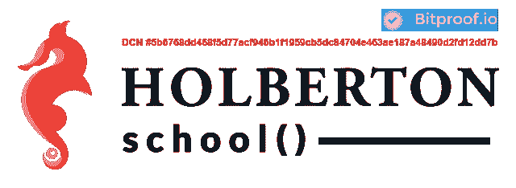

# 一所学校如何使用比特币区块链认证学位

> 原文：<https://thenewstack.io/one-school-using-bitcoin-blockchain-authenticate-degrees/>

令人惊讶的是，很大比例的人在简历中撒谎，以在竞争激烈的就业市场中获得优势。加密货币的区块链认证技术会给雇主验证求职者资格的方式带来巨大变化吗？有一派是这么认为的。

像[比特币](https://bitcoin.org/en/)这样的加密货币正在掀起波澜，不仅因为它是一种潜在的革命性方式，使用点对点、开源的模式来分散全球金融系统，还因为它的底层框架，允许用户匿名完成交易。不足为奇的是，正是这种匿名性导致了[武器、毒品和其他令人厌恶的服务](https://en.wikipedia.org/wiki/Bitcoin#Criminal_activity)的网上黑市交易的繁荣，在这里首选的支付方式是比特币。

尽管比特币本身可能会引发一些争议，但许多专家认为，其支撑区块链的技术可能会对其他应用产生重大影响，例如招聘和雇用新员工的竞争过程。

为了阻止令人震惊的普遍现象，即求职者“美化”或直接在简历上撒谎，总部位于旧金山的霍尔伯顿学校现在使用区块链技术来认证其提供的学位，让雇主更容易检查候选人的资格。

霍尔伯顿是一所另类软件工程学校，提供基于项目和同伴学习的课程，它正与区块链公证初创公司 Bitproof 合作。霍尔伯顿将是世界上第一所为毕业生提供学术证书的学校，这些证书将通过区块链获得并公开。

但是什么是区块链呢？区块链是一种数字分类账，任何人都可以在网上看到所有已经完成的交易或可能已经发生的事件，而不会损害相关方的隐私。这些分类帐在不同的计算节点之间共享和分布，并且只有在所有节点之间达成共享共识时才能改变。信息一旦输入，就无法擦除，而且这些记录的分布式特性以及内置的加密保护层使它们很难被任何个人破解或更改。

## 简化招聘流程

在比特币的例子中，区块链技术已经显示出其在消除交易中的传统金融中间人(如银行或政府)方面的有效性。对于雇主来说，这可能意味着简化选择过程，而不必煞费苦心地验证每个候选人的资格，或者雇佣另一家公司来做这件事。对于任何知名院校的毕业生来说，这意味着向招聘人员提供一个可核实的徽章和证明，证明申请人确实上过这所学校。

CoreOS 的招聘人员 Blake Haggerty 解释说:“谎报学历是一个普遍问题，今天伪造学历文凭和证书非常容易。”“此外，检查某人学位的过程相当费力，因为你需要获得学校的联系信息，找到合适的人，并为每个候选人重复一遍。大中型公司通常会将这项任务委托给第三方，因为这非常耗时耗钱。”

如果其他学校效仿霍尔伯顿的做法，雇主所要做的就是使用区块链浏览器来验证申请人的文凭，这是一个允许用户搜索和导航区块链的程序。外面的就业市场竞争激烈，但在这种情况下，想要撒谎的人在说出他们实际上没有上过的学校之前肯定会三思。

## 区块链是未来

霍尔伯顿的创始人，[来自苹果、LinkedIn 和 Docker 等公司的技术老手](https://www.zdnet.com/article/a-new-kind-of-school-tackles-the-software-engineering-talent-shortage/)押注区块链的技术最终将被整合到其他机构和行业中。

“区块链是认证的未来，我们相信在接下来的几年里，更多的学校将使用公共区块链来确保他们的证书和文凭，”霍尔伯顿学校的联合创始人 Sylvain Kalache 说。“它比当今行业中的产品更高效、更安全、更简单。我们首先考虑的是我们的学生——我们希望确保我们的证书始终有效，并且可以被雇主验证。这也将保证它们的安全，无法被复制或黑客攻击。”

事实上，认证学校文凭可能只是区块链的冰山一角:一些观察家认为，区块链的分散和分布式共识记录模式也将彻底改变我们投票、创建合同和许可证或转让资产所有权的方式，在这种情况下，没有一个机构或政府对一些容易改变的“真相”版本拥有中等或排他的控制权取而代之的是，真相，或者至少是一个安全的数字版本，将会被大众化，让每个人都能看到和使用。

*特征图片:[比特币链](https://www.flickr.com/photos/btckeychain/14861107819/in/photolist-oDe4AT-oTGbbW-oTGaqC-oDe3GZ-9APgFF-tFKZkm-pRNcBV-qCJM77-oHLuVE-p1vE5u-jeeYiX-sMfW62-qQ3Ffa-trvXpG-tFLZHU-tFLXsG-tJ6RGn-tFKX2o-truM6Y-tJ7Zyn-trw1kb-sMh5Vp-trEpn8-tJdJeZ-tHN2tQ-tJdEtx-tFLQx9-sMgo1Z-sM5ZwS-tJd3ei-sMgdUc-tJ6VmB-tJ6PMa-trDeZH-tJ6Crz-tFLP9C-tJd8xp-trDDfF-trvNjE-trvJz5-trvDuL-tJ6L3r-sPprJH-tLnmXv-z4TWXe-pGQzVP-pTKukJ-pRvLRo-yWC6xk-ttMQhH) by [BTC 钥匙扣](https://www.flickr.com/photos/btckeychain/ "Go to BTC Keychain's photostream")在[CC BY 2.0](https://creativecommons.org/licenses/by/2.0/)下授权*

<svg xmlns:xlink="http://www.w3.org/1999/xlink" viewBox="0 0 68 31" version="1.1"><title>Group</title> <desc>Created with Sketch.</desc></svg>