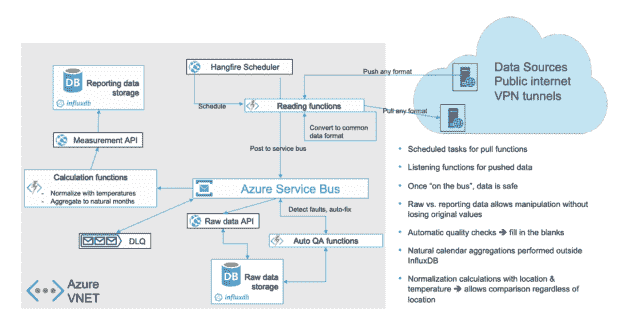
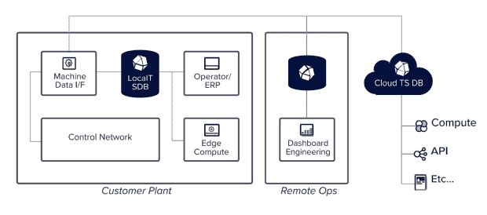

# 一项使可再生能源更加高效的技术

> 原文：<https://thenewstack.io/one-technology-that-makes-renewable-energy-more-efficient/>

2022 年见证了世界事件对全球能源市场的影响。最剧烈的波动影响了化石燃料，这导致了关于可再生能源实用性的更大讨论。幸运的是，越来越依赖可再生能源仍然是一个持续的趋势。

根据气候和能源解决方案中心的数据，在美国，可再生能源是增长最快的能源。

*   从 2000 年到 2020 年，可再生能源增长了 90%，其中包括从 2010 年到 2020 年增长 42%。
*   2020 年，大约 20%的能源生产来自可再生能源。分析师预计，到 2030 年，这一比例将升至 35%。
*   2020 年，大约 5%的消耗能源来自可再生能源。
*   最近的估计预测，可再生能源的消耗率在未来 30 年将以年均 2.4%的速度增长。

不仅仅是美国在[可再生能源](https://thenewstack.io/how-can-open-source-help-fight-climate-change/)领域大步前进。2020 年，29%的全球能源生产来自可再生能源。同年，全球可再生能源发电能力达到创纪录的 256 千兆瓦。

这一切和技术有什么关系？虽然传统的化石能源仍然不稳定，但可再生能源背后有一些重要的动力。然而，向可再生能源的转变意味着许多用于化石燃料生产和分配的基础设施不再适用。[可再生能源](https://thenewstack.io/can-reducing-cloud-waste-help-save-the-planet/)需要新的基础设施来跟踪新的系统需求和输出。技术在这些新系统中扮演着重要的角色。

## 时间序列数据和能源

随着公司寻求使能源生产和消耗更具成本效益和效率，他们需要了解这些系统是如何运作的。例如，这一领域的运营商希望跟踪:

*   整体能源生产水平，以确定它们是否能满足供应和需求。
*   每个设备的发电能力和影响设备性能的因素，如设备状态、最佳性能的必要维护和当前条件的影响。
*   服务降级的原因，这可能依赖于以前收集的数据或仍然需要收集的数据。

[时间序列数据](https://www.influxdata.com/what-is-time-series-data/?utm_source=vendor&utm_medium=referral&utm_campaign=2023-01_spnsr-ctn_ts-renewable-energy_tns)可以提供对这些领域和更多领域的洞察。操作员控制的任何设备或系统都可以生成时间序列数据。这使操作员能够深入观察系统，从而做出更好的业务决策，并更快地做出决策。

把自然作为一种能源来对待是很棘手的。风能、水能和太阳能等能源并不稳定，需要运营商定期调整设备以适应环境变化。

可再生能源运营商还经常面临其他挑战，可能包括:

*   **设备位置—**发电设备通常位于偏远地区。大型系统中的各个设备也可能在地理上分散。只有当设备需要维护时，运营商才会派出技术人员。连接问题也可能妨碍从远程设备收集数据。
*   **数据—**运营商需要从每台设备上收集大量数据。不同传感器的度量数据间隔和数据粒度可能不同。此外，他们需要长期存储所有这些数据，以便进行历史[分析](https://www.influxdata.com/time-series-analysis-methods/?utm_source=vendor&utm_medium=referral&utm_campaign=2023-01_spnsr-ctn_ts-renewable-energy_tns)或生产[预测](https://www.influxdata.com/time-series-forecasting-methods/?utm_source=vendor&utm_medium=referral&utm_campaign=2023-01_spnsr-ctn_ts-renewable-energy_tns)。
*   **基本工具—**手动数据收集，如实地调查，仍然很常见，并记录在电子表格或纸上。这可能会导致输入错误，并且无法扩展。
*   **设备—**可再生能源设备昂贵且易碎，因此保护资产以最大限度地利用和提高性能至关重要。

开源技术，如 [InfluxDB](https://www.influxdata.com/?utm_source=vendor&utm_medium=referral&utm_campaign=2023-01_spnsr-ctn_ts-renewable-energy_tns) 时间序列数据库，可以帮助运营商解决或减轻这些问题，推动创新，并允许开发人员更快地将想法付诸实践。

## 时间序列在可再生能源领域发挥着重要作用

“可再生能源”一词涵盖了能源生产、储存和消费过程的广泛领域。以下示例展示了世界各地的企业使用时间序列数据来推动可再生能源创新和改进的一些方式。

### Bboxx

[Bboxx](https://www.influxdata.com/customer/bboxx/?utm_source=vendor&utm_medium=referral&utm_campaign=2023-01_spnsr-ctn_ts-renewable-energy_tns) 开发和制造产品，为发展中国家的离网社区提供负担得起的清洁太阳能。它为客户提供连接到电池的太阳能电池板和一套 USB 和 DC 连接器，为灯、收音机和其他低功率电器供电。35 个国家的 350 多万人通过 Bboxx 获得电力。学童可以在干净的光源下学习，而不是燃烧煤油和吸入烟尘。

InfluxDB 是 Bboxx 解决方案的核心部分，收集与分布式设备的远程监控、计费和警报相关的数据。借助 InfluxDB，Bboxx 可以从其数据中获得洞察力，并应用从分析历史数据中获得的经验教训来开发超越客户预期的令人兴奋的新产品。

### EnerKey

[EnerKey](https://www.influxdata.com/customer/enerkey/?utm_source=vendor&utm_medium=referral&utm_campaign=2023-01_spnsr-ctn_ts-renewable-energy_tns) 是一家芬兰公司，运营一个平台，通过分析消费数据来推动室内空间的可持续发展和能源管理。它通过结合天气、时间序列和地理空间数据来监控能源消耗、室内空气质量、废物和排放，帮助组织减少其环境足迹。通过实时访问这些数据，EnerKey 用户可以发现能源使用波动，并就如何提高效率做出明智的决策。

EnerKey 使用 InfluxDB 存储和管理数十亿个指标，并对历史数据进行分析。该公司还使用 InfluxDB 将时间序列数据与天气数据等其他数据类型结合起来，以更好地了解外部气候因素如何影响室内能源使用。它还可以使用这些组合数据集来预测未来的能源消耗。这些能源效率转化为 EnerKey 用户的成本节约，能源使用的减少对环境是一个胜利。

数据采集体系结构

### 石墨能量

[石墨能源](https://www.influxdata.com/customer/graphite-energy/?utm_source=vendor&utm_medium=referral&utm_campaign=2023-01_spnsr-ctn_ts-renewable-energy_tns)是一家专注于工业脱碳的澳大利亚公司。它构建热能储存(TES)系统，将可变、间歇和低成本的可再生能源(如风力发电场或太阳能光伏场)与制造工厂的工艺要求分离，为工业应用提供可靠、可预测的热量。

该公司在其整个解决方案架构中使用 InfluxDB，在边缘和云中收集现场 TES 机器上的数据。每台机器产生大约 100 个数据系列，每隔 1 到 15 秒记录一次，每天总共记录大约 1，000，000 条。石墨能源公司利用这些数据创建其现场设备的实时数字双胞胎。这些数字双胞胎让石墨能源在时间上向前和向后滚动，以跟踪设备性能，并成为其生产优化预测工具包中非常强大的一部分。

石墨能源时序数据结构

无论我们谈论的是涉及能源生产或能源消费的公司，也无论是在消费者还是工业层面，时间序列都是现代应用中的关键数据。拥有 InfluxDB 等同类最佳的工具来实时收集、存储、管理和分析时间序列数据，可以观察和洞察这些正在改变全球能源模式并为每个人创造更可持续的能源未来的系统。

<svg xmlns:xlink="http://www.w3.org/1999/xlink" viewBox="0 0 68 31" version="1.1"><title>Group</title> <desc>Created with Sketch.</desc></svg>