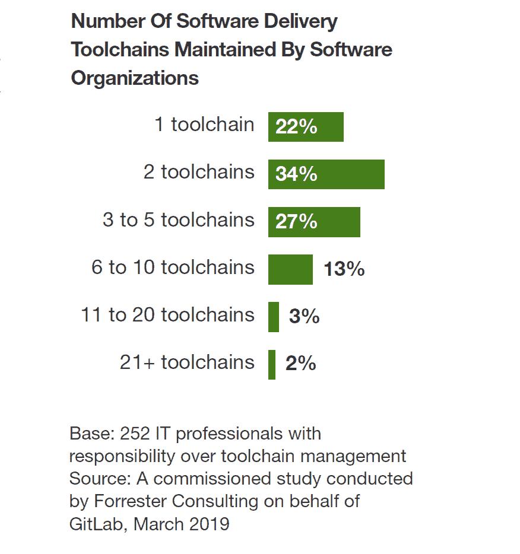
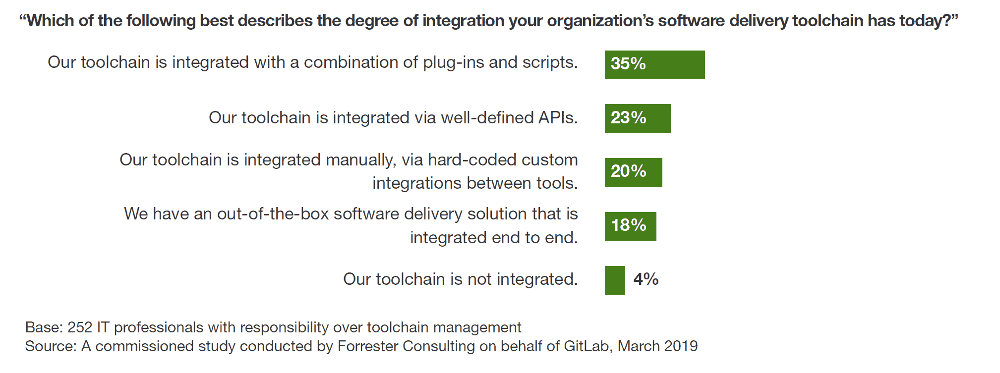
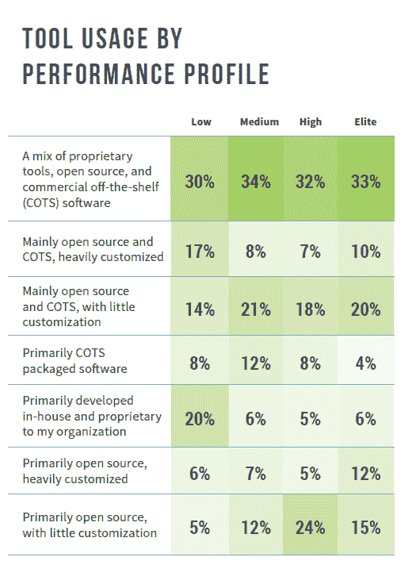

# 管理所有开发的一个工具链:CI/CD 供应商的困扰

> 原文：<https://thenewstack.io/one-toolchain-to-manage-all-the-development-a-ci-cd-vendor-obsession/>

衡量 CI/CD 采用情况很困难[有许多原因，但其中之一是在一体化捆绑软件和最佳工具之间做出选择。成千上万的公司和个人如何评估这些方法之间的权衡将决定 DevOps 工具的未来以及使用什么工具链。](https://thenewstack.io/measuring-ci-cd-adoption-rates-is-a-problem/)

由 GitLab quantified 赞助的 2019 年 Forrester [研究](https://about.gitlab.com/resources/whitepaper-forrester-manage-your-toolchain/)发现，超过四分之三的组织使用至少两个软件交付工具链，平均每个工具链有六个或更多工具。根据对 252 名负责工具链管理的 IT 专业人员的调查，该研究还报告称，确保安全性(45%)和维护可见性(39%)是团队在工具链方面面临的最大流程挑战。

只有 18%的被调查者拥有集成了端到端工具链的现成软件交付解决方案。开展这项研究是因为 GitLab 有兴趣成为这些解决方案提供商之一。在整合和简化软件交付工具的热潮中，It 并不是唯一的一家。例如，CloudBees 对 Electric Cloud 的收购[被解释为](https://go.forrester.com/blogs/the-rise-fall-and-rise-again-of-the-integrated-developer-tool-chain/)试图提供集成的开发人员工具链。就在本周，TPG Capital [收购了](https://www.collab.net/news/press/tpg-acquires-collabnet-versionone) [CollabNet VersionOne](https://www.collab.net/) ，这被[描述为](https://devops.com/collabnet-versionone-picks-up-500m-to-fuel-value-stream-management/)提供 DevOps 平台的“军备竞赛”的下一步，该平台被捆绑销售为[价值流管理](https://reprints.forrester.com/#/assets/2/1431/RES141538/reports)。

工具链可以执行有限的功能，或者支持软件开发生命周期(SDLC)中的所有步骤。即使一个公司有一个端到端的解决方案，它也可能只被一些团队和特定的用例所采用。当整合时，它们成为一个工具链。当工具链被集成时，该术语与“管道”、“价值流”或任何其他对构建、测试、交付和监控软件的捆绑系统的描述同义。

在实践中，公司使用现成的商业软件(COTS)、开源软件和必须集成的自主开发工具的组合。插件和 API 可以简化这个过程，但是定制会带来技术债务和高支持成本的风险。 [2019 加速 DevOps 状态](https://cloud.google.com/devops/state-of-devops/)报告显示，大多数人使用各种各样的集成方法。表现最差的 DevOps 公司中有两倍多(43%)的公司使用 COTS、开源和内部软件的高度定制组合，相比之下，研究中的其他公司只有 22%的时间这样做。

来源:2019 年加速发展状况

GitLab 和 CloudBees 是新的堆栈赞助商。

特写图片通过[好的免费照片](https://www.goodfreephotos.com/other-photos/lord-of-the-rings-the-one-ring.jpg.php)。

<svg xmlns:xlink="http://www.w3.org/1999/xlink" viewBox="0 0 68 31" version="1.1"><title>Group</title> <desc>Created with Sketch.</desc></svg>