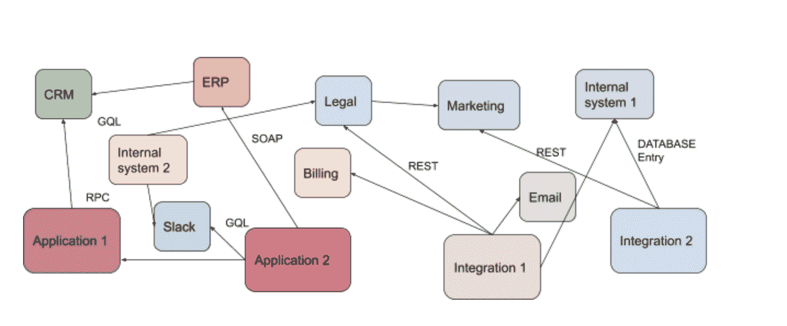
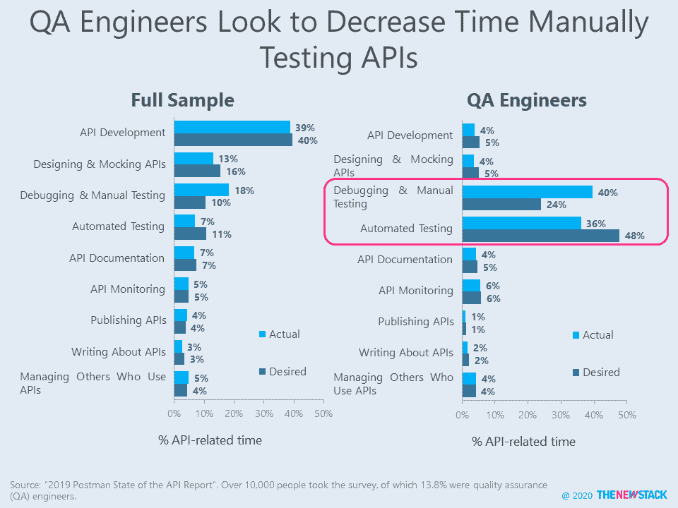
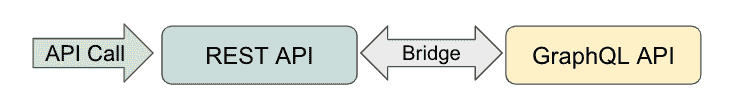
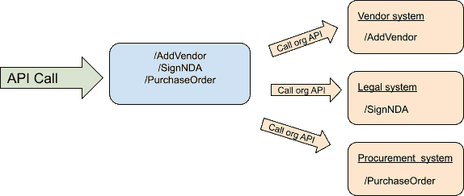
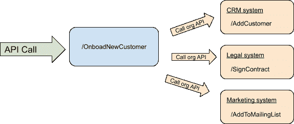

# 洋葱有层次，食人魔有层次，API 也应该有层次！

> 原文：<https://thenewstack.io/onions-have-layers-ogres-have-layers-apis-should-have-layers-too/>

当我在 Slack 和后来在 Twitch 时，我们使用了 50 多种不同的软件即服务(SaaS)云产品来推动我们的业务发展。从缺陷跟踪到任务管理，从销售到人力资源，我们使用的大部分软件都是 SaaS。这些服务中的大多数都很棒，增加了很多价值，有些甚至有很棒的 API，使我们能够创建有用的集成。当一个问题在吉拉得到解决时，会通过电子邮件或 Slack 发送通知。生活是甜蜜的！嗯，没那么多。

如今，许多公司的生活是这样的:

在这篇文章中，我将谈论为什么 API 集成仍然很糟糕，以及如何使用一种叫做 API 分层的伟大技术来稍微消除它们。

## API 集成仍然很糟糕

 [阿米尔·谢瓦特

阿米尔·谢瓦特是 Reshuffle.com 的联合创始人兼首席产品官。此前，阿米尔是亚马逊 Twitch 的产品副总裁，Slack 的开发者关系总监，谷歌的可扩展开发者项目负责人，以及微软的开发者倡导者。阿米尔与妻子和两个孩子住在加利福尼亚州的帕洛阿尔托。在业余时间，他喜欢骑自行车和对初创公司进行天使投资。](https://www.reshuffle.com/) 

不幸的是，虽然大多数现代系统都有 API，但是仍然有几个障碍使得使用它们很困难，尤其是在扩展的时候。

1.  **缺乏 API 标准化。**不同的系统公开了不同的 API，这些 API 有不同的架构风格(例如 REST、GraphQL 等)。)，使用不同的数据结构(例如，用户密钥在一个系统中可以是电子邮件，在另一个系统中可以是电话号码)，以及许多其他方面。这给管理和维护大量不同 API 的开发团队带来了压力。
2.  **多种安全模式使管理变得复杂。**每个系统都有不同的安全模型——OAuth、basic、m2m 令牌等。这使得集成的风险更大，因为每次集成更多系统时，这些令牌都会被重新共享，并且所有这些密钥都需要大量的供应和持续维护。
3.  **能力不足。**大多数 API 都是拉式的，但许多开发人员需要推送并不断拉取以模仿推送，这需要昂贵的资源，如计算周期和带宽，并产生次优的响应。
4.  代码不能跨 API 重用。系统 API，例如 Salesforce API，公开仅限于其特定第三方系统的功能。如果我需要向两个不同的集成添加“新客户端”功能，我需要在我的每个集成中复制对 Salesforce 的 API 调用。为了将该代码添加到第三个系统中，我将第三次重写它，这在规模上是不实际的。

## API 分层如何有所帮助

上面提到的常见问题耗费了组织的时间和金钱。它们是使用不同标准的结果，也是现代企业使用的 API 和服务严重碎片化的结果。好消息是，使用一组我称之为“API 分层”的简单设计模式可以简化甚至解决这些问题。

让我们探索这些 API 设计模式，其中我们将一个或多个 API 与另一个 API 包装在一起作为垫片。

### 扩展层:用一个 API 包装另一个来增加功能

在这个用例中，您有一个暴露部分或有限功能的 API，并且需要通过包装 API 添加额外的功能。例如:

**何时使用此模式:**

当底层 API 不足以完成您的用例时——或者如果您需要添加功能来满足安全性和合规性需求——使用该模式来丰富从包装的 API 返回的数据。

**现实生活中的例子:**

在 Slack，我们的 API 既用于 Slack 客户端，也用于我们的开发人员社区。开发人员告诉我们，虽然 API 在许多用例中运行良好，但它假设了一个可以缓存数据的富客户端。像用户 id 和用户名之间的映射这样的事情是客户端的责任。我们必须公开包装原始 API 的第三方端点，并添加第三方开发人员所需的信息。

### 还原层:用一个 API 包装另一个 API，以限制对原始 API 的访问

在这个用例中，您不希望公开完整的 API 功能，无论是内部的还是外部的。这可能是出于保护敏感信息、降低影响生产的风险或其他原因的需要。虽然有几个系统提供了细粒度的 API 权限解决方案，但对于企业用例来说，这些还远远不够。

**何时使用此模式:**

使用这种模式来保护和限制对原始 API 的访问。即使原始 API 有一个限制某些操作权限的令牌，也可能存在这样的情况，即您不希望公开某些端点，而不管它们使用的权限系统。

**现实生活中的例子:**

谷歌云有大量可供谷歌工程师使用的 API。他们中的许多人今天暴露了，但不是全部。当我在谷歌的时候，内部系统和它的 API 有一个内部秘密名称，不对外公开。今天你可以在这里读到它。

### 类型-转换器-层:用一种 API 类型包装另一种 API 类型

在这种模式中，您将一种 API 类型(例如 XML RPC、SOAP)与另一种 API 类型包装在一起，作为一个垫片。例如:

**何时使用此模式:**

当底层 API 或协议难以使用(大多数开发人员认为 SOAP 是一种卫生产品)或在特定用例中不够安全时，使用这种模式。

**现实生活中的例子:**

我们在 Twitch 遇到过这种情况。我们的内部系统 API 是 GraphQL，但是我们不想对外公开。相反，我们在外部公开了一个 REST API，并在 REST 端点中将它桥接到 GraphQL。另一个例子是 Twilio 如何为电话和 SMS 公开一个简单的 API。

### 聚合层:将一个或多个 API 组合成一个标准 API

在这种模式中，我们希望将几个 API 整合并标准化为一个简单且整合的 API。这可以规范化 API 参数中的字段或这些 API 调用的返回值。这里有一个例子:

**何时使用此模式:**

使用这种模式将不同的 API 整合成一致的标准 API，并确保整合后的 API 端点的输入和输出相互匹配。另一个很大的好处是，客户端只需要一个 API 密匙，不需要持有许多不同系统的凭证。

**现实生活中的例子:**

在 Twitch，我们创建了一个 API 网关来公开这种类型的功能。我们有一个以微服务为主的系统，没有一种简单的方法来跨这些服务实现标准化。API gateway 帮助开发人员为我们的客户创建了一个统一的 API。

### 复合层:将一个 API 包装在其他 API 上，以公开复合业务逻辑

这是最高级的模式。在这个示例中，您创建了自己的业务逻辑，封装了对不同系统的几个 API 调用。下面是使用这种模式的上述示例的变体:

**何时使用此模式:**

使用这种模式来公开公司的业务逻辑，而不是每个系统公开的构建块。如果处理得当，这是一个非常强大的模式，可以简化和抽象使用 API 和许多服务提供者的复杂性。

**现实生活中的例子:**

一个很好的例子是[BFF](https://medium.com/@abhilashjn85/bff-layer-when-its-more-than-just-an-api-gateway-4679da49534c)API，其中前端客户需要内部系统的简化版本。在 Twitch，我们有数百个微服务，对于前端客户端来说，与功能性断裂进行通信将是一项艰巨的任务，因此整合的 API 非常有意义。

## 更美好的未来

好的设计模式消除了复杂性。今天，我们使用比以往更多的系统来运营我们的业务——利用大型组织中的数百个 API 服务提供商。使用这些模式手动管理 API 是可行的，但对于现代组织来说可能太慢，这就是为什么使用像 Reshuffle 这样的[集成平台](https://www.reshuffle.com/)可以简化和自动化流程，帮助业务变得更快、更敏捷。无论您选择哪种方法来管理 API，都要确保集成能够提高效率、速度和可伸缩性。

[https://www.youtube.com/embed/-FtCTW2rVFM?feature=oembed](https://www.youtube.com/embed/-FtCTW2rVFM?feature=oembed)

视频

通过 Pixabay 的特征图像。

<svg xmlns:xlink="http://www.w3.org/1999/xlink" viewBox="0 0 68 31" version="1.1"><title>Group</title> <desc>Created with Sketch.</desc></svg>