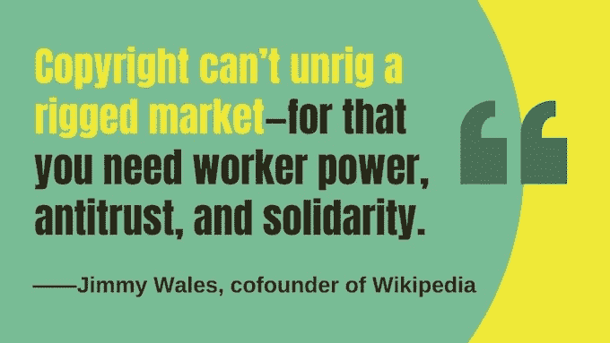

# 在线社区对抗大型科技公司的“瓶颈资本主义”

> 原文：<https://thenewstack.io/online-community-fights-big-techs-chokepoint-capitalism/>

书呆子。锋利。激进。这就是《金融时报》对 T2、科利·多克托罗和 T4 的描述，丽贝卡·吉卜林的书于 9 月出版。它的主题？"[创作者得不到报酬](https://www.kickstarter.com/projects/doctorow/chokepoint-capitalism-an-audiobook-amazon-wont-sell)"

该书的 Kickstarter 页面进一步解释道:“这是因为强大的公司已经找到了如何创造“瓶颈”，让他们在创造性工作产生的价值到达创造性工作者之前攫取更多的价值。”。

墨尔本法学院研究法律和文化交叉的教授吉布林上周告诉我这本书时说:“反响令人难以置信。”。吉布林也是澳大利亚知识产权研究所所长。“世界各地的人们都在用‘瓶颈资本主义’这个术语来描述他们自己的行业正在发生的事情，并向其他人解释。

“虽然我们关注创造性劳动力市场，但我们认为同样的现象也伤害了其他各种各样的人，这正是读者告诉我们的。让我印象特别深刻的是一封来自某人的短信，他告诉我们，我们的理论准确地解释了他自己的行业——观赏植物国际市场——所遭受的折磨。野！”

该书认为，我们的问题始于不寻常的高度权力整合。

吉布林在最近的一次采访中警告说，当企业聚集了“沙漏形的市场，一端是消费者，另一端是供应商，他们自己蹲在脖子上——他们扭曲了这一点，迫使每个人都通过它们，以便他们能够调解访问，他们得到了超过公平份额的东西。”

脸书属于这一类。亚马逊也是。两家公司都有庞大的用户群和供应商群(脸书负责广告，亚马逊负责几乎所有其他内容)。越来越多的，他们为了自己的利益挤压两端。

Craigslist 的创始人克雷格·纽马克称赞多克托罗和吉布林证明了“没有竞争，资本主义就无法运转”。吉布林和多克托罗令人印象深刻地展示了这种情况在整个创意产业中的流失程度，以及这种模式是如何威胁到其他所有员工的。

或者，正如《大西洋》*所说的,两位作者“提出了一个令人信服的案例，说明接受大技术和大内容——看似孤独和令人沮丧的努力——实际上是社区的一个机会。”*

 *展望未来，多克托罗看到了一个产生真正影响的真正机会——如果不是引发一场真正的运动的话。“我们在这里的变革理论是，‘任何不能永远持续下去的东西最终都会停止，’”多克托罗上周在一封电子邮件中告诉我，“这意味着破产的娱乐/科技经济将继续从一个危机走向另一个危机，当这些危机来袭时，处于边缘的‘想法’可以迅速转移到中心。”

“所以下次有关于链接税或强制性版权过滤器的辩论时，我们将把这些广泛社会化的、完善的计划作为更有成效的提议注入到话语中——此外，这些提议将观众和创作者视为阶级盟友，在大技术和大内容方面都有共同的阶级敌人，”多克托罗写道。

## 人们在听

当我问吉布林他们自己的合作时，听起来像是天生的一对——而且时机也很合适。“科里和我多年来一直在这些问题上大喊大叫，但这一刻感觉不同——人们在倾听，他们很愤怒，组织起来，并要求采取行动，这是我从未见过的。”

[https://www.youtube.com/embed/IraCYo-5aLo?start=63&feature=oembed](https://www.youtube.com/embed/IraCYo-5aLo?start=63&feature=oembed)

视频

多克托罗解释说，企业从与用户分享盈余开始——就像亚马逊早期的免费送货和图书赔钱一样。但随后他们将盈余集中在商业客户身上——他们最终也依赖于这个平台。

11 月,《华盛顿邮报》计算出，当亚马逊向你展示搜索结果时，超过 50%的前五个屏幕要么是亚马逊在推销自己的产品，要么是为更高的特色位置付费的产品。“亚马逊拥有 310 亿美元的‘广告’市场。这不是广告；去搜索结果的顶部是贿赂——当你搜索不是你搜索的东西时，把一些东西放在页面的顶部！”多克托罗写道。

最后的结果呢？“一旦我们被锁定，一旦我们锁定了商业客户，他们就开始拿走盈余，并把它交给他们的股东！”

因此，尽管有些人可能会认为严格的版权会赋予创作者更多权利，但多克托罗指出，更集中的市场会将这种利益分配到其他地方。“一旦出现瓶颈——一旦你不得不与少数公司打交道——那么给创作者额外的版权就像给受欺负的孩子额外的午餐钱。”

正如多克托罗所见，需要进行“结构性干预”…

## 只有一个经销商

多克托罗提供了一些具体的例子，说明今天的专注力确实不如过去。在 20 世纪 70 年代，全国有 300 家大众市场平装书分销商为独立经营的杂货店和药店服务——但现在只有一家。(“如果你在读一本书，英迈内容集团可能就在后面，”该公司网站吹嘘道[。)出版业也合并成了五大巨头，“所以你可以看到合并是如何产生这些脆弱点的。”](https://www.ingramcontent.com/)

多克托罗写道:“我还记得一段美好的时光，那时互联网不仅仅是五个巨大的网站，充斥着其他四个网站的截图和文字。”

如果你问这种趋势的背后是什么，多克托罗认为你可以将其追溯到一个普遍现象。例如，“谷歌营销的几乎每一个成功的产品都是他们从其他人那里购买的产品——以历史上被禁止的方式，直到我们开始解除对并购市场的管制，并产生了这个令人难以置信的集中行业。”

吉布林甚至认为这种做法现在实际上已经制度化了。“现在商学院教授的正统观念是，竞争是失败者的专利……你想要做的是创建一家企业，为你提供对抗竞争的护城河，阻止其他人进入这个市场。你应该做的不是制造人们需要的东西或提供服务，或者让世界变得更好，而是将自己定位在制造这些东西的人和需要这些东西的人之间，以便从别人的工作中提取价值，而不一定实际上提供有意义的价值。”

吉布林指出，这不会导致技术乌托邦。“我们不断被告知，这些垄断企业创造的所有资金将导致更多的创新，但这根本没有证据证明，事实上这是一种反向关联。如果我们要解决这个问题，如果我们要解决我们现在面临的所有最大的问题，不受监管的市场不是解决问题的方法。”

多克托罗认为，相反，我们拥有的是一个权力永存的世界。在过去，“尽管在艺术的各个时期都有很大的整合，但这些整合会被 CD 和 MP3 等颠覆性技术周期性地推翻”。

“现在不是了。我们在书中讲述的一个故事是，三大(音乐)唱片公司凭借拥有 70%的唱片，要求 Spotify 向他们提供大量股权，以此作为允许 Spotify 拥有其任何目录的条件。然后他们决定 Spotify 如何运作。”

## 退出的权利

实际上，吉布林对严厉的监管制度以及政府跟上快速发展的行业的能力抱有合理的怀疑态度。“我认为你必须非常小心监管带来的意想不到的后果，”吉布林警告说。

那么什么有效呢？“任何直接调节买方势力、鼓励工人和供应商的抗衡力量或鼓励新进入者进入市场的行为。这是那种实际上会有所不同的干预，让我们开始扩大这些瓶颈。”(尽管吉布林承认“这些也不是单独的解决方案……。我们需要共同努力，要求在所有这些方面做出改变……”)

多克托罗指出，还有一个简单的技术因素可以迫使创作者得到更好的待遇:互操作性。“如果你能*离开*一个平台，这个平台就得*赚*你的生意。”

“如果苹果对微软 Office 进行逆向工程，开发 iWork、Pages、Numbers 和 Keynote 是合法的，那么我对 iOS 进行逆向工程，开发自己的应用商店也是合法的。”

吉布林指出了互操作性和“退出权”的另一个优势。如果顾客可以在另一个平台上购物，那么*创建*竞争平台就更容易了——或许会给创造者提供更多的补偿。

“这正是那种将鼓励工人和供应商的抗衡力量的干预，我们正在谈论的这种力量对于扩大这些瓶颈至关重要。”

<svg xmlns:xlink="http://www.w3.org/1999/xlink" viewBox="0 0 68 31" version="1.1"><title>Group</title> <desc>Created with Sketch.</desc></svg>*