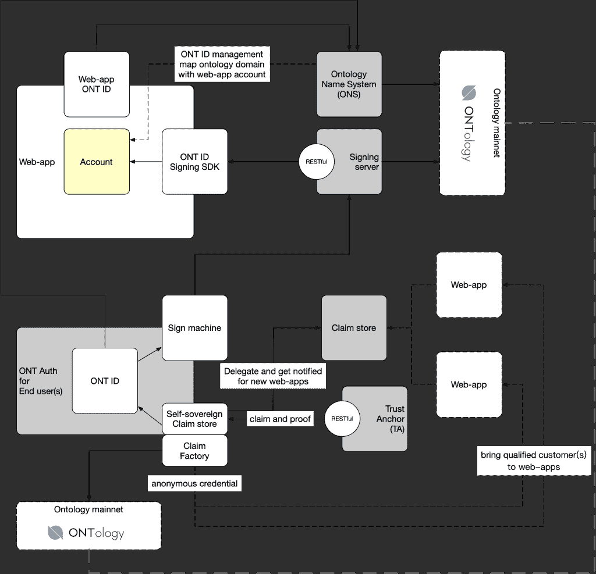

# 本体的 Web3 信誉和身份管理解决方案

> 原文：<https://thenewstack.io/ontologys-web3-reputation-and-identity-management-solutions/>

在 Web3 领域，有很多关于基于区块链的身份和信誉管理解决方案的讨论，这些解决方案能够将用户身份验证与应用程序完全了解您的一切的能力分离开来。这个想法是，通过让个人用户控制他们与分散式应用程序(dApp)共享的数据，它恢复了基于用户名的身份管理所失去的一定程度的隐私。此外，它消除了当今网络上发生的肆无忌惮的数据挖掘。

在之前的一篇文章中，我写到了来自 Hypernet 实验室的解决方案。ID，旨在通过不可转让的 NFT 为 dApp 开发人员简化了解您的客户(KYC)集成。 [Ontology](https://ont.io/) 通过其 [ONT ID](https://ontid.ont.io/) 提供了另一种解决身份管理挑战的方法，这是一种分散的身份应用程序，能够链接多个钱包，为个人创建跨链信誉。

## 一个身份有多种用途

ONT ID 和本体中的钱包上的[是创建用户身份的构件。该身份可用于 KYC 场景和许可的数据共享，作为基于用户名和密码的认证的替代，或作为 Web3 dApps 的钱包连接器。](https://onto.app/en/download/)

在接受新堆栈采访时， [Ontology](https://ont.io/) 的美洲生态系统负责人 [Erick Pinos](https://www.linkedin.com/in/erickpinos/) 解释说，目标是实现透明度和自我主权。他说，“在透明度方面，我们不知道今天我们的信用评分是如何计算的。有一整个行业的专业人士来帮助你了解你的信用是如何计算的，即使这样，他们也只能做出一个分数的估计，你的分数可能仍然会出现不同。区块链改变这种状况的方法是让分数透明化。如果你有一个链上信用评分，或基于加密活动的信用评分，你会知道它是如何计算的，你会知道你需要做什么来提高你的分数。”

自我主权，这个模型的第二部分，实际上是关于谁拥有数据的控制权。“分数在你的控制之中，”Pinos 说，“所以当你去申请时，如果你想透露你的分数，你可以选择这样做，或者不这样做。如果你不透露分数，应用程序可能会有规则阻止你使用它，但与当前的模式不同，你可以控制它是否被共享。”

## 用 ONT ID 开发

Ontology 提供了关于如何为您的 dApp 利用 ONT ID 的[文档，包括以太坊、币安智能链和其自己的 Ontology 区块链的分散 ID。SDK 文档可用于 Go 和 Java。下图概述了 ONT ID 框架的结构。](https://docs.ont.io/decentralized-identity-and-data/ontid/ont-login/scenarios)

## 在 dApps 中实现信誉

我问 Pinos，使用这些分散的身份进行信誉评分是什么样子，如果 ID 应用程序建立在本体区块链上，而您想要使用以太坊上的信誉评分，它们是如何工作的。“我们有一个协议叫做[橙色协议](https://www.orangeprotocol.io/)，”他回答道。“您从一个类似 Metamask 钱包的钱包开始，然后在上面添加一个 DID(分散身份)钱包，这样您就可以创建可验证的凭证，这些凭证是用您的私钥签名的信息片段，用于验证真实性。这些证书属于你，这些是你可以展示给项目方集成的项目的东西。”

对于开发者来说，[有一个 SDK](https://docs.orangeprotocol.io/developer-guides/within-your-system) 允许单个应用和项目决定如何给声誉打分。“我们现在正在做的是将用于信誉评分的数据源标准化，”Pinos 继续说道。“我们不只有一个分数，我们有一个平台，项目可以在这个平台上创建自己的模型，并在此基础上生成分数。例如，一个项目可能希望根据您的贷款历史生成信用评分，而另一个项目可能只关心您的资产余额。这将是两个不同的分数。”

## 通过声誉更好地管理道

Dao 面临一些治理挑战，这些挑战可以通过将治理令牌视为组织内投票权的关键来解决。[快照](https://snapshot.org/#/)是 DAOs 用于治理的常用 dApp。Pinos 解释说:“现在在加密领域有一个问题，大多数 Dao 都进行令牌加权投票。由此带来的问题是，这是非常财阀化的，类似于传统世界与股票打交道的方式。一个亿万富翁可以进来买下大部分股份，任何人对此都无能为力，他可以为所欲为。在加密领域，情况更糟，因为市值相对较小，所以亿万富翁更容易进入并收购该项目。我们需要从这种方式转向基于声誉的投票方式。”

Orange Protocol Reputation Studio 简化了为构建 DAO 治理而创建这些更细微的基于信誉的模型的过程。使用 [Orange Protocol SDK](https://docs.orangeprotocol.io/developer-guides/become-a-model-provider) 可以在 Go 或 Java 中设计模型，并使用预定义的数据集来建立信誉标准，这有助于定义一种超越令牌持有的新的基于信誉的影响结构。

Pinos 说，这是“一种你可以计算你在链上的声誉的方法，这是通过你的贡献来衡量的，比如:你对项目有贡献吗？你是社区经理吗？你在给 GitHub 推送代码吗？对于区块链项目，它不再仅仅是关于团队，而是关于社区。社区做出了贡献，每个人都能以自己的方式伸出援手。通过在此基础上分配投票权，你就创建了一个系统，在这个系统中，提案的通过或否决是基于参与者对问题的思考方式。”

还有一项工作是在信誉工作室中创建一个用于构建快照模型的拖放界面。这在一定程度上是因为有许多 Dao 本质上是非技术性的，可能无法访问能够从 SDK 实现模型的开发人员。

就像我最近采访的许多其他 Web3 协议和项目一样，Ontology 最近也宣布了一个[资助项目](https://ont.io/news/867)。如果处理身份或向您的项目添加信誉评分是您的开发计划的一部分，它可能值得一看。

<svg xmlns:xlink="http://www.w3.org/1999/xlink" viewBox="0 0 68 31" version="1.1"><title>Group</title> <desc>Created with Sketch.</desc></svg>