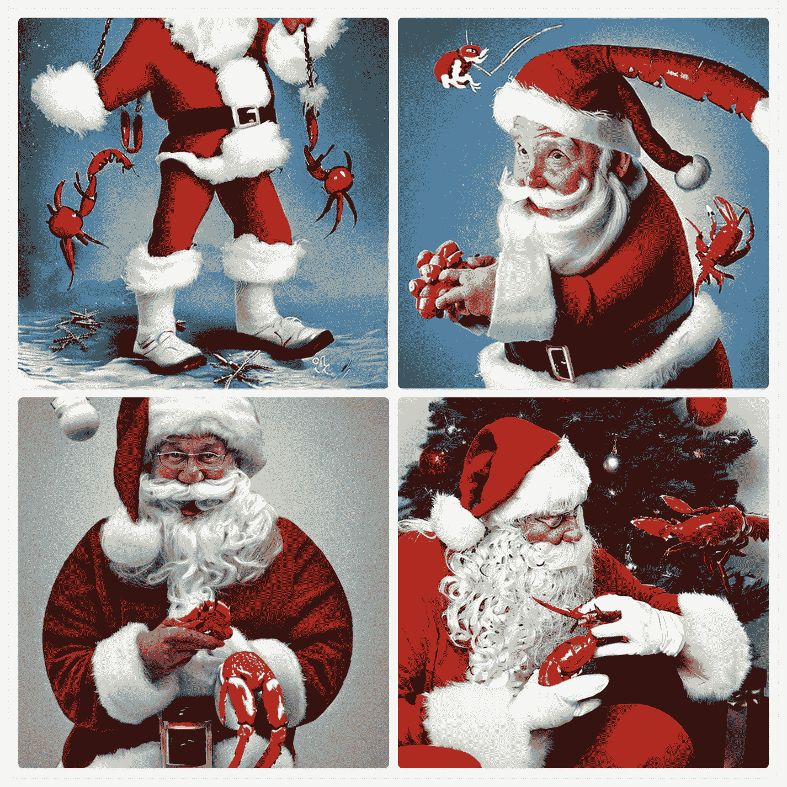
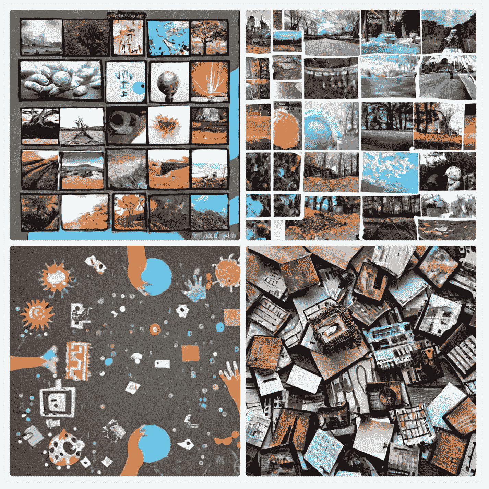

# 专栏:人工智能内容生成器的兴起是对创造力的冒犯

> 原文：<https://thenewstack.io/op-ed-the-rise-of-ai-content-generators-is-an-affront-to-creativity/>

我先说我有一只狗参加了这场比赛。你可能知道，我是个作家。我不仅写关于技术的文章，我还是一名小说作家。我已经写作三十年了，已经出版了五十多部小说。我也是演员和编剧。不用说，创造力是我基因的一部分。我活着就是为了创造。我的艺术创作充实了我的灵魂。就这么简单。

我为此不懈努力。根据 Grammarly 的说法，我在 2021 年写了超过 600 万字，今年有望打破这一纪录。写作的时候，我尽一切努力提高自己的手艺。同样的事情也适用于我的表演…总是尽我所能做得更好。

所有这些创造力都来自于几十年的生活、对创造的绝对需求、过度活跃的想象力和敏锐的观察力。如果没有这些品质，在这个竞争激烈的世界里，想要取得哪怕一点点的成功都很难。当然，艺术上的成功是相对的。对一些人来说，成功在于行动，而另一些人可能只满足于金钱或社会利益。然而，归根结底，我们艺术家之所以做我们所做的，是因为我们不能不做。相信我，我尝试过，感觉我的灵魂枯萎到一无所有。

对我来说，创造艺术就像睡眠和食物一样自然而必要。

但所有这些都让我想到一个非常重要的问题。没有灵魂的艺术真的是艺术吗？这当然让我想到了另一个问题。灵魂是什么？这两个问题问起来都很有挑战性，而且也与手头的主题密切相关。

人工智能聊天机器人。

当人工智能聊天机器人第一次出现时，它们主要是一种好奇心。用户可以向聊天机器人打字，聊天机器人会尽可能用对话的语气回答他们的问题。最初，很容易辨别你是否在和机器人聊天。然而，最终，这些聊天机器人得到了改进和发展，以至于知道你是否在和机器人聊天变得非常具有挑战性。直到 2014 年，尤金·古斯特曼聊天机器人才通过图灵测试。从那时起，这些聊天机器人已经达到了一个令人毛骨悚然的高度，几乎无法辨别。

随着人工智能技术的更大飞跃，聊天机器人不仅仅用于聊天。

现在，我们有了人工智能聊天机器人，它可以接受用户的提示，生成特定主题的图像甚至书面文档。在过去几年里，我阅读了大量人工智能生成的文档，以了解它们改进了多少。最初，这些文件常常是一串不连贯的句子，读起来就像是小孩子写的。现在，很难区分聊天机器人写的论文和高中生写的论文。

作为一个作家，这应该让我感到害怕。坦率地说，确实如此。然而，我们距离人工智能取代艺术家还有几十年的时间。

让最后一句话深入人心。

这在艺术家中引起了类似的共鸣，就像无代码开发在开发人员中引起的共鸣一样。假设你已经做了多年的开发人员。你总是试图提高你的技能，学习新的语言，适应新的技术，尽你所能保持领先。但是，不知从哪里，聊天机器人开始编写代码。首先，他们很幸运地完成了《你好，世界！在很短的时间内，这些机器人现在正在编写 API、web 应用和微服务。

反乌托邦对你有什么影响？

多年来，工厂工人眼看着他们的许多工作被机器人取代。毕竟，机器人可以持续工作，而且更加可靠。即便如此，这些机器人确实取代了许多努力工作的人。我们也见证了食品行业的售货亭接受订单。没有一个行业的技术没有触及。

但是创造这种技术的人需要考虑他们所开发的东西的后果。艺术是这个世界上珍贵的商品。它有助于社会从一幅油画、一页文字、舞台上的一个瞬间或一首歌曲的旋律中看到自己的影子。艺术是人类最真实的镜子。

在这个问题上我很纠结。首先，我完全理解这种技术将为众多行业带来难以置信的突破。然而，与此同时，科技也有能力毁掉很多人的经济和艺术福祉。

举个例子，像[稳定扩散](https://stablediffusionweb.com/)和[中途](https://midjourney.com/)这样的人工智能平台。这两个工具都会根据您的提示生成图像。例如，在 midway Discord 服务器上，您可以键入 */imagine* ，然后输入提示，例如*有龙虾爪的圣诞老人。*聊天机器人将处理提示，并在不到一分钟的时间内显示它生成的图像(**图 1** )。

图 1:不完全是我心目中的形象。

我们来谈谈这个。

您可以根据自己的提示尽情发挥创造力。这是对这项技术的一个有趣的理解。人工智能生成的图像缺乏真正的创造力。但当用户需要为人工智能编写一个创造性的提示时，那就是另一回事了。当然，你可以简单地抛出一堆随机的单词或短语，仍然能想出一些东西。例如，我将这一整段粘贴到提示中，得到了您在图 2 中看到的内容。

图 2:是的。AI 生成了这个。

是。那个。艺术？

我还测试了 ChatGPT，并输入了这个提示:给我讲一个食人族的故事。这是它产生的结果:

*很久很久以前，在一个遥远的地方，住着一个叫杰克的食人族。杰克是一个凶残无情的人，所有认识他的人都害怕他。众所周知，它会在陆地上游荡，寻找自己的下一餐，并以凶残的掠食者而闻名。*

*一天，杰克在森林里漫步时，偶然发现一群迷路的旅行者。看到它们是容易的猎物，他蹑手蹑脚地来到它们身后攻击，把它们一个个拖回自己的洞穴吃掉。*

多年来，杰克继续着他的恐怖统治，对任何经过他身边的人进行掠夺。他被称为“食人王”，他的传奇越来越广。

但是随着时间的流逝，杰克开始感到内心一种奇怪的空虚。他意识到世界上所有的食物都无法填补他灵魂的空虚。他渴望更多的东西，一些他以前从来不知道的东西。

一天，杰克遇到一位好心的老妇人，她给了他一片面包。他一边吃，一边感受到一种从未有过的温暖和幸福。他有生以来第一次感到真正的满足。

从那天起，杰克一改往日的生活方式，致力于帮助他人。他成为世界上一股正义的力量，用他的力量和狡猾保护弱者和无辜者。

因此，这个曾经令人畏惧的食人者成为了英雄，作为救赎和仁慈力量的象征被永远铭记。

除了 ChatGPT 使用我的名字，我不太担心它会在一段时间内取代我作为作家的地位。

即便如此，这里要考虑的东西还是太多了。是什么让安迪·沃霍尔的艺术成为真正的艺术？对许多人来说，沃霍尔的艺术是在打破常规。还是拿[杰森·布拉克](https://www.guggenheim.org/artwork/artist/jackson-pollock)来说。许多人会说他的艺术不在于成品，而在于创造产品的行为。

所以，艺术的概念本身是相对的。然而，即使是沃霍尔和波洛克，他们所做的一切都是由一种激情驱动的……一种灵魂。

艾创作的艺术缺少这一点。无论这项技术多么巧妙和不可思议，凭良心说，我都不能称之为艺术。人工智能生成的书面作品也是如此。艺术不是一堆拼凑起来的技术，根据没有灵魂的算法和标准来生成图像和段落。

无论这些人工智能聊天机器人的最终目的是什么，它必须避免取代真正的艺术家。我们已经够努力了。在已经充满挑战的生活中，我们不需要再去克服另一个障碍。不幸的是，恐怕潘多拉已经逃出魔盒了。我看到越来越多的人工智能生成的“艺术”在社交媒体上分享，而不是人类创作的艺术。我还发现，相比我分享艺术家写的诗歌或小说的链接，更多的人愿意在社交媒体上分享人工智能生成的段落和论文。

那真的不是什么值得骄傲的事情。是的，为你的创造感到自豪，但是要利用你的创造，使它对社会产生积极的影响。我发现这是一个非常滑坡。目标是取代作家、演员、画家和图形艺术家吗？也许目标应该是说明由真实的人类创造的艺术的价值。当然，人工智能聊天机器人可以根据提示拼凑一系列图像，但如果没有人类的条件加入其中，所创造的东西就没有人物的深度，没有心灵和灵魂。

没有人工智能，你无法拼出“heart”……这是一个人工智能聊天机器人可能会拼出的句子。但是不可磨灭的，不可辩驳的事实是，没有“艺术”你就不能拼出“心”

<svg xmlns:xlink="http://www.w3.org/1999/xlink" viewBox="0 0 68 31" version="1.1"><title>Group</title> <desc>Created with Sketch.</desc></svg>