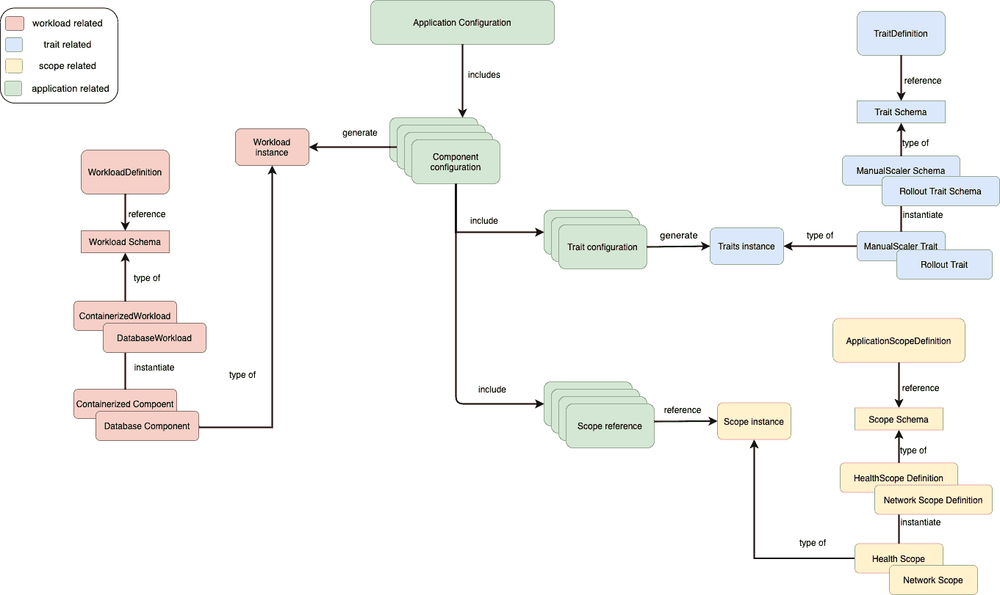
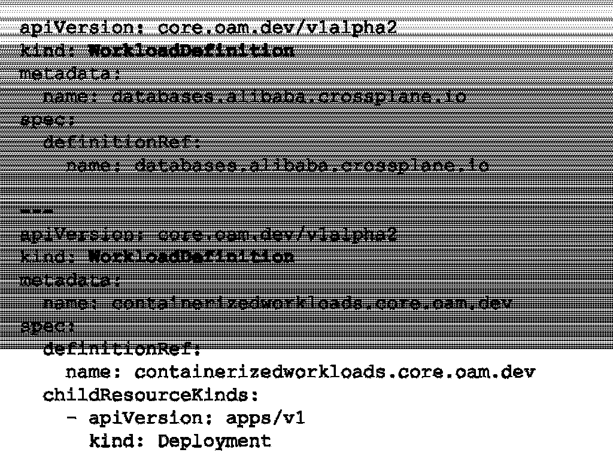
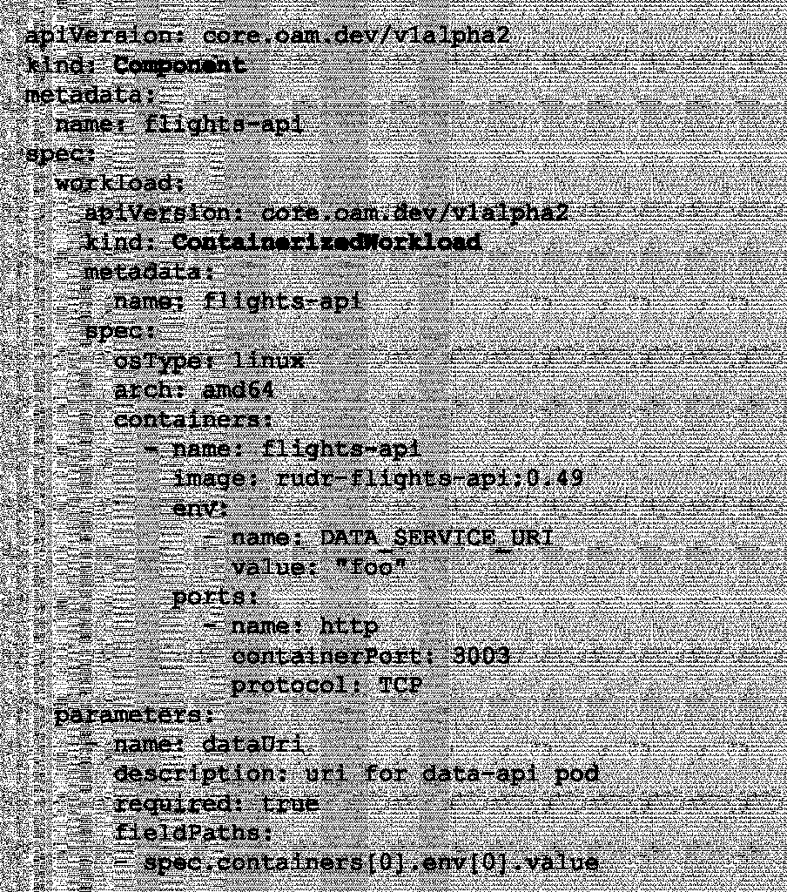
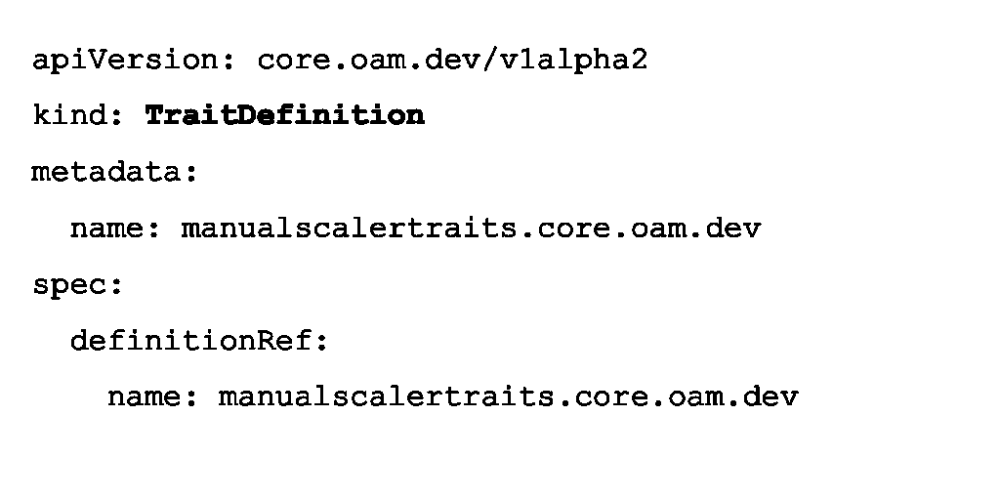
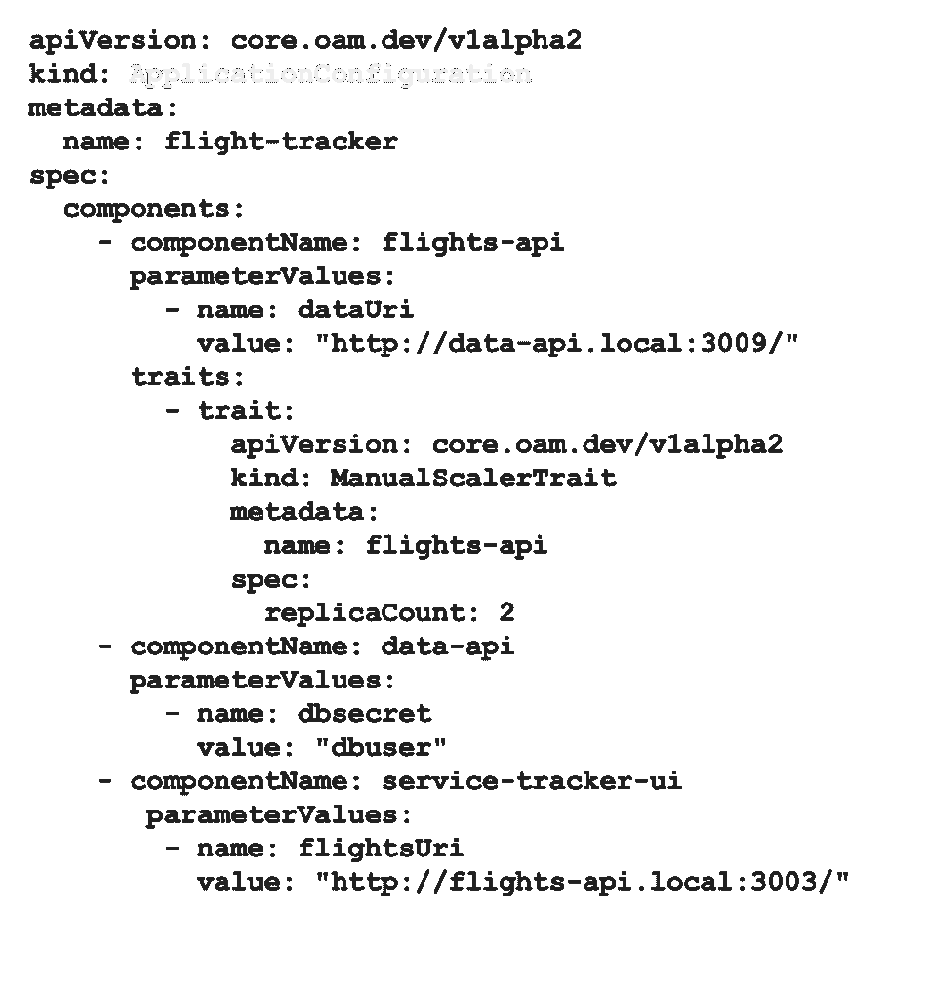

# 开放应用模型:构建下一代云原生应用

> 原文：<https://thenewstack.io/open-application-model-build-the-next-generation-of-cloud-native-applications/>

早在 2019 年 10 月，微软和阿里云联合宣布[开放应用模型](https://github.com/oam-dev)，这是一种描述云和边缘应用的标准、平台无关的方式。 [OAM](https://thenewstack.io/open-application-model-a-vendor-neutral-spec-for-modular-apps/) 的主要目标有两个:

*   为任何微服务平台提供标准应用环境
*   定义一个以团队为中心的模型，支持开发人员和操作人员之间关注点的清晰分离。

我们认为，在面向基础设施的平台(如 Kubernetes)上，明确定义“T4”应用非常重要。我们还观察到，在大多数现代[云原生应用程序开发环境](https://thenewstack.io/10-key-attributes-of-cloud-native-applications/)中有一些共同的功能角色。因此，我们在我们的[开放应用模型](https://www.alibabacloud.com/blog/its-the-worlds-first-application-management-model-and-its-open-source_595471)中正式定义了三个角色，即应用开发者、应用操作员和基础设施操作员。

## 从那以后我们一直在做的事情

 [张晨磊

张晨磊博士是大规模分布式计算专家，在研究和工程领域拥有超过 15 年的经验。他在莱斯大学获得博士学位，研究网格计算中的异构工作流调度。他是 Azure 的批量计算服务和阿里云的函数计算服务的创始成员。他目前是一名工作人员工程师，致力于一项开放规范，该规范将模块化、可扩展和可移植的设计引入到构建和交付云原生应用程序中。](https://github.com/ryanzhang-oss) 

在发布了规范的 1alpha1 版本之后，我们立即开始与 OAM 社区进行内部和外部的合作。虽然 OAM 得到了一些早期采用者，如[阿里云的](https://us.alibabacloud.com/) [企业分布式应用服务(EDAS)](https://www.alibabacloud.com/product/edas) ，但我们很快意识到我们需要继续发展 OAM 模型。

OAM 的核心是一个可扩展的模型，因此每个平台都可以选择通过一个标准的应用程序模型来公开它们独特的特性和功能，而不局限于“最小公分母”特性集。然而，我们意识到我们需要进一步提高模型的可扩展性，以便它可以无缝地描述特定平台、云或边缘的任何资源。

在接下来的几个月里，我们和来自[的](https://upbound.io/)[交叉平面](https://www.crossplane.io/)维护人员一起，开始设计规范的下一个里程碑。经过无数轮的讨论和有时激烈的辩论，我们很高兴地宣布 OAM 规范现在是 v1alpha2。OAM 的新草案引入了新的特性，极大地提高了它对各种平台的适应性。

## 深入了解 OAM 阿尔法 2

正如我们提到的，新的 OAM 规范更具可扩展性，对任何实现它的平台都更友好。我们通过引入几种类型的资源来取代 v1Alpha1 规范中的现有资源，从而实现了这一点。

### 总体图

首先，让我们看一个图表，它描述了 v1alpha2 规范中各种 OAM 资源之间的关系。

(点击进入 embiggen)。

我们可以看到有四类 OAM 资源，我们将使用一个[示例](https://github.com/oam-dev/samples/tree/master/2.ServiceTracker_App)来逐步介绍每一类。你可以不时地回头看看这张图，看看每一部分是如何融入整体画面的。

## 工作负荷定义

我们用***workload definition***替换了 v1alpha1 中的工作负载资源。 ***工作负载定义*** 是基础设施运营商或平台构建者定义给定平台上的应用程序开发人员可用的工作负载的一种方式。在新规范中，它还充当 OAM 的本地资源定义的“注册”。

下面是一些 ***工作负荷定义*** 的例子。

一个 ***工作负载定义*** 包含一个对本地资源定义的引用。具体来说，它们可以是 Kubernetes 生态系统中的[客户资源定义](https://kubernetes.io/docs/concepts/extend-kubernetes/api-extension/custom-resources/#customresourcedefinitions)。随着 ***工作负载定义*** 的升级，OAM 平台构建者现在可以通过创建相应的 ***工作负载定义*** 无缝导入任何本机资源作为 OAM 工作负载。一个 ***工作负载定义*** 可以包含可选的元数据字段，因此它也可以作为 OAM 平台的资源注册。OAM 用户可以列出系统中所有的 ***工作负荷定义*** 并进行描述。

## 成分

我们用 component 替换了 v1alpha1 中的 componentSchematic。一个组件描述了一个功能单元，它可以被实例化为一个更大的分布式应用程序的一部分。例如，应用程序中的每个微服务都被描述为一个组件。

下面是一个组件示例，其中包括一个部分实例化的工作负载。

一个 ***组件*** 有两大部分。

*   **工作负载**:这个扇区包含了对应 ***工作负载定义*** 所引用的模式的实例化。具体来说，这是一个[自定义资源](https://kubernetes.io/docs/concepts/extend-kubernetes/api-extension/custom-resources/#custom-resources)，对应于 Kubernetes 生态系统中 ***工作负载定义*** 中引用的自定义资源定义。在本例中，工作负载部分实例化了相应的 ***工作负载定义*中引用的 ***容器化工作负载*** 。**
*   **参数**:该扇区定义了该*组件*的所有可配置参数。这是应用程序开发人员在部署应用程序时将操作细节留给应用程序操作人员的一种方式。在本例中，我们将后端数据 api URI 作为一个参数，供应用程序操作员填写 ***应用程序配置*** 。

请注意，一个 ***组件*** 本身并不是一个实例，而是那个微服务的功能和操作能力的声明。代表微服务的真实实例是在 ***应用配置*** 的上下文中创建和配置的。

## 轨迹定义

我们用***trait definition***替换了 v1alpha1 中的 trait。一个***[trait definition](https://github.com/oam-dev/spec/blob/master/6.traits.md)***是一个运行时覆盖，它用额外的特性扩充了一个*组件*。它允许应用程序操作员决定*组件*的配置，而无需应用程序开发人员参与。

下面是一个***trait definition***的例子。

与 ***工作负载定义*** 类似，我们开放了 OAM 规范，允许 OAM 平台构建者将任何原生资源定义作为*特征*无缝导入到平台上。但是，与***workload definition***和 ***组件*** 不同的是， *trait* 的实例化是在***application configuration***的上下文中进行的。这是因为*特征*是应用程序操作者关心的，因此，我们可以将它们的配置和实例化放在一个 ***应用程序配置*** 中。

## 范围

我们还在 v1alpha2 中介绍了**[*scope definition*](https://github.com/oam-dev/spec/blob/master/5.application_scopes.md)**。一个*作用域*可以用来将 ***组件*** 组合到一个逻辑应用程序中，或者执行一个公共的运行时行为。

下面是一个***scope definition***和一个应用范围的例子。

同样，我们已经开放了 OAM 规范，将任何本机资源定义作为*范围*无缝导入到平台上。

但是，*范围*不同于 ***组件*** 和 ***特性*** ，因为应用*范围*的实例是独立创建的。这是因为*范围*主要是应用程序操作者关心的问题，但它是由多个 ***组件*** 共享的。因此，我们需要先创建一个 ***范围*** 实例，并在 ***应用配置*** 中引用它。

## 应用程序配置

最后，应用程序配置定义了应用程序的实例及其操作能力。这就是开放应用程序模型如何将一切放在一起以表示云原生应用程序。一般情况下， ***应用配置*** 由*应用操作员*角色管理。

这里是一个 ***应用程序配置*** 的简化示例，它包含了我们在本博客前面定义的 ***组件*** /trait。

在这个 ***应用配置*** 中，我们定义了三个 ***组件*** 。第一个引用了我们之前展示的 ***组件*** 。应用运营商通过 ***参数值*** 设置后端数据服务的 uri。应用操作员还将一个 ***手动缩放器*** 特征应用到这个*组件*上，以将相应的微服务缩放到两个实例。现在，我们可以将这个应用程序部署到任何 OAM 平台上。如果你感兴趣，这里有一个更详细的演示。

## 结论

OAM v1alpha2 规范开放了这种模型，允许 OAM 用户和平台构建者不做任何改变地使用他们现有的资源。这极大地提高了模型的可扩展性，我们对这可能带来的新的可能性感到非常兴奋。

我们也非常兴奋地宣布，我们在 Github 上有了一个新的基于 Golang 的 OAM Kubernetes 运行时。如果您想了解新规范的更多信息，请尝试一下。我们期待听到您的反馈，我们欢迎任何形式的贡献。请随时创建问题，拉请求或只是留下评论。

[Nour wagh](https://unsplash.com/@nourwageh?utm_source=unsplash&utm_medium=referral&utm_content=creditCopyText)在 [Unsplash](https://unsplash.com/s/photos/pyramid?utm_source=unsplash&utm_medium=referral&utm_content=creditCopyText) 上的特写照片。

目前，新堆栈不允许直接在该网站上发表评论。我们邀请所有希望讨论一个故事的读者通过 [Twitter](https://twitter.com/thenewstack) 或[脸书](https://www.facebook.com/thenewstack/)访问我们。我们也欢迎您通过电子邮件发送新闻提示和反馈:[feedback @ thenewstack . io](mailto:feedback@thenewstack.io)。

<svg xmlns:xlink="http://www.w3.org/1999/xlink" viewBox="0 0 68 31" version="1.1"><title>Group</title> <desc>Created with Sketch.</desc></svg>