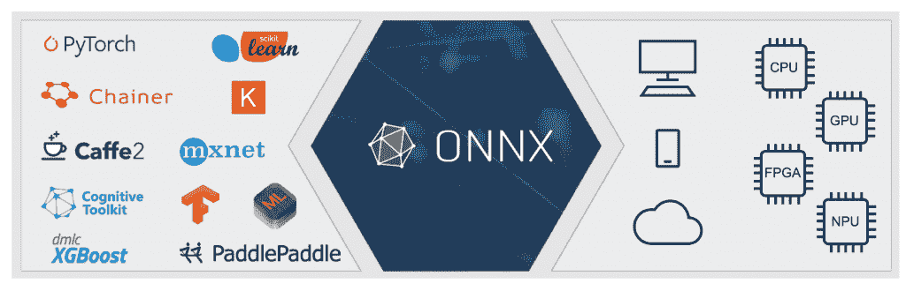
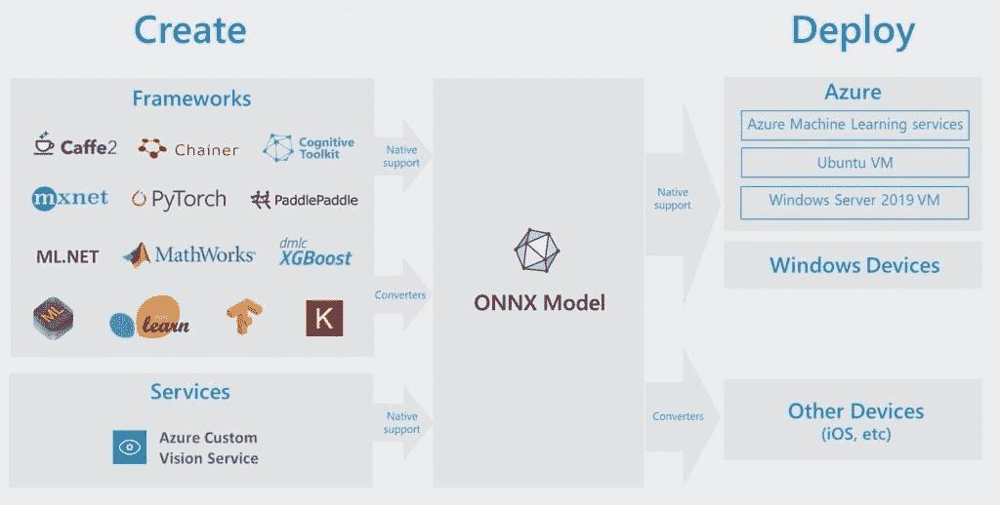
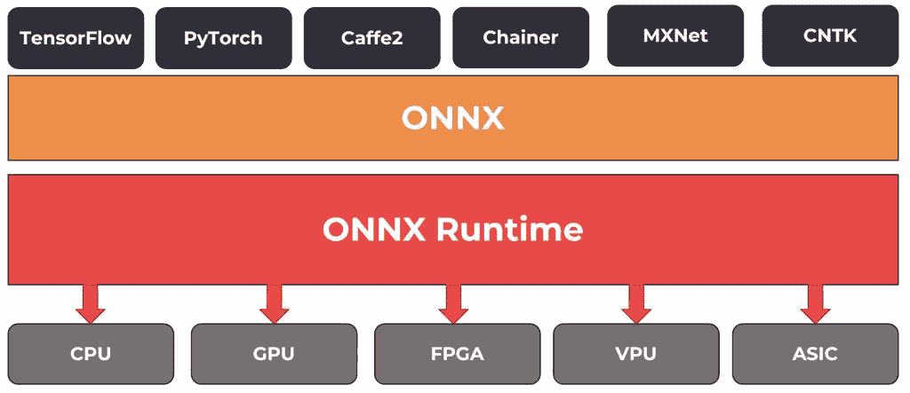

# 开放式神经网络交换为机器学习框架带来互操作性

> 原文：<https://thenewstack.io/open-neural-network-exchange-brings-interoperability-to-machine-learning-frameworks/>

本文是开放神经网络交换(ONNX)系列介绍教程的第一篇。明天回来查看本系列的第二篇文章。

机器学习和深度学习领域正变得越来越复杂。多样化框架、工具包和定制硬件架构的兴起是构建、部署和管理深度学习模型变得艰难的部分原因。

机器学习框架的选择有 [TensorFlow](https://www.tensorflow.org/) 、 [PyTorch](https://pytorch.org/) 、 [Apache MXNet](https://mxnet.apache.org/) 和微软 CNTK。为了加速训练，使用了硬件 AI 加速器，如图形处理单元(GPU)、现场可编程门阵列(FPGA)、张量处理单元(TPU)和专用集成电路(ASIC)。英伟达 GPU、英特尔 FPGAs 和谷歌云 TPU 是人工智能加速器的一些例子。这些加速器都带有定制的驱动程序和库，以便与机器学习程序进行交互。 [NVIDIA CUDA/cuDNN](https://developer.nvidia.com/cudnn) 和[英特尔 oneDNN](https://github.com/oneapi-src/oneDNN) 只是作为底层硬件加速器接口的两个软件堆栈。

一旦完成训练并形成模型，它就会被运行在公共云、桌面、浏览器、边缘设备和移动电话上的不同应用所消耗。为了加快推理速度，使用了不同的人工智能加速器。 [NVIDIA Jetson](https://developer.nvidia.com/buy-jetson) 家族、 [Intel Movidius 和 Myriad VPU](https://www.intel.com/content/www/us/en/products/processors/movidius-vpu/movidius-myriad-x.html) 、 [Google Edge TPU](https://cloud.google.com/edge-tpu) 和[高通 Adreno GPU](https://developer.qualcomm.com/software/adreno-gpu-sdk/gpu) 是边缘使用的硬件加速器的一些例子。像他们的训练对手一样，推理加速器有自己的软件栈。 [NVIDIA JetPack](https://developer.nvidia.com/embedded/jetpack) 、 [Intel OpenVINO Toolkit](https://software.intel.com/content/www/us/en/develop/tools/openvino-toolkit.html) 、 [Google TensorFlow Lite](https://www.tensorflow.org/lite) 和[高通神经处理 SDK](https://developer.qualcomm.com/software/qualcomm-neural-processing-sdk) 组成了在边缘加速 AI 的软件栈。在云中或数据中心训练的模型需要优化，以利用人工智能硬件和软件的结合。

机器学习生态系统中硬件和软件的极端差异带来了复杂性和摩擦。我们正在应对当前构建和部署 ML 模型的两个关键挑战:

*   模型之间缺乏互操作性。
*   训练和推理缺乏一致的运行时间。

例如，在 TensorFlow 中训练的复杂模型不容易被 PyTorch 开发人员用于推理。在使用模型之前，她必须在 PyTorch 中重新训练相同的模型。缺乏模型互操作性降低了 ML 开发人员的生产力，迫使他们不断地重新发明轮子。

应用程序无法立即使用经过训练的模型。它必须进行优化并转换到目标环境中。例如，TensorFlow 模型必须导出到[tensort](https://developer.nvidia.com/tensorrt)模型才能利用 NVIDIA GPUs。英特尔 Movidius 和 OpenVINO Toolkit 也是如此。没有一致的运行时层来抽象 AI 加速器的硬件和软件的组合。

### 开放式神经网络交换——ML 互操作性的标准

2017 年，AWS、微软和脸书共同推出了[开放神经网络交换(ONNX](https://onnx.ai/) )，它定义了 ML 互操作性的标准。ONNX 有两个组件:一组通用的操作符和一种通用的文件格式。

算子是机器学习和深度学习模型的构建模块。通过标准化一组通用的运算符，ONNX 可以轻松使用在任何支持的框架中训练的深度学习模型。它定义了一个可扩展的计算图模型，以及内置运算符和标准数据类型的定义。



ONNX 的通用文件格式成为表示模型的最小公分母。一旦一个模型被导出到 ONNX，不管它是在哪个框架中被训练的，它都会公开一个标准的图形和一组基于规范的操作符。每个模型都被转换成一个标准的中间表示(IR ),它被很好地定义和记录。

通过提供计算图的通用表示，ONNX 帮助开发人员为他们的任务选择正确的框架，允许作者专注于创新的增强功能，并使硬件供应商能够优化他们的平台。

ONNX 附带了一些库，可以很容易地将模型转换成 ONNX 格式。例如，下面的 Python 代码显示了一个在 [Scikit-learn](https://scikit-learn.org/stable/) 中训练的模型是如何被转换成 ONNX 格式的。

```
pip install onnx sklearn skl2onnx

```

```
from sklearn.datasets import load_iris
from sklearn.model_selection import train_test_split
from sklearn.ensemble import RandomForestClassifier
iris  =  load_iris()
X,  y  =  iris.data,  iris.target
X_train,  X_test,  y_train,  y_test  =  train_test_split(X,  y)
clr  =  RandomForestClassifier()
clr.fit(X_train,  y_train)

# Convert into ONNX format
from skl2onnx import convert_sklearn
from skl2onnx.common.data_types import FloatTensorType
initial_type  =  [('float_input',  FloatTensorType([None,  4]))]
onx  =  convert_sklearn(clr,  initial_types=initial_type)
with open("model.onnx",  "wb")  as  f:
    f.write(onx.SerializeToString())

```

PyTorch 的最新版本包括一个内置的 ONNX 导出器，使得在其他框架中使用模型变得容易。ONNX 既支持传统的机器学习模型，也支持深度学习模型。ONNX-ML 是 ONNX 的扩展，旨在导出用 Scikit-learn 等框架训练的传统机器学习模型。

去年，ONNX 成为了 [AI 基金会](https://lfai.foundation/)的一部分，该基金会是 Linux 基金会的一个伞式基金会，支持人工智能、机器学习和深度学习领域的开源创新。

### ONNX 运行时

ONNX 的联合创始人之一微软已经构建并开源了该运行时。 [ONNX Runtime](https://microsoft.github.io/onnxruntime/) 是一个高性能推理引擎，用于 Linux、Windows 和 Mac 上 ONNX 格式的机器学习模型。

ONNX 运行时通过公开一致的接口进行推理来抽象底层硬件。它对 NVIDIA TensorRT、NVIDIA JetPack、英特尔 OpenVINO Toolkit 和其他加速器提供后端支持。



微软在 ONNX 运行时上下了很大的赌注。对于 Windows 的机器学习组件 [Windows ML](https://docs.microsoft.com/en-us/windows/ai/windows-ml/) ，微软已经选择 ONNX 作为默认运行时。据微软称，内部团队正在使用 ONNX Runtime 来改善 Bing 搜索、Bing 广告、Office 生产力服务等核心场景中使用的模型的评分延迟和效率。

[Azure Custom Cognitive Services](https://azure.microsoft.com/en-in/services/cognitive-services/)包括一种将模型直接导出为 ONNX 格式的机制，可以部署在边缘设备上。

ONNX 运行时作为 [Python 库](https://pypi.org/project/onnxruntime/)提供。它还支持其他语言绑定，包括 C#和 Java。

一旦安装了 ONNX 运行时，它就可以用来加载任何 ONNX 模型进行推理。下面的代码片段是上一节中显示的 Scikit-learn 程序的扩展。

```
import onnxruntime as rt
import numpy
sess  =  rt.InferenceSession("rf_iris.onnx")
input_name  =  sess.get_inputs()[0].name
label_name  =  sess.get_outputs()[0].name
pred_onx  =  sess.run([label_name],  {input_name:  X_test.astype(numpy.float32)})[0]
print(pred_onx)

```

ONNX Runtime 做了 Java 虚拟机(JVM)和公共语言运行时(CLR)对深度学习框架的语言所做的事情。ONNX 的中间表示以相同的运行时为目标，而不管它是在哪个框架中被训练的。ONNX 运行时有执行提供程序，负责为目标硬件环境优化模型。

[](https://thenewstack.io/open-neural-network-exchange-brings-interoperability-to-machine-learning-frameworks/onnx-5/)

例如，在 NVIDIA T4 GPU 和 CUDA/cuDNN 上运行的 ONNX 模型会针对 TensorRT 自动优化模型。在此之前，ONNX 运行时必须在支持 TensorRT 执行提供程序的情况下构建和部署。英特尔 OpenVINO Toolkit 和 [Android NNAPI](https://developer.android.com/ndk/guides/neuralnetworks) 也是如此。

ONNX 和 ONNX 运行时的结合承诺了深度学习模型的可移植性、互操作性和优化。

为了更容易找到合适的执行提供者，微软为各种环境构建了 [Docker 文件和容器映像](https://github.com/microsoft/onnxruntime/tree/master/dockerfiles)。

微软正在大力投资 ONNX 运行时。它在 Windows、AzureML、认知服务、IoT Edge、可视化 AI 开发者工具包等产品中发挥着重要作用。微软也在努力使 ONNX 运行时成为训练模型的理想选择。

### ONNX 生态系统

除了 AWS、脸书和微软，还有 30 多家公司参与了 ONNX 社区。这个项目现在是 Linux 基金会的一部分，它最近刚刚从那里毕业。


该社区已经创建了一个 [ONNX 模型动物园](https://github.com/onnx/models)，其中包含一些流行的神经网络模型，如 AlexNet、ResNet、MobileNet、VGG、GoogleNet、TinyYolo 和 BERT。这些模型可以下载并与 ONNX 运行时一起用于推理。每个模型都有一个 *model.onnx* 文件和测试数据来评估模型。

除了库、运行时和模型动物园，ONNX 生态系统还构建了可视化和探索模型的工具。 [Netron](https://github.com/lutzroeder/netron) 可以加载 ONNX 模型，检查网络结构。在探索 ONNX 模型以理解神经网络图的输入层、隐藏层、运算符、数据类型和输出层时，这是非常有用的。

[来自百度的 VisualDL](https://github.com/PaddlePaddle/VisualDL) 是一款深度学习可视化工具，可以帮助设计深度学习工作。最初创建它是为了可视化用 Paddle Paddle 框架训练的深度学习模型。它包括标量、参数分布、模型结构和图像可视化等特征。

在 ONNX 系列的下一部分中，我们将看到如何使用来自模型动物园的预训练模型进行推理。敬请期待！

贾纳基拉姆·MSV 的网络研讨会系列“机器智能和现代基础设施(MI2)”提供了涵盖前沿技术的信息丰富、见解深刻的会议。在 [http://mi2.live](http://mi2.live) 注册参加即将举行的 MI2 网络研讨会。

由 [Lesly Juarez](https://unsplash.com/@jblesly?utm_source=unsplash&utm_medium=referral&utm_content=creditCopyText) 在 [Unsplash](https://unsplash.com/s/photos/marketplace?utm_source=unsplash&utm_medium=referral&utm_content=creditCopyText) 上拍摄的特写图片。

目前，新堆栈不允许直接在该网站上发表评论。我们邀请所有希望讨论某个故事的读者通过推特(Twitter)或脸书(T2)与我们联系。我们也欢迎您通过电子邮件发送新闻提示和反馈:[反馈@thenewstack.io](mailto:feedback@thenewstack.io) 。

<svg xmlns:xlink="http://www.w3.org/1999/xlink" viewBox="0 0 68 31" version="1.1"><title>Group</title> <desc>Created with Sketch.</desc></svg>