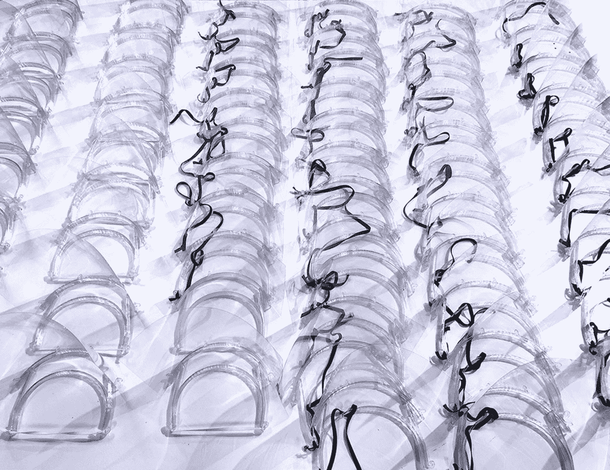
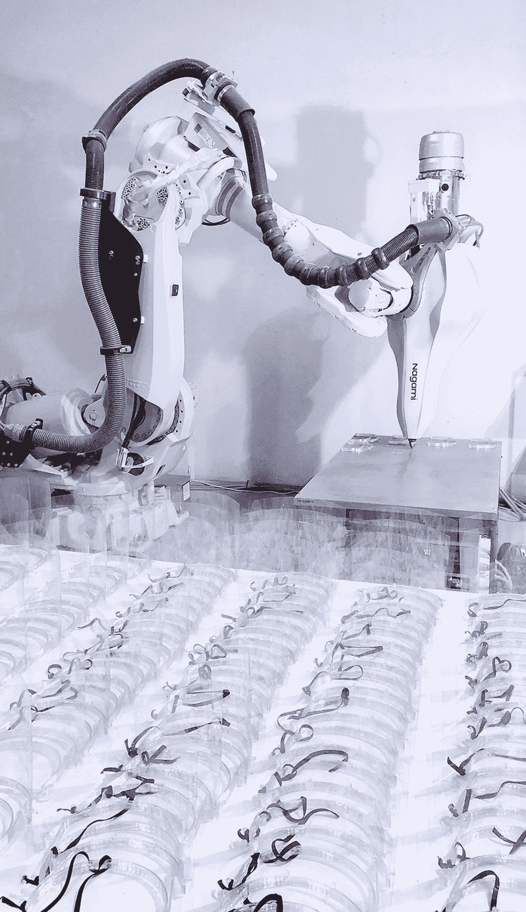

# 开源 3D 打印面罩保护医院工作人员免受新冠肺炎病毒侵害

> 原文：<https://thenewstack.io/open-source-3d-printed-face-shields-protect-hospital-workers-from-covid-19/>

随着全球冠状病毒疫情的肆虐，护士、医生、护理人员和其他医疗保健专业人员继续就防止一线工作人员被感染所需的个人防护设备(PPE)的严重短缺发出警报。情况变得如此糟糕，以至于我们经常听到医护人员[重复使用隔离衣和口罩](https://www.businessinsider.com/doctors-frontlines-coronavirus-protective-gear-running-out-2020-3)，甚至[自己制作隔离衣和口罩](https://www.fastcompany.com/90479200/hospital-workers-design-their-own-face-masks-using-craft-supplies)来应对短缺的故事。

为了满足日益增长的需求，一些公司正在加快步伐，重新调整生产线，改造制造设备，为医院员工制造更多救生设备。

总部位于西班牙的 [Nagami Design](https://www.nagami.design/en/) 就是这样一家从 3D 打印高端设计师家具转向制造塑料面罩的初创公司。这种特殊的设备类似于透明焊工的头盔，可以保护佩戴者的面部不与受感染患者打喷嚏或咳嗽时排出的空气飞沫直接接触。

专家表示，由于使用了无孔塑料材料，与口罩相比，像 Nagami 这样的小公司更容易制造面罩，通过增加这一额外的保护层，用户还可以延长口罩的寿命。

“这是一个提供第一保护层的外部面罩，在任何情况下都不能替代[标准面罩]设备，”Nagami 的首席执行官兼联合创始人曼努埃尔·希门内斯·加西亚向我们解释道。“我们在西班牙服务的医院没有任何类似的设备，一些医院已经在自己动手制作一些 DIY 版本。因为它不会直接接触到他们的眼睛或嘴巴，所以在使用前需要消毒。这种设备也在阻止医院工作人员用手触摸他们的脸。”

基于一个[开源设计](https://www.prusaprinters.org/prints/25857-prusa-protective-face-shield-rc2)，该设计后来被 Nagami 的 3D 打印机械臂重新采用，该公司的面罩设计有两个塑料交错带:一个使用弹性带附着在佩戴者的脸上，可以根据需要进行调整；和另一个塑料带，透明的保护塑料片可以固定在该塑料带中。

据该公司称，面罩是使用机械臂 3D 打印的，该机械臂配备了 Nagami 开发的专用挤出机。通过一种名为[熔融沉积成型](https://www.livescience.com/39810-fused-deposition-modeling.html) (FDM)的逐层打印工艺，一种耐用、耐化学腐蚀的热塑性材料(聚对苯二甲酸乙二醇酯或 PETG)被沉积下来，一次一层，形成一个三维物体。

“通过用机器人打印它们，我们比传统的桌面 FDM 3D 打印机沉积了更厚的塑料层，”Jimenez Garcia 说。“这使我们的印刷速度提高了 7 倍，将每个掩模的印刷时间从平均 35-40 分钟减少到了 5 分钟。[PETG]在自然状态下有 91%的透明度，非常像玻璃。它是 100%可回收的，不会损失任何属性，这意味着它可以无限回收和重新利用。”

该公司的机械臂打印机和定制挤出机大大加快了打印过程，使他们每天能够打印多达 500 个口罩。

“我们通常使用我们的机器人来 3D 打印大尺寸的工件，因为这是该公司的主要目标:实现大规模 3D 打印，”Jimenez Garcia 补充道。“我们必须为我们的塑料挤出机开发新的稀释剂喷嘴，以打印稀释剂，并重新计算字符串，以避免打印如此小的零件时伺服电机过热。”

目前，该公司正在Á维拉附近的地区快速生产和交付面罩，并计划在全国其他地区扩大分销规模——希望与其他希望提供专业知识的公司合作。希门尼斯·加西亚承认，扩大规模将带来后勤方面的挑战，但令人欣慰的是，3D 打印肯定会兑现其承诺，不仅在不同地方快速制造面罩，而且还制造通风机的关键部件。

“这真的证明了 3D 打印的最佳状态，”Jimenez Garcia 说。“十年来，我们一直在讨论 3D 打印的优势:建立非常短的生产链，允许分布式制造，从而大幅减少运输和二氧化碳排放。该项目展示了 3D 打印技术如何快速应对真正重要的问题和遍布全球的紧急情况，利用这种能力在创纪录的时间范围内创建任何形状。我们现在意识到 3D 打印的重要性及其在我们星球上的多功能性，我希望它很快会成为一种更加强大和易于使用的技术，可以在全球任何地方轻松使用。”

在[永见设计](https://www.nagami.design/en/)查看更多信息。

图片:长见设计

<svg xmlns:xlink="http://www.w3.org/1999/xlink" viewBox="0 0 68 31" version="1.1"><title>Group</title> <desc>Created with Sketch.</desc></svg>