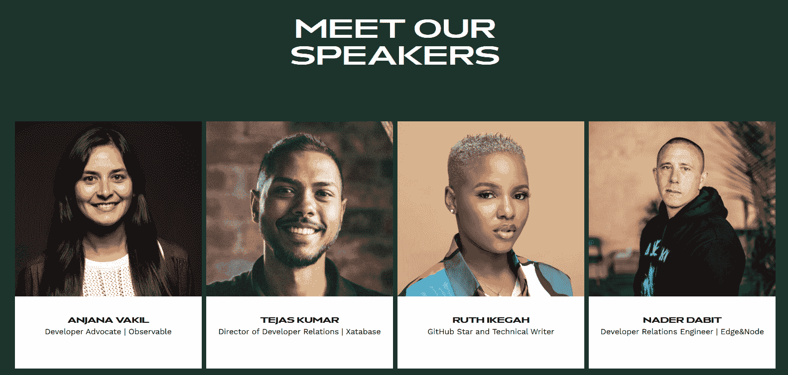

# 开源非洲:OSCA 如何赋能开发者

> 原文：<https://thenewstack.io/open-source-africa-how-osca-empowers-developers/>

尼日利亚开发者 [Samson Goddy](https://samsongoddy.com/#about) 是一名面向社区的开源倡导者，根据[在其个人网站](https://samsongoddy.com/#about)上的传记，他“相信以自己的方式改变世界”。他领导了非洲政府的技术项目，并为其提供咨询——他还维护着作为“每个孩子一台笔记本电脑”项目的一部分而开发的“T4 糖桌面”界面。

Goddy 本人在小学就体验到了“一童一机”计划的威力——这激发了他对开源软件的终生热情。因此，在 2018 年，Goddy 共同创立了开源社区非洲，他在自己的网页上将其描述为一个项目，以“反映我对开源的热爱，同时建立大型项目，帮助非洲萌芽的开源社区。”

通过分会聚会和一年一度的节日，该组织五年来一直鼓励来自非洲的开源软件贡献。因此，上个月在伦敦的“ [State of Open Con 23](https://stateofopencon.com/) ”会议上，Goddy 分享了他自己的旅程中的故事——以及整个非洲更大的开源运动中的故事。

## 非洲制造

Goddy 告诉他的观众，虽然有 12.16 亿人生活在这片大陆上，超过世界人口的 15%，但非洲经常被忽视。从谷歌开发者团队 Lagos 到其他与微软、GitHub 和 Meta 相关的社区，“有一个非常庞大的开发者社区已经在非洲大陆活动了很多年了。”

他利用他们的存在来强调开源社区非洲的使命。“我们不是来创造新的东西，而是来形成一种声音……”

Goddy 向他的观众推荐了一个 GitHub 项目集，名为 [Made in Africa](https://github.com/collections/made-in-africa) ，其中包含了 200 多个来自尼日利亚的项目，Goddy 将其描述为“不仅是为了社会公益，也是公司依赖的项目——这非常酷。”

尼日利亚拥有 2.18 亿人口，是世界上第七大人口大国。(埃塞俄比亚、埃及和刚果民主共和国分别排在第 13、14 和 15 位，它们的人口都超过 9900 万。)然而，Goddy 记得参加了 2017 年的谷歌代码导师夏季峰会——并注意到来自非洲的人数“有点低”

Goddy 与非洲项目维护者进行了交谈，并很快了解到他们的挑战不仅包括资金，还包括旅行的困难，“甚至包括获得签证，这是旅行时最常见的话题之一。”

Goddy 笑着说“我可能是这里最累的人——因为我花了大约四个小时才通过移民检查！”

因此，在 2018 年，Goddy 获得了政府资助，在他自己的大陆上举办了第一次基于大学的活动[开源社区非洲](https://oscafrica.org/) (OSCA)。这个想法是创建一个专门面向非洲开发者和开源爱好者的用户组。

“我想说的是，我们最终没有创造出下一个大型开发者社区。相反，我们所做的是确定这些社区在做什么。而且说实话，有很多！"

GitHub、微软和谷歌都在当地大学开设了专门的项目，“所以大学里已经有了很多项目，我们也和大学进行了很多合作，”Goddy 说。

从[谷歌开发者团队 Lagos](https://gdg.community.dev/gdg-lagos/) 到与微软、GitHub 和 Meta 相关的社区，“有一个非常庞大的开发者社区已经在非洲大陆活动了很多年了。”Goddy 拿出一张地图，上面显示了 OSCA 在非洲各地的 54 个分会。

“你可以看到西非的很多地方，”Goddy 说，因为住在尼日利亚，“我和我所有的朋友去那里旅行都很容易。但我们的目标是扩张，尤其是在欧洲大陆的北部。”

后来，Goddy 打趣说，“我敢肯定，在某个地方，尤其是在北非，可能有六个我不知道的 OSCA 版本。

非洲大陆带来了自己独特的挑战。非洲有许多不同的语言、文化和思维方式——穿越非洲大陆的旅行费用很高。“有时候，即使拿到签证也有点可笑——仅仅是在成员国之间旅行。”此外，非洲还有许多不同的货币，很难将资金从一个国家转移到另一个国家。“这是欧洲大陆有很多金融科技公司的一个原因，”Goddy 补充道。

那么 Goddy 如何让公司和个人在经济上支持开源社区非洲变得容易——即使是在不同国家之间？在 2018 年的一次会议后，情况有所改善，Goddy 在会上遇到了开源集体的一名贡献者，该组织提供了使捐款更容易收集的基础设施。另一条捷径是与现有组织合作。到 2020 年，OSCA 正与“她编码非洲”合作一个开源导师项目，该项目包括 100 名女性。OSCA 与脸书的开发者圈项目合作，发起了一项开源沉浸式项目。

“我们实际上并不关注数字或扩张，”Goddy 告诉他的观众。“相反，我们关注的是*的影响。*“它的社区活动从地方分会开始，“在那里，我们让你所在城市的人们能够建立对话、项目，并举办活动或小型聚会。”

该团体的旗舰社区活动是[一年一度的节日](https://festival.oscafrica.org/)。“我们的目标是将这个节日作为一个大型活动，人们来这里，我们分享我们每年打算做什么的计划”——这是一个更有意识地了解新兴趋势和宣传即将举行的活动的机会。

第一次于 2020 年在尼日利亚拉各斯举行，吸引了来自五个国家的 1000 多人，包括来自 15 个不同地方分会的领导人。大约 10%的与会者来自另一个大陆的非洲。但是这个节日还有另一个重要的目标:不仅仅是建立关系网，而是建立职业生涯。

许多非洲公司仍然要求有 10 年工作经验的开发人员——因此吸引非洲大陆以外的公司可以帮助开创事业。“我们将电影节作为一种策略，吸引公司前来赞助，当然也让他们能够与人才交流。”

它对其成员的生活产生了真正的影响。2021 年，OSCA 与 Meta——开源挑战——进行了为期一个月的合作，具体目标是从非洲获得更多贡献。“一天结束时，招聘人员找到了一群人，让他们来脸书工作。”

该节日跳过了 2021 年的版本——但去年它以混合形式回归，到 2022 年，你可以看到一个繁荣社区的所有景象和声音。该节日现在吸引了来自 9 个不同国家的 1400 多名成员，包括来自 54 个地方分会的领导人。有 92 位不同的演讲者和 96 场会议，涵盖了从[区块链](https://oscafest22.sched.com/event/yVmh/a-primer-on-understanding-blockchain-data?iframe=yes&w=100%&sidebar=yes&bg=no)T2 技术到[计算机视觉](https://oscafest22.sched.com/event/yVnU/image-classification-with-computer-vision-and-google-colab?iframe=no&w=100%&sidebar=yes&bg=no)，从[无服务器容器](https://oscafest22.sched.com/event/ywuG/rethinking-serverless-containers?iframe=yes&w=100%&sidebar=yes&bg=no)到[版本控制](https://oscafest22.sched.com/event/yVnv/open-source-101-version-control-with-git-and-github?iframe=yes&w=100%&sidebar=yes&bg=no)的一切。

甚至有一个关于 Linux 内核的[会议。](https://oscafest22.sched.com/event/yVmt/contributing-to-the-linux-kernel?iframe=no&w=100%&sidebar=yes&bg=no)

OSCAfrica 2022 大会发言人页面截图。

但最重要的是，该集团能够与一些公司合作，赞助差旅费用。OSCA 还举办了一场只有受邀者才能参加的[支持非洲](https://festival.oscafrica.org/sustain-africa/)活动，旨在支持开源项目的维护者，以互动案例研究为特色。

他们现在希望在 2023 年举办更多的黑客马拉松。“我认为在接下来的两到三周内，肯尼亚将会发生一些事情，我们将在那里接待多达 100 人。”但除此之外，在过去的三年里，他们与一些组织合作，创建了特殊的奖金项目和付费项目——他们已经在与一些组织讨论建立更多的项目。

他们希望在 6 月 22 日至 24 日在拉格斯举行的下一届 OSCA 音乐节上实现最大的赏金计划，预计将有 3000 人参加。“一旦我们解决了一些问题，我们希望在其他非洲国家推广这种做法。”

Goddy 希望，随着这种扩张，整个大陆的开源开发者将发出更响亮、更统一的声音。

<svg xmlns:xlink="http://www.w3.org/1999/xlink" viewBox="0 0 68 31" version="1.1"><title>Group</title> <desc>Created with Sketch.</desc></svg>