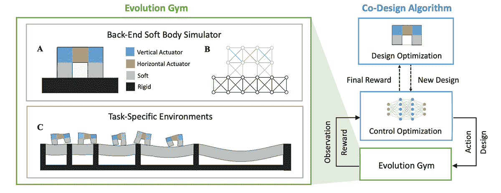
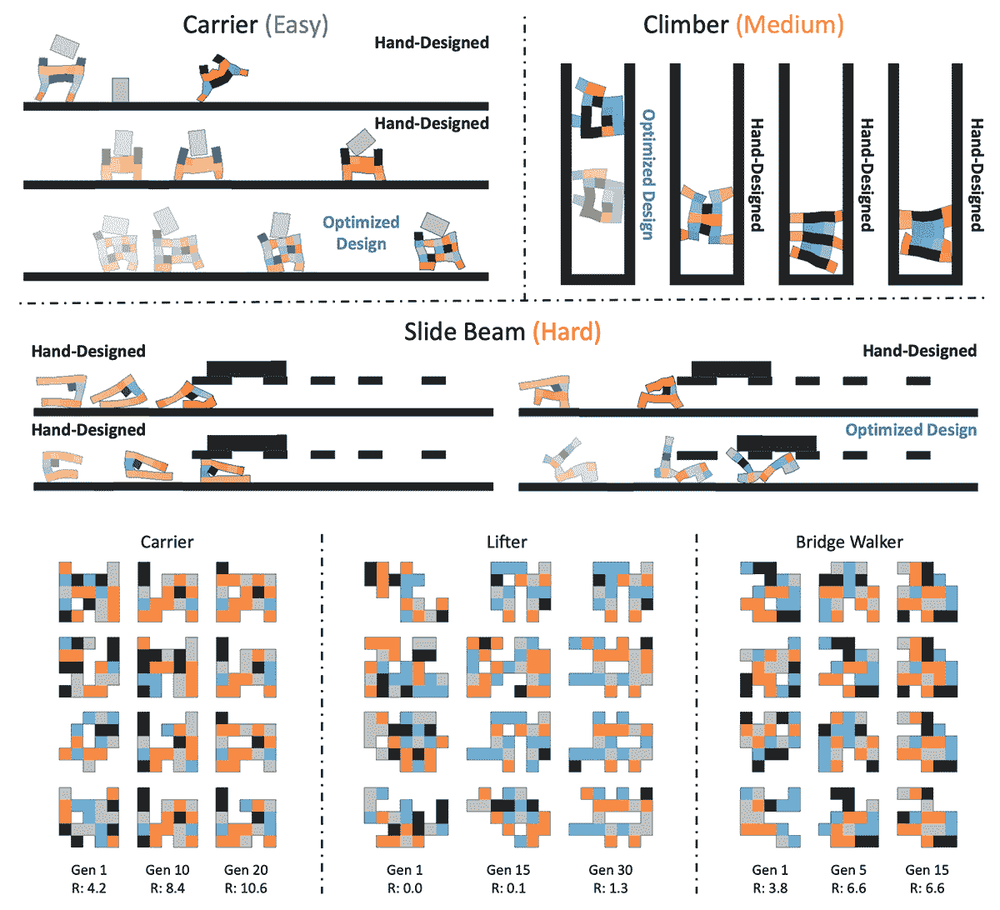

# 开源人工智能“健身房”帮助机器人进化

> 原文：<https://thenewstack.io/open-source-ai-gym-helps-robots-evolve/>

虽然我们熟悉生物进化的概念，但机器“进化”的概念可能不那么熟悉。但是机器人专家经常试图寻找新的方法来优化他们的机器人设计；然而，更多的时候，它是以一种零碎的方式发生的，研究人员要么改进机器人的机械身体，要么改进他们的“大脑”，也称为控制器。很少同时优化这两者是简单的，或者以一种[自动化的方式](https://thenewstack.io/mit-machine-learning-uses-graph-grammar-to-automate-and-optimize-robot-design/)。

但这一差距可能很快就会被填补，这要归功于麻省理工学院[计算机科学和人工智能实验室](https://www.csail.mit.edu/) (CSAIL)的一组研究人员，他们现在提出了一个简单的开源平台，使用人工智能算法来优化机器人的大脑和身体。这种同时优化的方法也称为“协同设计”虽然已经有一些现有的机器人协同设计软件，但它们通常需要大量的时间和计算资源。

相比之下，麻省理工学院团队的平台[进化健身房](https://evolutiongym.github.io/)，旨在为其他研究人员提供一种简单的方法来共同优化机器人的身体结构和控制器，此外还提供一种以标准化方式测试它们的方法。

“虽然最优控制在机器学习和机器人社区得到了很好的研究，但人们对寻找最优机器人设计的关注较少，”该团队在他们的论文中写道，该论文最近在关于神经信息处理系统的[会议上发表](https://nips.cc/)。“这主要是因为机器人技术中的协同优化设计和控制被定性为一个具有挑战性的问题，更重要的是，协同优化的综合评估基准并不存在。Evolution Gym(是)首个协同优化软体机器人设计和控制的大型基准。”

## 机器进化的世代

Evolution Gym 系统本质上是一个简单快速的模拟器，它使用“体素”库或机器人组件(可能是软的、刚性的或水平和垂直的致动器)来生成不同类型的软机器人。在 Evolution Gym 的二维界面中，这些模拟组件以不同的彩色方块组合来表示，每个方块代表不同类型的体素。这些组件以不同的布局组织，使用不同的算法来自动确定手头任务的最佳设计。

然后，这些模拟的软机器人将在 30 个基准环境中接受测试，看看它们在各种类型的地形、运动或操纵中的表现如何。例如，根据地形或所需运动的类型，任务可能被评为“容易”、“中等”或“困难”——在平坦的表面上行走将被评为“容易”而在相同的平面上和横梁下滑动会被认为是“硬的”

该团队的方法不是设计和调整单个机器人，而是通过利用人工智能算法来模拟生物进化，以生成连续的机器人种群，每个机器人都有略微不同的设计，然后在这些基准环境中进行测试。特别是，该团队的方法使用了两个相互依赖的优化级别——一个级别或“外环”,涉及一种进化机器人物理结构的设计优化方法，以及一种“内环”,针对特定的结构设计优化机器人的控制器。

“我们通过结合最先进的设计优化方法和深度强化学习技术，开发了几个机器人协同进化算法，”该团队解释道。“在我们的基准平台上评估算法，我们[观察到]随着进化的进行，机器人表现出越来越复杂的行为，最佳进化设计解决了我们提出的许多任务。”

对于设计优化循环，团队使用了各种途径，如遗传算法(GA)、贝叶斯优化(BO)和组合模式生成网络(CPPN)。对于用于训练机器人控制器的控制优化循环，该团队应用了一种被称为近似策略优化(PPO)的强化学习(RL)算法。

通过使设计优化和控制优化的算法协同工作，出现了一种进化过程，其中设计优化器可以为控制优化器生成新机器人的结构，然后控制优化器将在与进化健身房的一些交互之后为新结构产生控制器，定制以确保这种新一代机器人将在它将经受的任何基准测试中获得最大回报。成功执行任务并获得最大回报的机器人的设计方面将在后续世代中得到保留、重复和改进，从而自动进化以保留其最大优势。

与人类创造的机器人相比，通过算法设计的机器人通常比手工设计的机器人表现得更好，该系统提出了任何人都无法想象的复杂设计，以及一些本质上非常像动物的设计，尽管它没有关于动物世界的信息。然而，有些任务太难了，人类和机器制造的机器人都无法完成。

“实验结果表明，智能机器人设计可以完全自主地进化，同时在更简单的任务中胜过手工设计的机器人，这再次证明了联合优化机器人结构和控制的必要性，”该团队说。“然而，没有一种基线算法能够在我们最艰难的环境中成功找到完成任务的机器人。现有算法的这种不足表明了对更先进的机器人协同设计技术的需求，我们相信我们提出的 Evolution Gym 为机器人协同设计提供了一个全面的评估试验台，并开启了该方向的未来研究。”

最终，研究人员希望这个新生的研究领域能够通过将这个简单但通用的平台开源并让每个人都可以访问来进一步发展。通过提供一个全面的平台，机器人设计可以根据标准基准生成和测试，开发优化的机器人将成为该学科更广泛领域的一项更容易的任务，而不是只能由拥有最多资源的人解决的不可逾越的挑战。

“通过这种方式，Evolution Gym 为共同设计算法提供了一个易于使用的平台，以进化机器人的结构和控制，优化机器人的任务性能，”该团队指出 Evolution Gym 旨在成为第一个全面的测试平台，用于对不同的协同设计算法进行基准测试和比较，以期促进协同设计领域中更新颖、更强大的算法的开发。"

在[论文](https://papers.nips.cc/paper/2021/file/118921efba23fc329e6560b27861f0c2-Paper.pdf)中了解更多，在 [GitHub](https://evolutiongym.github.io/) 上下载代码。

图片:麻省理工学院 CSAIL

[https://www.youtube.com/embed/VWivmi9j608?feature=oembed](https://www.youtube.com/embed/VWivmi9j608?feature=oembed)

视频

<svg xmlns:xlink="http://www.w3.org/1999/xlink" viewBox="0 0 68 31" version="1.1"><title>Group</title> <desc>Created with Sketch.</desc></svg>