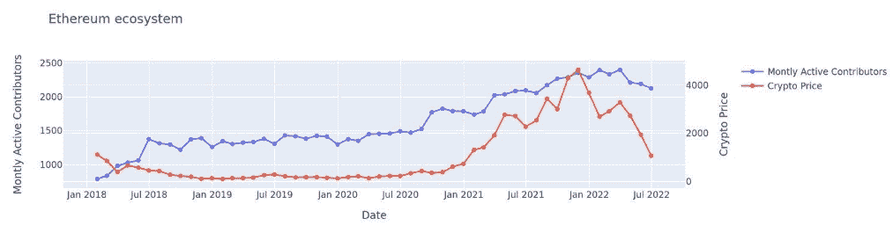

# 尽管资金削减，开源区块链发展强劲

> 原文：<https://thenewstack.io/open-source-blockchain-development-strong-despite-funding-cuts/>

如果你只关注头条新闻，2022 年的 Web3 空间看起来相当可怕。2021 年上半年与今年上半年相比，Web3 公司的融资额同比下降了 25.6%。加密货币的估值下降了 80%。另一方面，根据本周由 [Telstra Ventures](https://telstraventures.com/people/) 数据科学团队发布的[研究](https://telstraventures.com/blockchain-may-be-down-but-it-is-not-out/)，开源 Web3 项目仍然发展强劲。

## 开发者贡献研究方法

Telstra Ventures 的研究分析了 1000 个活跃的组织，它们为 GitHub 上的 30，000 多个比特币、以太坊和 Solana 开源项目做出了贡献，这些项目由 Electric Capital 在 2021 年底建立的[加密生态系统分类法](https://github.com/electric-capital/crypto-ecosystems)定义，以及加密货币项目和令牌聚合器确定的项目。

到 2022 年 7 月，Telstra Ventures 将项目限制在相关 GitHub 知识库中至少有 100 颗星和活跃贡献的项目。在接受 New Stack 采访时，Telstra Ventures 的数据科学主管 Jonathan Serfaty 表示:“我们从组织的角度来看待贡献者。例如，我们查看了保存以太坊项目的特定存储库。我们调查了以太坊组织的贡献者。我们研究了以太坊生态系统，其中包括所有与 EVM 兼容的周边项目。”Telstra Ventures 计划定期重新运行该报告，以继续监控 Web3 开源社区的健康状况。

## Telstra Ventures 研究的发现

我问塞尔法蒂，这项研究的数据中是否有令人惊讶的地方。他说，“有一个非常核心的开发者群体，即使在过去的衰退中，这个核心群体仍然继续积极建设他们相信的项目，不管加密货币市场在做什么。”

该研究表明，从 2018 年 1 月 1 日开始，以太坊在过去 4 年的市场波动中以 24.9%的复合年增长率增长，如下图所示。你可能还会注意到，尽管价格大幅波动，以太坊开发者的贡献比 2021 年 7 月略有上升。

Telstra Ventures 的普通合伙人 Yash Patel 说:“当你想到传统的股票市场和加密价格，它们比一年前下降了 70%或更多。我们对继续开发的开发者感兴趣。与你在金融领域看到的价格投机相比，捐款下降相对较小，这让我们感到欣慰。”

我发现有趣的一件事是跨越比特币、以太坊和索拉纳的开发者生态系统的整体规模。就积极参与项目的开发人员而言，以太坊仍然是最大的区块链，大约有 2100 名活跃的开发人员。区块链衡量的最成熟的比特币有大约 400 名开发者积极参与项目，而截至 7 月底，Solana 的活跃贡献者略少于 300 人。

一定要阅读完整的 [Telstra Ventures 关于比特币、以太坊和 Solana 的研究](https://telstraventures.com/blockchain-may-be-down-but-it-is-not-out/)。如果你对其他区块链的开发者活动感到好奇，电之都[生态系统浏览器](https://electric-capital.github.io/)包括一套更广泛的区块链和协议，在 3845 个生态系统中跟踪 96，436 个存储库。

<svg xmlns:xlink="http://www.w3.org/1999/xlink" viewBox="0 0 68 31" version="1.1"><title>Group</title> <desc>Created with Sketch.</desc></svg>