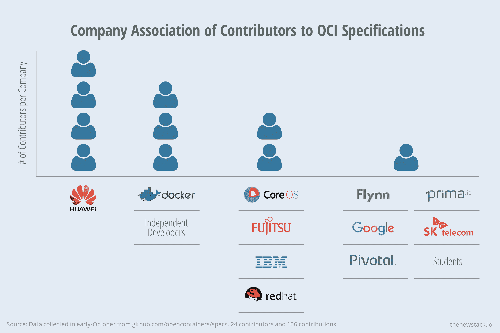
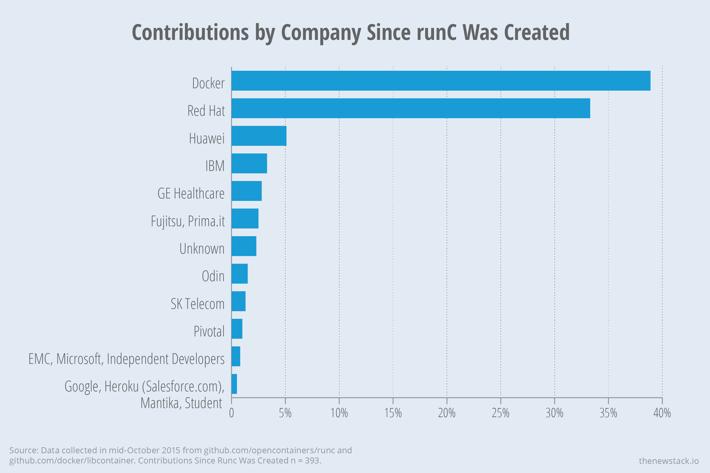

# 开源社区如何推动 Docker 和容器生态系统

> 原文：<https://thenewstack.io/open-source-communities-define-docker-container-ecosystem/>

随着系统变得越来越复杂，需要不断的适应、改变和更新，专有技术的经济性变得越来越不可行。专有软件和系统越来越不如开源软件和系统健壮。码头和集装箱生态系统代表了这一新的市场现实。

随着许多与容器相关的项目进入企业生产用途，许多开源社区正在受到 IBM、Intel 和 Google 等供应商以及 Goldman Sachs 等大客户的影响，这些大客户正在创建和支持强大的新开源基金会。这些基金会反映了新一代商业风格的开源社区，由专业组织领导，如 [Linux 基金会](http://www.linuxfoundation.org/)，它现在运行[开放容器倡议](https://www.opencontainers.org/)、[云本地计算基金会](https://cncf.io/)和[云铸造基金会](https://www.cloudfoundry.org/)。

创建于 2015 年 6 月的[开放容器倡议(OCI)](http://opencontainers.org/) 是一个针对容器的开放规范和运行时。OCI 为最终用户提供了整体市场如何发展、提供商的技术差异以及以应用为中心的基础架构的过去和未来的背景。

OCI 的根源可以追溯到 Docker 及其 libcontainer 技术的发展。libcontainer 格式使得 Docker 朝着一个更少以 Linux 为中心，更多以 Docker 为中心的设计方向发展。具体来说，它脱离了 systemd，这是 Linux 内核的关键启动组件。按照 LXC 的设计，systemd 是负责以操作系统可以管理的方式启动和维护容器进程的守护进程。

作为 OCI 的一部分，Docker 向该计划捐赠了 libcontainer。总体目标是确保系统和利用容器的代码之间的兼容性，从而解放下一代工程师，使他们专注于价值链更高端的创新。

在这种背景下，定义公司的界限变得更好理解，并在 OCI 的数据分析中得到例证，以及它与仍在兴起的云原生计算基金会(CNCF)的差异。CNCF 是最新的开源项目，由谷歌发起，由思科、Docker、IBM、Mesosphere、Joyent 和生态系统中试图标准化调度和编排功能的许多其他公司加入。

通过回顾 GitHub 的活动统计数据，新的堆栈发现在创建规范的紧密结合的团队中有重要的活动和行业合作。对于从 libcontainer 迁移而来的实际底层运行时代码(runC ),已经有了强大的参与。

作为背景，CoreOS 去年秋天宣布了 rkt，这是 CoreOS 为其 Rocket 运行时系统开发的规范。在今年春天的 CoreOSFest 上，该公司宣布了 App Container (appc)，这是它自己基于 rkt 技术的开源项目。谷歌、VMware、红帽、混合云操作系统制造商 Apcera 和一个聚集的行业合作伙伴联盟支持 appc。

[cyclone slider id = " ebook-1-赞助商-2 "]

CoreOs 得到了谷歌风投的资助。此外，CoreOS 技术与 Google 的开源容器管理平台 Kubernetes 深度集成。就谷歌而言，它正专注于最近宣布的[云本地计算基金会](https://cncf.io/)，该基金会强调容器管理。

Docker，毫无疑问，[与 CoreOS 和 Google 都有竞争](http://www.forbes.com/sites/paulmiller/2015/07/21/container-competitors-google-coreos-joyent-and-docker-join-new-linux-club-as-kubernetes-turns-one/)。他们还相互合作，这反映了这个快速变化的应用程序开发和大规模管理世界的细微差别，因为没有一个通用的解决方案。

## **规范和谁在领导这个项目**

OCI 最初的技术领导层包括来自 Docker、Red Hat、CoreOS、Google 的代表，以及一家名为 [InfoSiftr](http://www.infosiftr.com/) 的公司的独立开发者。现在项目已经运行了几个月，我们可以看到谁真正参与了规范的开发，这就是这个项目真正的力量所在。我们发现 [opencontainers/specs](https://github.com/opencontainers/specs) 库有 24 个贡献者，其中大部分来自华为、Docker、Red Hat、IBM、富士通和 CoreOS。

对 OCI 规范贡献最大的公司是华为、Docker、Red Hat、IBM、富士通和 CoreOS。

值得注意的是，appc 规范的前三名贡献者——CoreOS 的 Jonathan Boulle 和 Brandon Philips 以及 Red Hat 的 Vincent Batts——正在积极地为 OCI 的规范做出贡献。没有这些领导人的支持，自从 OCI 宣布后， [appc](https://github.com/appc/) 项目的活动已经大大减缓。

随着规范的不断成熟，需要注意的是它们的发展对于保持一些公司的参与是多么重要。例如，CoreOS [刚刚发布了基于 appc 的 rkt 的更新版本](https://coreos.com/blog/rkt-0.8-with-new-vm-support/)，然而在未来它计划发布基于 OCI 规范的相同运行时。

如果 OCI 要取得成功，它至少需要像 CoreOS 这样的公司使用一致同意的标准，这将允许它继续开发自己的运行时，同时确保与 Dockerfiles 构建的应用程序的互操作性。有趣的是，CoreOS 仍然对 OCI 的成功两面下注。尽管 CoreOS 的员工大量参与了规范的制定，但是他们并没有为 runC 库做出贡献。

## **参与 runC**

虽然规范是 OCI 的核心，但 Docker 捐赠的 libcontainer 是开发人员目前正在使用的实际内容。与 libcontainer 中完成的工作相比，runC 的 GitHub 活动水平实际上有所提高，自从 libcontainer 迁移到 runC 以来，存储库中有 24%的贡献发生了。

自 OCI 宣布以来，新的贡献者也有所增加，在过去两个月里，127 个贡献者中有 29 个加入。然而，值得注意的是，大部分贡献来自 Docker 和 Red Hat 员工。CoreOS 没有出现在投稿公司的名单中。同样值得注意的是，Google 只占了两个贡献(占总数的 0.5%)，而它在最初的 libcontainer 存储库中占了 18%。

贡献最大的 OCI 成员是 Docker、Red Hat、华为和 IBM。

## **哪些 OCI 成员正在出资**

我们的最后一点分析是比较贡献 runC 的公司和 OCI 的实际会员名册。我们发现，OCI 一半的成员公司仍然没有一名员工为该项目做出贡献。

缺乏参与意味着什么？当然，一个公司可以采用或支持标准，而不必对一个开源项目做出实际贡献。如果是这样的话，那么通过创建一个每个人都可以建立的标准，OCI 将至少完成其使命的一部分。

但是它确实说明了在商业技术提供商的参与下，开源项目会变成更大的组织。差距扩大了。大公司贡献了大部分，而较小的供应商只占总数的很小一部分。

Apcera、Cisco、CoreOS、Docker、IBM、Intel、Pivotal、Red Hat 和 VMware 是新堆栈的赞助商。

<svg xmlns:xlink="http://www.w3.org/1999/xlink" viewBox="0 0 68 31" version="1.1"><title>Group</title> <desc>Created with Sketch.</desc></svg>