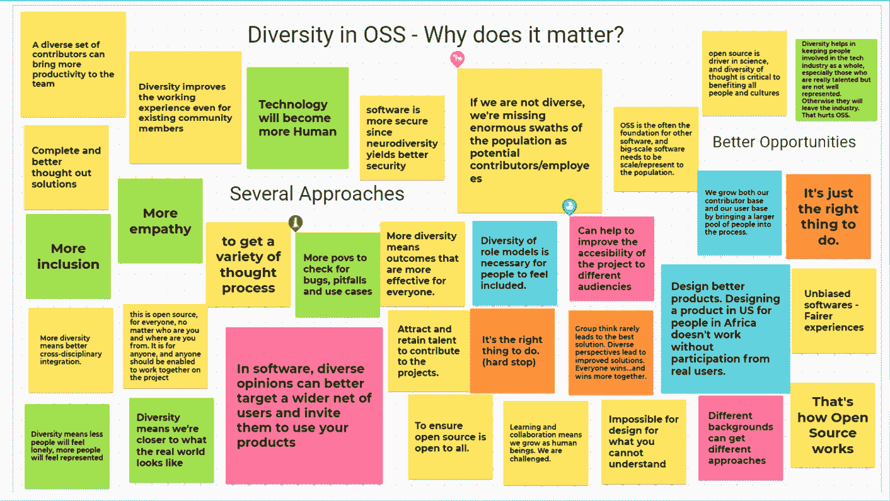
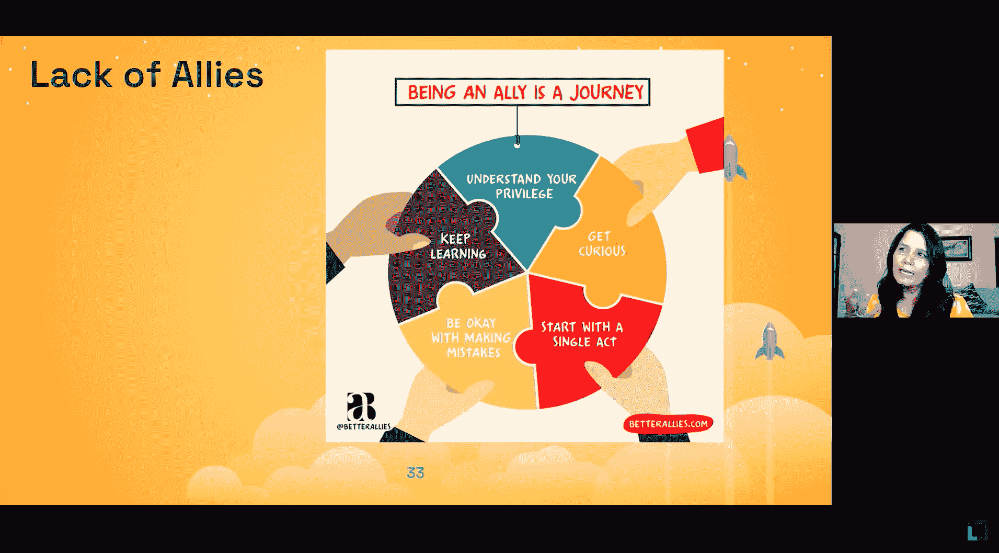
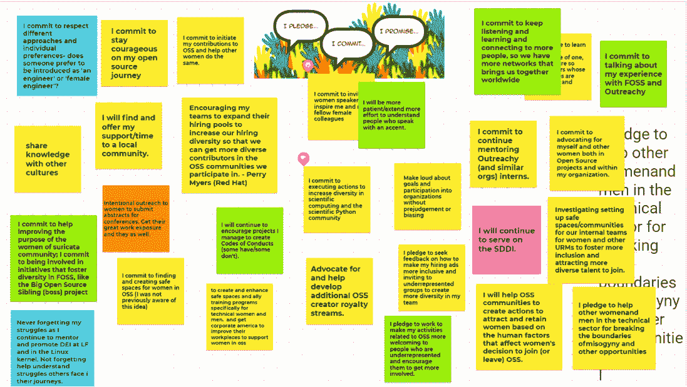

# 开源社区需要更多的安全空间和行为准则。现在。

> 原文：<https://thenewstack.io/open-source-communities-need-more-safe-spaces-and-codes-of-conducts-now/>

我们知道有无数的理由来招募和保留更加多元化的团队，包括[多元化的团队被证明更聪明](https://hbr.org/2016/11/why-diverse-teams-are-smarter?)，更有生产力，更有创新性。此外，建立一个多元化的团队可以让产品真正由他们的目标用户制造出来。

然而，尽管女性占美国劳动力的一半，在科技行业中仍占可耻的 20%，但她们在开源社区中的比例不到 3%。正如田纳西大学副教授[万达纳·辛格](http://sis.utk.edu/vandana)在最近的 Linux 基金会[在线讨论](https://www.linuxfoundation.org/webinars/time-for-disrupting-the-status-quo-diversity-in-open-source-software/)中指出的，这必须改变。

在过去的几年里，已经有了一致的努力——和充足的资金——来增加开源中所有的多样性、公平和包容性的定义。但是他们没能移动针头。研究开源社区超过 20 年的 Singh 已经揭示了这些 DEI 努力失败的一些原因，以及什么可以帮助阻止这种不受欢迎的趋势。

## 自我实现的预言

对开源软件(OSS)的贡献有明确的动机，从学习新的技术技能到获得核心技能的经验，比如管理软件团队。开放源码软件可以为建立关系网和寻找新工作提供极好的机会。这是少有的情况之一——如果你在为一个开放的公共项目做贡献——你可以得到代码和经验的证明。

然而 20 多年来，这可怜的 3%一直停滞不前。为什么？

部分原因是工作的性质——为开源项目做贡献通常是无偿的志愿者工作。那些在科技行业中代表性不足的人，包括女性，已经承担了大部分的无酬照护工作，所以没有时间去接受免费服务。每一种不平等在 2020 年都被放大了，除了其他事情之外，[根据 TrustRadius 的报告](https://www.womenintech.co.uk/3-ways-the-pandemic-has-impacted-women-in-tech)，疫情认为技术行业的女性被解雇或休假的可能性是男性的 1.6 倍，而感到育儿负担更重的可能性是男性的 1.5 倍。

对于一小部分 OSS 贡献者来说，他们的贡献实际上是有报酬的，他们通常为赞助项目的企业或非营利组织工作，通常是有自己的多样性问题的大实体。

但不仅仅如此。

辛格的研究特别引用了轶事和实证研究的结合，显示了“妇女和代表性不足的少数民族的敌意、歧视和掠夺经历。”

持续缺乏各种形式的多样性成为一个自我实现的预言:缺乏多样性导致更多的骚扰，从而导致持续缺乏多样性。对绝大多数女性来说，科技行业仍然是有毒的。

这意味着，用辛格的话说，“我们正在创造，而不是延续社会不平等。因此，这些社区中的人们错过了参与 OSS 的这些好处和机会。”

## 骚扰猖獗

2019 年，一群女性竞选了[开源倡议](https://opensource.org/)的董事会，这是一个强大的开源软件实体，以批准开源许可而闻名。这些候选人都受到骚扰——大多是匿名的——被认为是对社区的“威胁”。

他们并不孤单。有一个记录在案的模式，所有级别的女性开源贡献者都很容易成为骚扰的目标。这不仅促使女性以比整个科技行业更高的速度离开开源软件，而且还从根本上阻碍了她们的参与。

辛格的研究试图揭露 OSS 社区的“坏名声”

首先，她致力于反驳那些认为这些故事只是轶事证据的观点，她的目标是生成和检验能够并且已经发表在学术软件期刊上的经验证据。[辛格的研究](https://sis.utk.edu/vandana/women-in-oss)，其中大部分发表于 2020 年底，是自 GitHub 在其 2017 [开源调查](https://opensourcesurvey.org/2017/)中触及开源多样性以来，新堆栈发现的第一个关于开源多样性的实证工作。

值得注意的是，Singh 的调查和采访对象是那些自称为积极为开源项目做出贡献的女性，这个群体不包括被技术行业边缘化的其他群体或前 OSS 项目贡献者。

她的研究得出的第一个关键结论是，所有女性都感受到了开源项目中性别稀缺的影响，所有女性贡献者都感到孤立。

“被孤立的感觉不仅仅是‘我是唯一的一个’，还包括‘我在房间里，作为唯一的一个，然后我被要求代表世界各地的所有女性，’”辛格说，他指的是一种合乎逻辑的商业需求，即更多的代表性以及想法和经历的多样性。

她还发现有证据表明，一些女性在投稿中特意隐瞒了自己的身份、性别和种族。这意味着他们甚至不能用他们的贡献作为工作的证明。

辛格分享了一则轶事，转述了她和大学伦理研究委员会收到的对她第一次调查的回复邮件。

她说，受访者写道:“在你的调查中，你问我贡献了什么产品，我来自哪个国家，把这两者放在一起，任何人都可以认出我，因为我是我的国家中唯一一个在该产品中同时是女性的人。”

## 没有犯错的余地

Singh 研究的大多数开源参与者也提到了他们对 OSS 的第一次体验，这看起来很关键。热情、乐于助人的导师和 Singh 所称的“安全空间”(如黑客马拉松)的结合，是使这一入职培训成功并使参与者有可能继续从事 OSS 项目的关键。

辛格说，女性也一贯认为她们需要不断证明自己。这意味着他们觉得没有犯错的余地，并经常做额外的工作来证明他们的参与。

“一位女士分享的例子是‘如果我写了一个补丁，那么我就写了一个完整的丢失列表’，这就是我所知道的。这就是我这么做的原因。“这就是我认为它有效的原因，”研究人员说。因为，如果一个男人发布了它，他只会说‘这是补丁，它会工作的。’"

她的研究的另一个令人惊讶的结果是[有多少女性甚至在做出第一次贡献之前就考虑了行为准则。他们寻找:](https://www.springerprofessional.de/en/codes-of-conduct-in-open-source-software-for-warm-and-fuzzy-feel/18912452)

*   无论它是指多样性
*   它是否概述了如何解决问题

考虑到这一点，辛格的下一个研究项目侧重于培养这些安全空间和优化行为准则。

## 寻找支持，网上骚扰

辛格接着对 350 个开源、以女性为中心的在线“安全空间”进行了网站内容分析。这是一个不同种类的邮件列表服务、互联网中继聊天、博客、Twitter 页面和论坛的混合体。这些社区的共同目标包括:

*   展示开源女性的成功故事
*   将导师与学员联系起来
*   合作的机会
*   活动组织
*   教育机会
*   社会支持

然后，她放大了五个论坛的内容分析，这些论坛有 10，698 条信息和 1，344 名参与者，回溯到 18 年前，寻找女性相互支持的方式。

辛格很快意识到，这些论坛是社会、情感、信息和技术支持的安全空间:“它们通过分享经验、专业知识和机会，帮助彼此在充满敌意的开放源码软件环境中取得成功。”

在所有被调查的论坛中，关于挫折和敌意的讨论都很普遍，因此辛格关注于这种支持是如何帮助改善那些经历的，并确定这些空间正是这样实现的。

最后，Singh 分享了她即将发表的关于开源项目论坛中歧视和敌意的部分研究。开源社区是分布式的和自愿的，所以他们经常没有被很好的监控。在这些论坛上，研究人员发现对女性的骚扰很普遍，从轻微的侵犯到强奸和死亡的威胁。无孔不入的行为导致女性一起抛弃开源。

辛格即将发表的研究遭到了同行评议者的反对，她说:“这项研究只关注厌女症、骚扰和歧视，这是一颗难以下咽的药丸。”她补充说，她可能会选择自行发表，放弃发表荣誉以保持她的研究完整无缺。

## 行为准则有帮助吗？

研究人员还分析了行为准则(CoC)是如何编写和执行的。这是一个组织制定的一套规则或规范，它阐明了它的使命、价值观和原则，同时也概述了当行为违背它们时的后果。

她发现并不是所有的开放源码软件社区都有行为准则，或者是复制粘贴的通用准则。她发现，最成功的行为准则不是通用的，而是为受众量身定制的。

如果一个社区重视多样性，那么应该命名特定类型的多样性。( [Contributor Covenant，](https://www.contributor-covenant.org/version/2/0/code_of_conduct/)是开源社区流行的行为准则，以其包容性的语言而闻名。)

辛格说，但是 CoC 仍然只是一纸空文，除非问责制和强制执行被纳入其中:当报告违反行为时，谁将采取行动，他们何时采取行动，他们将做什么？

“有一个关键的指标需要执行:我们看到你，我们重视你，我们不容忍 XYZ，”她说。

2021 年上半年，从[自由软件基金会让理查德·斯托尔曼重返董事会的有争议的决定，](https://thenewstack.io/why-almost-everyone-wants-richard-stallman-cancelled/)到 Basecamp 最近的员工流失，这更加明显地表明，一个坚实的 CoC 必须包括如果管理机构中有人违反规范会发生什么。

## OSS 多样性从测量一切开始

Singh 说，一些开源社区正在努力招募和保留更多样化的成员，让他们有归属感。她核对了姓名:

那么，当如此多的开源组织都做不到的时候，是什么让这些工作呢？我们可以在哪些方面帮助他们取得成功？我们如何让每个人都有公平的机会，增加公平？

辛格说:我们必须找到适合不同人群的解决方案。“这必须是迭代解决问题。DEI 不是一种大爆炸式的方法，在这种方法中，我们可以只做一件大事，然后完成它。事情不是这样的。我们必须坚持我们的承诺，我们必须不断改进。”

作为一个小组，Singh 的 livestream 活动的参与者定义了要监控的 DEI 维度。尽可能选择用于诊断的指标，包括代表性、招聘、保留和薪酬。研究人员说，这些目标不能基于投资回报，而是基于移动指针。

辛格说，这些指标需要随着环境的变化而调整。“例如，我们将不得不应对 COVID 对人们及其生活的长期影响。远程工作情况。在家工作的人。[人们的孩子呆在家里。](https://thenewstack.io/chaos-hugs-and-interruptions-dev-folks-work-from-home-with-kids/)随着形势的变化，我们必须将这些纳入我们的多元化和包容性指标中。”

她说，一旦你建立了自己的基线，并开始衡量指针是否移动，最重要的是发布你自己的多元化报告，并重申你的承诺。因为还没有足够的研究发表在这个主题上。

辛格提供了开始的领域。其中包括:

*   在撒哈拉和萨赫勒观测站为妇女和其他边缘化人群创造和支持安全空间，包括面对面的活动。
*   创建和执行 COC。
*   允许的话，突出那些通常在技术社区中代表性不足的人的简介。
*   促进更多有意的指导和网络机会。
*   让妇女和其他代表性不足的人参与开放源码软件治理。

<svg xmlns:xlink="http://www.w3.org/1999/xlink" viewBox="0 0 68 31" version="1.1"><title>Group</title> <desc>Created with Sketch.</desc></svg>