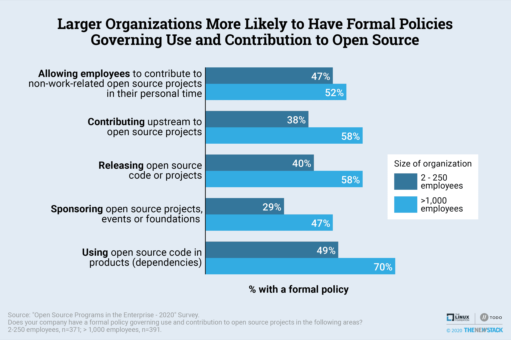

# 开源对金融科技、医疗保健和政府的贡献正在增加

> 原文：<https://thenewstack.io/open-source-contributions-on-the-rise-in-fintech-healthcare-and-government/>

Linux 基金会赞助了这篇文章。

企业对开源的使用保持稳定，新一代的[公司正在增加他们对开源社区的参与](/constructive-open-source-citizenship-produces-results/)。在金融服务、医疗保健和政府的带领下，大多数垂直行业中的更多组织定期(经常或有时)为上游项目做出贡献，在过去三年中从 42%上升到 46%。

在与 Linux 基金会的[托多集团](https://todogroup.org/)的合作下，新堆栈在 2020 年 5 月和 6 月对 1000 多名技术人员进行了第三次年度“企业中的开源程序”调查。这一多年的努力为衡量变革、增长和努力的有效性提供了坚实的基础，以指导企业开源政策和社区参与。在 GitHub 的[和本文的底部可以找到对这项研究方法的描述。](https://github.com/todogroup/survey/tree/master/2020)

关于开源使用的是/否问题越来越无关紧要；连续第二年，85%的组织在商业产品中使用开源。从开源社区的角度来看，开源在企业中的发展更好。越来越多的组织定期创建项目，并在开源项目和/或基金会之间进行合作。当协作发生在上游时特别有效——也就是说，当实际的软件开发发生在一个社区存储库中，而不是一个专注于单个供应商需求的分叉存储库中。

金融服务、医疗保健和政府都越来越多地使用开源软件。几乎一半(47%)的金融公司表示，他们定期向上游贡献代码，比去年的 29%有所上升。43%的金融参与者表示，他们的组织有开源项目或计划，高于 2019 年的 23%。数字的巨大波动部分是因为样本的变化；去年的发现被提交给了金融科技开源基金会，这是一个后来归入 Linux 基金会旗下的组织。

医疗保健(2019 年为 42%比 23%)和政府(2019 年为 40%比 24%)组织也更有可能定期为上游项目做出贡献。增加的原因可能是与新冠肺炎疫情有关的举措。然而，与其他垂直行业相比，这些垂直行业不太可能有正式的政策来管理开源的使用和贡献。例如，平均 48%的受访者表示，有一项关于员工在个人时间为与工作无关的开源项目做出贡献的正式政策，但这一数字在医疗保健群体中降至 31%。最近创建的[Linux Foundation Public Health](https://www.lfph.io)可以帮助医疗保健和政府组织采用最佳实践和政策，进一步提高参与度。

零售业在 2019 年开源参与方面的增长排名第四，但是该行业垂直领域的样本规模(18 名受访者)太小，无法得出有力的结论。在这个例子中，零售业实际上看到了他们在商业产品中使用开源软件的减少，而其他垂直行业都看到了增加。

再看一下所有的垂直行业，45%的垂直行业有管理上游贡献的正式政策，高于之前研究中的 34%。许多公司已经采用这些政策来应对预先存在的活动；过去，61%的上游缴费组织拥有保单，但这一比例在 2020 年跃升至 74%。然而，这些政策的普及比实际上游捐款增长快三倍。我们预计，正式的政策只会加快向上游项目投资的公司数量。

大型组织和那些有[开源项目办公室](https://thenewstack.io/does-your-organization-need-an-open-source-program-office/) (OSPO)的组织是最有可能用正式政策支持上游贡献的群体。希望这些公司建立的最佳实践将渗透到较小的组织，这些组织可能没有预算能力来支持甚至是解决上游贡献的非正式管理倡议。

## **方法和受访者简介**

经过筛选和数据清理，该报告基于参与调查的 1026 人，该调查由 New Stack 于 2020 年 5 月 5 日至 2020 年 6 月 15 日进行。受访者通过社交媒体和新堆栈的电子邮件列表以及调查赞助商(Linux Foundation 的 TODO Group 和 VMware)进行了征集。

*   公司规模具有广泛的代表性，24%的受访者在员工超过 10，000 人的大公司工作，37%的受访者来自员工不超过 250 人的中小型公司。
*   开发人员和软件工程师占受访者的 40%，至少另有 34%的人从事与 IT 相关的工作。
*   47%的受访者组织有正式或非正式的开源项目或管理计划，另有 17%的受访者组织正在计划这样做。

完整的数据集[可以在这里](https://github.com/todogroup/survey/tree/master/2020)找到。

VMware 是新堆栈的赞助商，并共同赞助了这项研究。

图片由 Pixabay 的 Yama Zsuzsanna Márkus 提供。

<svg xmlns:xlink="http://www.w3.org/1999/xlink" viewBox="0 0 68 31" version="1.1"><title>Group</title> <desc>Created with Sketch.</desc></svg>