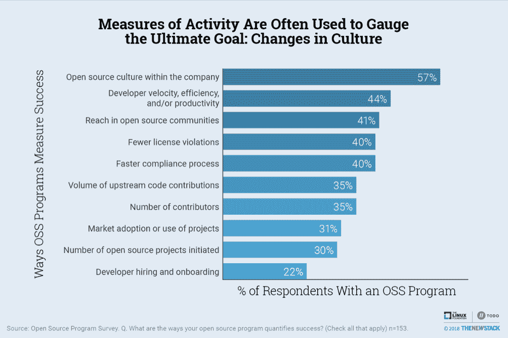
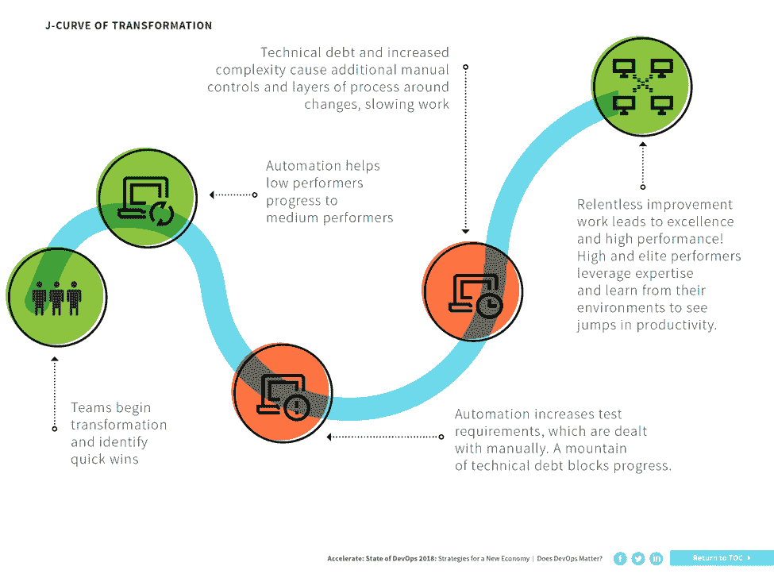
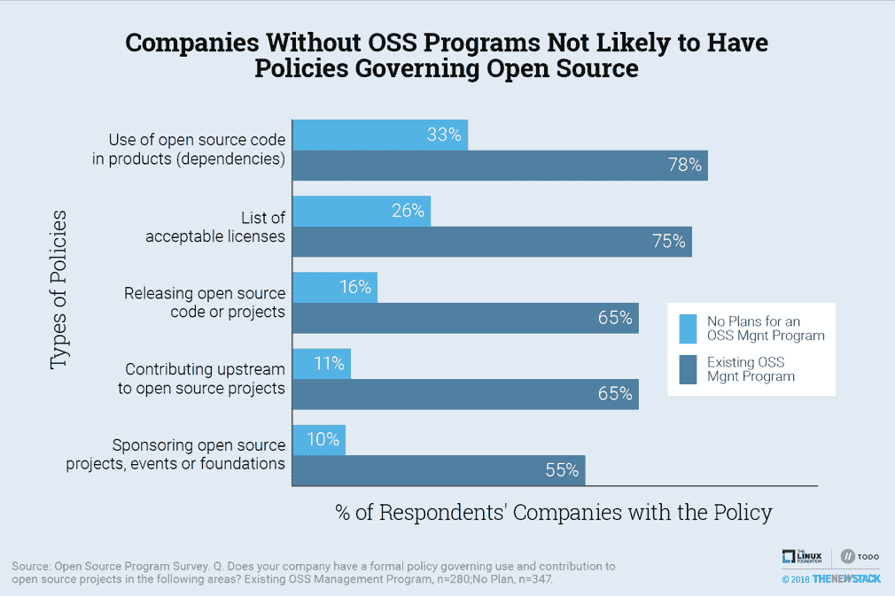

# 开源文化始于计划和政策

> 原文：<https://thenewstack.io/open-source-culture-starts-with-programs-and-policies/>

最重要的是，开源程序负责培养“开源文化”，根据[与](https://thenewstack.io/survey-open-source-programs-are-a-best-practice-among-large-companies/)[Linux 基金会](https://www.linuxfoundation.org/)的[托多集团](https://todogroup.org/)进行的调查。通过创建开源文化，拥有开源项目的公司看到了我们之前报道过的好处，包括开发周期的速度和灵活性的提高，更好的许可证合规性以及对公司产品所依赖的开源项目的更多了解。

但是什么是开源文化，为什么它很重要，我们如何衡量它？根据今年夏天[开源峰会](https://events.linuxfoundation.org/events/open-source-summit-north-america-2018/)的调查数据和报告，我们认为开源项目支持优先开发运维及微服务架构的企业文化，并使开发者能够快速使用和参与内部和外部项目。通过计算一个公司的技术栈中有多少百分比是开源的来衡量该公司的开源文化已经不够了。对提高开发人员效率感兴趣的企业应该检查他们在开源项目中的参与情况，并支持一种在外部维护的项目中培养代码共享和协作的文化。

## 定义开源文化

开源文化不仅仅是重用 GitHub 上的免费代码，让产品更快上市。这是一种重视分享的风气。这种文化包含强调内部和外部协作的软件开发方法，越来越关注核心能力而不是核心基础设施，以及通常与微服务和云原生技术相关的 DevOps 流程的实施。

在社区项目上合作是与开源开发相关的一种思维方式。使用外部创建的开源组件的软件工程师需要与负责项目维护的人员合作。通常，交互就像确保软件更新集成到新部署中一样简单，这可以通过持续的部署管道来解决，该管道会检查以确保组件是最新的，并与最新的存储库和库同步。这是让组织适应外部依赖性的良好的第一步，但是与其他项目维护者的双向交流才是真正的协作类型，这对于最大化开源文化的好处是必不可少的。

从外在心态转向内在心态是内部采购的全部内容。“内部资源”是一个越来越流行的术语，用来描述在一个组织内应用的 OSS 开发原则。根据 GitHub 的说法，“Innersource 是一种开发方法，工程师使用大规模开源项目的最佳实践来构建专有软件。”许多公司[如 Capital One](https://thenewstack.io/adopting-inner-source-culture-within-organizations/) 正在使用内部外包来增加公司内部的协作和代码共享，从而提高开发人员的效率并加速创新，这包括让所有利用软件的员工都可以访问所需的开发工件。它还经常鼓励基于平等主义和精英标准的决策。

开源文化的另一个关键方面是，IT 部门不太可能认为他们有责任创建和维护整个技术堆栈。在解释为什么他们的组织正在考虑创建一个开源程序时，一位调查回答者写道，“我们不再认为对我们的盈利能力不重要的问题的正确答案是编写新代码。相反，我们寻找那些总体上朝着我们希望的方向发展的项目，并努力适应和投入其中。”

VMware 首席开源官 [Dirk Hohndel](https://www.linkedin.com/in/dirkhohndel/) 表示，使用开源的意愿让人们专注于他们的核心能力，而不是基础设施。在一次关于新堆栈的采访中，Hohndel 解释说像 Capital One 这样的公司已经决定他们的核心产品是软件。在 Capital One 的案例中，这意味着企业文化鼓励速度和敏捷性等价值观，而这些价值观在银行业并不总是优先考虑的。Hohndel 说开源已经在 AWS 和 VMware 这样的公司中普及。无论是这些庞然大物，还是没有技术焦点的公司，都越来越多地使用开源来“在边缘而不是核心达成共识”

Hohndel 做了一个跳跃，将开源与其他几个主要趋势联系起来。他说:“开源文化支持 DevOps 实践和微服务架构，这是使这种基于开源的云原生基础设施工作所必需的。”正如在“[开源项目是大公司的最佳实践](https://thenewstack.io/survey-open-source-programs-are-a-best-practice-among-large-companies/)中所报道的，大多数有项目的公司都知道它们对开发运维流程有影响。

DevOps 和开源之间的联系在 [DORA 的](https://devops-research.com/)*Accelerate:State of devo PS 2018:Strategies for a New Economy*中报告的调查数据中得到确认，该调查数据发现，表现最好的组织广泛使用开源的可能性是 1.75 倍。该报告还显示了云原生技术的使用，CI/CD 管道技术与高性能相关联。由于所有这些实践经常一起出现，我们认为它们作为一个整体表明开源文化已经扎根。正如下一节所解释的，我们相信文化，而不是技术，能提高绩效。

## 开源文化的影响

根据我们的调查，开源项目的三大好处是:1)提高对开源的认识，2)提高开发周期的速度和灵活性，以及 3)更好的许可证合规性。[Chris Aniszczyk](https://twitter.com/cra),[TODO Group](https://todogroup.org/)的联合创始人、[Cloud Native Computing Foundation(CNCF)](https://www.cncf.io/)的首席技术官告诉《新堆栈》杂志，有两种类型的开源程序，一种围绕提高开发人员效率来定义成功，另一种基于降低合规风险来证明它们的存在。

50%拥有开源项目的受访者表示，开源文化是他们衡量项目成功的标准。其他活动指标被用来衡量这种文化转变。这篇文章描述了如何确定你的公司是否有强大的开源文化。

Aniszczyk 说，许多长期存在的项目通过它们可以减少多少风险和成本来证明其存在的合理性。他解释说，例如，意外发布 GPL 或 a GPL 代码可能会产生合规性问题，公司将因此推迟未来的产品发布，甚至开源整个项目，从而失去可能已经货币化的知识产权。

开发人员的效率是 Aniszczyk 看到开源程序真正发挥作用的地方。他解释了一种常见的情况，即像脸书这样的公司可能希望为已经在内部使用的 Apache 项目做出贡献。传统上，如果公司已经完成了这个项目，并希望归还一些变更，它必须经历一个详尽的法律程序，可能需要几周甚至几个月的时间。同时，项目的方向可能已经偏离，这意味着开发项目变得不同步和延迟。

Aniszczyk 认为，为工程师在上游做出贡献建立一个简单的过程可以使开发更快、更可持续。此外，通过开源现有项目，开发人员可以变得更有效率，因为这将维护项目的负担分散到用户身上，释放内部时间来专注于可以帮助公司而不仅仅是项目繁荣的新功能。此外，[研究表明](https://papers.ssrn.com/sol3/papers.cfm?abstract_id=3091831)为他们所消费的开源项目做出贡献的组织可以提高他们的能力，从开源的使用中获得比他们的免费竞争对手多 100%的生产价值。

## 看效率，而不是速度

我们现在必须解决一个普遍存在的误解。开发效率和开发速度不是一回事。开源参与和 DevOps 过程不会自动缩短软件开发生命周期，也不意味着产品会在短期内更快发布。相反，开发人员的效率随着他们专注于重要的事情并允许开源社区维护核心基础设施而变得更有生产力而提高。

前面提到的 DORA 报告描述了一种常见的情况，即采用 DevOps 流程有助于公司立即提高稳定性，但也会导致速度的短期下降(请参见下面的转型 J 曲线)。出现这种现象是因为 CI/CD 管道的自动化经常增加测试需求，而测试需求通常是手动处理的。换句话说，许多公司没有应用关于使用最新的开源依赖项的最佳实践，并且正确地做事情需要增加手工工作。

当我们问一个普通的应用程序开发团队多久发布一次代码到产品中时，我们看到了类似的矛盾。我们的调查发现，仅仅有一个开源程序对开发速度没有影响。事实上，在开源程序中，被调查者认为最大的程序好处是提高速度和灵活性的公司更有可能变慢，24%的公司每月发布代码不到一次，而其他公司中只有 6%的公司这样做。

转换的 J 曲线帮助我们理解，公司花一个多月的时间来发布代码，是因为新制定的手动过程最终将被自动化。一些公司看起来比其他公司慢的另一个原因是他们实际上专注于指标。在这种情况下，无知是福。事实上，当被问及两次发布之间需要多长时间时，33%认为速度/敏捷性不是优势的公司回答“不知道”。

拥有现有开源程序的公司和那些没有计划创建程序的公司发布频率差不多。公司规模和行业垂直对开发者速度有更大的影响。

乍一看，公司似乎对开源管理程序的速度/灵活性优势有错误的认识。进一步分析表明，许多优先考虑速度指标的公司更有可能收集这些数据。

## 政策促进文化

充满活力的开源文化的许多好处在短期内很难衡量，并且与 DevOps 流程的存在和云原生技术的使用密切相关。要确定开放源码文化是否存在，如果有特定的活动发生，以及是否有管理开放源码使用的政策，这是很有帮助的。我们在调查中询问了这两个问题，发现拥有开源项目的公司更有可能向上游贡献代码。我们认为这至少部分是由于管理上游捐款的政策。

从下面的图表中可以看出，拥有开源程序的公司更有可能拥有关于产品和可接受许可列表中开源依赖的政策。这些政策与降低使用开源软件的风险的主要目标相关联。他们也更有可能有关于发布源代码和为外部开源项目做贡献的政策。这些活动与开发人员的效率更直接相关，而开发人员的效率可以通过使用开源来实现。与实际维护自己的项目相比，允许开发人员与其他人合作更是开源的缩影。TODO 组维护示例策略和模板，您可以利用它们来创建您组织的开源策略:[https://github.com/todogroup/policies](https://github.com/todogroup/policies)

65%的公司有关于上游贡献的政策，而只有 11%的公司没有创建这样的计划。

## 结论

一个公司的价值观体现在他们的政策和行动中。实际上，拥有关于为开源项目做贡献的政策意味着高级管理层已经接受了从开源项目中获益需要的不仅仅是免费——而是回报。

开源项目有助于促进一种让公司更有生产力的文化。培养“开源文化”是开源项目的主要目的。衡量一个项目的成功本来就很困难。就像企业多样性计划一样，最初应该通过政策的存在和与开源文化紧密相关的 DevOps 过程的实现来衡量进展。有了这两个结果，我们期望公司能够收获开源思维的回报。

<svg xmlns:xlink="http://www.w3.org/1999/xlink" viewBox="0 0 68 31" version="1.1"><title>Group</title> <desc>Created with Sketch.</desc></svg>