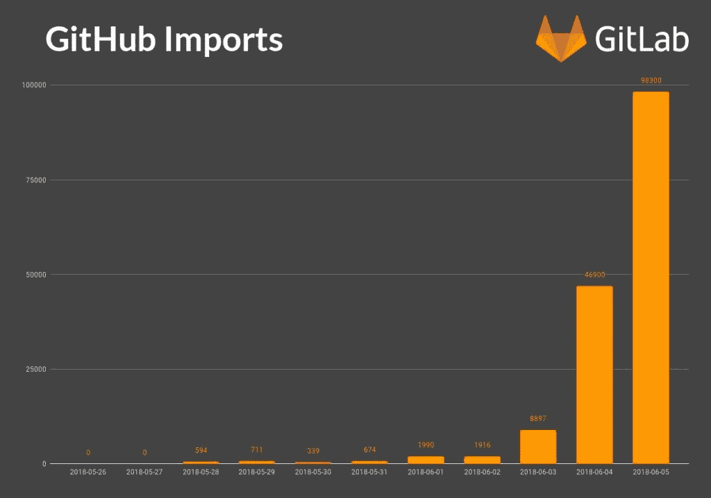
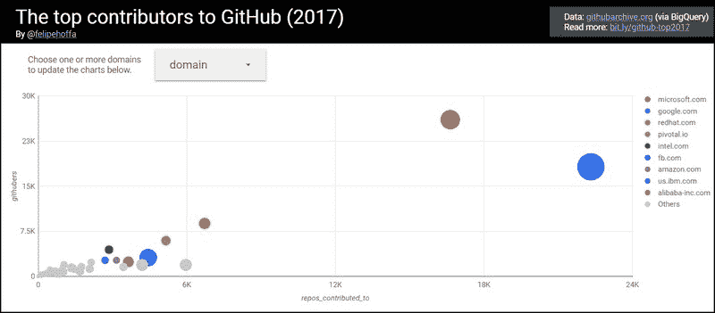

# 对微软即将接管 GitHub 心存警惕的开源开发者考虑了一个“B 计划”

> 原文：<https://thenewstack.io/open-source-devs-wary-of-microsofts-pending-github-takeover-consider-a-plan-b/>

不久前，20 世纪最伟大的资本主义成功故事之一、至今仍是世界主要专利持有者之一的 T2 微软宣称自己是自由企业的捍卫者，反对开源运动。当一家同名的公司，虽然由不同的人领导，并重新专注于云托管业务，[宣布其有意收购在版本控制、开源软件的协作和自动化领域最著名的品牌](https://thenewstack.io/microsoft-to-acquire-github-to-expand-developer-reach/)时，你不能责怪一些人持怀疑态度。

但截至目前，这种怀疑与其说是沸腾，不如说是慢慢酝酿。依赖 GitHub 作为其虚拟供应链的开源贡献者担心任何公司所有者——无论是微软、谷歌还是星巴克——都可能对维护私有存储库的可见性感兴趣。这种情况以前也发生过，[尽管是在不同的环境下](https://www.theregister.co.uk/2016/03/23/npm_left_pad_chaos/):2016 年 3 月，一位名叫 Azer Koç ulu 的开发者将一个名为 **kik** 的 JavaScript 模块发布到了他的 **npm** 资源库中。不知何故，这一行为引起了一家公司的注意，该公司将“Kik”注册为一种即时通讯工具的商标。当该公司联系开发人员，要求他重命名模块时，他出于原则拒绝了。

然后在争论[失控](https://thenewstack.io/the-kik-kerfuffle/)之后，某些生殖器被引用，开发者公开了他的 **kik** ，连同他所有的其他模块。由于其他公司的代码依赖于 Koç ulu 的代码，结果是几个小时内软件崩溃的雪崩。

虽然这个问题很快就被修复了，但这个事件揭示了开源组件之间的相互依赖有多深——即使在商业容器化时代刚刚开始的时候。

## 备用退出策略

周一，在微软和 GitHub 的联合声明之后，Go language 的[一般讨论列表**golang-nuts**的成员温和地提出了他们是否应该考虑保护自己免受 GitHub 未来类似意外事件的问题。一些评论者表达了对即将离任的 GitHub 首席执行官克里斯·万斯特拉斯的声明的信心，他说知识库系统将继续独立运行。也就是说，一些人建议 Go 贡献者保留他们的选择。](https://groups.google.com/forum/#!forum/golang-nuts)

争论的焦点:如果一个开发组织决定将它的存储库移动到任何新的位置，它能避免破坏依赖于他们在该存储库中导入模块的能力的其他人的代码吗？至少有一个贡献者正在考虑使用 [Fossil](https://fossil-scm.org/index.html/doc/trunk/www/index.wiki) ，除了版本控制，它还包括 bug 跟踪和一个集成的 wiki。

另一位名叫大卫·斯金纳的长期撰稿人说他已经开始谨慎地寻找替代品，他建议开发者开始使用一种叫做*虚荣导入*的技术。本质上，这是一种从你的源代码的导入路径到你自己的域替换**github.com**源包名的方法。在那里，您的索引页面将包含一个 HTML **meta** 标签，该标签包含一个指向您的源代码库的当前地址的指针。Go 命令行工具 **go get** 知道在接受任何 URL 作为依赖模块的唯一源位置之前查找索引页面。

> “我不会因为微软收购 GitHub 就离开它。但我确实想有一个退出策略。这只是谨慎。”

如果一个开发人员或组织认为它必须进行迁移，那么它所需要做的就是编辑 **meta** 标签以指向新的存储库位置。

这种间接的方法可以给 GitHub 用户一种悄悄溜出系统的方式，如果微软现在的领导层剥掉他们的蜡唇和面具，揭示史蒂夫·鲍尔默和吉姆·奥尔钦一直藏在那里。

斯金纳写道，“回到 1980 年，我有个人理由不信任微软。我有朋友在那里工作，我很担心他们。我不会因为微软买下 GitHub 就离开它。但我确实想有一个退出策略。这只是谨慎。”

据竞争服务 GitLab 称，超过 100，000 个知识库的贡献者可能会分享 Skinner 的谨慎。这些贡献者在购买谣言开始传播后的前三天就开始将他们的 GitHub 库导入 GitLab。

然而与此同时，Skinner 的评论表明了当今专业开源开发者所采取的更成熟、更谨慎的态度。对他们来说,“栈”的全部目的是启用服务的耦合和连接选项，以后只要条件允许，就可以解耦和重新连接。

## 万福玛利亚选项

golang-nuts 组中的一些 Go 开发者正在讨论利用一个名为[星际文件系统(IPFS)](https://github.com/ipfs/ipfs)的项目的可能性，也许再加上一个区块链元素，来设计一种对等语言存储系统。根据它的创造者胡安·贝内的说法，IPFS 是用 Go 自己写的，“试图用相同的文件系统连接所有的计算设备”。

与 GitHub 不同，GitHub 依赖网络作为其资源寻址系统，IPFS 将利用自己的分布式哈希表，以及 Benet 所描述的“自认证名称空间”，来部署单个 Git 存储库，就像一个巨大的、正在进行的 BitTorrent。

虽然 IPFS 是一项有吸引力的技术，或者至少是一项有前景的技术，但它可能完全没有抓住要点:微软即将进行的 75 亿美元的股票交易不是为了拥有一部分 Linux，而是为了控制一项健康的业务，这项业务现在每年获得 2 亿美元的收入。GitHub 的商业模式是它的企业级私有软件库服务。公共服务建立了社区，但私人服务保持着光明。

“公司从来都不是利他的。这不是它们的设计目的，” [Randy Bias](https://www.linkedin.com/in/randybias) 评论道，他是过去几十年开源社区的主要倡导者之一，目前是 Juniper Networks 的技术和战略副总裁，也是新堆栈的老朋友。“它们旨在创造利润和回报股东价值。宇宙中任何地方的任何公司都可以以利他方式运营的想法是无法用语言表达的天真想法。”

Bias 告诉我们，他认为微软的举动将有利于整个开源生态系统。会有一些来自过去的老兵记得微软过去的立场，以及它设法用对社区的煽动性评论浇灭草原大火的方式。在他看来，那家公司已经不存在了。

尽管如此，他建议我们在更广阔的背景下看待这笔交易:尽管 GitHub 可能已经成为所有版本控制源代码的事实上的来源，但它并不总是能够成功地迈出建立生态系统的下一步——要么建立或启用其他工具来建立围绕 GitHub 的轨道。例证:尽管 GitHub 已经做出了自己的努力来整合 bug 跟踪，但在 Bias 看来，绝大多数用户更喜欢使用 [Atlassian 的吉拉](https://thenewstack.io/pagerduty-devops-hub-jira-software-atlassian/)。

“GitHub 在源代码库之外的能力并没有真正做得很好，”Bias 说，“在他们的核心基础之外构建。如果我们看看微软，他们已经多次尝试在网上建立开发者中心，但在微软生态系统之外基本上都没有成功。”

Bias 说，微软在基于端到端工具链建立卓越的开发人员关系方面的历史和经验应该与 GitHub 现有的价值链很好地融合。但在这个过程中，它为 GitHub 创造了一个机会，使其商业模式迈出下一步——“进入这个现代 CI/CD 管道，该管道旨在允许普通企业应用程序开发人员从他们的笔记本电脑构建下一代、云原生、基于微服务的应用程序，并将其投入生产，而无需接触甚至无需了解该发布管道的所有部分。”

Bias 提到的开发者中心之一是 [CodePlex，微软 2009 年的努力](https://betanews.com/2009/09/10/microsoft-mono-developer-form-open-source-commercial-cooperative/)建立了当时所谓的“独立”合作源代码交换，与当时最大的此类努力 SourceForge 竞争。没有完全被忽略的是，早期努力的董事会成员之一是 Mono(第一个开源软件)的开发者米格尔·德·伊卡萨。NET 实现)和 Xamarin 的联合创始人。微软将在 2016 年收购 Xamarin，并在此过程中正式聘用 de Icaza 和另一位联合创始人 [Nat Friedman](https://twitter.com/natfriedman) …他现在被任命为新 GitHub 的首席执行官。

## 杠杆买入

根据去年全年收集的数据，并由谷歌的 BigQuery 引擎汇编，微软在 2017 年雇用了最多的 GitHub 贡献者，参与了全球第二大知识库，仅次于谷歌。它自己最活跃的库是 Visual Studio 代码编辑器的 [VS 代码](https://code.visualstudio.com/)，最近[取代了它的同名前身 Visual Studio](https://insights.stackoverflow.com/survey/2018/) 成为 Stack Overflow 用户最受欢迎的开发环境。

这是一个 Marko Insights 负责人 [Kurt Marko](https://twitter.com/krmarko) 认为不可能忽视的统计数据。“微软看到了社区知识库和 GitHub 平台的价值，”Marko 告诉 The New Stack。“它也理解自动化开发过程和工具链的力量，这就是购买 GitHub 的原因。”

他指出，该公司现有的 Visual Studio 工具链仍然有其强大的支持者。但这些人主要是 Windows 开发人员，CI/CD 等现代方法学需要更长时间才能掌握。

“我认为 GitHub 的长期战略至少有一部分是为 Azure 构建一整套 CI/CD 和基础设施即代码(IaC)服务，”他继续说道。“虽然 GitHub 是众所周知的公共平台，但它显然也可以用于私有存储库。我怀疑微软将继续支持开源项目的公共网站，并将该技术重新包装为面向私人回购的计量 Azure 服务。”

如果这一预测成立，Marko 建议我们，“如果微软也收购或重新包装其他 CI/CD 产品，如 Jenkins、TravisCI 或 Atlassian，也不要感到惊讶。”

今天，成为一名开源“社区成员”并不一定意味着加入了某种政治运动或采纳了某种道德教条。事实上，开源是现代的软件开发，正如微软自己所展示的。

“我们自己已经踏上了开源和开源社区的旅程，”微软首席执行官[塞特亚·纳德拉](https://twitter.com/satyanadella)在周一早上与 GitHub 的联合分析师电话会议上说道。“今天我们都在用开源。我们活跃在开源生态系统中，我们为开源项目做出贡献，我们一些最具活力的开发工具和框架也是开源的。”

然后纳德拉发表了一条严厉而果断的信息，针对的是那些对他的公司在 Linux 现在占主导地位的领域采取的任何商业行动仍有一触即发反应的人:“当谈到我们对开源的承诺时，请根据我们在最近的过去、今天和未来采取的行动来判断我们。”

微软是新堆栈的赞助商。

特色图片:马丁·比约克为 GitHub 创作的一个受 Windows XP 启发的主题，[现已在 GitHub](https://github.com/martenbjork/github-xp) 上发布。

<svg xmlns:xlink="http://www.w3.org/1999/xlink" viewBox="0 0 68 31" version="1.1"><title>Group</title> <desc>Created with Sketch.</desc></svg>