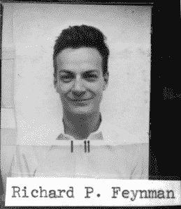

# 当开源黑客遇到安全破解

> 原文：<https://thenewstack.io/open-source-hacking-meets-safe-cracking/>

极客们着迷于保险箱破解——以及物理安全系统可以教给我们的关于虚拟系统的课程。但是在我们廉价和开源自动化的时代有新的教训吗？或者它只是再次证实了古老的开源智慧— 给了足够的眼球，所有的错误都是肤浅的*。*

我们的故事从 SparkFun 的一名工程师开始，他的妻子给了他一份不同寻常的圣诞礼物——一个没有密码的上锁的保险箱。“她知道我真的很喜欢拼图、锁和机器人，”赛德尔[后来告诉《连线》杂志](https://www.youtube.com/watch?v=_fTz2D6x20U)，在今年春天的一篇博客文章[中](https://learn.sparkfun.com/tutorials/building-a-safe-cracking-robot)他开玩笑地总结了他的方法。“步骤 1)找一个没有打开过的保险箱。第二步)部署机器人军队。”

[https://www.youtube.com/embed/_fTz2D6x20U?feature=oembed](https://www.youtube.com/embed/_fTz2D6x20U?feature=oembed)

视频

Seidle 用一个自制的 Arduino 驱动的机器人跟踪他的保险箱表盘的位置——或者至少识别表盘从原始位置旋转了多远——通过每一种可能的组合机械地扭曲它。但是有了三个两位数的数字，就有一百万种可能的组合——即使每 10 秒钟尝试一种，也要花将近四个月的时间。幸运的是，这个特殊品牌的保险箱有一个固有的误差范围。“如果组合中有一个数字是 53，那么 52 和 54 也可以……”塞德尔写道。"这很快将定义域缩减为 33 * 33 * 33 = 35，937 个组合."

事实证明，最后一个拨号要容易得多。如果你已经有了前两位数字，你可以简单地旋转拨号盘。保险箱制造商试图通过 12 个凹痕停止旋转来增加难度，但这实际上使事情变得更容易。最后一个标识——组合中的最后一个数字——明显窄了 0.01 英寸。这意味着它可以被转盘机器人通过一系列仔细的自动测量来识别，只剩下 33 x 33 种可能的组合——也就是 1089 种。

上周，在一年一度的 DEFCON 安全会议上，Seidle 在拉斯维加斯的舞台上展示了他的设备。在胜利的时刻，设备发出哔哔声，显示密码，并结束搜索(赢得观众热烈的掌声)。BBC 报道称，“团队开玩笑说保险箱可以更快被打开，但是他们必须填满他们 45 分钟的时间。”

英国广播公司还指出，尽管一些 SentrySafe 型号有一个用钥匙打开的附加锁，但“该团队能够使用 Bic 笔打开它。”

## 用开源软件打开保险箱

有趣的是，所有的零件总共花费了 200 美元——为了向我们的现代时代致敬，它们是用 3d 打印机制造的。Seidle 的博客帖子甚至包括一条“打造你自己的！”部分，称之为“火花保险箱破解”

“你需要一台 3D 打印机、烙铁，以及编写代码和修改 3D 文件的能力，以适应你试图打开的保险箱类型……”

在一个四分钟的视频报道中,《连线》称这个实验证明了“利用廉价的开源硬件和代码来破解历史上可靠的模拟安全系统变得多么容易”但塞德尔建议，这应该被视为应用于其他领域的开源思维，在这些领域，发现是为了共同利益而共享的。

“也许，保险箱制造商，你应该知道这一点，这样你就可以把保险箱做得更好。这就是开源的心态。”

他预测随着开源思想被接受，安全性将会提高*。“这不是说，‘嘿，看看我能偷什么’，而是说，‘嘿，找到这个东西了，我想和你分享一下。我想指出这个问题，这样你就可以使它更安全。"*

或者，正如*丹佛邮报*所说，演示的目的是“展示物理安全的变化本质，这应该促使供应商和公司[注意并做出他们自己的改进](http://www.denverpost.com/2017/08/01/sparkfun-niwot-safe-cracking-robot-def-con-2017/)

这是黑客新闻评论中的一个理念。“随着时间的推移，观察这种机器人的改进曲线将是有趣的…特别是在某种程度上，这种改进部分是在黑客/制造商社区的创新手中，而不仅仅是少数商业公司…”

## 一个由来已久的极客传统

事实上，公益撬锁是一种传统，至少可以追溯到理查德·费曼，这位获得诺贝尔奖的物理学家曾在洛斯阿拉莫斯实验室工作，该实验室在二战期间开发了美国第一批核武器。“洛斯阿拉莫斯是一个非常合作的地方，”费曼在他的自传书*中回忆道，“你肯定在开玩笑，费曼先生*，“我们觉得我们有责任指出应该改进的地方。”

费曼首先展示了他可以成功地从几个上锁的柜子里取出文件。新的密码锁很快就安装好了——费曼认为这只是另一个挑战。“我喜欢谜题，”费曼在书中回忆道。“一个人试图制造一些东西来阻止另一个人；一定有办法打败它！”他很快发现了 70 年后 SparkFun 的机器人会利用的同样的事情——密码锁很宽松。在费曼的例子中，如果正确的数字是 69，那么它实际上可以打开 2 以内的任何数字——因此，71、70、69、68 或 67，“在一个 100 的轮子上有 20 个这样的数字，那就是 8000 种可能性，而不是你必须尝试每个数字才能得到的 100 万种可能性。”

费曼还采用了其他安全破解技术，这些技术今天仍在我们的数字世界中使用——比如猜测哪些组合最有可能被选中。在他的大楼里，大约 20%的保险箱甚至还在使用原始的出厂默认密码。

## 提升传统

破解保险箱仍然是当今极客们的热门话题。Seidle 今年春天的博客帖子还提到了 2011 年 DEFCON 上关于保险箱破解的演讲，这让观众想起了这一代人的最新工具。“机器人非常擅长重复的任务，”主持人埃里克·施密德尔说，“没有什么比尝试表盘上的每种组合更重复的了。”

[https://www.youtube.com/embed/4_lkYQ88kv0?feature=oembed](https://www.youtube.com/embed/4_lkYQ88kv0?feature=oembed)

视频

事实上，赛德尔的项目最终只是一长串自制保险箱破解机器人中的最新一个。有人在 Reddit 上引用了这位有事业心的年轻人，他在“过去的经历中[忘记了我所有的储物柜组合](http://www.jakebozz.com/Rudolph.html)，不得不购买新的锁”之后建造了这个锁柜 2015 年，GadgetReview 还描述了马萨诸塞州尼达姆富兰克林 w 奥林工程学院的学生开发的一款名为[的锁破解装置。几年前，两名麻省理工学院的学生甚至制造了一个笔记本电脑控制的机器人，可以打开高度安全的保险箱。](https://www.gadgetreview.com/best-home-security-system)

但也许最终会有一些更大的教训需要吸取。Matt Blaze 是一个对现实锁的安全性特别感兴趣的极客，他是 Linux 的原始[加密文件系统(CFS)的创建者。密码学家格斯·西蒙斯(生于 1930 年)曾经把一个双钥匙的 Abloy 圆筒给了布雷泽，这成为他最有价值的财产之一。2004 年，布雷泽为计算机科学家](http://www.linuxjournal.com/article/6381) 写了一本名为 [*保险柜破解的书，深入研究了保险柜制造者们用“几代人的后见之明”学到的一些关于安全的具体教训*](https://archive.org/stream/Matt_Blaze__Safecracking_for_the_computer_scientist/safelocks_djvu.txt)

Blaze 写道“与信息安全领域的同行相比，保护保险箱的机制非常成功。物理安全中很少有弱点承认计算机和网络中常见的灾难性故障，在这种情况下，低风险、低成本的攻击可以产生高价值且易于复制的收益。

即使是针对保险箱的最复杂的攻击，无论是暴力攻击还是开锁攻击，几乎总会带来一定的暴露风险。对各种攻击所需的时间和其他资源的相对准确的估计，使得紧密地优化有效的物理安全系统和协调互补的安全机制成为可能。”

Blaze 公平地补充道，“当然，对物理安全的研究比对信息安全的研究要早得多，而且对抵御攻击和保护成本之间的权衡也相对比较了解。”但另一个(或许更重要的)优势是“相对稳定的技术基础”，这使得安全制造者可以精确定义他们期望阻止的攻击类型。安全制造者可以考虑“成功攻击的时间”——这对于计算机安全来说更加难以衡量。计算机和通信安全的通常设计原则认为，只有当工作因子大到使任何攻击的可能性完全不可行时(例如，要求将太阳系中的每个分子都变成超级计算机)，系统才是安全的

那么现在我们该怎么办呢？

有些人认为，最好的姿态是用批判的眼光看待我们的安全幻想。在登上 DEFCON 舞台前不久，Seidle 分享了一个关于物理保险箱的类似悲观结论。“不管你在保险箱上花了多少钱，没有什么是不受影响的，”他告诉 BBC，促使 Mashable 郁闷地得出结论，“从本质上来说，[没有什么是一个专注的黑客](http://www.mashable.com/2017/07/28/safe-cracking-robot-defcon/)无法达到的。不是你的电脑，不是你的手机，更不是你放在家里保险箱里的任何东西。

"就当你被警告了。"

* * *

# WebReduce

<svg xmlns:xlink="http://www.w3.org/1999/xlink" viewBox="0 0 68 31" version="1.1"><title>Group</title> <desc>Created with Sketch.</desc></svg>