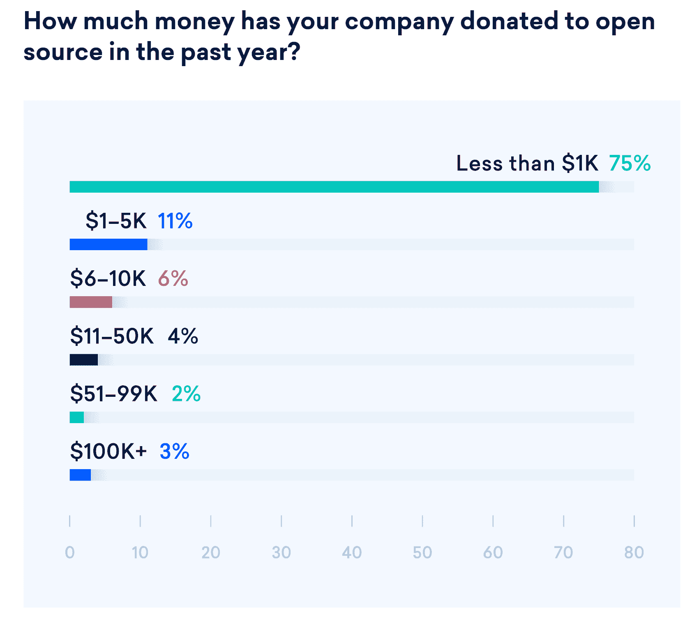

# 开源投资:给我钱(和时间)

> 原文：<https://thenewstack.io/open-source-investment-show-me-the-money-and-time/>

自利和内疚是公司投资开源的主要原因。没有与自身利益的明确联系，一个持续的挑战是证明开源项目的时间和金钱投资是合理的。Digital Ocean 最近的一项调查发现，只有四分之一的受访公司每年向开源软件捐赠超过 1000 美元，只有 18%的公司是开源软件基金会的成员。甚至开源软件基金会的成员也不是作为慈善行为加入的。几乎一半的人说他们公司参与的原因之一是为了更好地向社区开发者推广他们的解决方案。Linux 基金会的另一项调查发现，几乎一半参与开源的招聘经理说他们公司的投资是为了支持招聘工作。

如果你深究实际花费的钱，你会发现很多钱都花在了会议和培训上，而不是付给开发人员工资，让他们从事与公司无关的项目。不要为“开源”寻找预算项目，一个更好的衡量标准是花在开源开发上的时间。根据前面提到的数字海洋调查，55%的开发人员正在为开源做出贡献，但只有 34%的人说他们的公司给他们时间来为与工作无关的项目做出贡献。在这个特权群体中，53%的人被允许每周花 1-5 个小时进行非工作时间的开源软件开发。

GitHub 的一项 [2017 年调查](https://opensourcesurvey.org/2017/)发现，三分之二的贡献者表示他们的参与至少与工作间接相关。它还警告说，41%的公司没有明确的知识产权政策，允许员工为非工作项目做出贡献。

开源被接受的战斗已经胜利了。下一场战斗是为开源开发者创建一个可持续的资助机制。随着像 Amazon Web Services 这样的公司提供基于 OSS 项目的服务，已经创建了开源商业模式的公司正面临着挑战。然而，像下面推文中看到的公开羞辱不会改变这一现象。相反，如果有证据表明参与项目对服务质量有明显的影响，大型云客户可能会从云提供商那里获得更多的开源投资。

产生开源投资的最简单的方法是允许开发者花时间在与工作无关的开发上。这是一种“资源”，软件经理可以在没有获得预算批准的情况下进行投资。请注意，我们没有明确提到众包是一种资助开源开发者的方法。我们承认在这一领域确实存在可能性，但就目前而言，推广这一方法的大多数努力都失败了。

证明我们的怀疑是错误的，并向我们发送数据，以证明您的众包平台将扩展，并成为一种将大规模支出导向开源开发者工资的方式。

近二十年来，劳伦斯·赫克特一直致力于企业 IT 市场的分析和报告。他使用调查、访谈和非传统的市场研究技术来分析分布式和分散式技术。

Linux 基金会是新堆栈的赞助商。

通过 Pixabay 的特征图像。

<svg xmlns:xlink="http://www.w3.org/1999/xlink" viewBox="0 0 68 31" version="1.1"><title>Group</title> <desc>Created with Sketch.</desc></svg>