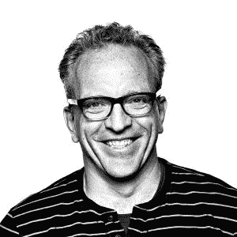

# 开源领导者:Dirk Hohndel 为 VMware 带来开源

> 原文：<https://thenewstack.io/open-source-leaders-dirk-hohndel-brings-open-source-vmware/>

下面的采访是“开源领导者”系列的一部分，在这个系列中，我们描述了开源 IT 社区中的项目领导者，以了解他们如何开发他们的软件，以及运行开源项目带来的挑战和好处。

[Dirk Hohndel](https://www.linkedin.com/in/dirkhohndel/) 喜欢在开源世界保持低调，但他无法逃脱聚光灯。经常可以看到他和他的密友，Linux 创造者 [Linus Torvalds](https://github.com/torvalds) 进行主题讨论。两人都热爱 Linux 及其他系统。Hohndel 也是一名潜水爱好者，他和 Torvalds 一起在世界各地的深水中潜水。

他们对开源和水肺潜水的共同热爱也导致了托瓦尔兹创建的水下潜水日志项目。现在 Hohndel 是项目的维护者。从一个轻松的角度来看，Hohndel 和 Torvalds 之间的一个巨大差异可以从他们的水下摄影中看出来；虽然 Hohndel 可以很容易地离开 VMware，成为一名全职的水下摄影师，但 Linus 对水下生物模糊的屁股照片感到满意。

Hohndel 偶尔也会为 libdivecomputer、Kirigami、Qt 和一些随机的小型项目做贡献，这些项目都是他用来运行地下项目的基础设施的。

但是德克·霍恩德尔的影响力已经超出了他的 Github 数字。

今天，英特尔是对 Linux 和开源最友好的芯片制造商之一，这在一定程度上要归功于 Hohndel 的帮助。这不是一夜之间发生的。Hohndel 是为英特尔带来这一变革的关键团队的一员。现在 Hohndel 在 VMWare，把它变成了开源的友好面孔。在英特尔工作很长一段时间之前，Hohndel 还为历史最悠久的 Linux 供应商 SUSE 担任首席技术官。

Hohndel 来自德国，有很强的教育背景。他拥有数学和计算机科学学位。他在德国维尔茨堡大学时第一次接触到开源。

Hohndel 说:“我当时使用了许多令人惊叹的自由软件工具:Emacs、gcc、binutils——都是在 20 世纪 80 年代末。

## 向前支付它

但是如果你参与了开源，你不可能在很长一段时间内仅仅是一个消费者。最终，你会开始有所回报。“如果我没记错的话，我的第一个贡献是 Epoch(支持 GUI 的 Emacs 分支)，”他回忆道。

1991 年，Hohndel 在阅读了托瓦尔兹的电子邮件后兴奋不已，他在邮件中宣布创建一个免费的 Unix 版本。但是直到 1991 年 11 月(版本 0.11)，他才得到一个基于 386sx 的 2MB 内存系统(这是第一个 32 位 CPU 的 16 位版本)，并开始使用并很快为 Linux 做出贡献。“为什么？因为它就在那里，我可以让它变得更好，”霍恩德尔说。

随着他对 Linux 越来越感兴趣，他与托沃兹的友谊也越来越深厚。霍恩德尔仍然热情地回忆起第一次会议(1993 年在荷兰 Ede 召开的 [NLUUG 会议](https://www.nluug.nl/)，托瓦尔兹和霍恩德尔都在会上发言。

“人们问 Linus Linux 能走多远，他对 Linux 有什么期望。他建议，如果我们设法修复 TCP/IP 堆栈中的一些错误(这些错误很大程度上阻碍了第二年 3 月发布的 1.0 版本)，在不太遥远的将来，Linux 可能会成为当时在世界各地的大学和公司中无所不在的 X 终端的可行替代品，”Hohndel 说。

“我们现在可以说，这个项目已经略微超越了莱纳斯 24 年前雄心勃勃的梦想，”他总结道。

霍恩德尔对 Linux 的深度参与最终引起了英特尔的注意。该公司在 2001 年找到他，帮助他们成功地融入 Linux 和更广泛的开源生态系统。

"[Imad Sousou sou](https://www.linkedin.com/in/imad-sousou-2b8b496/)(他仍然在英特尔运行开源软件)那时已经开始了一个小团队，致力于运营商级 Linux 。但从更广泛的战略角度来看(特别是从社区参与和上游贡献的角度来看)，仍然很少，”Hohndel 说。

“在接下来的几年里，一群人成功地说服了执行领导层改变他们在这一问题上的立场，并为开源做出贡献(以及随后在许多关键项目中的领导地位),这是英特尔的一个战略目标。这绝不是一个人的工作，许多关键人物在这项工作中发挥了重要作用。

Hohndel 可能很谦逊，不会因为他在英特尔所做的工作而邀功，但他在使英特尔成为 Linux 和开源的最大支持者方面发挥了非常重要的作用。

英特尔内部最大的变化之一是允许员工使用他们的英特尔电子邮件地址为 copyright left 项目做出贡献，然后目标是在开源项目中创造重大贡献和领导角色。

2004 年，英特尔将 Hohndel 提升为首席 Linux 和开源技术专家；从技术上讲，他是英特尔开源小组的首席技术官。在这个新职位上，Hohndel 与 Sousou 密切合作，推动英特尔在这一领域推出的许多计划。

2016 年，新墨西哥州圣达菲，德克·霍恩德尔。

“我最引以为豪的是 [Yocto 项目](https://www.yoctoproject.org/)(针对嵌入式 Linux)。理查德·波弟是 [OpenEmbedded](https://www.openembedded.org/wiki/Main_Page) 的贡献者之一， [BitBake](https://www.yoctoproject.org/software-item/bitbake/) 的维护者，他通过收购加入了英特尔。我们想出了推动创建强大的跨平台构建系统和互联生态系统的想法，这些系统和生态系统是为嵌入式系统构建定制 Linux 映像的一组工具。这是基于 OpenEmbedded 的，但将其扩展为准行业标准的角色，以帮助巩固嵌入式 Linux 构建工具的极度分散的空间，”Hohndel 说。

今天，Yocto 项目是最成功和最关键的 Linux 基础项目之一，对嵌入式行业和其他领域有着深远的影响。

该项目对英特尔进军嵌入式市场起到了重要作用。

Hohndel 认为他当时最大的贡献是吸引了一群才华横溢的开发人员加入英特尔的开源技术中心。

Hohndel 说:“从 2001 年的 24 人团队到 2016 年的 1000 多名工程师，包括十多名顶级 Linux 内核开发人员和众多开源项目的许多关键领导者，从开源 BIOS 到 UI 库，从上到下，从开源 BIOS 到 UI 库，一直到……你可以想象得到。”“多元化、充满活力的团队让我很难离开英特尔；他们继续激励着我。”

2016 年，Hohndel 离开英特尔加入 VMware，担任副总裁兼首席开源官。与英特尔不同，VMWare 并不以重要的开源工作而闻名。他预测，随着霍恩菲尔的到来，这种情况将会改变。

Hohndel 解释说，他在 VMware 的角色跨越三个密切相关且相互交织的领域。他的团队围绕开源项目的使用和贡献推动内部流程。第二个领域是他们致力于在 VMware 内部创造一种文化转变，涉及到他们与开源的整体合作以及他们对该领域许多项目的贡献。Hohndel 说，第三个领域是“我们正在与许多开源开发者(以及客户和合作伙伴)讨论我们的角色、愿景，当然，还有我们对开源的贡献和计划”。

即使他已经改变了公司，而且他的头衔中没有 Linux，Hohndel 也不会停止参与 Linux 社区。“我有太多的好朋友是这个社区的核心，我已经成为其中的一员超过 25 年了。在过去的几年里，我没有编写内核补丁(相反，我已经从 Linus 那里接管了地下维护)，但我仍然关注讨论，参加会议，并在有机会与开发人员交谈时极客出来。”

最近，Hohndel 被选为 Linux 基金会的董事会成员，他参与了该基金会的许多项目。“我花时间在云原生生态系统中，并以极大的兴趣关注那里的发展，”他说。

虽然 VMWare 在开源社区中不如 Intel 出名，但是 Hohndel 说公司有很多开源项目。“我们为 Linux 内核做出贡献已经有很长的历史了。我今年能够在我的团队中增加两名顶尖的内核维护人员——这是一个明显的迹象，表明我们正计划扩大我们在该领域的足迹，”他说。该公司在 OpenStack 社区中的影响力也越来越大，并为云原生空间中的广泛项目做出了贡献。

该公司的 [GitHub 页面](http://vmware.github.io/)展示了 [VMware 集成容器引擎](https://vmware.github.io/vic/)、 [Lightwave](https://vmware.github.io/lightwave/) 容器访问控制软件和 [Photon OS 容器主机](https://vmware.github.io/photon/)等项目。

Hohndel 说:“我认为可以公平地说，我的职业生涯是‘开源的’。“如果不是开源商业模式和蓬勃发展的开源生态系统，我不会有自己的职业生涯。或者我可能有一个非常不同的生活。”

Linux 基金会是新堆栈的赞助商。

资料图片由 Dirk Hohndel 提供。

<svg xmlns:xlink="http://www.w3.org/1999/xlink" viewBox="0 0 68 31" version="1.1"><title>Group</title> <desc>Created with Sketch.</desc></svg>