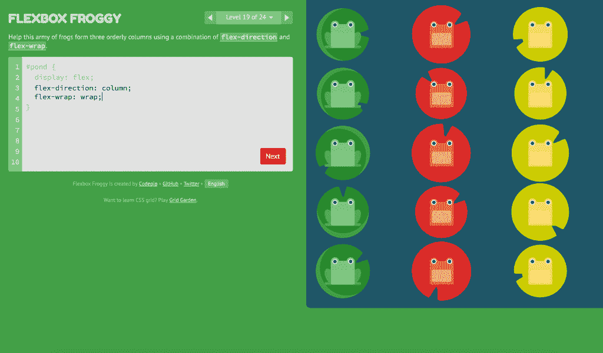

# 开源领导者:Thomas Park 使用 Flexbox Froggy 简化 CSS 开发

> 原文：<https://thenewstack.io/open-source-leaders-thomas-park-hops-easy-css-development-flexbox-froggy/>

下面的采访是“开源领导者”系列的一部分，在这个系列中，我们描述了开源 IT 社区中的项目领导者，以了解他们如何开发他们的软件，以及运行开源项目带来的挑战和好处。

[Thomas Park](https://www.linkedin.com/in/thomashpark/) 是 [Drexel 大学计算和信息学院](http://drexel.edu/cci/)的研究员，在那里他获得了人机交互和计算教育的博士学位。Park 的学术研究是 [openHTML](http://openhtml.org/) 的一部分，这是一个由 Drexel、Mozilla、国家科学基金会和内布拉斯加大学支持的合作研究项目，致力于设计更好的教育工具和实践，以帮助初学者学习 web 开发。

在空闲时间，Park 致力于他自己的开源项目——其中之一是 [Flexbox Froggy](http://flexboxfroggy.com/) ，可以说是网络上最好的，也绝对是最有趣的免费资源，用于学习 CSS3 Flexbox 布局模式的细节。Park 的动力来自于创造基于计算机的学习系统的热情，这种系统平易近人、引人入胜，最重要的是高效。《新堆栈》采访了 Park，以了解更多信息。

Flexbox Froggy 是一个游戏公园，作为一个交互式学习工具为初学者创建，以掌握 CSS3 的 Flexbox 布局模块。

**你是怎么开始编程的**？

我大学毕业后的第一份工作是在约翰霍普金斯大学天才青年中心的在线教育部门，设计和教授在线数学课程。不过，最终，我开始对寻找改进我们在那里使用的技术平台的方法感兴趣，这让我去了德雷克塞尔大学的研究生院。虽然我以前到处做过编程，但 Drexel 是我全力投入编程以及研究其他人如何学习编程的地方。这包括我的论文工作，在 Mozilla 基金会的实习，以及像 Bootswatch 和 Flexbox Froggy 这样的开源项目。

**你的开源项目统计数据是什么**？

我最受欢迎的开源项目是 [Bootswatch](https://github.com/thomaspark/bootswatch) ，这是一个针对 [Bootstrap](https://getbootstrap.com/) 的开源主题集合，Bootstrap 是 web 上最受欢迎的开发框架。Bootswatch 于 2012 年推出，已有数百万次下载。它在 GitHub 上有 52 个惊人的贡献者和 9250 颗星。

Flexbox Froggy 正在为学习 [CSS Flexbox](http://learnlayout.com/flexbox.html) 编写游戏，在 GitHub 上大约有 2175 颗星。超过 40 个贡献者已经将游戏本地化为 25 种语言，甚至包括世界语。[格子花园](http://cssgridgarden.com/)是一款与 Flexbox Froggy 一脉相承的新游戏，今年 3 月刚刚上线。它已经有 17 个开源贡献者。

**是什么激发了你创作这些项目**？

Bootswatch 在一个周末开始作为一个概念验证，演示如何通过修改和重建 [Less](http://lesscss.org/) 源代码来为 Bootstrap 框架换肤，以呈现非常不同的外观。很明显，从一开始，人们就发现了它的用处，所以我继续加强主题的收集并维护这个项目，一直持续到今天。

Flexbox Froggy 的灵感来自其他学习编码的游戏，如 [CSS Diner、](https://flukeout.github.io/)，当我在伦敦的 [Mozilla Festival](https://mozillafestival.org/) 上见到 CSS Diner 的创造者 [Luke Pacholski](https://github.com/flukeout) 时，我才真正开始工作。

**你非常努力地创造了三个非常著名，甚至有影响力的操作系统项目。你如何赚钱来获得所有投入的时间和精力的回报？**

我的项目主要是广告支持的。过去，我也通过项目产生了一些咨询和承包工作，尽管我现在更感兴趣的是直接参与我的项目。我正致力于在 Codepip 的旗帜下扩展像 Flexbox Froggy 和 Grid Garden 这样的游戏。

你的贡献之所以受欢迎，部分是因为它们似乎巧妙地填补了现有资源留下的一些空白。他们在满足什么需求？

Bootswatch 为开发人员的 Bootstrap 基于 Bootstrap 的站点提供了一个嵌入式解决方案，或者至少是一个创建自定义主题的起点。使用 Bootswatch 非常简单，只需下载一个 CSS 文件并替换 Bootstrap 附带的文件，因此即使是初学者也可以非常快速地创建一个设计良好且有吸引力的界面。

虽然有很多关于 CSS Flexbox 和 CSS grid 的令人惊叹的参考资料，但 Froggy 和 Garden 给人们提供了一种有趣、平易近人和交互式的学习基础知识的方式。交互性很重要，因为它允许人们修改代码，并获得对属性行为的直观感受。

<svg xmlns:xlink="http://www.w3.org/1999/xlink" viewBox="0 0 68 31" version="1.1"><title>Group</title> <desc>Created with Sketch.</desc></svg>