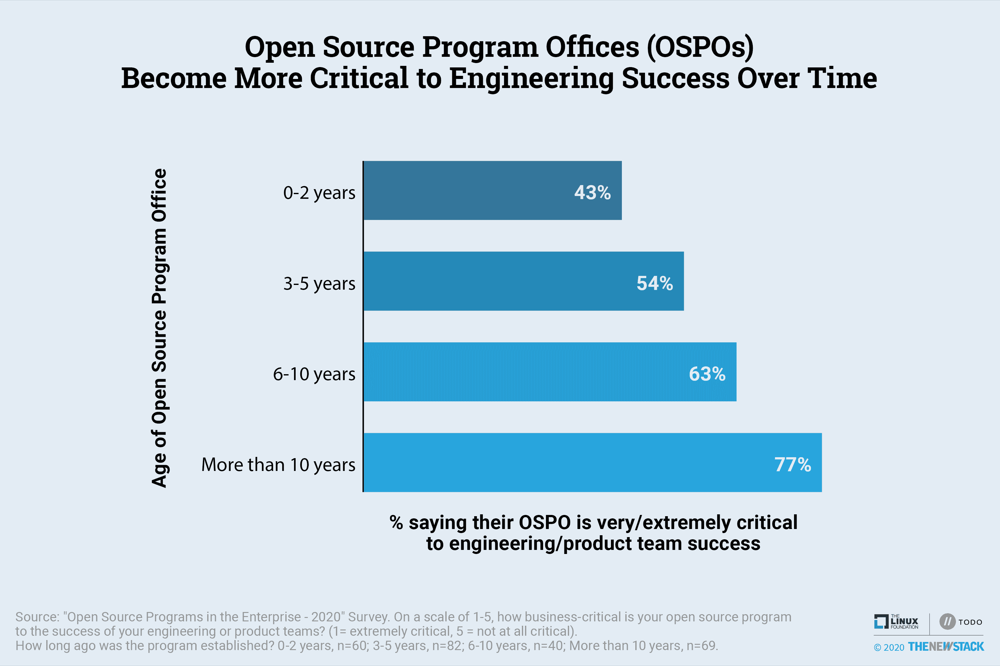
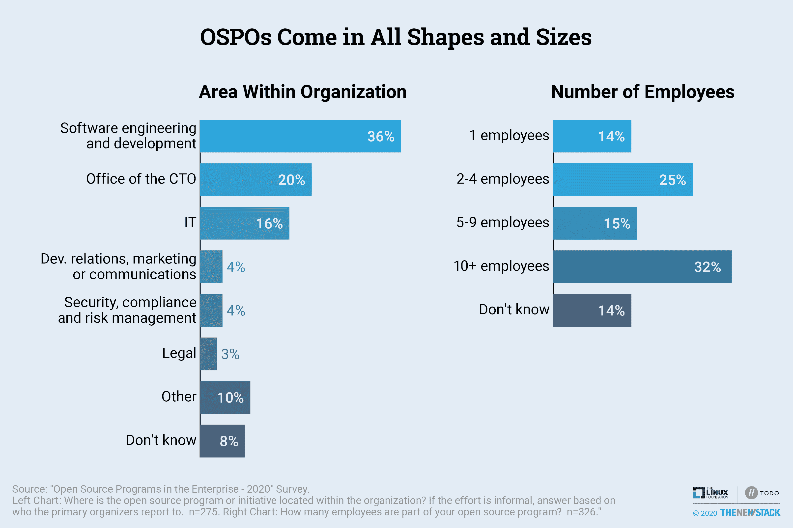

# 随着时间的推移，开源程序对工程越来越重要

> 原文：<https://thenewstack.io/open-source-programs-become-more-critical-to-engineering-over-time/>

Linux 基金会赞助了这篇文章。

第一代和第二代[开源项目办公室](https://thenewstack.io/does-your-organization-need-an-open-source-program-office/)(ospo)已经达成共识，他们对开发实践有积极的影响，支持创新，并且对工程和产品团队的成功至关重要。这个结论是基于我们的第三次年度[“企业中的开源项目调查”](https://github.com/todogroup/survey/tree/master/2020)，它是与 Linux 基金会的 [TODO 组](https://todogroup.org/)合作完成的。这项研究有 1000 多名参与者，但这些发现是基于在一个有开源项目或倡议的组织中工作的 325 人的详细信息。

OSPOs 的最大优势是:

1.  增加创新
2.  开源意识
3.  参与外部项目，以及
4.  更好的许可证合规性。

从更高的层面来看，该子集中 80%的受访者表示他们的 OSPO 对公司发展实践有积极的影响。一个回答者指出拥有一个“中央办公室来回答与开源相关的问题提高了开发者的生产力。”大多数受访者认为这些计划有助于他们的工程或产品团队，56%的人表示 OSPO 对这些团队的成功非常或非常重要。

与前几年相比，重视对产品和工程团队的影响的受访者略有下降，因此我们调查了为什么会出现这种情况。事实证明，老项目比新项目更有价值，这表明它们已经成功地融入了公司流程。

当这项研究在 2018 年开始时，36%接受调查的 OSPOs 不超过 2 岁，而 19%超过 10 岁。两年后，22%的人在年轻群体中，25%的人是长期退伍军人。虽然 43%的年轻组织表示 OSPOs 对工程团队来说是业务关键型的，但在最老的项目中，这一比例上升到了 77%。此外，OSPO 越古老，社区影响和安全就越有可能被视为益处。关于安全性，一个回答者告诉我们，“OSPO 定义了进口损失的政策，这使得为 oss 的使用修复 CVE 漏洞变得容易得多。”

不管他们有多老，创新和开源福音都来自 OSPOs。我们预计，随着最近创建的计划的成熟，更好的许可证合规性和安全性等更常见的好处将会更加突出。

* * *

## 其他发现

OSPOs 有许多形状和大小。这些工作中略多于一半的正式结构有专门的人时、报告结构和/或职称。OSPOs 有 35%的时间位于软件工程和开发部门，CTO 办公室(20%)和 IT 部门(16%)也托管计划。尽管这些特征通常不会影响项目的成功，但还是有一些显著的差异:

*   较低的支持成本是 55%位于 it 部门的 OSPOs 的首要优势，相比之下，普通受访者的这一比例为 32%。
*   位于 CTO 办公室的 OSPOs 更关注于影响开源社区。值得注意的是，增加对外部项目的参与是这些 OSPOs 中 59%的首要利益，而对于普通受访者，这一比例下降到 44%。
*   拥有正式 OSPOs 的受访者更有可能将许可证合规性作为首要优势(平均 50%对 41%)，而不太可能提及更好的安全测试和漏洞管理(平均 25%对 31%)。

此分析所基于的完整数据集可在找到。

VMware 是新堆栈的赞助商，并共同赞助了这项研究。

通过 Pixabay 的特征图像。

<svg xmlns:xlink="http://www.w3.org/1999/xlink" viewBox="0 0 68 31" version="1.1"><title>Group</title> <desc>Created with Sketch.</desc></svg>