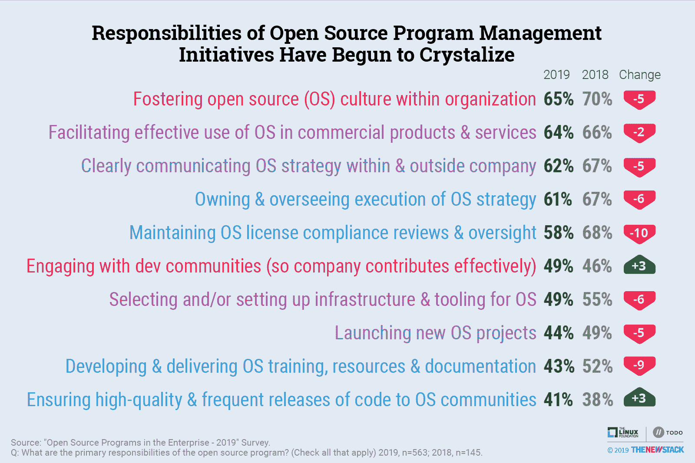
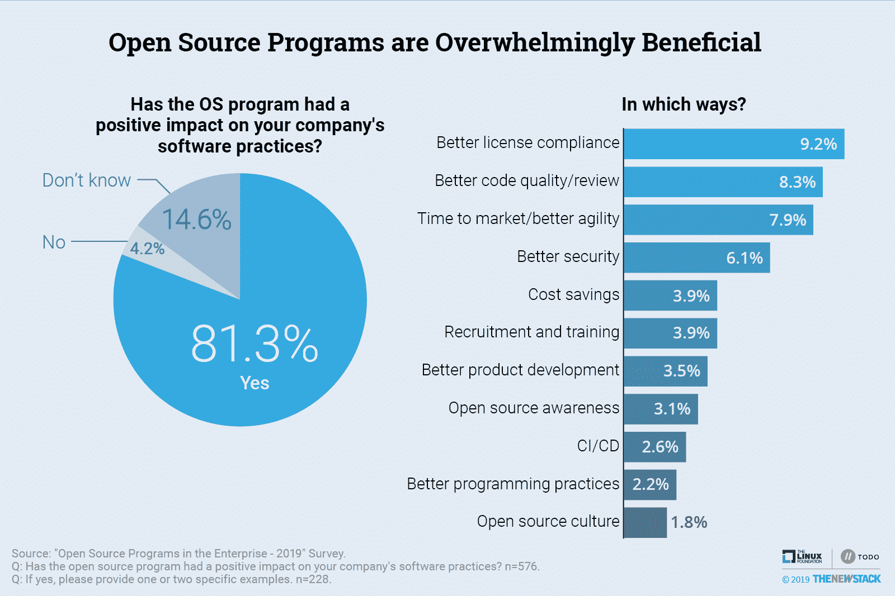
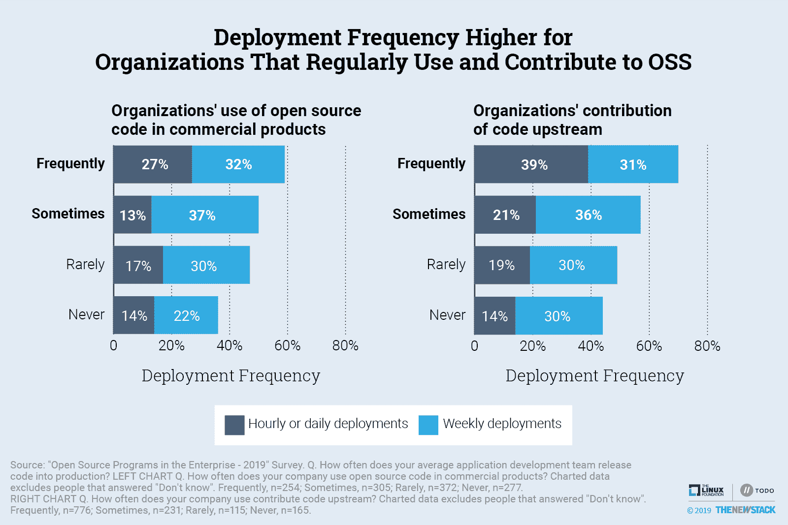
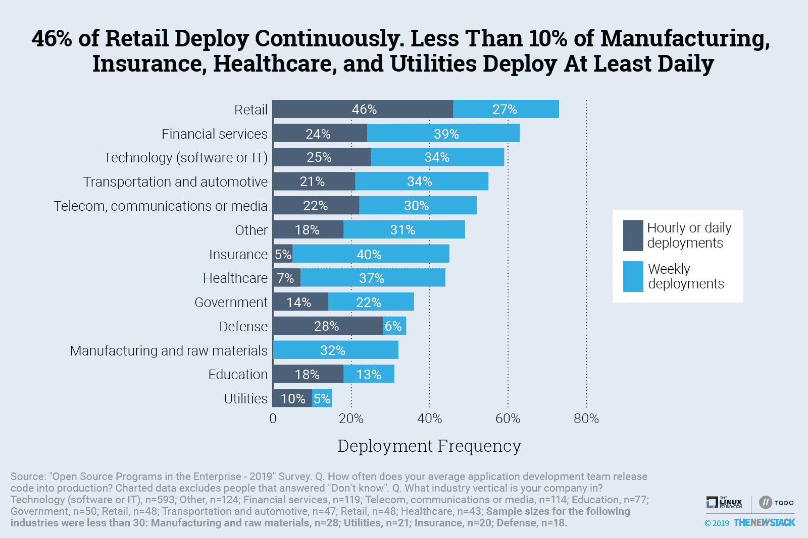

# 开源项目从法律转向工程生产力

> 原文：<https://thenewstack.io/open-source-programs-shift-from-legal-to-engineering-productivity-focus/>

根据对由 Linux 基金会的 TODO 组、VMware 和 New Stack 进行的开源调查的一项新分析，开源程序(也称为 OSPOs)现在主要由工程团队而不是律师推动，旨在完善工程实践和吸引开发人员，而不是简单地遵守许可要求。

长期以来，遵守开源许可一直是公司开始正式开源项目的一个原因。但随着自动化工具的出现，如 Linux 基金会的[开放链项目](https://www.openchainproject.org/)、[软件包数据交换](https://spdx.org/) (SPDX)和 [FOSSology](https://www.fossology.org/) 改善了代码扫描和合规性，以及现代商业工具如 FOSSA 和 Snyk。

开源管理中的挑战和机遇现在在于组织驾驭开源文化的能力，这种文化通过协作开发实践来奖励代码审查。如果做得好，开源项目会培养开源实践，并带来更具弹性、创新性和差异化的架构，提高代码质量和安全性，以及更快的产品和服务上市时间。反过来，这些改进可以帮助吸引新的开发人员。

公司现在正在组建开源办公室，这样他们就可以为开源项目增加更多的开发人员。这是真的，尤其是在技术领域，它引领着开源办公软件的创建，以及开源软件的使用和贡献。但随着软件开发扩展到科技领域之外，这种趋势也出现在其他垂直行业。

各行各业的高管都意识到，为他们的商业产品所依赖的开源项目做贡献是明智的商业行为，也是简单明了的经济行为。开源社区是一个分散的劳动力池。这允许公司快速采用现代软件实践，例如连续交付。现在对开源项目办公室在吸引那些明确受雇于开源项目的开发人员方面的重要性有了深刻的认识。

## 工程实践随着开源程序而改进

随着开源程序的好处变得越来越明显，开源程序办公室的创建正在兴起。与开源开发和管理最密切相关的工作角色已经从法律部门转移到了工程部门。

开源项目主要职责的转变就是最好的证明。在我们的 2018 年开源调查中，维护许可证合规性是受访者提到的开源项目办公室的第二大责任。它在 2019 年排名第五，但降幅最大，从 2018 年的 68%降至 2019 年的 58%。

向工程重点的转变也明显体现在公司如何定义他们项目的成功。调查对象现在主要通过采用或使用公司创建的开源项目来衡量成功。

开源办公室的焦点向工程实践的转移产生了良好的效果。超过 80%的受访者表示，他们的开源项目对他们公司的软件实践产生了积极的影响。许可证合规性仍然是最大的影响，9%的受访者看到了这一好处。但是更好的代码质量紧随其后(8%)，随后是更好的上市时间/更好的敏捷性和更好的安全性。

使用开源项目并向上游做出贡献的公司也更有可能更频繁地部署代码。在我们的研究中，39%经常参与上游项目的公司至少每天部署一次，相比之下，那些从不参与的公司只有 14%。

随着公司在商业产品中使用开源代码的增加，他们至少每周部署一次的可能性也在增加。同样，每天至少部署一次的公司更有可能在商业产品中频繁使用代码——61 %,而其他公司只有 48%。

## 部署速度更快的行业

每天部署的公司倾向于使用开源，向上游贡献，并且有更现代的开发实践。这些公司中最大的一些有开源程序来管理和改进这个过程。

云本地架构是由软件公司开发的实践定义的。近年来，垂直市场中的更多公司已经转向云原生架构来开发他们自己的大规模软件开发、部署和管理实践。需要云原生架构的实践在很大程度上依赖于开源技术，这表明软件开发现在是任何公司如何看待其业务的核心。软件是商业的核心，开源是构建软件的基础。

在云原生环境中，越来越多的公司出于同样的原因，正在开发与软件行业领导者相同的开源实践。不管什么垂直，需求都是给开发者的。让开发者开心取决于许多因素，但是最重要的是让他们能够使用开源软件。推动云原生架构的动力正在推动公司对专用开源项目办公室的持续需求。

我们已经到了这样一个地步，你的垂直行业是什么并不重要。这些实践将为软件开发编纂法典。理解开源程序发展的最好方法是研究由开发者领导的 DevOps 运动以及他们开发应用程序的速度。这带来了更高的效率和云原生技术的发展。软件公司带头冲锋，现在其他垂直行业的公司也在跟进。我们最终会达到软件实践在各个垂直领域都相同的地步。商业视角将使他们与众不同，并使软件团队更加高效和创新。

22%的调查受访者表示他们每小时或每天部署一次，他们还分享了几个 [firmographic](https://en.wikipedia.org/wiki/Firmographics) 特征。值得注意的是，拥有超过 10，000 名员工的组织(28%)和与零售相关的组织(46%)更有可能频繁部署。由于大型公司通常有繁重的过程，会延迟随需应变的软件交付，他们可能实际上没有进行连续的部署，但是这并不意味着他们的开发过程没有改进，特别是就平均开发团队至少每天甚至每周部署而言。事实上，凭借其可观的资源，大型企业往往是技术趋势的早期采纳者。

“ [2019 加速开发状态](https://cloud.google.com/devops/state-of-devops/)”报告发现，零售业是唯一一个在软件部署指标方面有显著改善的行业。我们同意报告的评估，即竞争压力使得灵活更新面向客户的应用程序成为必要。零售公司很早就接受了 A/B 测试，这意味着他们也有可能成为特性标记的主要用户，这是一种测试和发布模式，通常由开发运维实践最成熟的公司使用。

对实时软件部署的需求也出现在国防行业的受访者中，28%的受访者表示他们至少每天部署一次。然而，他们平均只有 6%的开发团队每周部署到生产中。这表明，对于最重要的国家安全系统来说，速度是有价值的，但与此同时，政府的风险规避可能会减缓开发商的速度。

遵守法规的需要似乎不会显著影响不同行业将代码部署到产品中的速度。与大多数行业相比，制造业和原材料行业受到的监管较少，但没有一个调查对象按小时或按天部署。行业的数字化程度可能是不同部署率的更好解释。即使一家石油公司或一家涡轮机制造商已经采用了一些信息技术，它也可能不需要部分快速的部署周期，因为其产品不是以数字方式交付的。

## 更多关于行业的观点

行业垂直市场有不同的模式，在这些模式中他们已经接近开源。传统上，由于法律和安全问题，受监管的行业采用开源技术的速度较慢。对于大多数行业来说，随着对开放源码许可和合规性的认识和接受程度的提高，法律障碍似乎至少部分被克服了。

可以理解的是，遵守有关患者数据的法规可能会使部署软件的速度低于平均水平，上图表明只有 7%的医疗保健公司每小时或每天进行部署。监管环境会影响使用开源软件的决定，这不太合乎逻辑，然而医疗保健行业中只有 34%的受访者经常在商业产品中使用开源软件，相比之下，研究的平均比例为 50%。

一般来说，使用开源代码的公司也更有可能为上游项目做出贡献。软件、IT、电信和媒体公司在开源的采用和贡献方面都处于领先地位。可以理解的是，这些行业的公司也更有可能创建了一个开放项目办公室，或者至少是正式的开源政策。

## 未来的研究

风险规避和竞争压力解释了不同行业之间开源采用和部署速度的差异。单纯说一个行业被监管，不应该意味着这个行业在创新和发展速度上必然落后。

大多数专家认为利用别人的代码可以节省时间，但是维护和集成问题可能会使这些收益化为乌有。将开放源码的使用或开放源码程序的存在孤立为提高开发速度的主要原因或促成因素是困难的，但这不应该阻止研究人员的尝试。

同样，DevOps、开源和云原生最佳实践如此紧密地交织在一起，以至于很难确定它们对开发速度、安全性和其他好处的独立影响。

2020 年版的调查将努力应对这些挑战。它的目标是量化开放源码提高整体代码质量和开发速度的程度。我们邀请您参与下一份调查问卷[。](https://github.com/todogroup/survey/tree/master/2020)

<svg xmlns:xlink="http://www.w3.org/1999/xlink" viewBox="0 0 68 31" version="1.1"><title>Group</title> <desc>Created with Sketch.</desc></svg>