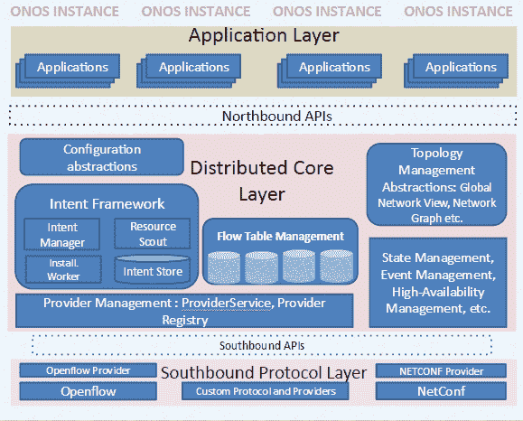
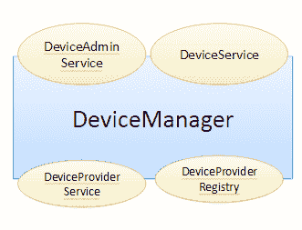
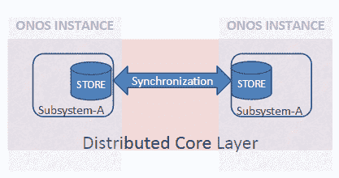
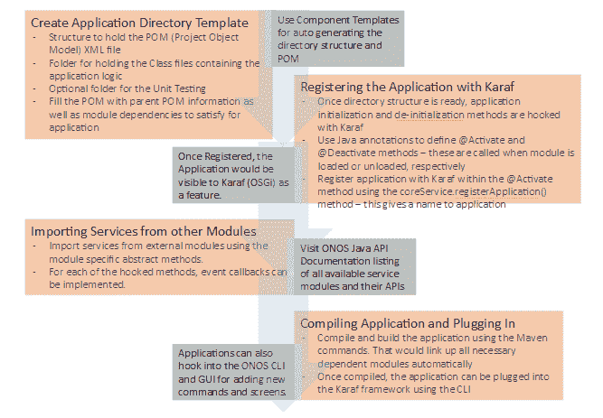

# SDN 系列第七部分:ONOS

> 原文：<https://thenewstack.io/open-source-sdn-controllers-part-vii-onos/>

这是我们软件定义的网络系列的第七部分。该系列的其他故事可以找到

[here.](https://thenewstack.io/?s=sdn)

形成 SDN 生态系统核心的先驱们于 2011 年聚集在一起，成立了开放网络研究中心(ONRC)和开放网络实验室( [ON。实验室](http://www.technicalexpressions.com/files/ON.LAB-acrobat-com.pdf)。根据该网站，ONRC 是斯坦福大学的一部分。实验室开发、部署和支持开源 SDN 工具和平台。

本文的主题——开源 SDN 控制器——开放网络操作系统(ONOS)就是 ON.Lab 的成果。ONOS 是一个分布式系统，是一个专为可扩展性和高可用性而设计的 SDN 控制器平台。通过这种设计，ONOS 将自己设计成一个网络操作系统，将广域网(WAN)和服务提供商网络的控制和数据平面分离开来。虽然 ONOS 是一个相对较新的控制器，但在 wiki.onosproject.org 可用的文档数量确实值得称赞。然而，我们对 ONOS 的了解相对较少，随着我们在 ONOS 上花的时间越来越多，这篇文章将来可能会更新。但是在我们详细描述 ONOS 之前，我们将首先介绍三个主题来帮助读者理解 ONOS 的设计原则:

*   基于意图的网络
*   分布式控制器体系结构
*   SDN 和服务提供商

## 基于意图的网络

牛津将意图定义为“一个[目标](http://www.oxforddictionaries.com/definition/english/aim#aim)或[计划](http://www.oxforddictionaries.com/definition/english/plan)或[目的。在过去的几年里，这个术语已经进入了网络领域。惠普的 Dave Lenrow 说](http://www.oxforddictionaries.com/definition/english/purpose)[意图是关于“什么”，而不是“如何”。他以一个有趣的问题开始了他的论点:“如果我们可以描述分布式工作负载的行为，而不是描述我们希望如何配置网络，会怎么样？网络管理员不需要详细的网络配置专业知识，也不需要了解网络协议和设备接口，他们只需要指定分布式工作负载的行为和通信要求。”](https://www.opennetworking.org/?p=1633&option=com_wordpress&Itemid=316)

为了更详细地理解这一点，并理解 Lenrow 的问题，让我们首先来看看特定于应用程序的策略，这些策略可以被视为应用程序意图的声明(或描述)。它们通常与具有不同要求的应用程序的网络设计相关，例如，三层应用程序包括一组通过应用交付控制器(ADC)连接到公共互联网的 Web 应用程序服务器，并使用一组数据库服务器作为后端数据存储。通常，策略(例如:互联网和服务器之间的流量必须通过一组防火墙规则)是一组定义好的规则，决定网络中数据包流的所有方面。为了实施这样的策略，需要进行配置，这可能是非常低级的和特定于供应商的:物理网络基础设施、端点和设备[1，2]。这种配置取决于具体的物理网络拓扑和技术，以及安装的管理工具和流程。因此,(端点和接口的)配置会直接影响连通性。为了提供敏捷性和简单性，我们需要一种机制(例如，一种语言)来描述连接的抽象意图。通过这种机制，用户不需要大量的网络知识来描述连接性要求。此外，这种意图应该与网络转发语义相分离，以便最终用户能够以这样一种方式描述策略，即策略的改变不需要影响转发行为，反之亦然[1]。

因此，强调用户关注他们的意图——“他们想要什么”，而不是“他们想要如何实现”——并允许网络层找出如何实现意图的趋势在过去几年中变得突出。意图驱动系统的目标是将焦点从网络细节转移到分布式网络应用程序的需求上。下面列出了一些我们会发现使用“意图”的作品——读者需要参考这些解决方案来更深入地挖掘基于意图的网络:

1.  [IBM 的 Dove](http://researcher.ibm.com/researcher/files/zurich-DCR/An%20Intent-based%20Approach%20for%20Network%20Virtualization.pdf) :基于意图的网络虚拟化方法[1]
2.  基于组的策略(GBP):open stack 的意图驱动策略 API 或思科的以应用为中心的策略模型，使用[基于组的策略](https://wiki.openstack.org/wiki/GroupBasedPolicy%20)，或通过 Puppet Enterprise 基于意图的网络自动化。

总之，术语“基于意图”指的是属性，其中管理抽象与网络的功能相关，允许人们表达、形式化和验证它。

## 分布式 SDN 控制器架构

考虑到关于控制器的作品数量——包括开源和商业作品——突出了这样一个事实，即控制平台是 SDN 范式的关键推动者。构建生产质量控制平台的一些最重要的挑战是可伸缩性和可靠性[3]。控制平面可扩展性——网络控制平面作为分布式系统实施——一直是 SDN 的热门研究课题之一。为了强调分布式架构的重要性，研究人员认为控制器如何管理网络信息通常决定了系统的可扩展性和可靠性[4]。例如，随着网络中网络元件(交换机/接口)数量的增加，非分布式网络信息库(NIB)可能会耗尽系统内存。此外，在某些情况下(如交换机故障)，网络事件和相应处理过程的数量可能会呈指数级增长，从而使单个控制器实例的 CPU 使用率达到饱和[3]。为了支持这种可扩展性和可靠性要求，已经提出了各种分布式 SDN 控制器架构提案，其中运行多个控制器平台实例来管理网络。他们如何互动，如何分享信息，等等。在不同的溶液中是不同的。有各种技术，如分区/分片、聚合、复制等。，用于不同的工作。下面，我们列举了有关分布式 SDN 控制器架构的不同作品，其详细信息可从包含的参考资料中获得:

*   Onix:用于大规模生产网络的分布式控制平台[3] — ONIX 是作为一个平台提出的，在这个平台之上，网络控制平面可以作为分布式系统来实现。
*   HyperFlow:OpenFlow 网络的分布式控制平面[4]–为 OpenFlow 提出了一个逻辑上集中、物理上分布式的基于事件的控制平面。
*   Kandoo:控制器的分层分布[5] —提出了两层控制器，其中底层控制器仅运行本地控制应用程序，并且不具有互连或网络范围状态的知识，顶层是维护网络范围状态的逻辑集中式控制器。
*   DISCO:分布式多域 SDN 控制器[6]–提出了一个开放且可扩展的分布式 SDN 控制平面，能够应对现代覆盖网络和广域网的分布式和异构特性。
*   ElastiCon:迈向弹性分布式控制器架构[7] —提出控制器池，根据流量情况动态增长或收缩，工作负载在控制器间动态分配。
*   Pratyaastha:一个高效的弹性分布式 SDN 控制平面[8] —提出了一种新的方法，用于将 SDN 交换机和 SDN 应用状态的分区分配给分布式控制器实例。

## SDN 和服务提供商网络

在过去的几年中，我们看到移动设备数量的快速增长，这导致了流量的指数级增长、大量有趣的额外服务以及服务提供商对云和基于云的服务的采用。服务提供商依靠丰富、可靠和差异化的服务来创造收入和留住客户，不断的服务创新是在云战场上取胜的唯一途径。因此，正如 ONOS 白皮书[9，10]所述，服务提供商:

1.  探索使其网络变得灵活高效的可能性，以应对这些指数级带宽需求的挑战。
2.  希望通过创新服务和新的业务模式创造收入流。
3.  希望利用技术创新降低资本支出和运营支出。

为了应对这些挑战，服务提供商必须重新思考他们的网络[9]。软件定义的网络已经成为一种范式，它有可能通过提供云式的灵活性和创新以及恢复经济活力来转变这些网络。许多服务提供商，如 NTT、美国电话电报公司等。已经采用 SDN 和 NFV 来提高其网络的价值。“SNS research 估计，到 2020 年，SDN 和 NFV 可以帮助服务提供商(有线和无线)每年节省高达 320 亿美元的资本支出。”[10]

## ONOS——开放式网络操作系统

引入上述三个概念的原因是它们构成了 ONOS 控制器平台设计原则的核心。ONOS 是一个可扩展的分布式控制器平台，面向服务提供商网络和服务提供商的要求，例如策略驱动的网络可编程性和对运营商友好。

ONOS 认为，为服务提供商建立一个控制平台涉及到解决困难的分布式系统问题，以满足高可用性、横向扩展和性能的要求。除了这三个关键属性(可用性、可扩展性和高性能)之外，ONOS 还致力于在南向接口支持多种协议，以与不同的设备进行通信，并在北向接口公开正确的 API，以满足服务提供商使用案例和应用程序开发人员的需求。

图 1 显示了 ONOS 的架构。从图中，我们可以看到存在多个 ONOS 平台实例，突出了系统的“分布式”本质。ONOS 架构可以被视为多个“子系统”(也称为服务)的三层集合，其中每个子系统实现一项服务，并作为三个不同层(应用层、核心层和南向协议层)中的组件的组合来实现。一些示例子系统是集群、设备、分组、流规则、路径、链路、主机和意图。在这一节的剩余部分，让我们详细看看 ONOS 的每一层。

## 北上申请

与其他控制器类似，ONOS 平台确实被设计为支持各种应用类别，如控制、配置和管理应用。在上发布的应用程序中。实验室，其中一些是分段路由、多层 SDN 控制、拓扑查看器、路径计算和 SDN-IP 对等应用。[9,10,11,12]

与其他控制器类似，应用程序通过发送和接收命令请求和响应以及事件处理来处理核心层的信息。ONOS 核心层公开了两个接口，AdminService 和 Service，应用程序使用这两个接口来处理核心中不同服务组件管理的信息。每个应用程序使用其名称向 CoreService 注册，CoreService 又向应用程序提供一个惟一的 ApplicationId。ONOS 使用这个标识符来跟踪与应用程序相关的任务和目标，比如意图和流规则。

图 1: ONOS 架构

## 分布式核心层

### 意图框架

正如开始所解释的，ONOS 提供了这种策略驱动的编程框架，使用户能够指定他们需要什么，而不必担心它将如何在底层网络上实例化——从更高层抽象网络复杂性。

意向框架是 ONOS 核心中的一个子系统。这些意图，基于策略的指令，被翻译和编译成安装在网络设备上的特定指令。可以根据网络资源、约束、标准和指令来描述意图。除了翻译和编译之外，该框架还包括对管理网络条件变化和跨意图优化的支持，包括通过意图的组合实现复杂的功能。如图 1 所示，这个功能由四个不同的子组件实现:意图管理器、安装工人、意图存储和资源侦察。该框架主要包括意图编译器和协调器，其中意图编译器将意图翻译成更特定于网络环境的可安装意图，协调器确定必须如何对网络进行编程，包括在设备/资源级别的安装顺序。

### 拓扑管理和全局网络视图

ONOS 还提供网络图和整个网络的视图，作为北向抽象。这种全球网络信息在逻辑上是集中的，尽管它在物理上分布在多个服务器上。全局网络视图是根据每个 ONOS 实例发现的网络拓扑和状态构建的，例如交换机、端口、链路和主机信息。网络视图数据模型通过解决方案的组合来实现，例如 Titan [13]图形数据库、Cassandra [14]用于分发和持久化的键值存储以及 Blueprints graph API，以向应用程序公开网络状态。[12]

### ONOS 分布式核心:可扩展性、高可用性和性能

ONOS 的分布式核心旨在实现可伸缩性、高可用性和性能，包括不同的先进分布式系统技术，如下所述。下一节——ONOS 集群——将详细描述其中一些技术的用法。

1.  ONOS 包括一个反熵协议(一种基于[流言的协议](https://en.wikipedia.org/wiki/Gossip_protocol))来实现控制器的多个实例之间的同步。
2.  有多个数据库具有高可用性、可靠的事务、可伸缩性和性能改进方法，如复制技术、强一致性和分区。ONOS 包括所有这些技术，还包括[最终一致性模型](https://en.wikipedia.org/wiki/Eventual_consistency)，它非正式地保证如果没有对给定数据项进行新的更新，最终对该项目的所有访问都将返回到上次更新的值。
3.  [矢量时钟](https://en.wikipedia.org/wiki/Vector_clock)，一种在分布式系统中生成事件偏序的方法，在 ONOS 中使用。进程间交换的消息包含发送进程的逻辑时钟(或多个进程的逻辑时钟数组)的状态，这有助于生成部分排序。
4.  有许多技术，如分布式排队和队列共享组，许多研究人员已经用来提高系统的可用性。在 ONOS 中，HA 执行由分布式队列支持。
5.  ONOS 使用[hazel cast](http://www.hazelcast.org)——一种基于 Java 的内存开源软件数据网格——来进行集群成员管理。

### 其他管理器:设备、数据包、流规则、路径、链路、主机管理器

这些管理器中的大多数都包含一个功能，它实现并与南行提供者和北行应用程序进行交互。例如，DeviceManager 能够通过 DeviceProviderService 和 DeviceProviderRegistry 接口与多个南向提供者接口，并通过 DeviceService 和 DeviceAdminService 接口与多个北向侦听器接口，如图 2 所示。

图 ONOS 的设备子系统/服务管理器架构

## 可插拔南向:提供者和协议

ONOS 支持多种南行协议——Openflow、NetConf 等。，用于与各种网络设备通信。与其他控制器(例如 ODL)类似，ONOS 使用提供者的概念——每个南行协议一个提供者——这向控制器平台的其他组件隐藏了协议复杂性(任何协议特定的行为或要求)。这些提供商向核心层提供所有必要的网络元素“描述”。术语“可插拔”强调了这样一个事实，即任何人都可以开发自己的特定于设备/协议的提供者，并向 core 注册。在注册之后，提供者和核心通过(a)由提供者向核心通知新事件(设备连接，packet_in)作为描述(不可变且短暂的消息，包含它所描述的对象的 URI)来彼此通信；以及(b)在提供商的控制下从核心向元件发布命令。

类似于北向接口的应用程序标识符，ONOS 也使用 ProviderID 的概念，它被分配给南向接口中的每个提供者。ProviderID 用于唯一标识和设备的正确映射。最后，从子系统的角度来看，多个提供者(通常指定为主提供者和辅助提供者)可能与单个子系统相关联。一个设备子系统支持多个提供商。

## ONOS 星团

与其他控制器不同，在 ONOS 中，分布式架构支持是设计原则之一，而不是事后支持。ONOS 也类似于上面分布式 SDN 控制器架构一节中描述的五到六种分布式架构。也就是说，ONOS 可以被部署为控制器-服务器的集合，这些控制器-服务器相互协调以实现弹性、容错和更好的负载管理。在现有的分布式体系结构中，存在各种挑战，如主机选择、网络状态分配和管理等。分布式控制器体系结构解决了很多问题。让我们以“集群协调”作为案例研究。每个实例都知道网络状态的子集，并且由管理子集的实例作为事件在集群的其他成员之间共享(图 3)。因此，生成事件的不同子系统(服务)存储包括一个分发机制。例如，集群子系统管理加入和离开集群的节点——这是使用 Hazelcast 的分布式结构(强一致性)实现的。类似地，链路和主机管理使用乐观复制技术和 gossip 协议来确保最终的一致性(注意，为了最终的一致性，事件部分地用向量时钟排序)。

图 3: ONOS 分布式存储同步

在群集(多实例)环境中，可能会出现各种故障，从一个节点的完全故障(崩溃)到群集中的一个节点无法从其对等节点接收更新。为了解决这些问题，ONOS 使用了反熵机制等方法，该机制基于 gossip 协议和节点的定期探测。

## 在 ONOS 中编写应用程序

与典型的 Maven 项目非常相似，ONOS 也是使用项目对象模型(pom.xml)绑定在一起的 Java 类文件的集合。ONOS 本质上是一个符合 OSGi 标准的框架，使用 Karaf 作为框架实现，将编译 Maven 包后创建的 jar 文件绑定在一起。pom.xml 文件通过保存关于包的依赖关系的信息来提供所有的绑定胶水，这由 OSGi 在模块加载时满足。

ONOS 项目团队提供了精心编写的文档，其中包括详细 API 列表的基础教程。因此，本文没有重复这些信息，而是展示了编写应用程序的整个过程的鸟瞰图。

为 ONOS 编写应用程序可以通过表示各种重要步骤的流程图来理解，如下所示:

图 4:典型的 ONOS 应用程序开发工作流

### 创建 ONOS 应用程序的步骤:

*   如上所述，ONOS 使用 Karaf 来实现 OSGi 框架，将应用程序分解成包。第一步是为这样一个包创建目录布局。这个目录布局将包含 pom.xml 文件和保存核心逻辑的各种 Java 类文件。
    *   pom.xml 文件放在这个目录结构的根目录中。它还包含对作为父 pom 的 ONOS 根 pom.xml 的引用。任何典型项目的框架目录布局都可以通过使用组件模板来自动化。
*   所有用 ONOS 编写的应用程序都需要使用像@Activate 或@Deactivate 这样的注释将它们的代码粘在 Karaf 上。这些注释充当了 Karaf 在各种事件中调用应用程序的 java 代码的钩子，比如包的加载和卸载。这些调用对于设置必要的变量、挂钩其他服务和启动应用程序逻辑非常重要。然后，下一步是用这些注释创建入口和出口函数，以允许 Karaf 加载您的应用程序。
*   要注册 Karaf 可用的其他服务，请在使用 org . onos project . core . core service 包的 coreservice . register application()方法的 startup 方法中，使用 Karaf 可以识别的唯一名称注册应用程序。
    *   在启动和清理方法中，请求 Karaf 提供应用程序需要使用的所有服务。例如，应用程序可能需要将 ONOS 收到的数据包传递给它——packet Processor 接口需要作为“处理器”添加。
*   一旦框架准备好与 Karaf 粘合，就该写你的核心逻辑了，也就是商业逻辑。这一部分是在 Java 文件中完成的，然后这些文件将被编译成适当的类文件。代码完成后，使用 Maven 命令构建/编译应用程序。
    *   Maven 将负责编译所有的应用程序 java 文件，链接所有的依赖包，或者下载那些在本地不可用的包。
    *   一旦 Maven 过程完成，Java 档案(jar)将被放在 ONOS 文件夹中的一个位置，供 Karaf 在没有开发人员干预的情况下获取。
*   最后，使用 ONOS CLI 启动应用程序。“功能:安装<application name="">命令。</application>

## 参考

[1]科恩，r；IBM 研究实验室。，以色列海法；k .巴拉巴什；Rochwerger，b；Schour，l .，“基于意图的网络虚拟化方法”，2013 年 IFIP/IEEE 集成网络管理国际研讨会(IM 2013)，2013 年 5 月 27-31 日。
[2] Thomas Graf，利用 OVS 和厂商中立硬件卸载的意图驱动网络，2014 年 OVS 会议
[3] T. Koponen 等人，“Onix:大规模生产网络的分布式控制平台”，2010 年，OSDI。
[4] A. Tootoonchian 和 Y. Ganjali，“Hyperflow:Openflow 的分布式控制平面”，INM/雷恩，2010 年。
【5】1S。H. Yeganeh 和 Y. Ganjali，“Kandoo:有效和可扩展的控制应用卸载框架”，HotSDN，2012 年。
【6】k . phe mius、M. Bouet 和 J. Leguay，“DISCO:分布式多域 SDN 控制器”，CoRR，arxiv.org/abs/1308.6138,卷 2013
【7】Advait Dixit、方浩、Sarit Mukherjee、T.V. Lakshman 和 Ramana Kompella。2013.弹性分布式 SDN 控制器。SIGCOMM 计算机。Commun。修订版 43，4(2013 年 8 月)，第 7-12 页。
[8] Anand Krishnamurthy、Shoban P. Chandrabose 和 Aaron Gember-Jacobson。2014.一种高效的弹性分布式 SDN 控制平面。在“第三届软件定义网络热点问题研讨会会议录*”*(Hot sdn’14)。美国纽约州纽约市 ACM，133-138。
【9】上。实验室白皮书，“推动服务提供商网络采用 SDN”，2014 年。
【10】上。实验室白皮书《ONOS 简介——面向服务提供商的 SDN 网络操作系统》，2014 年。
[11] Prajakta Joshi，“ONOS 简介”，网上研讨会，2014 年 http://www . opennet summit . org/ons-inspire-webinars-on lab-ONOS-nov11 . PHP
[12]Pankaj Berde、Matteo Gerola、Jonathan Hart、樋口裕太、Masayoshi Kobayashi、Toshio Koide、Bob Lantz、Brian O'Connor、帕芙琳·拉多斯拉沃夫、William Snow 和古鲁·帕鲁卡尔。2014.ONOS:走向开放的分布式 SDN 操作系统。在“第三届软件定义网络热点专题研讨会会议录”(HotSDN '14)中。美国纽约州纽约市 ACM，1-6。
【13】泰坦分布式图形数据库。http://thinkaurelius.github.io/titan/.
[14]拉克什曼和 p .马利克。Cassandra:一个分散的结构化存储系统。ACM SIGOPS 操作系统评论，44(2)，2010 年。

斯里达尔于 2007 年获得新加坡国立大学计算机科学博士学位；他于 2000 年在印度苏拉塔 KREC 获得计算机科学硕士学位；并于 1997 年 8 月从印度班加罗尔大学 Tumkur 的 SIT 获得仪器仪表和电子工程学士学位。他在印度 SRM 研究所担任研究主管；意大利都灵理工大学微软创新中心博士后研究员；也是新加坡资讯通信研究所(I2R)的研究员。他从事过各种开发和部署项目，涉及 ZigBee、WiFi 和 WiMax。斯里达尔目前在 NEC 技术印度有限公司担任集团技术专家。斯里达尔的研究兴趣主要在于下一代有线和无线网络领域，如 OpenFlow、软件定义网络、面向认知网络的软件定义无线电系统、Hotspot 2.0 和物联网。

<svg xmlns:xlink="http://www.w3.org/1999/xlink" viewBox="0 0 68 31" version="1.1"><title>Group</title> <desc>Created with Sketch.</desc></svg>