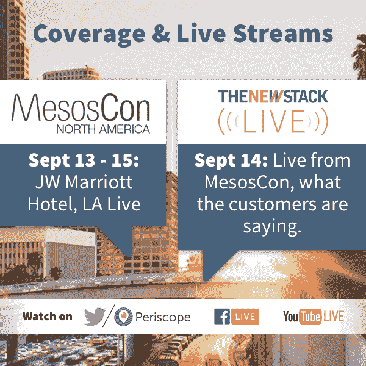

# 开源峰会:Kubernetes 作为新的 Linux

> 原文：<https://thenewstack.io/open-source-summit-kubernetes-new-linux/>

尽管 Linux 基金会庆祝其开源操作系统内核的持续成功，但不断变化的技术格局可能会将操作系统推到一边，将另一个玩家放在众所周知的新基础设施堆栈的中心:容器编排引擎。因为编排引擎让开发人员考虑应用程序本身，而不用担心底层的操作系统。

“Linux 已经进入了每一个市场，它已经完全占据了主导地位，”本周在洛杉机举行的[开源峰会](http://events.linuxfoundation.org/events/open-source-summit-north-america)上，[的吉姆·泽姆林](https://twitter.com/jzemlin)指出。超级计算机、嵌入式系统、大型机、云计算服务由 Linux 主导，移动市场也是如此，基于 Linux 的 Android 占据了 82%的市场份额。

对于 Linux，目前有 4300 名开发人员在开发代码库，每天增加 10000 行代码，修改 2000 行代码，删除 2500 行代码。代码库每小时变化八次。

Zemlin 声称，今年，Linux 第一次在本地企业服务器市场取代了 Unix，仅次于 Windows。今年 3 月，很大程度上得益于 Android，基于 Linux 的客户端现在占据了互联网客户端的大多数，首次超过了 Windows。

“你知道这意味着什么吗？”泽姆林问道。没错，2017 年是 Linux 桌面的第[年](https://www.reddit.com/r/linux/comments/3038d4/when_was_the_first_year_of_the_linux_desktop/)，他说，这让观众非常开心。

但是，即使 Linux 享受了另一个隐喻的胜利，它发现自己在我们正在出现的[云原生时代](/category/cloud-native/)中，越来越多地扮演一个新的，也许是被削弱的角色。

在一次开源峰会上， [Daniel Riek](https://twitter.com/llunved) ，一位 Red Hat 系统设计和工程的高级主管，解释说由于容器和云原生技术，Linux 发行版的角色正在彻底改变。

那些已经在这个行业呆了一段时间的人总是认为，在现代软件栈中，操作系统是基础设施的关键部分。然而，云计算的原生观点将应用作为中心，使得操作系统的主要角色与基础设施分离。相反，操作系统的目的只是为应用程序提供一个公共运行时。

Linux 发行版在很大程度上是第三方库和软件包的集合，一旦安装在 PC 或服务器上，往往不会得到更新。RPM 和 up2date、yum 和 apt 等二进制打包方案提供了一种跨服务器标准化部署的方法，尽管这也导致了依赖地狱，用户永远无法使用该库的正确版本或发行版上可用的应用程序，或者一台机器可能需要同一库的两个冲突版本。

虚拟机为流程带来了一些统一性，允许组织构建预构建的映像，基本上是在每个虚拟机上放置一个服务。虚拟机使得跨不同服务共享硬件变得更加容易。此外，单个虚拟机可以跨开发、测试和生产运行。这在一定程度上减少了依赖性，尽管它造成了虚拟机蔓延的新问题，即虚拟机在完成其最初目的后仍将长期运行。

“你转向集中控制来解决你在这么多机器上遇到的可扩展性问题，”Riek 说。这种大规模管理的问题是，修补软件包的问题仍然存在。事实上，情况变得更糟了。

与此同时，数量庞大的库和支持程序开始淹没 Linux 发行版。一个发行版可以由成千上万个包组成，其中至少有一些包一发货就过时了。更复杂的是，开发人员使用他们自己喜欢的依赖版本，而不是使用 OS 发行版中包含的版本。

“我们看到 Linux 发行版在这种复杂程度下收益递减，”Riek 说。“试图在 rpm 中重新打包 80 万个上游包是没有意义的。你可以雇佣半个欧洲，但还是赶不上。冻结的二进制发行版在这种复杂程度下是不可伸缩的。

尤其是容器，它帮助开发人员从以应用程序为中心的运行时的角度来考虑问题，以最小的开销提供最大的灵活性。有了容器，用户共享内核，但是他们有自己独立的名称空间。“它将 Linux 重新变成了一个多实例、多版本的环境，因为突然间我有了独立的名称空间，我可以安装任何我想安装的东西，而且我不能破坏任何其他人的，”他说。

今天的容器化应用程序通常由一组容器组成，通常由 Kubernetes 或 Docker Swarm 这样的容器编排器控制。一个容器只能容纳几个服务(理想情况下只有一个服务)。容器提供了二进制级别的可重复构建，具有内置的自动化和传输机制。默认情况下，每个应用程序都是分布式应用程序。

“Kubernetes 是标准化编排模型的一个缺失部分，它将我运行二进制文件的 Linux 机器转变为一个全面的集群环境，可以运行由多个容器组成的容器化应用程序，”Riek 说。“我用服务定义来定义我的应用程序。Kubernetes 展开集装箱。高可用性成了这种环境的产物。”

这种方法为开发人员铺平了道路，他们根本不用考虑容器，而是考虑应用程序本身。他们会想到“部署数据库服务”，等等。“应用程序不知道它在哪里运行。Kubernetes 将这些抽象化了。

Linux 基金会和 T2 红帽是新堆栈的赞助商。

<svg xmlns:xlink="http://www.w3.org/1999/xlink" viewBox="0 0 68 31" version="1.1"><title>Group</title> <desc>Created with Sketch.</desc></svg>