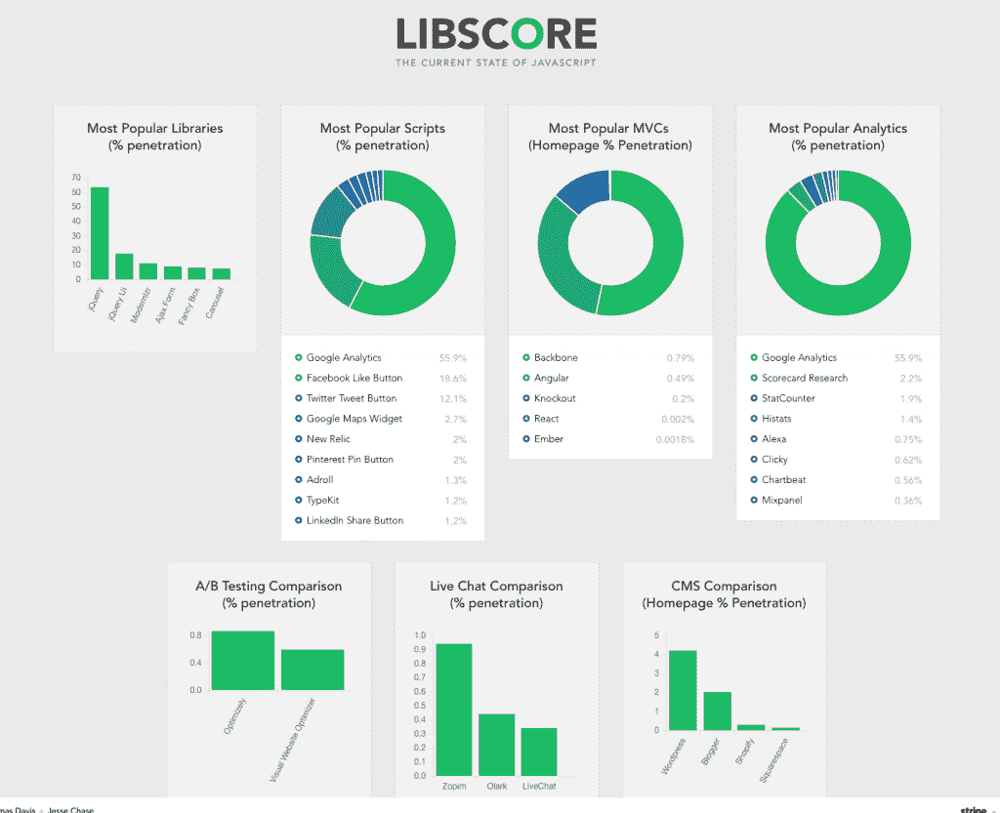

# 开源工具 Libscore 对 JavaScript 库进行排名

> 原文：<https://thenewstack.io/open-source-tool-libscore-ranks-javascript-libraries/>

完成动画引擎[后的速度。JS](http://www.smashingmagazine.com/2014/06/18/faster-ui-animations-with-velocity-js/) ，开发人员 Julian Shapiro 需要一个工具来衡量项目的采用率，这让他创建了一个在开源 JavaScript 库上聚合数据的工具。

今天，他启动了 [Libscore](http://libscore.com/) ，这是一个开源项目，每月扫描 100 万个网站，以确定他们正在使用哪些第三方 JavaScript 库。该工具旨在帮助前端开源开发者衡量他们的影响。

他与快速增长的数字海洋(DigitalOcean)和支付服务 Stripe 合作，前者是一家专注于开发者的托管服务公司，后者被 Mashable 命名为 2014 年突破性创业公司。

“我知道人们在使用 Velocity，但我无法量化它的使用情况，更不用说将其与类似的图书馆进行比较，”夏皮罗在 Libscore 的公告中说。

“一旦 Libscore 建立起来，我不仅能够了解 Velocity 在 web 开发人员中的受欢迎程度，还能够发现谁是我最受欢迎的用户。”

有了这些信息，他将它们列在 Velocity 的主页上，以提高项目对潜在用户的可信度。

Shapiro 开发了这个工具，EFF.org 的高级开发人员 Thomas Davis 开发了它的 API，DigitalOcean 的创意总监 Jesse Chase 开发了它的网站。

Chase 说，Libscore 的数据收紧了项目开发和开发者采用之间的反馈回路。

伦敦 Bespoke Programmers 的创始人 David Bolton 认为开发者会发现 Libscore 很有用。

“我上次检查时，有数百个图书馆，我希望有近一千个。如果它包括图书馆的链接和一个简短的摘要，那就太好了。…

“我预计 jQuery 会名列前茅，但看看其他人的排名会很有趣。…现在，如果他们能够将它扩展到其他编程语言，如 C#、PHP 和 iOS，该多好啊，”他说。

夏皮罗于 2013 年 9 月将自己的[域名初创公司 NameLayer](http://venturebeat.com/2013/09/24/techstars-buys-namelayer-to-save-its-startups-from-awful-domain-names/) 出售给加速器 TechStars，他是被选中参加 Stripe 开源务虚会的三名开发者之一。他的动画引擎 Velocity.js，jQuery 的$的替代品。动画功能，提高了 UI 动画的速度和工作流程。

那次撤退后，夏皮罗写道:

“我正在与 Stripe 和 DigitalOcean 合作一个项目，该项目将极大地增强网络开源开发者的能力。我认为这个即将到来的项目将比 Velocity 大得多。”

他的合作伙伴 DigitalOcean 最近从 Fortress Investment Group 获得了 5000 万美元的信贷额度，以扩大其业务。去年 3 月，该公司通过主要投资者 Andreesen Horowitz 获得了 3720 万美元的首轮风险投资。提供市场份额分析的 Netcraft 将 DigitalOcean 评为世界第三大托管服务。

[Stripe 刚刚在一轮融资中筹集了 7000 万美元](https://bits.blogs.nytimes.com/2014/12/02/stripe-an-e-commerce-start-up-raises-70-million/?_r=0)，包括红杉资本(Sequoia Capital)和 Thrive Capital。它的估值在不到一年的时间里翻了一番，达到 35 亿美元。

数字海洋是新堆栈的赞助商。

特色图片 [via](https://www.flickr.com/photos/dmitry-baranovskiy/2378867408/in/photolist-4Cdjpj-7hmEGJ-78W2Go-8nYEjW-8aGB5o-qNti2-68AyEG-b57b8-9p9eiR-cPcXKq-K23Cp-K23BZ-2EAfN-ed9n87-4Xbkrh-9YqyAw-73pVad-3fWHiz-52v82Z-ftrxck-7f1KVT-2u3wUF-9JCWoo-7atTr6-9fZ1Uo-6WKnUa-p6H3ap-nVhADg-eGznP-nivxMN-7nHK69-Dx5d8-8VpwiL-3g26Nd-5Ver7g-8nPGm9-qGpZX-9xQCxe-4EcFGg-Dx54o-p4wzcU-pHYQ9U-p4wzph-p4zt68-p4wzrS-q1j5og-pHTv2p-pHVG1d-pHTuXM-q1j5uP) Flickr 知识共享。

<svg xmlns:xlink="http://www.w3.org/1999/xlink" viewBox="0 0 68 31" version="1.1"><title>Group</title> <desc>Created with Sketch.</desc></svg>