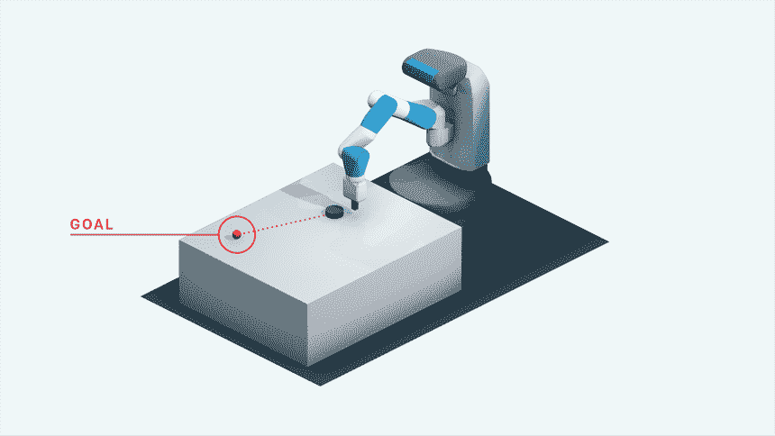
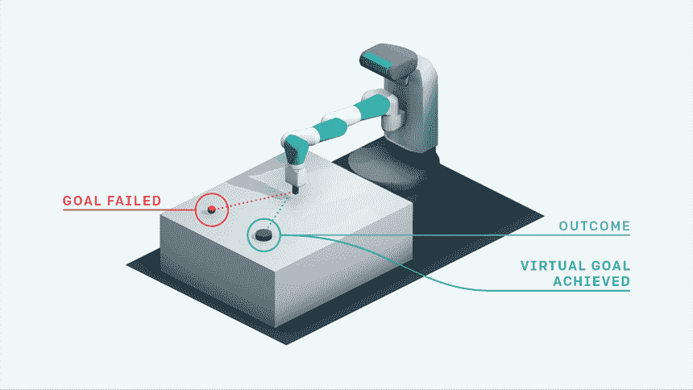
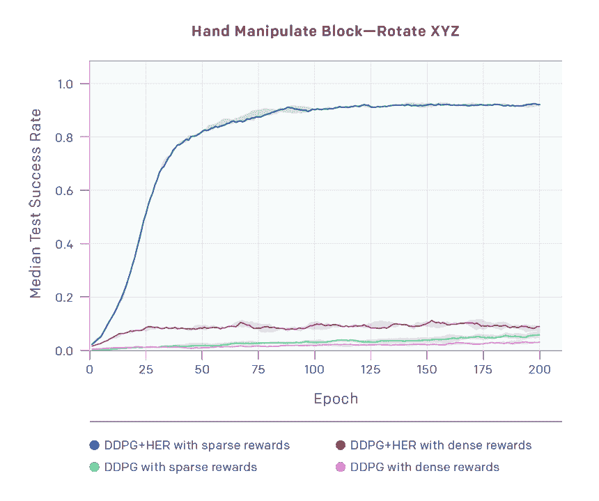

# OpenAI 算法允许 AI 从错误中学习

> 原文：<https://thenewstack.io/openai-algorithm-allows-ai-to-learn-from-its-mistakes/>

人类和许多其他动物的一个关键特征是从错误中学习的能力。当面对要实现的目标或要掌握的特定技能或任务时，我们通常需要尝试很多次才能成功——或者至少做得足够好。在经历一次又一次失败的过程中，我们学会了如何做某事的各种方法。每次我们失败，我们都会学到一些新的东西，可能会帮助我们最终正确地做这件事，事后来看，这让我们明白失败是成功的必要条件。

虽然这种从后见之明中学习的特性对人类来说是天生的，但对机器人来说却不一定如此。在人工智能模型中，我们可能有最接近的类比是[强化学习](https://thenewstack.io/reinforcement-learning-ready-real-world/)，机器的任务是解决某种问题，并根据它解决问题的程度，“赚取”不同数量的奖励。然而，设计这种依赖奖励的机器学习方法可能会变得复杂，并不总是容易转化为现实世界，实际上可能会阻碍人工智能代理的探索。

为了解决这个难题，同时开发一种更简单的方法让机器从错误中学习，总部位于旧金山的人工智能研究公司 [OpenAI](https://openai.com/) 最近发布了一种叫做[马后炮体验回放](https://arxiv.org/pdf/1707.01495.pdf) (HER)的开源算法——这是旨在用于人工智能研究开发的模拟机器人环境的更大版本的一部分。下面是她的简要解释:

[https://www.youtube.com/embed/8Np3eC_PTFo?feature=oembed](https://www.youtube.com/embed/8Np3eC_PTFo?feature=oembed)

视频

根据研究人员的说法，这里的想法是让机器以更类似于人类的方式从失败中学习。研究人员[在一篇博客文章中写道:“她的关键见解是人类凭直觉做的事情:即使我们没有在一个特定的目标上取得成功，我们至少已经实现了一个不同的目标。”。“那么，为什么不假装我们一开始就想实现这个目标，而不是我们最初打算实现的目标呢？”](https://blog.openai.com/ingredients-for-robotics-research/#content)

HER 算法通过使用所谓的“稀疏和二进制”奖励来实现这一点，该奖励仅向代理提供失败或成功的指示。相比之下，传统强化学习中使用的“密集的”、“成形的”奖励会提示代理，他们是否正在“接近”、“接近”、“非常接近”或“非常接近”达到他们的目标。这种所谓的密集奖励可以加快学习过程，但缺点是这些密集奖励通常不包含太多供代理学习的学习信号，并且可能难以设计和实现真实世界的应用。

相比之下，对她来说，即使一个人工智能代理在执行任务时不成功，它仍然会收到少量的奖励来进一步鼓励它。此外，她还创建了一个“多目标”强化学习框架，将每一次失败的尝试重新定义为成功，每次都略微改变目标，以便有一个学习信号可以利用，同时仍然牢记总体目标。

通过进行这种替换，强化学习算法可以获得学习信号，因为它已经实现了某些目标；即使这不是你最初想要实现的目标，”该团队写道。“如果你重复这个过程，你最终会学会如何实现任意的目标，包括你真正想实现的目标。”

该团队使用基于现有硬件机器人的模拟环境测试了 HER 算法，以及它们在各种操纵任务中的表现，如推、滑和取放。然后，该算法从模拟环境转移到真实的机器人手臂上。与未修改的深度强化学习模型相比，观察添加 HER 如何提高解决这些任务的相对成功率:

[https://www.youtube.com/embed/Dz_HuzgMxzo?feature=oembed](https://www.youtube.com/embed/Dz_HuzgMxzo?feature=oembed)

视频

相对于实验中的其他强化学习技术，该团队的比较显示，在基于目标的环境中，人工智能代理可能无法在早期实现初始目标，她的表现明显更好。然而，与其他强化学习技术不同，使用她，代理能够在每次尝试完成后事后学习新的东西。

稀疏奖励的使用似乎也增加了成功率，因为代理人不会受到与解决原始任务无关的探索行为的惩罚。稀疏奖励的设计和实施也更简单，不需要对学习发生的领域有更深入的了解——这更接近于模仿现实世界中的学习方式。这些是令人着迷的发现，可能是第一次表明复杂的操纵行为可以仅使用简单的二进制奖励来学习，并且是朝着创造能够像人类一样学习的智能机器迈出的又一步。

图片:OpenAI

<svg xmlns:xlink="http://www.w3.org/1999/xlink" viewBox="0 0 68 31" version="1.1"><title>Group</title> <desc>Created with Sketch.</desc></svg>