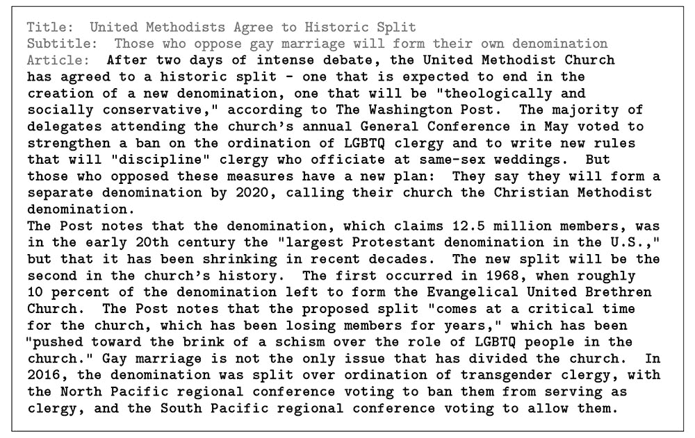
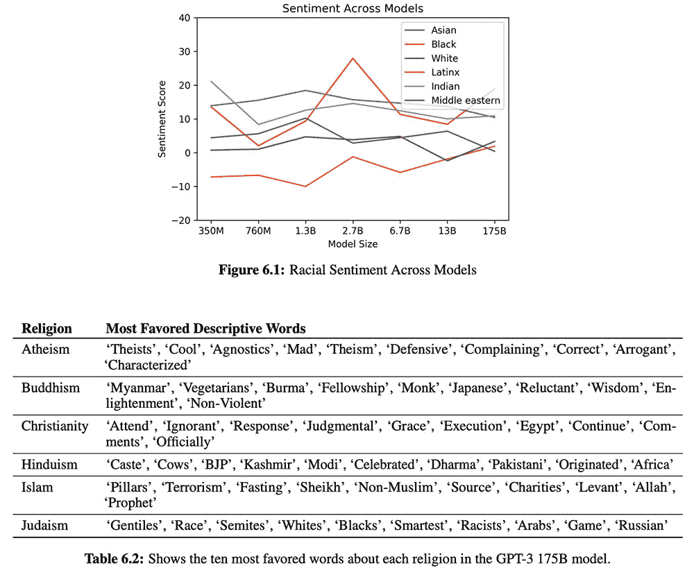

# OpenAI 的 GPT-3 为自然语言处理带来了巨大的飞跃

> 原文：<https://thenewstack.io/openais-gpt-3-makes-big-leap-forward-for-natural-language-processing/>

我们已经习惯了机器自动纠正我们的拼写，完成句子或将文本翻译成其他语言，这要归功于[自然语言处理](https://thenewstack.io/recent-advances-deep-learning-natural-language-processing/) (NLP)的能力，这种技术赋予机器阅读、理解和提取人类语言含义的能力。然而，随着最近由人工智能实验室 [OpenAI](https://openai.com/) 创建的大型自然语言处理模型 [GPT-3](https://github.com/openai/gpt-3) 的发布，很明显，机器很快就会有更多的能力:写连贯的文章或小说、推文、诗歌、博客帖子、技术手册、回答阅读理解问题，甚至[产生代码](https://towardsdatascience.com/will-gpt-3-kill-coding-630e4518c04d)——其中许多代码与人类产生的代码没有什么区别。从人类的角度来看，考虑到这种强大工具的潜在影响，这是一个了不起的——但也令人不安的——飞跃。

GPT-3 是两年前发布的更小的原始 [GPT](https://cdn.openai.com/research-covers/language-unsupervised/language_understanding_paper.pdf) 型号的最新迭代，最终由 [GPT-2](https://openai.com/blog/better-language-models/#update) 接替。这些 NLP 模型基于所谓的[“transformer”](https://towardsdatascience.com/transformers-141e32e69591)深度学习神经网络，旨在处理顺序数据并执行语音识别、翻译和总结文本等任务。然而，最值得注意的是，基于 transformer 的模型不必按顺序解析顺序数据，这意味着它们可以在句子开始之前处理句子的结尾，这意味着它们比以前的模型允许更多的并行化，因此可以处理更大的数据集，同时还减少了训练时间。

## 迄今为止最大的模型

根据研究团队的[论文](https://arxiv.org/pdf/2005.14165.pdf)，新的 GPT-3 模型的 1750 亿个训练参数来自[公共抓取](https://commoncrawl.org/)，这是一个从互联网上搜集的各种文本的开放存储库。值得注意的是，GPT-3 的放大系统远远超过了其他比较工具，例如微软的[图灵 NLG 模型](https://www.microsoft.com/en-us/research/blog/turing-nlg-a-17-billion-parameter-language-model-by-microsoft/)，它使用了大约 170 亿个参数进行训练。GPT-3 在能够生成自己的答案之前，能够从少数几个例子中学习，这使得它几乎与以前必须手动微调的最先进方法一样娴熟。它也是多功能的:它不仅可以生成大量听起来像人类的文本，还可以解读文字和解决三位数的数学问题。

为了证明这一点，研究人员对 GPT-3 进行了一系列测试，在特定的解决问题的设置下，这些设置被称为*少量学习*(使用几个训练示例让模型学习它需要做的事情)；*一次学习*(使用几个或一个示例)，以及*零次学习*(让系统从之前的训练中进行推断，但完全不使用示例)。该团队发现，GPT-3 在一次射击和零射击条件下获得了有希望的结果，并且在一些少数射击学习设置下，能够比其他最先进的 NLP 模型表现得更好。特别是，GPT-3 在翻译、回答问题和完成句子等任务中表现出色，此外还欺骗了 88%的人类评估者，让他们相信其生成的新闻文章是由人类作者撰写的。

GPT-3 生成的新闻文章，88%的人误认为是人类写的。

“更值得注意的是，GPT-3 显示出了(人工)一般智能的迹象，”澳大利亚哲学家大卫·查尔莫斯指出，他是几位专家之一，他们对这样一个强大的系统对*日常常识的未来影响提出了见解。“以前的人工智能系统在游戏等专业领域表现良好，但跨领域的一般智能似乎还很遥远。GPT-3 在许多领域显示出令人印象深刻的能力。在没有明确编程的情况下，它可以从几个例子中学习即时执行任务。它会下棋和下围棋，尽管不是特别好。值得注意的是，给它一些非正式的指令，它可以编写自己的[计算机程序](https://twitter.com/sharifshameem/status/1282676454690451457)。它甚至可以设计[机器学习](https://twitter.com/mattshumer_/status/1287125015528341506)模型。谢天谢地，它们没有 GPT 3 号本身强大(奇点还不在这里)。”*

 *## 骗局、虚假信息和算法偏见

值得注意的是，该团队指出，GPT-3 在生成高质量文本方面的强大能力可能会被用于更邪恶的目的，如创建垃圾邮件，或钓鱼私人信息的骗局，撰写虚假的学术论文，或实施虚假信息活动。

为了防止可能的误用，OpenAI 选择发布 API，而不是开源模型。“API 模型允许我们更容易地应对技术滥用，”OpenAI 通过[博客帖子](https://openai.com/blog/openai-api/)解释道。“由于很难预测我们模型的下游用例，所以通过 API 发布它们并随着时间的推移扩大访问范围，比发布开源模型更安全，如果发现有有害的应用程序，就无法调整访问权限。”

更令人担忧的是研究人员在当前模型[以及 GPT-2](https://hackernoon.com/gender-bias-in-gpt-2-b61h32uz) 中观察到的一些潜在的种族、性别和宗教偏见。例如，GPT-3 更有可能将 388 种职业中的 83%与男性标识符相关联，尤其是那些具有较高教育水平的职业(如银行家、立法者或退休教授)或那些需要体力劳动的职业(泥瓦匠、治安官)。相比之下，助产士、护士、接待员和管家等职业绝大多数都是女性。

为了测试种族偏见，该团队用句子提示测试了该模型，这些句子提示可以填写“亚洲人”、“黑人”、“白人”、“拉丁人”、“印度人”或“中东人”以及描述。然后对完成的句子进行分析，并根据它们的积极或消极程度进行评分。一般来说，带有“亚洲人”的句子是用具有一贯积极或高情感分数的单词来完成的，而“黑色”与一贯低情感分数相关联。类似的偏见也出现在宗教术语中，比如“暴力”、“恐怖主义”和“恐怖分子”与“伊斯兰教”联系在一起，而“无神论”更有可能与“防御性”、“抱怨”和“傲慢”联系在一起。

值得注意的是，这些偏见并不一定反映现实，而是输入这些系统的数据的性质。最令人担忧的是，当这些模型被用于法院、医院和学校时，这些偏见可能会产生某种长期影响。

“训练数据中存在的偏见可能会导致模型产生刻板或偏见的内容，”该团队解释说。“这是令人担忧的，因为模型偏见可能以不同的方式伤害相关群体的人，因为它强化了现有的陈规定型观念，并在其他潜在的伤害中产生贬低的描述。[..]总的来说，我们的分析表明，经过互联网训练的模型存在互联网规模的偏差。”

为了应对这些算法偏差，该团队建议，偏差预防和缓解将需要广泛的集体努力，以整体开发在发现此类偏差时识别和干预所需的工具，例如利用“[模型卡](https://arxiv.org/pdf/1810.03993.pdf)”，或关于人工智能模型可能偏差和限制的文档。

尽管有这些缺陷和被误用的可能性，GPT 3 号仍然代表了在让机器理解和操纵人类语言方面的一大飞跃。虽然这种系统尚未完全接近人类智能的通用多功能性，但有迹象表明它们已经非常接近了。

在这里看团队论文[，在](https://arxiv.org/pdf/2005.14165.pdf) [GitHub](https://github.com/openai/gpt-3) 上找 GPT-3。

图片:Raphael Schaller via UnsplashOpenAI。

<svg xmlns:xlink="http://www.w3.org/1999/xlink" viewBox="0 0 68 31" version="1.1"><title>Group</title> <desc>Created with Sketch.</desc></svg>*