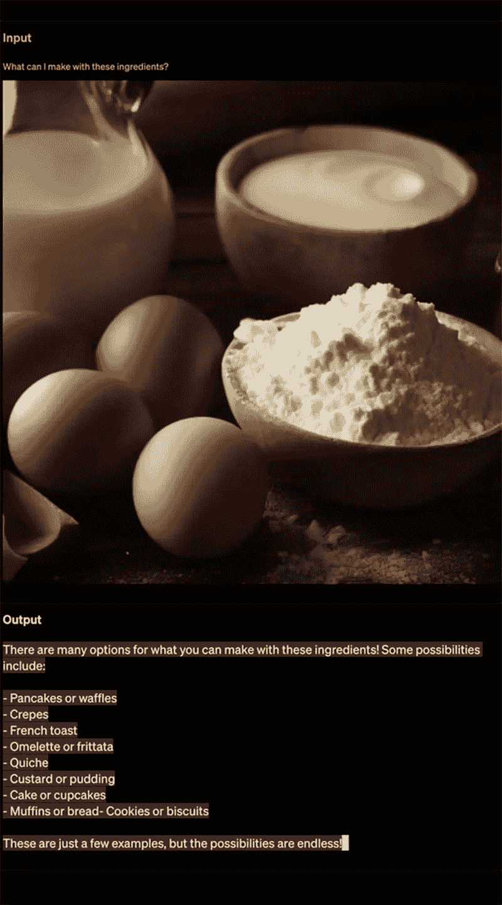
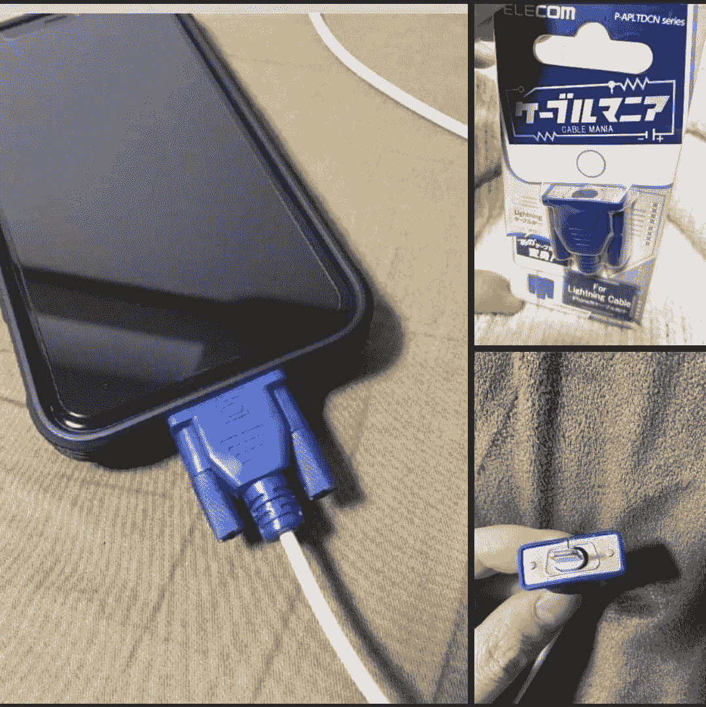

# OpenAI 的 GPT-4 可以分析视觉图像，通过律师考试

> 原文：<https://thenewstack.io/openais-gpt-4-can-analyze-visual-images-pass-bar-exam/>

本周早些时候，OpenAI 推出了 GPT-4，这是其大型语言模型系列的最新产品，能够以几乎类似人类的方式阅读、总结、翻译和生成文本。

GPT-4 旨在成为 GPT-3.5 的继任者，后者是流行的聊天工具的基础模型。尽管这一次，GPT 4 号展示了许多令人印象深刻的进步，包括多模式能力，允许它在收到图像和文本输入时生成文本，例如在给定成分图像时建议一系列可能的食谱。

值得注意的是，GPT-4 在各种标准化学术考试中也表现出了“人类水平的表现”，如 LSAT、GRE 和各种 AP 考试。

OpenAI 的 GPT 系列是所谓的[生成性预训练转换器](https://en.wikipedia.org/wiki/Generative_pre-trained_transformer)，这是一个在大型基于文本的数据集上预训练的语言模型家族。这些人工智能模型是用“[变压器](https://towardsdatascience.com/transformers-141e32e69591)”深度学习神经网络构建的，这使它们能够学习和理解文本中单词之间的上下文关系。

OpenAI 在 2018 年发布了第一款 GPT 模型，随后在 2019 年发布了 [GPT-2](https://thenewstack.io/can-we-teach-an-ai-to-play-dungeons-and-dragons/) ，在 2020 年发布了惊人的 1750 亿参数 [GPT-3](https://thenewstack.io/openais-gpt-3-makes-big-leap-forward-for-natural-language-processing/) ，在 2022 年发布了更新的 GPT-3.5。在一篇[博客文章](https://openai.com/research/gpt-4)和[技术论文](https://cdn.openai.com/papers/gpt-4.pdf)中，OpenAI 概述了 GPT-4 的一些新改进，以及一张[系统模型卡](https://cdn.openai.com/papers/gpt-4-system-card.pdf)描述了该模型的局限性。

## GPT 的新功能-4

据该公司称，GPT-4 在许多关键指标上取得了飞跃，包括提高的创造力，处理图像等视觉输入的能力，以及处理多达 25，000 个单词的能力。这大约是 ChatGPT 的八倍，并允许 GPT-4 执行扩展的文档分析，产生更长的内容，或与用户保持扩展的对话。

GPT-4 增强的创造力允许在更复杂的创造性任务上与用户更好地协作，如编写长格式内容。它甚至可以学习用户独特的写作风格，然后在其内容中模仿该用户的风格。

这些发现还详细说明了 GPT-4 与其前身相比增强的能力，当在机器学习基准中使用除英语之外的相对不常见的语言，如拉脱维亚语和威尔士语进行测试时。

此外，GPT 4 处理视觉图像的能力可能是一个潜在的强大功能，允许用户生成自动字幕之类的东西，或者如下例所示，当给定鸡蛋和面粉的图像时，提供一些食谱想法，如煎饼、乳蛋饼等。

GPT-4 似乎也能够理解和解构基于视觉图像的笑话，如下图所示。当用户问“这张图片有什么好笑的？一个面板一个面板地描述，”该模型能够一步一步地解释为什么这些图像可以被认为是幽默的，并回答说，“这幅图像中的幽默来自于将一个大型过时的 VGA 连接器插入一个小型现代智能手机充电端口的荒谬性。”

这个新版本还展示了更好的[可操作性](https://ali-design.github.io/gan_steerability/)，这意味着开发者可以对 API 进行编程，以特定的方式做出响应。例如，它可以被定制为像“莎士比亚的海盗”一样回复用户提示，当用户要求帮助他们在 W-2 税表上找到不合格的计划时，它会发出像“嘿，亲爱的朋友… /把你的目光转向框 1 中的工资收入/以及框 2 中的扣缴税款”这样的宝石。

OpenAI 认为，这样的功能将使聊天机器人有更多的机会实现更细微的实现。OpenAI 团队的[解释道](https://openai.com/research/gpt-4)“现在，开发者(以及很快 ChatGPT 的用户)可以通过在‘系统’消息中描述这些方向来规定他们的 AI 的风格和任务，而不是传统的 ChatGPT 风格和风格。”。“系统消息允许 API 用户在[OpenAI 的使用策略]内显著定制他们的用户体验。"

这些升级使 GPT-4 能够在标准化学术考试中名列前茅，如 SAT、LSAT、GRE 和统一律师考试。该模型在一些 AP 考试中也表现不错，包括宏观经济学、微观经济学、美国历史和化学。然而，有趣的是，GPT-4 在英语语言、文学和写作的 AP 考试中成绩平平。

除了这些改进，OpenAI 表示，GPT-4 还进行了调整，使其比以前的版本更安全。根据该报告，与 GPT 3.5 相比，这一最新版本产生的真实响应增加了 40%，同时对“禁止内容”的响应减少了 82%。

像以前的模型一样，GPT-4 可能容易产生有害的建议或不准确的信息等风险，但 GPT-4 的额外能力带来了新的风险。为了减轻这些潜在的风险，该公司采用了所谓的从人类反馈 (RLHF)中进行[强化学习，使用一组人类](https://bdtechtalks.com/2023/01/16/what-is-rlhf/)[手动微调](https://time.com/6247678/openai-chatgpt-kenya-workers/)模型的行为。

OpenAI 说:“为了了解这些风险的程度，我们邀请了 50 多位来自人工智能对齐风险、网络安全、生物风险、信任和安全以及国际安全等领域的专家对该模型进行了对抗性测试。”“他们的发现特别使我们能够在需要专家评估的高风险领域测试模型行为。来自这些专家的反馈和数据反馈到我们对模型的缓解和改进中；例如，我们已经收集了额外的数据，以提高 GPT-4 拒绝关于如何合成危险化学品的请求的能力。"

## 幻觉和局限

然而，OpenAI 指出，GPT-4 仍然存在一些限制，随着该技术变得更加广泛，这可能会导致不良后果。

“GPT-4 有‘幻觉’的倾向，或者产生与某些来源相关的荒谬或不真实的内容，”OpenAI 团队说。“随着模型变得越来越令人信服和可信，这种趋势可能会特别有害，导致用户过度依赖它们。

与直觉相反，随着模型变得更加真实，幻觉会变得更加危险，因为当模型在他们熟悉的领域提供真实信息时，用户会对模型建立信任。此外，随着这些模型被集成到社会中并用于帮助各种系统的自动化，这种产生幻觉的趋势是导致整体信息质量下降并进一步降低自由可用信息的准确性和可信度的因素之一。"

其他[点批评](https://venturebeat.com/ai/lightning-ai-ceo-slams-openais-gpt-4-paper-as-masquerading-as-research/)来自人工智能研究领域的专家，他们对 OpenAI 不寻常的选择感到不安，不公布关于 GPT 4 号的重要技术细节，如模型的实际大小，使用的硬件，训练计算，数据集构建和训练方法。

“我想我们可以把它叫做‘开上关’人工智能。介绍 GPT-4 的 98 页论文自豪地宣布，他们没有透露*任何关于他们训练集内容的*，[在推特上写道](https://twitter.com/benmschmidt/status/1635692487258800128)，Nomic AI 信息设计副总裁 Ben Schmidt。

“关于机器学习数据集的每一项学术工作都发现了训练数据制约模型输出的一致和有问题的方式，”施密特阐述道。“训练数据的选择反映了历史偏见，可能造成各种伤害。为了减轻这些危害，并做出明智的决定，决定在哪里应该使用模型*而不是*，我们需要知道什么样的偏见是内在的。OpenAI 的选择让这一切变得不可能。”

尽管存在这些问题，但据证实,[GPT-4 已经被整合到微软的 Bing 聊天中几个月了，微软最近也向该公司投资了 100 亿美元。现在，OpenAI 还宣布计划与 Duolingo、Be My Eyes、Stripe 和 Khan Academy 等其他公司合作，将 GPT-4 纳入他们的平台。](https://blogs.bing.com/search/march_2023/Confirmed-the-new-Bing-runs-on-OpenAI%E2%80%99s-GPT-4)

<svg xmlns:xlink="http://www.w3.org/1999/xlink" viewBox="0 0 68 31" version="1.1"><title>Group</title> <desc>Created with Sketch.</desc></svg>