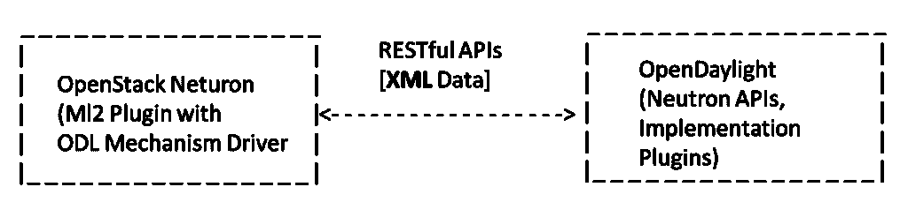
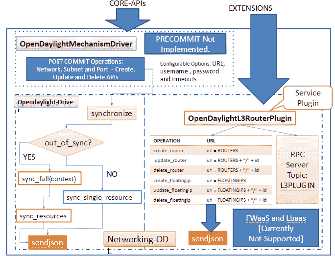
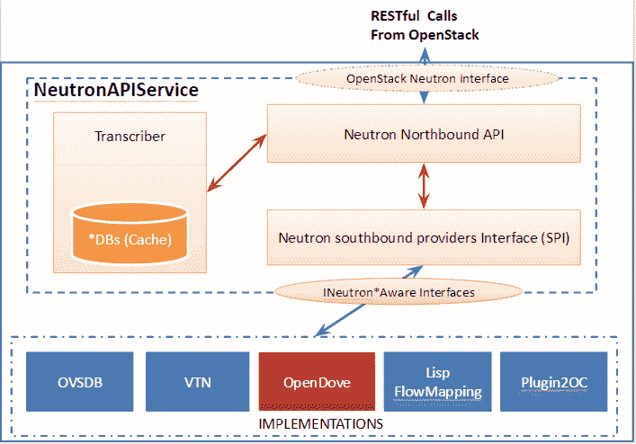
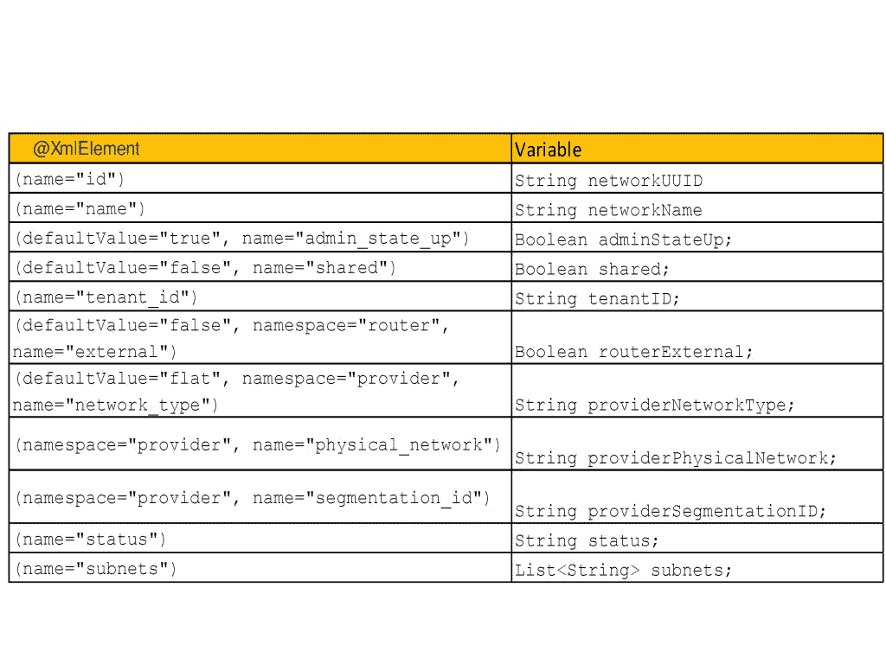
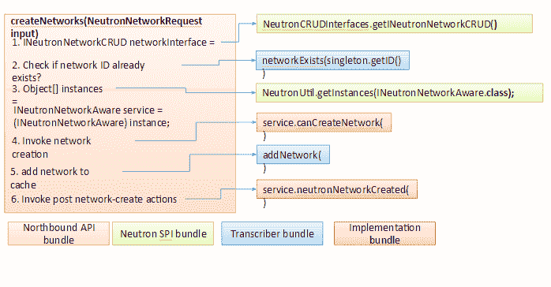

# OpenDaylight 是 OpenStack 最好的控制器之一——下面是如何实现它

> 原文：<https://thenewstack.io/opendaylight-is-one-of-the-best-controllers-for-openstack-heres-how-to-implement-it/>

OpenStack 和 OpenDaylight (ODL)的集成是一个热门话题，有大量详细的信息可用；然而，这些文章的大部分都集中在解释用法方面，而不是集成是如何实现的。

在本文中，我们将关注集成不同组件的详细实现。以下是一些非常有用的参考资料:

通过这些链接，我们可以将完整的设置过程总结如下:

1.  在虚拟机或物理机上构建并安装适当的 OpenDaylight 版本(取决于您的实现选择)。确保你有合适的包来实现中子 API(OVSDB，VTN 管理器，LISP 等)。).
2.  使用适当的配置启动 OpenDaylight 控制器。
3.  部署 OpenStack，最好采用多节点配置，包括一个控制节点、一个网络节点和一个或多个计算节点。
4.  执行必要的 OpenStack 配置，以便与 OpenDaylight 控制器进行交互:
    1.  确保核心插件在 ML2 中。
    2.  将 OpenDaylight 添加为 ML2 中的“mechanism_drivers”之一。
    3.  使用以下内容设置“ml2_conf.ini”文件中的“[ml2_odl]”部分:
        1.  用户名=管理员
        2.  密码=管理员
        3.  URL = http://IP-Address-Of-open daylight:8080/controller/nb/v2/neutron
5.  开始从 OpenStack 创建和添加虚拟机及其相应的虚拟网络。
6.  从 OpenDaylight GUI 验证相同的(拓扑)。

还有[优秀的视频](https://www.youtube.com/watch?v=0APNbgiRD8o)演示了 OpenStack 和 OpenDaylight 集成的一步一步的过程。

[https://www.youtube.com/embed/NayuY6J-AMA?feature=oembed](https://www.youtube.com/embed/NayuY6J-AMA?feature=oembed)

视频

## **open stack 和 OpenDaylight 的集成**

图 1 总结了 OpenStack 和 OpenDaylight 集成的整个过程。在 OpenStack 方面，Neutron 由 ML2 机制驱动程序组成，它充当 REST 代理，并将所有 Neutron API 调用传递给 OpenDaylight。OpenDaylight 包含一个北向 REST 服务(称为 Neutron API 服务)，它缓存来自这些代理 API 调用的数据，并使其可用于 OpenDaylight 内部的其他服务。如下图所示，当我们详细描述这两个组件时，这些 RESTful APIs 实现了 OpenStack 和 OpenDaylight 的绑定。

[](https://thenewstack.io/wp-content/uploads/2015/05/FigureOne.png)

图一:OpenStack 和 OpenDaylight 集成

## **OpenStack**

正如在 [SDN 控制器和 OpenStack](https://thenewstack.io/sdn-controllers-and-openstack-part1) 中介绍的，OpenStack Neutron 的模块化第 2 层(ML2)插件是一个旨在同时利用各种第 2 层网络技术的框架。ML2 插件背后的主要思想是将网络类型与实现网络类型的机制分开。ML2 插件中的驱动程序实现了可扩展的网络类型集(本地、平面、VLAN、GRE 和 VXLAN)以及访问这些网络的机制。

在 ML2 中，当创建、更新或删除三个核心资源——[网络、子网和端口](https://github.com/openstack/neutron/tree/master/neutron/plugins/ml2)——时，通常特定于供应商的注册机制驱动程序被调用两次。第一个调用通常称为预提交调用，是 DB 事务的一部分，其中维护特定于驱动程序的状态。在 OpenDaylight 机制驱动程序的情况下，这个预提交操作是不必要的。一旦事务被提交，驱动程序被再次调用，通常被称为提交后调用，此时它们可以与外部设备和控制器交互。

[](https://thenewstack.io/wp-content/uploads/2015/03/4.png)

图二:ML2 机制驱动架构

[机制驱动](https://github.com/openstack/neutron/tree/master/neutron/plugins/ml2)也作为端口绑定过程的一部分被调用，以确定相关联的机制是否可以为网络提供连接，如果可以，则确定要使用的网段和 VIF 驱动。

上面的图 2 总结了 OpenStack Neutron 的 ML2 OpenDaylight 机制驱动程序架构。OpenDaylight 机制驱动程序由一个文件“mechanism_odl.py”和一个单独的网络 OpenDaylight 驱动程序组成。基于 API 处理，机制驱动被分成两个不同的部分(核心和扩展)。OpenDaylight 机制驱动程序和 OpenDaylight 驱动程序类实现了核心 API。OpenDaylight 的 L3 路由器插件类只实现扩展 API。ODL 驱动程序目前不支持防火墙即服务(FWaaS)和负载平衡即服务(LBaaS)。

OpenDaylight 机制驱动程序接收创建/更新/删除核心资源(网络、子网和端口)的调用。它通过调用 synchronize 函数将这些调用转发给 OpenDaylight 驱动程序类。这个函数反过来调用‘send JSON’API。

类似地，OpenDaylight L3 路由器插件类处理 L3 APIs 来创建/更新/删除路由器和浮动 IP。因此，对核心和 L3 扩展 API 的最后一个调用是“send JSON”——它向 OpenDaylight 控制器发送一个 REST 请求，并等待响应。

在下一节中，我们将看到 OpenDaylight 如何处理这些 REST 调用。

## **开启日光**

OpenDaylight 公开了 OpenStack Neutron API 服务——它为多个实现提供中子 API 处理。图 3 总结了 OpenDaylight 中 Neutron API 实现的架构。主要有三个不同的包组成了 Neutron API 服务——称为北向 API、Neutron south bound provider interface(SPI)和 transcriptor——以及一组实现。在本节中，我们将详细了解这些组件。

[](https://thenewstack.io/wp-content/uploads/2015/03/2.png)

图 3: OpenDaylight Neutron API 实现架构

## **北行 API 捆绑包**

这个包处理来自 Openstack 插件的 REST 请求，并返回适当的响应。北向 API 包的内容可以描述如下:

1.  请求的单个父类:IneutronRequest。
2.  每个资源的 JAXB(Java architecture for XML Binding)注释请求类的集合:网络、子网、端口、防火墙、负载平衡器等。这些类用于表示一个特定的请求，它实现了 IneutronRequest 接口。例如，网络请求包含以下属性:类 NeutronNetworkRequest 实现 INeutronRequest <neutronnetwork>```
    @XmlElement(name="network") NeutronNetwork singletonNetwork; @XmlElement(name="networks") List&lt;NeutronNetwork&gt;  bulkRequest; @XmlElement(name="networks_links") List&lt;NeutronPageLink&gt;  links; 
    ```</neutronnetwork> 
3.  Neutron northbound 类*的集合，为管理相应的资源提供 REST APIs。例如，NeutronNetworksNorthbound 类包括以下 API:list networks()、showNetwork()、createNetworks()、updateNetwork()和 deleteNetwork()。

除非另有说明，否则符号*代表以下任何内容:网络、子网、端口、路由器、浮动 IP、安全组、安全组规则、负载平衡器、负载平衡器健康、负载平衡器监听器、负载平衡器池等。

## **中子 SPI 束**

这是将北向 API 链接到适当实现的最重要的包。中子南行协议接口(SPI)包包括以下内容:

1.  1.  JAXB(Java architecture for XML binding)带注释的基类和子类，命名为 Neutron*用于支持 networking [API v2.0](http://developer.openstack.org/api-ref-networking-v2.html) 中记录的 API。
    2.  INeutron*CRUD 接口，由转录器包实现。
    3.  INeutron *感知接口，由特定插件(OpenDove、OVSDB、VTN 等)实现。).

【T2

除非另有说明，否则符号*代表以下任何内容:网络、子网、端口、路由器、浮动 IP、安全组、安全组规则、负载平衡器、负载平衡器健康、负载平衡器监听器和负载平衡器池等。

## **转录器包**

转录器模块由一组 Neutron *接口类组成，这些接口实现了 INeutron*CRUD 接口，用于在缓存中存储中子对象。这些类中的大多数都包含一个并发 HashMap。例如，private concurrent map<string neutronport="">portDB = new concurrent HashMap<string neutronport="">()——所有的添加、移除和获取操作都在这个 HashMap 上工作。</string></string>

## **实施捆绑包**

OpenDaylight 的优势在于它包括中子网络的多种实现，提供了几种与 OpenStack 集成的方式。旨在提供网络虚拟化的大多数北向服务可以用作中子网络的实现。因此，OpenDaylight 包括以下用于中子 API 实现的选项:

1.  OVSDB: OpenDaylight 具有与 Neutron 交互的北向 API，并使用 OVSDB 对计算节点上的 vSwitches 进行南向配置。因此，OpenDaylight 可以管理网络连接，并为计算节点启动 GRE 或 VXLAN 隧道。OVSDB Integration 是 OpenDaylight 的一个包，它将实现 Open vSwitch 数据库管理协议，允许对 vSwitch 进行南行配置。对于具有开放式虚拟交换机转发元素的网络虚拟化来说，这是一个关键协议。虚拟化版中的 OVSDB neutron bundle 支持针对 OpenStack 和 CloudStack 部署使用 VXLAN 和 GRE 隧道的网络虚拟化
2.  VTN 管理器(虚拟租户网络):VTN 管理器是 OpenDaylight 中的网络虚拟化解决方案之一，使用 AD-SAL 实现为 OSGi(开放服务网关倡议)控制器捆绑包，并管理 OpenFlow 交换机。VTN 管理器还可以包含一个单独的组件，作为 OpenStack 的网络服务提供商。VTN 管理器的中子组件使 OpenStack 能够在纯 OpenFlow 环境中工作，其中数据平面中的所有交换机都支持 OpenFlow。VTN 管理器也可以利用 OVSDB 增强的 VTN。中子束可以利用 OVSDB 插件进行诸如端口创建之类的操作。
3.  [Open DOVE](https://github.com/opendaylight/opendove) : Open DOVE 是一个“网络虚拟化”平台，基于“Open vSwitch”为 OpenDaylight 和数据平面提供了完整的控制平面实现。它旨在为逻辑隔离的多租户网络提供第 2 层或第 3 层连接，并在虚拟化数据中心的任何 IP 网络上运行。Open DOVE 基于 IBM SDN 虚拟环境和 IBM Research 的 DOVE 技术。Open DOVE 在氢释放后一直没有更新，在 OpenDaylight 的锂释放中的存在性存疑。
4.  OpenContrail (plugin2oc):提供 OpenDaylight 控制器和 OpenContrail 平台之间的集成/互通。这种组合的开源解决方案将无缝支持 OpenContrail 平台功能，如 OpenDaylight 项目中的云网络和网络功能虚拟化(NfV)。
5.  LISP 流映射:定位器/ID 分离协议(LISP)旨在提供“灵活的映射和封装框架，可用于覆盖网络应用，并将网络控制平面与转发平面分离。”LISP 包括两个名称空间:端点标识符(EIDs —主机的 IP 地址)和路由定位器(RLOCs—LISP 路由器到主机的 IP 地址)。LISP 流映射提供 LISP 映射系统服务，这些服务将映射数据(包括各种路由策略，如流量工程和负载平衡)存储并提供给数据平面节点以及 OpenDaylight 应用程序。

这些实现通常实现以下处理器中的一些或全部:网络、子网、端口、路由器、浮动 IP、防火墙、防火墙策略、防火墙规则、安全组、安全组规则、负载平衡器、负载平衡器健康、负载平衡器监听器、负载平衡器池和负载平衡器池成员。这些处理程序支持对相应资源的创建、删除和更新操作。例如，NeutronNetworkHandler 对网络资源执行以下操作:

```
canCreateNetwork(NeutronNetwork network)
neutronNetworkCreated(NeutronNetwork network)
canUpdateNetwork(NeutronNetwork delta,  NeutronNetwork original)
neutronNetworkUpdated(NeutronNetwork network)
canDeleteNetwork(NeutronNetwork network)
neutronNetworkDeleted(NeutronNetwork network)

```

这些处理程序涉及的确切机制取决于它们使用的南行插件:OpenFlow (1.0 或 1.3)、OVSDB、LISP、REST (OpenContrail)等。让我们以 VTN 管理器中的 NeutronNetworkCreated 处理程序为例。该处理程序中涉及的步骤可以概括为:

1.  通过调用 canCreateNetwork 检查是否可以(再次)创建网络。
2.  将 Neutron network 的租户 ID 和网络 ID 分别转换为租户 ID 和网桥 ID。
3.  检查租户是否已经存在，如果不存在，则创建一个租户。
4.  创建一座桥并执行 VLAN 映射。

对于实际操作，VTN 管理器的中子组件调用 VTN 管理器的核心功能，后者又使用 OpenFlow (1.0)插件在 OpenFlow 交换机上进行必要的配置。

## **使用所有包创建网络**

[](https://thenewstack.io/wp-content/uploads/2015/03/31.png)

图四:在开放日光下创建网络的过程

上面的图 4 简要总结了网络创建中涉及的过程，以及上面描述的 Opendaylight Neutron 实现的所有包中的相应调用。这个图应该有助于读者理解所有包之间的控制流。

总之，OpenDaylight 是提供 OpenStack 集成的最佳开源控制器之一。尽管仍然缺少对负载平衡器和防火墙服务的支持，但多种实现的自由和对完整核心 API 的支持本身为管理员提供了巨大的优势和灵活性。在不久的将来，我们可以期待 OpenDaylight 支持 OpenStack 的所有扩展，实现完美的集成。

斯里达尔于 2007 年获得新加坡国立大学的计算机科学博士学位，于 2000 年获得印度苏拉特卡尔 KREC 大学的计算机科学硕士学位，并于 1997 年 8 月获得印度班加洛尔大学 Tumkur 分校的仪器仪表和电子工程学士学位。他曾担任印度 SRM 研究院的研究主管，意大利都灵理工大学微软创新中心的博士后研究员，以及新加坡信息通信研究院(I2R)的研究员。他从事过各种开发和部署项目，涉及 ZigBee、WiFi 和 WiMax。斯里达尔目前在 NEC 技术印度有限公司担任集团技术专家。斯里达尔的研究兴趣主要在下一代有线和无线网络领域，如 OpenFlow、软件定义网络、基于认知网络的软件定义无线电系统、Hotspot 2.0 和物联网。

<svg xmlns:xlink="http://www.w3.org/1999/xlink" viewBox="0 0 68 31" version="1.1"><title>Group</title> <desc>Created with Sketch.</desc></svg>