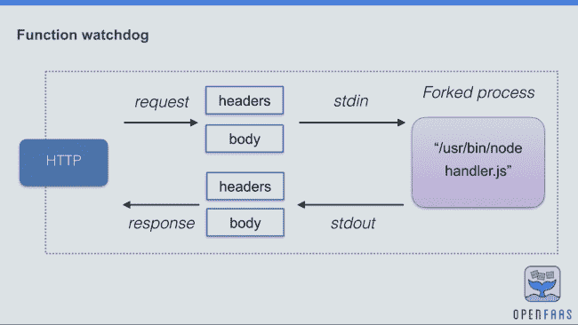
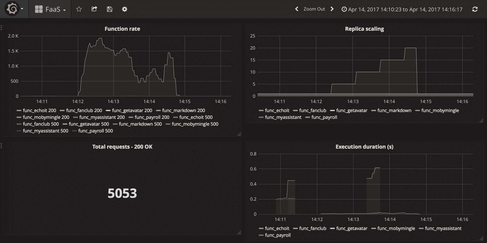

# OpenFaaS:将任何二进制或代码打包成无服务器函数

> 原文：<https://thenewstack.io/openfaas-put-serverless-function-container/>

为什么要将无服务器功能局限于供应商支持的任何编程语言？

[OpenFaaS](https://www.openfaas.com/) 是一个新的[开源](https://github.com/openfaas/faas)无服务器软件程序可以运行任何嵌入在 Docker 容器中的 CLI 驱动的二进制程序。“任何在 Linux 上运行的命令行界面，我们都可以打包，” [Alex Ellis](https://www.alexellis.io/) 自豪地说，他创建了 OpenFaaS，白天是 ADP 的软件工程师。

实际上，任何可以从命令行运行的程序都可以通过 OpenFaaS 被容器化并作为一个功能提供。即使是复杂的多媒体 Linux 应用，如 [FFmpeg](https://www.ffmpeg.org/) 或 [ImageMagick](https://www.imagemagick.org/script/index.php) 也可以打包成一个函数，大约五行，作为一个 Docker 文件。

[open FAAS Stats](https://github.com/openfaas/faas)

*   [提交:617](https://github.com/openfaas/faas)
[*   分支:24*   贡献者:28*   许可:MIT](https://github.com/openfaas/faas)

AWS Lambda 等无服务器的第一次部署是非常专有的服务，这意味着最终用户无法控制运行代码的后端平台(事实上，这就是术语“[无服务器](/category/serverless/)”的来源)。商业无服务器服务通常也受到它们具体支持的语言的限制。在 Lambda 的情况下，这意味着 Node.js (JavaScript)、Python、Java 和 C#。

OpenFaas 消除了这两个问题。“OpenFaaS 对你来说是无服务器的，”Ellis 在上个月的 Linux 基金会开源峰会上对我们说。

OpenFaaS 最初是作为一个项目的辅助工具，Ellis 正在利用他的亚马逊 Alexa 语音服务。他有一个在圣诞树上运行多色灯的树莓派，他想通过 Alexa 来控制它。

Ellis 发现在 Lambda 上运行他的代码的准备工作很繁琐——每次更改都需要将代码和 Node.js 实例重新打包成 zip 文件，然后上传到 Amazon。

相反，Ellis [将他的代码](https://blog.alexellis.io/functions-as-a-service/)打包在一个容器中，该容器将由 Docker Swarm 管理，并将端点从 Lambda 切换到 HTTP 调用。

埃利斯的工作吸引了很多关注，既来自他在《黑客新闻》上的文章，也来自 Docker，这让他在去年的会议上以“酷黑客”的身份展示了他的工作。

OpenFaaS(最初称为 [Docker FaaS](https://www.brianchristner.io/test-driving-docker-function-as-a-service-faas/) )遵循 Unix 管道模型，其中多个组件可以通过标准输入(stdin)和标准输出(stdout)流串在一起。

用 Go 编写的 API 网关就像一个反向代理，用户可以从这里调用函数，而网关跟踪路由。API 读取请求体和请求头，将其转发到适当的容器，并将结果通过管道返回给用户。

【T2

实际上，埃利斯已经通过 [Docker Swarm](https://docs.docker.com/engine/swarm/) 编排工具用一些巧妙的分段替换了 Lambda 后端。Kubernetes 也可以使用，代码库足够简单，其他人可以很容易地添加自己的编排引擎，比如有人为[牧场主牛](https://github.com/rancher/cattle)、[埃利斯说](https://skillsmatter.com/skillscasts/10813-faas-and-furious-0-to-serverless-in-60-seconds-anywhere)。

封装函数/程序的容器在端口 8080 监听请求。这是通过放置在容器中的 Ellis 函数看门狗组件的副本来完成的，它在函数和用户之间传递 HTTP 请求。当一个新的请求进来时，看门狗将进程分叉，并将请求数据传入。

函数 Watchdog 的行为有点像旧的[公共网关接口](http://www.oreilly.com/openbook/cgi/ch01_01.html) (CGI)，在 Web 的早期经常使用。事实上，为了提高性能，Ellis 实际上抄袭了 Fast CGI 的一些技术，Fast CGI 是一种注重性能的 CGI 扩展。

由于担心为每个 Java 应用程序启动一个新的 JVM 的开销，Ellis 设计了一个看门狗来派生几个相同的进程，而不是一个，以防需要额外的实例。Ellis 说，“当请求进来时，它们将总是使用一个池化的进程”，从而减少启动时间。埃利斯没有采用奇怪的、现在几乎被遗忘的快速 CGI 二进制协议，而是将这一经验应用于标准 HTTP。

对于自动缩放，他使用 Docker Swarm 副本来创建额外的实例，这些实例可以通过 Prometheus 监控工具的 JSON 警报来触发。Minio 处理存储的扩展，它提供了一个兼容 AWS s3 的 API。

OpenFaaS auto-scaling in action.

[Linux 基金会](https://www.linuxfoundation.org/)是新堆栈的赞助商。

<svg xmlns:xlink="http://www.w3.org/1999/xlink" viewBox="0 0 68 31" version="1.1"><title>Group</title> <desc>Created with Sketch.</desc></svg>