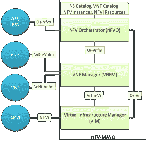
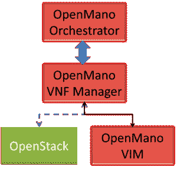

# 开源 NFV 第四部分:开源 MANO

> 原文：<https://thenewstack.io/opensource-nfv-part-4-opensource-mano/>

编者按:这是详细介绍网络功能虚拟化的系列文章的第四部分，虚拟化是一组新兴的网络层虚拟化技术。该系列的第一部分，NFV 介绍，可以找到

[here](https://thenewstack.io/de-ossify-the-network-with-function-virtualization/)

第二部分是

[here](https://thenewstack.io/opnfv-operationalizes-network-functions-virtualization/)

，第三部分是

[here](https://thenewstack.io/opensource-virtual-network-functions-part3/)

。这一部分重点介绍 ETSI NFV 架构的管理模块。

 [斯里达尔饶

斯里达尔于 2007 年获得新加坡国立大学计算机科学博士学位；2000 年获得印度苏拉特卡尔 KREC 大学计算机科学硕士学位；并于 1997 年 8 月在印度班加罗尔大学 Tumkur 获得仪器仪表和电子工程学士学位。他在 NEC 印度技术公司担任副总经理；印度 SRM 研究所研究负责人；意大利都灵理工大学微软创新中心博士后研究员；并在新加坡资讯通信研究所(I2R)担任研究员。他从事过各种开发和部署项目，涉及 ZigBee、WiFi 和 WiMax。斯里达尔目前在思必驰通信印度有限公司担任解决方案架构师。](https://thenewstack.io/author/sridharrao/) 

在 [ETSI ISG NFV](http://www.etsi.org/technologies-clusters/technologies/nfv) 架构中定义， [MANO(管理和网络协调)](http://network-functions-virtualization.com/)是一个层，是多个功能实体的组合，管理和协调云基础设施、资源和服务。它主要由三个不同的实体组成——NFV Orchestrator、VNF 管理器和虚拟基础设施管理器(VIM)。下图突出了 ETSI NFV 建筑的马诺部分。

NFV Orchestrator 负责管理网络服务生命周期管理和整体资源管理等功能。服务管理或流程编排处理服务的创建和端到端管理—通过组合不同的虚拟网络功能(vnf)来实现。资源管理有助于确保 NFV 基础设施资源被干净地抽象出来(独立于 VIM ),以支持访问这些资源的服务。

VNF 管理器监督虚拟网络功能(VNF)实例的生命周期(通常涉及供应、扩展、终止)管理。通常假设每个 VNF 都将与管理该特定 VNF 生命周期的 VNFM 相关联。一个 VNFM 可以管理相同类型的 VNF 或不同类型的 VNFs 的多个实例。

虚拟化基础架构管理器(VIM)控制和管理 NFVI 计算、存储和网络资源。这是 NFV-马诺最关键的组成部分，因此它受到业界最大的关注也就不足为奇了。

总之，当 MANO 被视为一个单一实体时，的典型功能包括(a)基础架构自动化和提供一致、准确的资源全局视图，(b)网络集成，(c) VNF 生命周期管理及其在 NFVI 中的位置，(d)服务管理，(e)性能监控、分析和治理(审计、合规性)支持。

VIM-component 受到了极大的关注，各种开源解决方案[如 OpenStack](https://thenewstack.io/telecoms-band-together-virtualize-open-source-network-stacks/) 已被用于实现 MANO 的虚拟化基础设施管理功能。

从上图可以看出，MANO 要想很好地发挥作用，必须与现有系统中的一组接口集成，最好是开放的。据 ETSI 称，MANO 功能负责部署和连接托管元件或虚拟网络功能。

电信行业同意，为了实现各种好处，例如实现更大的灵活性、敏捷性和操作功能性；人们必须正确地称呼马诺。

正如许多专家所提到的，NFV 马诺是一个对供应商的解释和扩展相当开放的部分。例如，德国电信的开放网络基金会董事会成员 Axel Clauberg 指出，存在一个“编排者动物园”,指的是不同供应商对 NFV 参考架构中仍然定义不明确的组件的解释:NFV 管理和编排(MANO)堆栈。

此外，Clauberg 补充说，每个供应商似乎都以“开放”来推销他们的解决方案，但当在适当的显微镜下观察时，很难理解“开放”的真正含义。人们应该对仍然是专有的“开放”API 持怀疑态度。

## 1.1 open stack 的困境

一个流行的问题是:OpenStack 是否应该被增强以覆盖 MANO 的所有方面？虽然一些专家认为 OpenStack 足以满足 MANO 的要求，但其他人认为 OpenStack 是云 VIM 的一个元素，应该成为 NFV MANO 的一个工具。

总的来说，大多数行业专家反对只为 MANO 提供 OpenStack 的想法，主要理由是存在传统设备或从传统设备中提取的解决方案。OpenStack 缺乏特定的机制来支持现在使用传统网络设备部署的许多服务和服务组件。此外，由于许多传统元素都有其管理和编排工具，实现了 MANO 功能，因此 OpenStack 不需要超越其管理云基础架构的使命，只需管理云即可。

另一方面，由于几乎所有的 NFV 部署都源自云，因此在管理此类虚拟化基础设施方面非常流行的 OpenStack 可以得到增强，以支持所有的 NFV 需求。这将使 OpenStack 更加强大，并可能促进 NFV 部署的增长。

此外，OpenStack 可以提供一条更快的开放 MANO 的路径，特别是如果当前在 OpenStack 内启动 NFV 计划的努力导致更广泛的类似 MANO 的能力集。总之，虽然趋势是开发更多的编排器和管理器来与 OpenStack 一起工作，但如果这些编排器/管理器不能保持真正的“开放”,事情可能会发生变化。

## 1.2 绿洲 TOSCA 及其马诺解决方案的支持

一个 [OASIS](https://www.oasis-open.org/committees/tosca/) 、 [TOSCA](https://www.oasis-open.org/committees/tc_home.php?wg_abbrev=tosca) (云应用的拓扑和编排规范)的目标是标准化如何描述软件应用以及在云环境中运行该应用所需的一切。TOSCA 旨在促进云服务的“可移植性”和“生命周期管理”。TOSCA 支持许多云编排工具，如 [OpenStack Heat](https://wiki.openstack.org/wiki/Heat) 、 [Cloudify](http://getcloudify.org/) 、 [SeaClouds](http://www.seaclouds-project.eu/) 、 [Alien4Cloud](https://alien4cloud.github.io/) 等。

## 1.3 实施挑战-当前状态。

Heavy Reading 的一项深入研究表明，在实践中，大多数实施者没有坚持 ETSI·NFV·ISG 对 MANO 堆栈中业务流程三个功能层的描述，没有单独实施。此外，大量阅读还突出了 VIM 和 NFVO 之间资源管理责任划分所造成的混乱。因此，到今天为止，考虑到不同的 VIMs(开源和商业)和 VNF-M/NFVO 供应商，运营商[最好](https://thenewstack.io/red-hat-time-telcos-consider-openstack/)自行构建一些元素(如 Telefonica 和 AT & T)或启动开放项目来应对挑战，这样的猜测可能不会错。

## 2.NFV-马诺开源软件

NFV·马诺通常负责管理运行在云基础设施上的工作负载。在本节中，我们将讨论目前可用的开源 MANO 解决方案。在我们讨论开源实现之前，我想为那些感兴趣的读者提供一些商业 MANO 解决方案，如下所示:

1.  [阿尔卡特朗讯的 CloudBand 管理系统](https://www.alcatel-lucent.com/press/2012/002752)
2.  [爱立信的云管理器](http://www.ericsson.com/ourportfolio/products/cloud-manager)
3.  [诺基亚的云应用经理](http://networks.nokia.com/portfolio/solutions/cloudband)
4.  Oracle Communications 最近发布的应用协调器
5.  惠普的 NFV 总监，负责 NFVO 和 VNFM 领域
6.  风河电信级通信服务器(扩展架构)

我们将把开源的 MANO 解决方案分为两类:(a)集成项目，即提供完整 MANO 解决方案的项目，(b)子集项目，即实现部分 MANO 的项目。

## 2.1 集成项目-完整的 MANO 解决方案

### OpenMANO

[西班牙电信发布的项目 OpenMANO](http://www.tid.es/long-term-innovation/network-innovation/telefonica-nfv-reference-lab/openmano) ，由 VIM (OpenVIM)、VNF 管理器和一个管弦乐队组成——如下图所示。该图还强调了 OpenMANO 也可以在其架构中作为 VIM 与 OpenStack 一起工作。OpenVIM 是 NFV VIM 的参考实现。它非常类似于 OpenStack，与 NFV 基础架构中的计算节点和 OpenFlow 控制器相连接，以提供计算和网络功能并部署虚拟机。它提供了一个基于 REST 的北向接口。OpenVIM 支持 EPA，包括 CPU 和 NUMA 锁定、PCI 直通等特性支持。

OpenMANO 是 NFV-O(网络功能虚拟化协调器)的参考实现。它通过其 API 与 NFV VIM 接口，并基于 REST (OpenMANO API)提供北向接口，其中提供 NFV 服务，包括 VNF 模板、VNF 实例、网络服务模板和网络服务实例的创建和删除。此外，NFV orchestrator 包括 VNF 和 NS 描述符，并通过平台感知字段进行了增强，而 VNFM 非常通用，并且支持 DSL。

到目前为止，OpenMANO 还是一个非常基础的实现，不适合商业部署。OpenMANO 的源代码可以在[这里](https://github.com/nfvlabs/openmano)找到。

### RIFT.ware

[RIFT.io](https://riftio.com/) 在 8 月份的英特尔信息技术峰会上向全世界介绍了 RIFT.ware，并声称将于 2015 年底向开源社区发布 RIFT.ware 4.0，这是一款针对 NFV 管理和编排的完整解决方案。然而，这种说法并不完全正确——根据该网站，RIFT.ware 在有限的时间内通过早期访问计划(EAP)提供给合格的网络应用程序和解决方案构建者。

### 开源 MANO

OSM(开源 MANO)是一个由 ETSI 主持的项目，旨在开发一个开源的 NFV MANO 软件栈，该软件栈符合其提议的架构。该项目在 2016 年世界移动通信大会上首次作为运营商用例展示。有趣的是，OSM 同时使用了上述两个项目——open Mano 和 rift . io——以及 OpenStack 和 Ubuntu JuJu(如下所述)。考虑到这些项目的重复使用，OSM 受到 Telefónica、英国电信、Telekom Austria Group、Korea Telecom 和 Telenor 等电信公司以及 Intel、Mirantis、RIFT.io、Brocade、Dell、RADware 等供应商的支持也就不足为奇了。

### 打开 O

在 Linux Foundation 下，中国移动正在推动这一计划，为 NFV 全球管理和自动部署开发一个开放的 Orchestrator ( [Open O](http://www.huawei.com/en/news/2016/2/Project-for-SDN-and-NFV) ),它专注于 ETSI NFV ISG 架构的 VNFM(VNF 管理器)和 Orchestrator 组件。该项目旨在兼容开放源码项目，如 OPNFV、OpenStack、ODL 等。该项目仍处于非常萌芽阶段，没有太多的信息可用，我真诚地希望它变大！

## 2.2 产品中的马诺

### 2 . 2 . 1 Cloudify Orchestrator

[Cloudify](http://getcloudify.org/) 是一款开源的云编排软件(确切地说，是框架)。由于 Cloudify 允许人们对应用和服务进行建模，并自动化它们的整个生命周期，因此已经相当成功地探索将其用作 MANO 解决方案的一部分。 [Cloudify](http://docs.getcloudify.org/) 声称可以促进“任何数据中心环境中的应用程序/服务的部署，监控已部署应用程序的所有方面”——例如检测问题和故障，手动或自动修复它们。像许多其他 MANO 解决方案一样，Cloudify 也可以与 OpenStack 很好地集成，尽管它没有绑定到 OpenStack(或任何特定的 VIM 解决方案)。

### 2.2.2 Ubuntu Juju

Canonical 的 Juju 是开源的通用 VNF 管理器。相反，它更像是一个服务建模系统，可以对服务、相互关系和规模进行建模。这种面向服务的特性使得 Juju 非常适合 VNFM 的角色。使用 Juju 提供的模型，更高级别的编排者可以做出必要的业务决策。Juju 将服务建模为由一组单元组成，单元的数量定义了服务的可伸缩性，而单元的数量以及它们与心跳的关系定义了服务的可用性。

此外，这些单元可以位于物理机、虚拟机或容器中。为了满足 Ve-VNFM 参考点对 VNF 服务不可知的要求，Juju 对传递给服务的信息使用了标准的键值格式。最后，Juju 特别擅长服务组合——将多个服务组合成一个单一的功能系统，这使它成为 VNFM 的一个很好的候选对象。

### 开放式堆叠钉书机

[Tacker](https://wiki.openstack.org/wiki/Tacker) 是 OpenStack 项目，致力于构建一个开放的 NFV Orchestrator 和一个通用 VNF 管理器，以在“OpenStack 管理的虚拟基础架构”中部署和运行虚拟网络功能(VNFs)它声称遵循 ETSI MANO 体系结构框架，提供完整的功能堆栈来端到端协调 VNFs。Tacker 的 VNFM 部分可以管理 VNF 的基本生命周期，包括 VNFs 的停止/启动、监控、配置和自动修复。然而，NFVO 组件可以执行端到端网络服务部署、VNF 放置控制、VNFs 的服务功能链接、通过 VIM 的管理资源分配，以及跨多个 VIM 编排 VNFs

### NTT 的悟饭

[Gohan](http://gohan.cloudwan.io/) 是 NTT 的一项开源计划，旨在提供一个“面向 SDN/NFV 流程编排的服务开发引擎”它支持使用 JSON 模式和策略来定义和配置资源(服务定义)。使用这个 JSON 模式，Gohan 实现了他们所谓的“基于模式的服务部署”,包括基于 REST 的 API 服务器、数据库后端、命令行界面和 web 用户界面。NTT 悟饭的一个强有力的用例可以在[这里](https://www.openstack.org/summit/tokyo-2015/videos/presentation/gohan-an-open-source-service-development-engine-for-sdnnfv-orchestration)找到。

### 2.2.5 基于 OpenStack 的 OPNFV 项目

面向 NFV 的[开放平台](https://www.opnfv.org/) (OPNFV)是一个[合作项目](https://thenewstack.io/opnfv-operationalizes-network-functions-virtualization/)，涉及 AT & T、中国移动、NTT DOCOMO、意大利电信和沃达丰等服务提供商，以及 Brocade、思科、戴尔、爱立信、惠普、华为、IBM、英特尔、瞻博网络、NEC、诺基亚网络和 Red Hat 等 IT 供应商。OPNFV 最初的重点是虚拟化基础设施和相应的管理器。

作为第一步，OPNFV 旨在组装一个最小的基础设施集，以实现现实世界的部署。OPNFV 包括围绕 OpenStack 的各种子项目——Movie、Predictor、Doctor、Copper、Multisite、Promise 等。–它们共同构成了 ETSI NFV ISG 架构的标准 VIM 组件。

<svg xmlns:xlink="http://www.w3.org/1999/xlink" viewBox="0 0 68 31" version="1.1"><title>Group</title> <desc>Created with Sketch.</desc></svg>