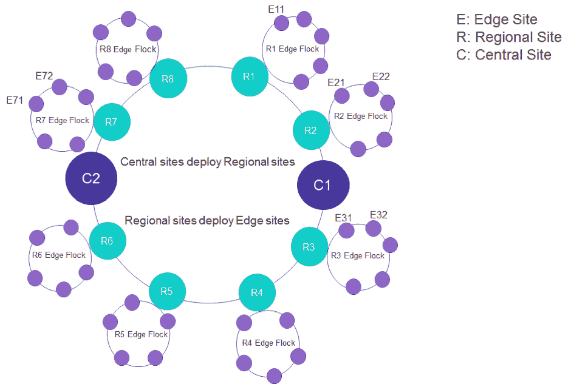
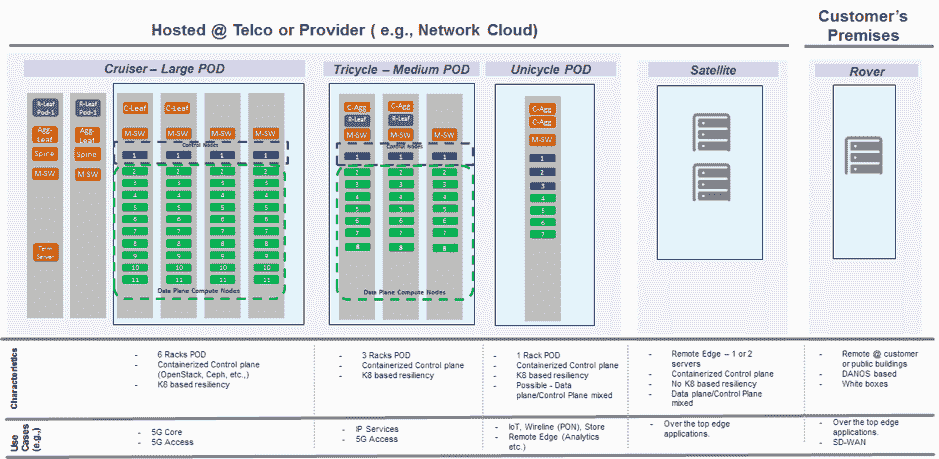
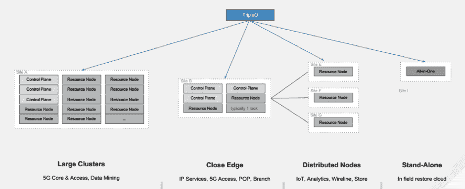
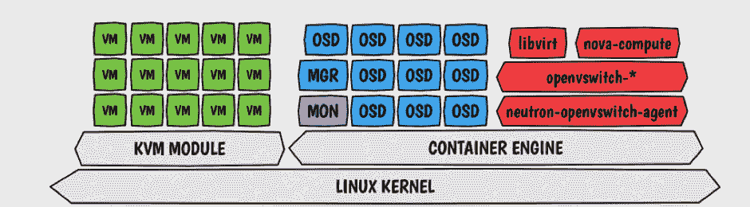
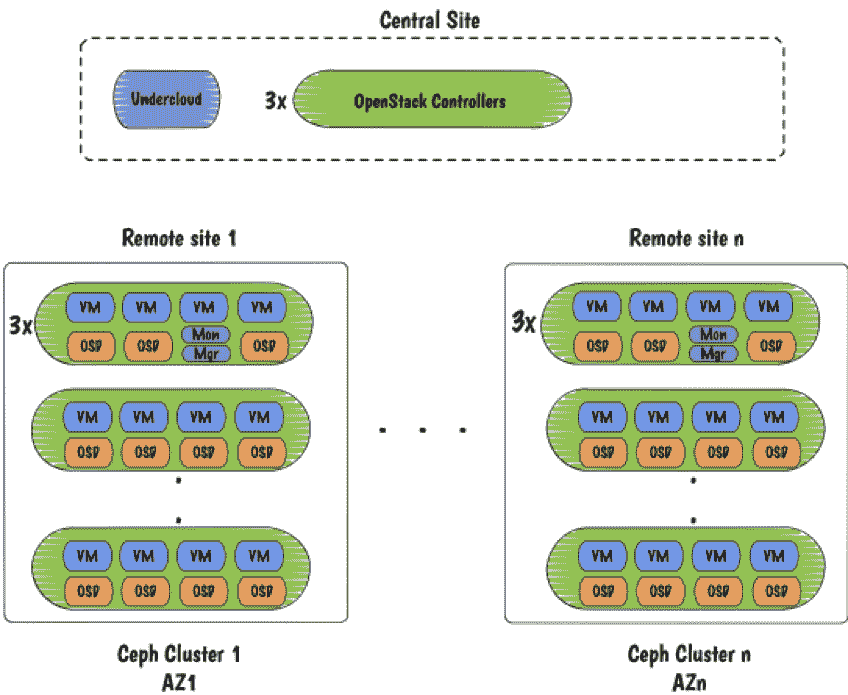
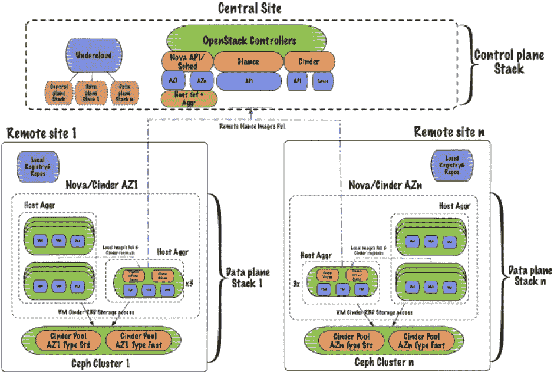

# 面向分布式超融合边缘部署的 OpenStack 和 Ceph

> 原文：<https://thenewstack.io/openstack-and-ceph-for-distributed-hyperconverged-edge-deployments/>

[Sagar Nangare](https://calsoftinc.com)

[Sagar Nangare 是科技博客作者，专注于数据中心技术(网络、电信、云、存储)和边缘计算、物联网、机器学习、人工智能等新兴领域。他目前在浦那担任 Coredge.io 的产品营销总监。](https://calsoftinc.com)

领先的科技巨头和多家企业正在大举投资边缘计算解决方案。边缘计算将使企业能够在消耗数据后更快地行动，并在竞争中保持领先。创新应用所期望的更快的行动将需要接近实时地访问数据，将数据处理到附近的边缘节点，并生成见解以提供给云和源设备。边缘解决方案供应商正在构建边缘解决方案，以降低延迟对不同业务用例的影响。

支持边缘计算的网络的目标应该是在边缘节点活跃的网络中保持端到端的服务质量和用户体验连续性。例如，考虑到 edge 将成为 5G 电信网络的主流，5G 用户在不同的 edge 房屋内移动时不应丢失活动服务。此外，新服务需要实时推送，而不考虑网络中的任何边缘区域。用户不仅需要持续的新服务，还需要以更快的方式实现实时应用的百分之百的结果。随着物联网在技术市场格局中的演变，从消费者到网络运营商和解决方案提供商，这种低延迟需求将会更高。

同样，Red Hat 团队提出了集成解决方案，以在支持边缘节点的 5G 网络中减少延迟并保持用户体验的连续性。让我们来大致了解一下。

## 以超融合方式将 Ceph 和 OpenStack 放在一起

5G 网络的特点是分布式云基础设施，其中服务设置为在网络的每个部分提供，即从中央数据中心/云到区域和边缘。但是，在 5G 网络的情况下，将分布式边缘节点连接到中央云会受到限制。

*   对服务提供商的基本要求是对网络中每个节点的网络服务进行生命周期管理，从一个中心位置集中控制这些功能和端到端协调。
*   5G 网络应该在边缘级别提供更低的延迟、更高的带宽以及弹性(单个节点上的故障和恢复)和可扩展性(根据不断增长的需求提供服务)。
*   服务提供商将需要以最少的硬件资源为消费者提供更快、更可靠的服务，这些资源主要在区域节点和边缘节点。
*   大量的数据处理和分析将在边缘节点进行。这将要求存储系统能够以所有可用的方式存储每种类型的数据，并能更快地访问这些数据。

为了解决上述需求，Red Hat 的 Sean Cohen、Giulio Fidente 和 Sébastien Han [在 2018 年 11 月柏林 OpenStack 峰会上提出了](https://openstack.org/summit/berlin-2018/summit-schedule/events/22984/distributed-hyperconvergence-pushing-openstack-and-ceph-to-the-edge)解决方案架构。该架构以超融合的方式将 OpenStack 的核心以及存储相关项目与 Ceph 融合在一起。最终的架构将支持分布式 NFV(这是 5G 的主干技术)、具有更少控制平面的新兴用例，并在网络中涉及的所有区域和边缘节点中分布 VNFs(虚拟网络功能或网络服务)。

提议的解决方案称为 Akraino Edge Stack(Edge 软件堆栈，Linux Foundation 开源项目)，典型的 Edge 架构由中央站点/数据中心/云、区域站点和远边缘站点组成。

图 1–边缘架构

中央云是网络所有操作和管理的中枢，所有处理过的数据都可以存储在这里。区域站点或边缘节点可以是移动塔、专用于特定场所或任何其他以电信公司为中心的场所的节点。远边节点是网络的端点，可以是数字设备，如手机、无人机、智能设备；自动驾驶汽车、工业物联网设备等。共享存储在边缘区域可用，以便在节点出现故障时持续存在。

## 解决方案中建议的部署

在此提议的解决方案中，Red Hat 团队引用了电信服务提供商的[边缘交付点(POD)架构](https://wiki.akraino.org/pages/viewpage.action?pageId=1147248)，以解释 Ceph 集群可以通过 OpenStack 项目以超融合方式放置在何处。

图 2–交付点(POD)

基于上图，让我们来理解部署和操作场景。

## OpenStack

在图 2 的例子中，OpenStack 已经覆盖了对 POD 的 Cruiser 和三轮车的支持。但是，对于边缘部署，OpenStack 的不同项目可以用于各种操作。

TripleO: 一种提议的 TripleO 架构，旨在使用中间层的 OpenStack TripleO 控制器节点减少从中央云到远边缘节点的控制平面。建议的解决方案是让 TripleO 能够部署位于边缘的非控制器节点。借助 TripleO 的力量，OpenStack 可以对参与网络的所有边缘节点进行集中控制。

图 3–三层架构

Glance API: 主要负责从中央数据中心到远端边缘节点的边缘网络中虚拟机镜像形式的工作负载交付。Glance 设置在中央数据中心，部署在控制器所在的中间边缘节点上。带有缓存的 Glance API 可以在远边缘站点推送，这是超收敛的。这样，可以将图像从中央数据中心拉到远处的边缘节点。

## Ceph

Ceph 提供了不同的接口来访问基于对象、块或文件存储的数据。在这个架构中，Ceph 可以部署在容器中，也可以部署在管理程序中。容器化 Ceph 集群为动态工作负载带来更多好处。比如更好的隔离、更快的应用访问、更好的资源利用控制等。

图 4–提议架构的 Ceph

在超融合中，Ceph 的部署应在边缘节点的单圈和卫星单元(参见图 2)进行；就在中央云之后。因此，由此产生的架构，描述了集装箱化 Ceph 集群在一个区域站点的协同定位，如下所示。这种协同定位可以(参考图 2)。

图 5–使用 Ceph 的分布式计算节点

Ceph 部署了两个软件包 Monitor 和 Manager 带来监测的好处，如收集信息，管理地图和存储它们。

该表示示出了控制平面从死亡节点分离并被放置在中央站点上。这带来了以下好处

*   减少边缘的硬件资源和成本，因为边缘节点是超融合的，不需要控制平面来管理每个节点。
*   更好地利用计算和存储资源。
*   降低部署复杂性
*   减少运营维护，因为所有边缘节点的控制平面都将是相似的，并且将遵循统一的生命周期进行扩展、升级等。

## 最终架构(OpenStack + Ceph 集群)

这是从中心站点到远边缘节点的整体架构，包括在 Ceph 集群中集成的 OpenStack 服务的分布。该表示显示了项目是如何分布的；控制平面在中心节点投影堆栈，在远边节点投影数据堆栈。

图 6–以 HCI 方式展示 OpenStack 项目+ Ceph 集群的最终架构。

在即将到来的 OpenStack 版本“Stein”中，几乎没有考虑和未来的工作它将涉及在边缘节点断开连接时关注服务维持、在远边缘没有存储需求、使用容器资源分配的具有 Ceph 监视器的 HCI、使用 TripleO 部署多个 Ceph 集群的能力等。

## 摘要

硬件资源的超融合有望成为多个小型数据中心(即边缘节点)的基本架构。Red Hat 团队带来了 OpenStack 项目和 Ceph 软件定义的存储的创新性超融合。一种解决方案表明，通过减少控制平面，可以更好地控制所有边缘节点，并保持 5G 网络的连续性和可持续性以及新时代应用所需的性能。

<svg xmlns:xlink="http://www.w3.org/1999/xlink" viewBox="0 0 68 31" version="1.1"><title>Group</title> <desc>Created with Sketch.</desc></svg>