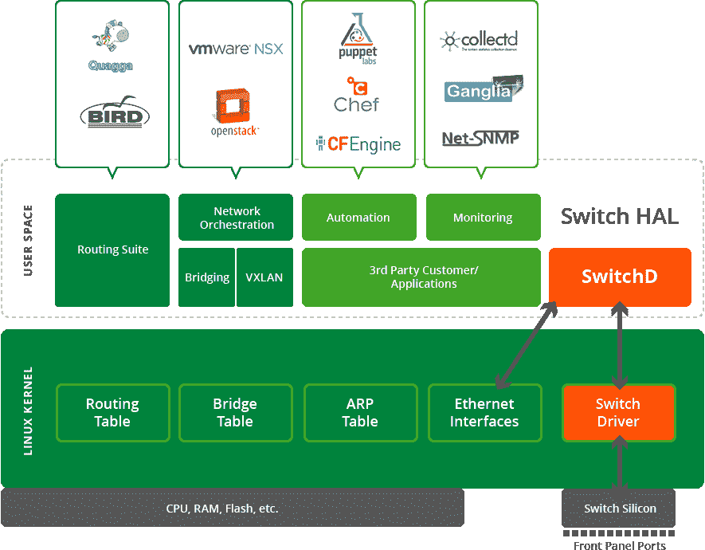

# 羽状网格和积云网络如何应对 SDN

> 原文：<https://thenewstack.io/openstack-austin-plumgrid-cumulus-networks-tackling-sdn/>

编者按:新的网络堆栈是新堆栈今年将探索的一个主题。以下是我们在 OpenStack Summit Austin 2016 上做的一组采访，探讨了随着以开发者为中心的架构的出现，网络将如何变化。

随着[软件](https://thenewstack.io/defining-software-defined-networking-part-1/) [定义的网络](https://thenewstack.io/defining-software-defined-networking-part-1/)的出现，企业能够通过一系列抽象层来管理他们的网络，提供了甚至在 10 年前都无法实现的灵活性。虽然这对于一些人来说似乎有些超前，但 SDN 正在迅速成为大规模处理容器、网络和虚拟机的新标准。

OpenStack 社区也采用了 SDN，提供了自己的一套标准，说明 OpenStack 设计人员必须如何配置防火墙、DNS 和路由器配置。随着这些标准的出现，开发人员和网络架构师不仅可以在基于 Linux 的平台上使用各种工具，还可以跨平台使用。

## PLUMgrid 简介

[PLUMgrid](http://www.plumgrid.com/) 始于云时代，定位为一家专注于所有基于虚拟机和容器的公司。在这一集的《新堆栈制造商》中，新堆栈创始人 Alex Williams 和共同主持人 Scott M. Fulton III 与 PLUMgrid 产品管理和营销副总裁 Wendy Cartee 坐在一起，讨论 PLUMgrid 如何为当今的堆栈、数据中心的安全性和编排的未来提供系统网络。

[TNS 采访:Wendy Cartee，PLUMgrid 产品管理副总裁&营销](https://thenewstack.simplecast.com/episodes/tns-interviews-wendy-cartee-plumgrid-vp-of-product-management-marketing)

采访[也可以在 YouTube 上听到](https://youtu.be/AWbS95xGKlQ)。

Cartee 首先注意到 PLUMgrid 的 PLUM 部分是一个首字母缩略词，它基于数据包处理时的四个关键任务:解析、查找、更新和修改。因此，该公司的主要重点是智能网络。无论是使用容器还是虚拟机，PLUMgrid 都位于网络层之上，以实现无缝服务。“PLUMgrid 允许应用程序开发人员拥有一个无缝的智能网络，使他们能够运行应用程序，而不用担心连接、策略和安全问题，”

Cartee 解释说，这种“无缝服务”方法提供了直接嵌入到构建 SDN 网络的联网方面的安全性，“这不再只是关于连接性，或者关于下一条路径或路线。这是关于分发策略和安全性，询问它如何成为每个虚拟机的一部分/每个容器可用的一部分？”

PLUMgrid 将安全性作为新堆栈每一层的一个组成部分。通过实施称为微分段的过程，它通过对网络流量进行分段为数据中心提供了更高的隐私性。在传统模型中，如果安全漏洞通过了标准防火墙，攻击者就有可能访问整个数据库。对于 PLUMgrid 的微分段，Cartee 解释说，如果发生违规，不会影响微分段域。

Cartee 继续指出，PLUMgrid 是从为 Docker 开发 SDN 插件开始的。它现在已经成为 Docker 的生态系统技术合作伙伴，通过使容器技术能够利用 SDN 覆盖的优势，将微分段的核心概念引入 Docker 社区。这些插件可以在 GitHub 上找到，供那些希望为这个项目做贡献的人使用。

由于 PLUMgrid 在一个人现有的堆栈上运行其加密技术，它可以很容易地嵌入到运行容器和虚拟机的服务器中。这使得网络架构师和开发人员部署它变得简单。“PLUMgrid 位于 SDN 覆盖层。它完全不需要对数据中心内的任何硬件进行更改。Cartee 解释说:“微分段虚拟域可以由客户按需创建，而不会影响任何硬件。

Cartee 指出，拥有随时构建整个网络基础设施的能力已经改变了我们今天使用技术的方式。如今，开发人员可以使用的各种工具已经彻底改变了从模块化网络风格到努力配置部署的转变。“能够按需构建虚拟网络、应用程序和安全策略是非常强大的。这就是这种新堆栈所能提供的令人兴奋的地方，”Cartee 说。

隔离流量和划分域已经成为 PLUMgrid 为 OpenStack 带来的安全性的关键要素。这种细粒度的 SDN 工具在 15 年前闻所未闻，现在为网络架构师提供了轻松管理基础设施的工具。

基于 PLUMgrid VXLan 的覆盖网络架构

## 积云网络让事情变得简单

随着网络模型的不断发展，连接系统的框架也随之发展。其中一些框架已经成为服务器的一部分，导致曾经的单一供应商物理 IT 网络生态系统的崩溃。JR Rivers， [Cumulus Networks](https://cumulusnetworks.com/) 的联合创始人兼首席技术官通过强调 Cumulus 对新网络生态系统的方法，开始了下面嵌入的新堆栈制造商这一集:

“让它们变好，不要让它们变坏。”

在第二集《新堆栈制造商嵌入下方》中，Williams 和联合主持人 [Lee Calcote](https://twitter.com/lcalcote) 与 Rivers 讨论了系统联网，解决了在网络上使用容器和虚拟机所涉及的复杂性，以及微服务的未来。

[TNS 访谈:JR Rivers，积云网络联合创始人& CTO](https://thenewstack.simplecast.com/episodes/tns-interviews-jr-rivers-cumulus-networks-co-founder-cto)

采访[也可以在 YouTube 上听到](https://youtu.be/Mjx5Yi-tNpw)。

由于网络崩溃已经酝酿了 10 年，积云遵循了古老的亲吻策略。没有添加太多的附加功能，通过保持事情的简单和可预测性，它很快在 Docker 社区中获得了广泛的支持。“有了 Docker networking，他们知道 IP 是如何工作的。只要我们让知识产权真正发挥作用，他们就会喜欢。我们专注于这一点，使事情易于部署和管理，”Rivers 说。

而且，随着 VXLan 被添加到 Linux 内核中，这个数据中心覆盖网络隧道工具允许更快的网络设置。在将 VXLan 添加到 Linux 内核之前，Rivers 解释说，许多开发人员正在发明他们自己的自制网络协议和覆盖层，或者已经购买了一台物理服务器和工作站，然后您可以为其分配一个静态 IP 地址。在最近与[戴尔和 Red Hat](https://cumulusnetworks.com/media/resources/solution-briefs/Cumulus-Dell-RedHat-OpenStack-Scalability-Solution.pdf) 的一项实验中，Cumulus Networks 展示了在使用微服务时，简单、快速的方法为何如此重要。

积云 Linux 架构

“服务器有众所周知的名字，人们会将 IP 地址编码到应用程序中。在这个超级灵活计算的世界中，无论是基于容器还是基于虚拟机，这都是不可能的。寻址是动态的，将服务绑定到名称空间很重要。人们如何在环境中解决这些问题是一个有趣的概念。没有标准——Docker，Kubernetes，每个人都不一样。每个人都在使用 IP，但是命名机制是独立的，”Rivers 指出。

容器触及了许多人至今仍未摆脱的一个核心问题:就其本质而言，它们是短暂的。物理服务器通常很大，占据了桌面或整个数据中心的空间，整个数据中心内布满了服务器。

架构、部署、监控、故障排除和生命周期管理构成了运营的五大支柱。里弗斯毫不含糊地解释说，最后四个支柱是人们“在交换机上安装软件，因为他们不想运行服务器。你总会发现他们有一个用于计算的基础架构，还有一个单独的网络基础架构。因为我们是一个 Linux 平台，这一切都包括在内。”

由于当今的基础设施有如此多的组件，Rivers 继续解释说，制作总括报表会适得其反。他进一步强调了这一点，指出这完全是关于客户模型，而不是供应商模型。适合客户的解决方案，而不是一层层包装。这种方法非常符合 Cumulus Network 对简单性的关注，尤其是在处理微服务时。

“当你认为遇到问题时，能够及时了解发生了什么是很重要的，”Rivers 指出。由于微服务通常是短暂的实例，因此确定问题何时或如何发生可能是一个挑战。API 的创建有助于打破这一点，从本质上掩盖了在基于微服务的普通环境中发生的变化的复杂性。

“集装箱以更快的速度来来去去。如果你看看面向容器的应用程序，有很多小的实例。你会看到实例以令人眼花缭乱的速度来来去去。它让人们以更好的方式解决问题。”

Docker、GoDaddy 和 Red Hat 是新堆栈的赞助商。

通过 Pixabay 的特征图像，通过 PLUMgrid 的嵌入图像，积云网络。

<svg xmlns:xlink="http://www.w3.org/1999/xlink" viewBox="0 0 68 31" version="1.1"><title>Group</title> <desc>Created with Sketch.</desc></svg>