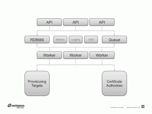

# OpenStack Barbican，用于管理云中秘密的加密技术

> 原文：<https://thenewstack.io/openstack-barbican-cryptography-for-managing-secrets-in-the-cloud/>

安全性发展的下一个阶段要求开发人员能够将安全特性包含在他们的代码中，而不依赖于可能与应用程序架构很好地匹配或不匹配的单点产品。现代的十二要素应用程序依靠开源技术来支持“安全”新堆栈的快速发展。在我去年对在规模上提供可编程安全特性的技术进行研究期间，一个特别的项目引起了我的注意，这个项目以不同的方式看待 云的秘密 的存储、提供和管理问题。

[OpenStackBarbican](https://wiki.openstack.org/wiki/Barbican)是由 open stack 社区开发的平台，旨在提供对所有环境都有用的加密功能，包括大型短暂云。

Rackspace 的 Jarret Raim 是 Barbican 的项目技术负责人，我有机会和他谈论这个项目。

该节目可供[下载。以下是我们讨论的一些记录。](https://api.soundcloud.com/tracks/164147306/download?client_id=b45b1aa10f1ac2941910a7f0d10f8e28&oauth_token=1-16343-94518611-894099730a50a82)

大约一年前，[贾雷特·雷姆](https://twitter.com/jarretraim)和他的团队在 Rackspace 发起了巴比肯。该项目的需求源于 Jarret 和他的团队在 OpenStack 服务(如 Nova(计算)、Swift(对象存储)等)中发现的差距。人们希望在各种 OpenStack 服务中加入加密功能，但还没有具体的计划或解决方案。此外，Rackspace 的目标是重建其 SSL 证书产品。因此， Barbican 最初是一个名为 CloudKeep 的项目，是一个用 Python 构建的 REST API。

> 有很多人希望在 OpenStack 服务中提供加密，如 Nova 和 Swift，但没有执行计划。
> 
> 我们决定建立 Barbican 平台，为 OpenStack 解决这些问题。
> 
> –Jarret Raim，Rackspace

在 11 月的 [OpenStack 峰会上，Barbican 将作为 OpenStack 下一个](https://www.openstack.org/summit/openstack-paris-summit-2014/)[版本](https://wiki.openstack.org/wiki/Juno_Release_Schedule)的一部分发布，名为 Juno。

在服务孵化过程中做出重大贡献的 组织 包括 Redhat、惠普、英特尔、OpenStack 安全小组团队和来自约翰·霍普斯金大学 应用物理实验室 的工程师。该代码可在 GitHub 上获得，供感兴趣的密码工程师、爱好者和现有或潜在的贡献者查看和提供输入。

目前，Barbican 很好地支持对称密钥的生命周期管理和各种后端管理，允许你选择如何保护你的密钥，比如硬件安全模块(HSM)。 RedHat 贡献了代码来使用一个叫做 [Dogtag](https://pki.fedoraproject.org/wiki/PKI_Main_Page) 的系统——一个 RedHat 企业密钥管理器，对惠普密钥管理器的支持迫在眉睫。

这为企业提供了一个独特的机会来扩展他们在 HSM 上的现有投资，从而为他们的云项目提供安全特性。值得注意的是，Barbican 的架构是可扩展的，并且可以使用已建立的 DevOps 工具以编程方式访问。

*图像来源*

对于 Juno 版本，正在进行工作以包括非对称密钥支持，从 SSL/TLS 密钥开始，并将其扩展到 SSH 密钥或任何其他类型的密钥材料。此外，我们的目标是支持公共证书颁发机构(ca ),如 Symantec、DigiCert 和其他与证书管理相关的机构。 OpenStack 中的负载平衡即服务( LBaaS )也在寻求为 Juno 扩展 Barbican 的服务。

### 结论

在现代可编程和可扩展的环境中，让开发人员能够轻松访问安全功能将确保信任和增加采用。Barbican 是一个独特且充满希望的计划，推动这种模式向前发展，使云环境更加安全。

Jarret Raim 和 Paavan Mistry 可以分别在 Twitter [@jarretraim](https://twitter.com/jarretraim) 和 [@98pm](https://twitter.com/98pm) 上发表评论。

特色图片[通过](https://www.flickr.com/photos/alphageek/10218390083/in/photolist-6neVgS-dGicqP-bZ8eh-536vF-9EuXe-jZt8hR-7h7g9p-gyXVnn-k57RZf-a4vVz-k85XaG-4zwPbd-7mmzZg-6vfmLv-7mqv7f-6vfmMD-7mqvbm-6pNAjb-6qu9Bz-axGAQA-7mqvdY-6neVdN-5fq4La-gCJHZ4-4pd7M5-8a4pCD-Bdsd-74EuXY-eycpxw-hThFD6-bZ6T9-7hQpex-g1jJ11-7cQEoy-uLML-dxzHrJ-jZxDhv-eiKpAh-nCTH3w-byypqb-byugdF-aMBAnv-eLVW55-a6KNa-hvrEi-4PXnwN-9GjhvW-dW9L2K-6doV7q-7kLJc6) Flickr 知识共享

<svg xmlns:xlink="http://www.w3.org/1999/xlink" viewBox="0 0 68 31" version="1.1"><title>Group</title> <desc>Created with Sketch.</desc></svg>